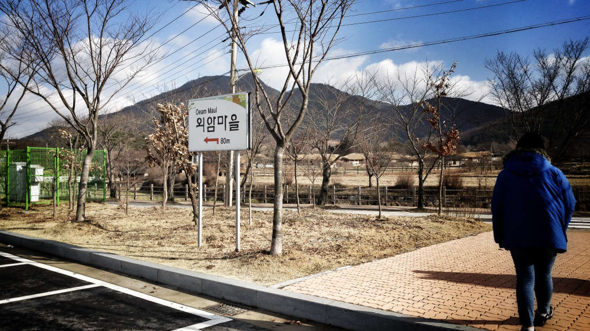
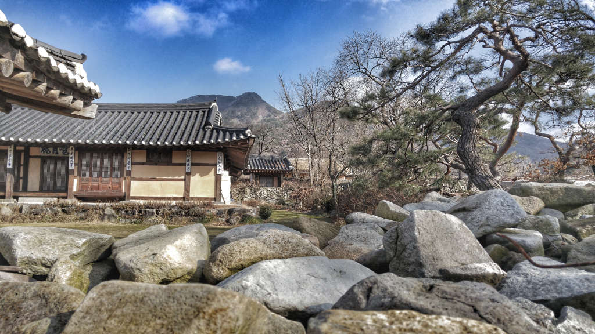

외암마을은 `예안이씨` 중심으로 구성 된 마을이라고 합니다.

약 500년 전부터 부락이 형성되어 충청 고유격식인 `반가의 고택`과 `초가 돌담`(총 5.3㎞), `정원`이 보존되어 있으며 다량의 민구와 민속품을 보유하고 있다고 합니다.

또한 가옥주인의 관직명이나 출신지명을 따서 `참판댁`, `병사댁`, `감찰댁`, `참봉댁`, `종손댁`, `송화댁`, `영암댁`, `신창댁` 등의 택호가 정해져 있으며 마을 뒷산 `설화산 계곡`에서 흘러내리는 시냇물을 끌어들여 연못의 정원수나 방화수로 이용하고 있습니다.

외암마을의 주차장은 2곳인데 바깥쪽 주차장에 주차를 하고 마을 입구쪽으로 걸어오는 길입니다.

마을 입구에서 차량의 진입을 막고있습니다. 동네에 사는 사람들의 차들만 들어갈 수 있습니다.
오던 길에서 입구를 더 지나가면 또하나의 주차장이 있습니다. 그곳에 주차를 하는 것이 마을입구와 더 가깝습니다

이 다리를 건너면 바로 외암마을 입니다.

외암마을은 조선후기의 충청의 상류층과 하류층이 살았던 가옥을 복원하여 전시를 하고 있기도 하고 일부 가옥은 현재도 사람이 살고 있는 마을입니다.

마을 곳곳의 집에서는 체험활동도 하고 있는것 같았지만 제가 갔을때가 겨울이라 그런지 체험활동은 쉬고 있었습니다.

그네도 있네요. 기둥이 나무로 되어 있어서 사알짝 불안했지만..

어린시절 시골에서 자라서 그런지 굴뚝에서 연기가 피어오르는 이런 한산한 겨울풍경의 마을이 저의 향수를 많이 자극해 주어서 좋았습니다.

개울을 가로지르는 나무다리가 있긴 하지만 건널수없도록 나무 가운데가 막혀있습니다.  
이리로 건너가게되면 입장료를 받을 수가 없어서 막아 놓은듯 합니다.  
그냥 중간쯤에서 사진만 찍고 오는 정도로 이용하시면 됩니다.

## 주차

무료로 운영하고있는 비교적 넓은 주차장이 2곳에 위치해 있어서 주차 걱정은 하실 필요 없을 것 같습니다.

## 비용

입장료가 성인 기준 **2,000원**입니다.

## 위치와 연락처

- 주소 : 충남 아산시 송악면 외암민속길 42-7
- 연락처 : 041-541-0848
- URL : http://oeam.co.kr/oeam/skin1

## 인근맛집

**아산 꽁당보리밥**  
외암마을에서 15분 거리에 있는 **꽁당보리밥**을 추천합니다.  
정말 가성비에서 최고라 할 수 있습니다. 맛도 좋고 양도 푸짐합니다.  
방심하고 방문했다가 미쳐 식당 사진을 찍지 못했으나 나중에 간단하게나마 맛집 포스팅을 올려볼까 합니다.

## 주의사항

봄, 가을에 가보는 것이 체험도 할 수 있고 좋을 것 같습니다.  
겨울에는 여유롭게 마을을 걷는 느낌을 느끼고자 할때만 방문하는것을 추천합니다.

아래의 내용을 미리 보시고 가시면 좀더 재미있게 관람하실 수 있습니다.

