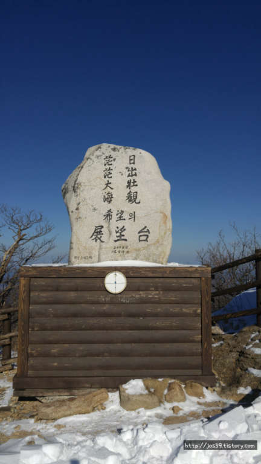
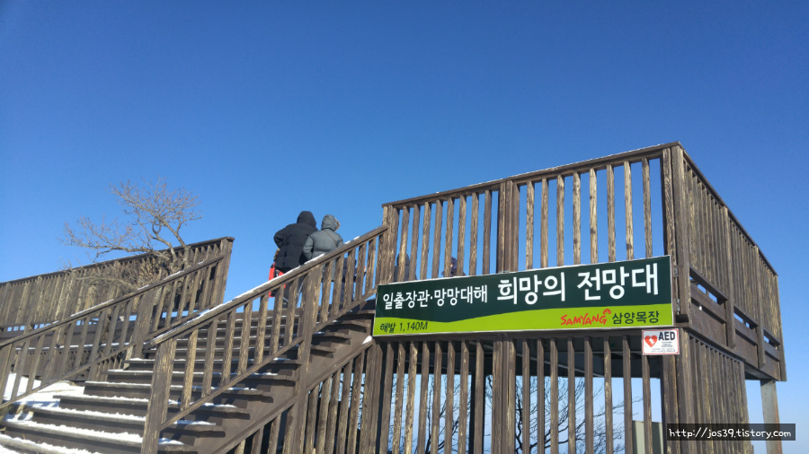
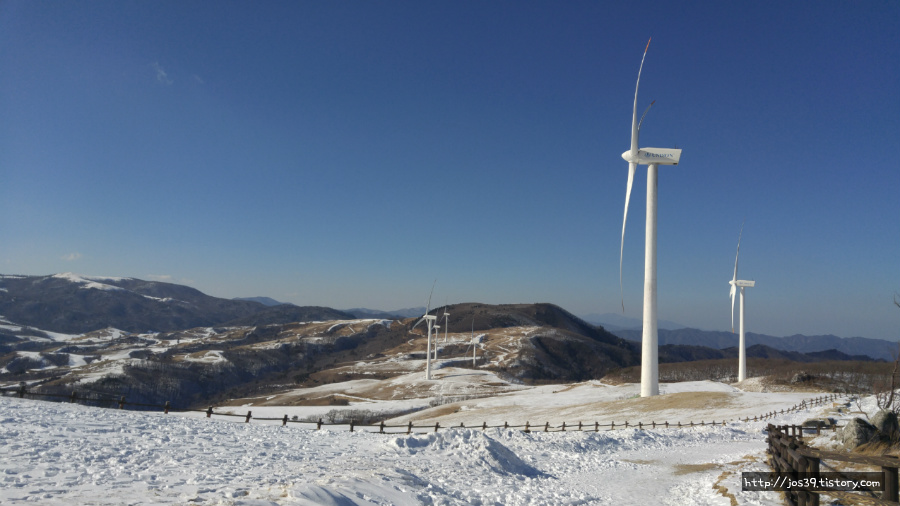
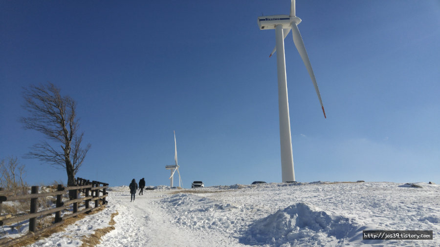
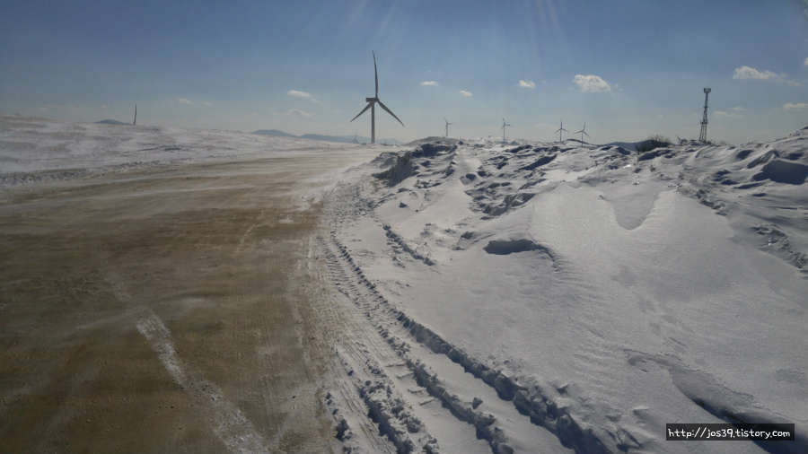
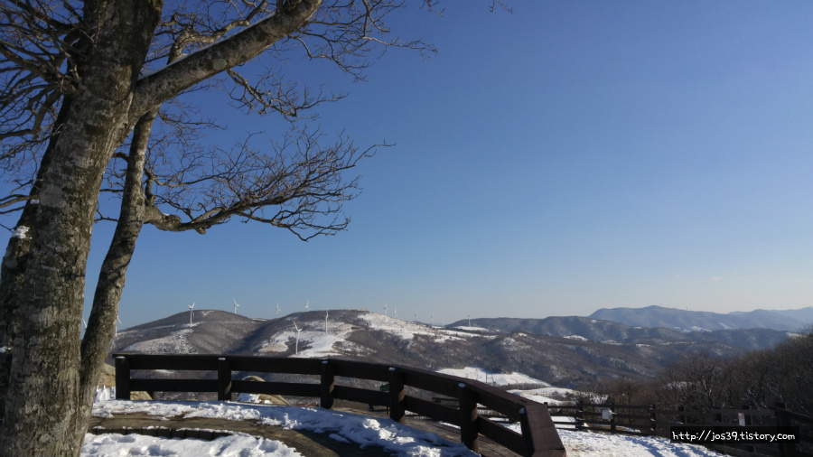
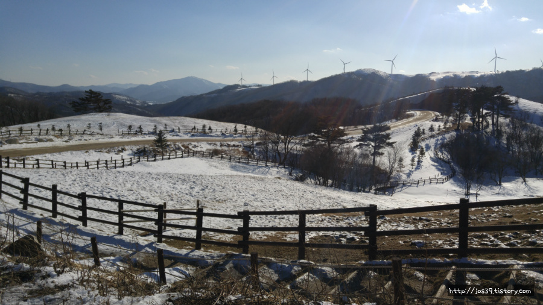

삼양목장은 양을 보러가는것이 맞지만 양을 보기 힘든 겨울에도 나름대로 독특한 풍경을 자랑합니다.  
대관령에는 잘 알려진 양떼목장과 삼양목장이 있지만 겨울풍경은 압도적으로 삼양목장이 멋있습니다.

겨울에 방문하는 삼양목장은 봄, 여름, 가을에는 자체 운영하는 셔틀버스를 운행하지만 겨울에는 본인의 자가용으로 목장 꼭대기까지 올라갈 수 있습니다.

목장 꼭대기에 있는 **희망의 전망대**까지 올라갔다가 내려오면서 원하는 장소에 마음대로 멈취서 구경을 하면 됩니다.

마지막 삼양목장을 나오기 전에 있는 매점에서 다양한 삼양식품들을 보고 구매를 할 수 있습니다.

아직 시중에 출시되지 않은 라면이나 스넥들이 다양하게 준비되어 있고 가격도 비싸지 않아서 구매 하기에 좋습니다.

▲ 희망의 전망대의 모습입니다. 맑은날 희망전망대에 오르면 강릉쪽의 **동해**를 볼 수 있습니다.

▲ 정상에서 능선을 따라보이는 풍력발전기들의 모습이 압권입니다. 겨울이라 그런지 바람이 정말 장난이 아닙니다.

▲ 희망의 전망대에서 주차장까지 걸어오는 길입니다.

▲ 꼭대기에서 내려오는 도중에 촬영한 겨울 풍경입니다. 밖은 엄청난 바람에 날아갈듯 춥지만 상대적으로 히터로 덮혀진 자가용 안이 그렇게 포근할 수 없습니다. 따뜻한 엄마품에서 보호받는 느낌입니다.

▲ 드라마 촬영지 입니다. **연애소설**, **베토벤바이러스**를 촬영했다고 하네요..

▲ 마지막으로 풍경이 이뻐서 찍어봤습니다.

## 주차

주차비는 따로 없으며 주차할 장소도 넓습니다.  
겨울에는 차를 끌고 산을 오를 수 있기때문에 주차장은 별로 무의미 합니다.

## 비용

| 구분       | 대인    | 소인                                               |
| ---------- | ------- | -------------------------------------------------- |
| 개인       | 9,000원 | 7,000원                                            |
| 단체(30인) | 7,000원 | 5,000원                                            |
| 우대       | 5,000원 | 경로우대 (65세 이상), 장애인 4~6급, 국가 유공자    |
| 무료       |         | 36개월미만 어린이, 장애인 1~3급 본인 및 보호자 1명 |

## 입장시간

- 시작시간 : 오전 8시 30분
- 마감시간 :
  - 11월~1월 : 16시
  - 2, 10월 : 16시 30분
  - 3, 4, 9월 : 17시
  - 5월~8월 : 17시 30분

## 연락처

- 주소 : 강원도 평창군 대관령면 꽃밭양지길 708-9
- 연락처 : 033-335-5044~5
- URL : http://www.samyangranch.co.kr/

## 인근맛집

인근맛집으로는 삼양목장에서 영동고속도로를 타기전에 **황태회관** 이라는 곳이 있습니다.  
참고로 저는 시간상 들르지 못했습니다. 다만 블로그에서는 맛집으로 통하고 있는듯 합니다.

## 주의사항

삼양목장에 들어가는 입구가 비포장도로로 되어 있습니다. 바닥이 낮은 자가용이라면 입장을 고려해 봐야 할 것입니다. 일반 자가용(아반떼, 소나타 등..)정도는 들어갈 수 있으나 스포츠카나, 낮게 튜닝을 한 차라면 바닥이 흙길에 닿을 수 있습니다.  
티몬이나 위메프등을 검색해 보시면 1,000원이라도 싼 입장료를 구매할 수 있습니다.
