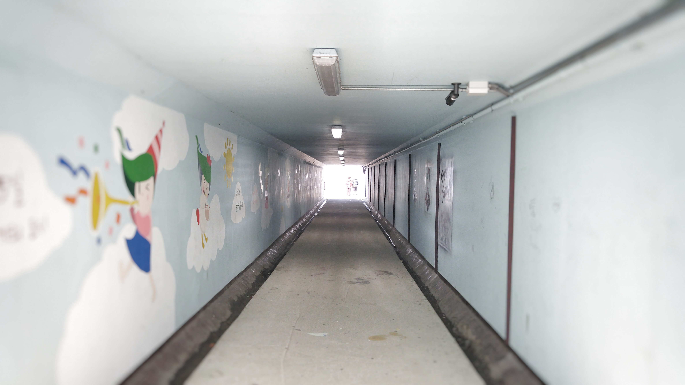
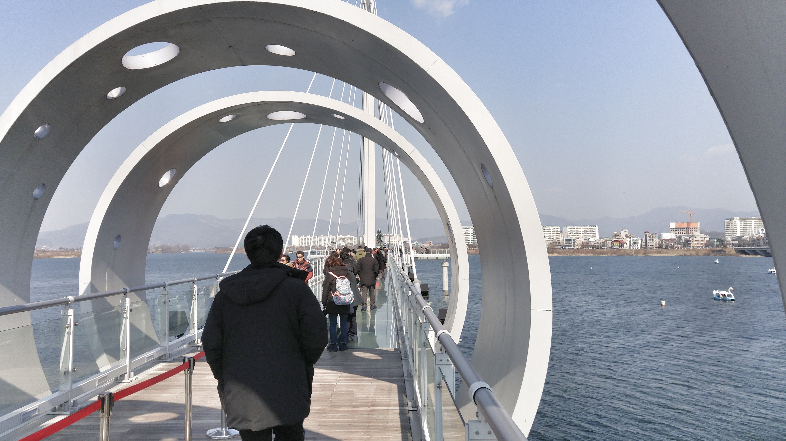
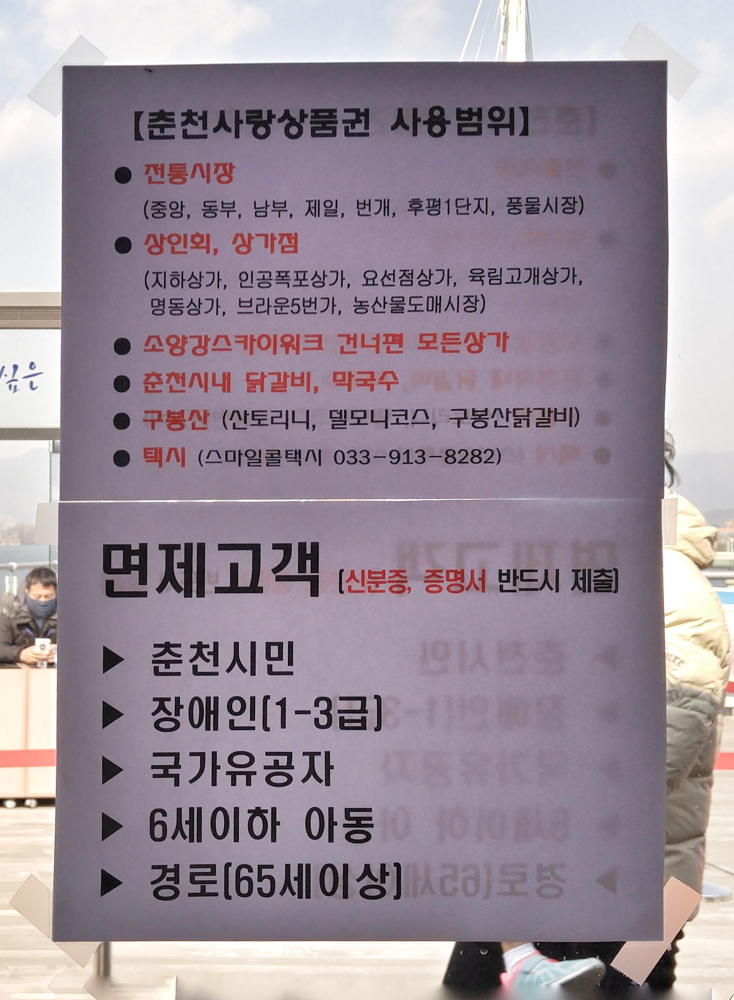
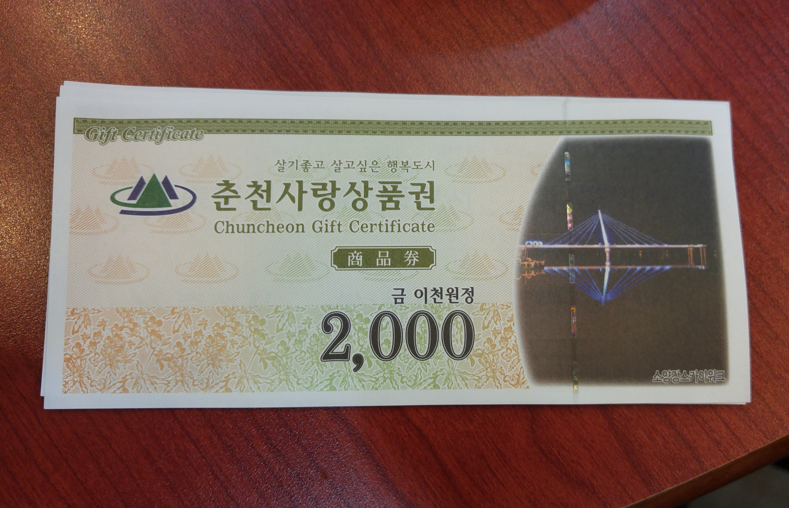
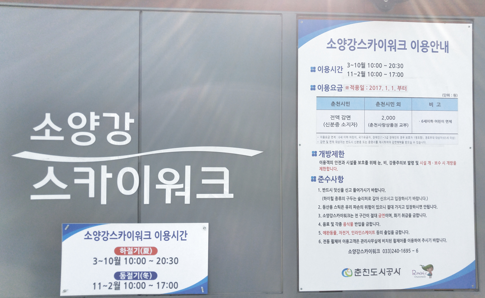
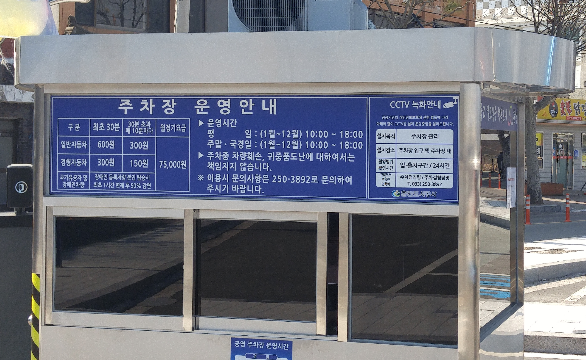

춘천하면 호반의 도시, 낭만의 도시로 많이 알려져 있습니다. 또한 닭갈비와 막국수로도 유명하죠.
그리고 또하나의 명물이 근래 생겼습니다.

**소양강 스카이워크**라고도 하고 **춘천 스카이워크**라고하는 여행포인트가 2016년 7월 8일에 개장을 했습니다.

▲ 주차장은 유료주차장을 이용합니다. 주차장과 소양강스카이워크는 큰길을 사이에 두고 있으며 주차장과 스카이워크는 지하통로를 통해 이동을 할 수 있습니다.

지하통로를 통과하여 소양강쪽으로 나오면 **소양강처녀상**을 지나서 춘천스카이워크를 볼 수 있습니다.

▲ 전체길이가 `174m`나 되고 바닥은 투명한 유리로 되어 있습니다. 여기를 지나가려면 입구에서 덫신을 신고 입장을 합니다.

▲ 스카이워크 끝부분은 원형광장으로 되어 있습니다. 여기도 유리로 되어 있어서 바닥에 흐르는 소양강이 한눈에 보입니다. 사방으로 탁트인 강이라 개방감은 최고 입니다.

## 비용

춘천시민은 무료이고 **외지인은 2,000원**의 비용을 받습니다. 그리고 **춘천사랑상품권 2000원권**으로 다시 돌려 줍니다. 따지고 보면 무료입장인 것 이죠. 그리고 그 비용을 춘천지역의 활성화를 위해, 소상공인을 위해 사용하라는 취지라고 합니다. 지역활성화에 좋은 방법인것 같습니다.  
중요한 것은 이 **춘천사랑상품권**으로 춘천의 닭갈비를 사먹을 수 있다는 것입니다. 다시말하면 여행스케줄을 잡을 때 식사를 하기 전에 먼저 **소양강 스카이워크**를 다녀오면 **소양강 스카이워크**는 무료로 체험하는 것이나 마찬가지 입니다.

> - 춘천시민 : 전액 감면 (신분증 소지자)
> - 춘천시민 외 : 2,000원 (춘천사랑상품권 교부)
> - 이용요금 면제 : 6세 이하 어린이, 국가유공자, 장애인(1~3급 장애인의 경우 보호자 1명포함), 경로우대 대상자(65세 이상)

## 입장시간

> - 3 ~ 10월 10:00 ~ 20:30
> - 11 ~ 2월 10:00 ~ 17:00

## 여행지 정보

- 주소 : 춘천시 영서로 2663(소양 2교 인근)
- 연락처 : 춘천시 관광개발과 033-250-3668, 관리사무소 033-240-1695, 1696
- URL : http://korean.visitkorea.or.kr/kor/bz15/where/where_tour.jsp?cid=2396037

    <iframe src='https://www.google.com/maps/embed?pb=!1m18!1m12!1m3!1d3148.587078671762!2d127.72122401485963!3d37.89333827973804!2m3!1f0!2f0!3f0!3m2!1i1024!2i768!4f13.1!3m3!1m2!1s0x3562e609e6b18db9%3A0xecd7cf3bf41a1924!2z7IaM7JaR6rCV7Iqk7Lm07J207JuM7YGs!5e0!3m2!1sko!2skr!4v1498903102342' class='embed-responsive-item' allowfullscreen></iframe>

## 주차

일반자동차 기준 최초 30분은 600원 30분 초과시 10분에 300원... 1시간이면 1500원... 1시간정도면 모두 둘러볼수 있습니다.

## 인근맛집

춘천하면 **닭갈비**죠. 제가 자주 가는 곳은 [1.5닭갈비](https://junistory.blogspot.kr/2017/06/15.html)인데 이전에 포스팅한 글을 참조하세요.
