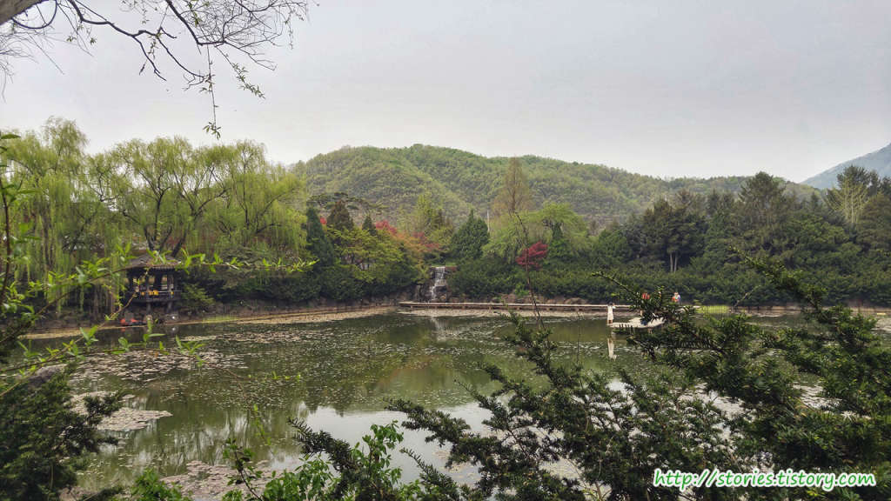
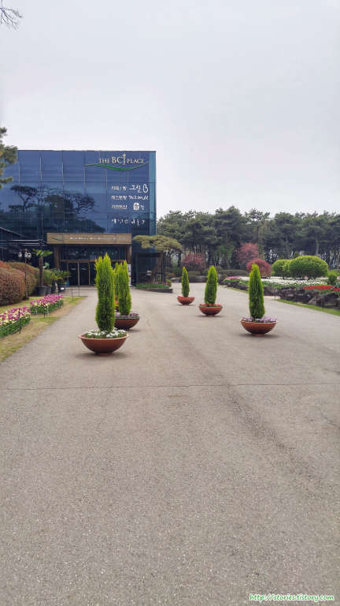

파주에서 근래에 좀 뜨고 있는 수목원을 소개할까 합니다.  
碧[푸를 벽], 草[풀 초], 池[못 지]를 쓰고 있는 벽초지 문화수목원입니다.

동양의 아름다움과 서양의 아름다움을 모두 담고 있는 벽초지수목원은 여러차례 방송의 촬영지로도 유명한 곳입니다.

제1주차장 앞에 있는 매표소에서 매표를 하고 입구로 입장을 합니다.
제일 먼저 입구 앞쪽에 있는 `퀸즈가든`(Queen's Garden)을 구경하거나 `해븐스스퀘어`(Heaven's Square)쪽을 지나 `무지개원`쪽으로 한바퀴 먼저 도는 방법으로 보시면 됩니다. 그렇게 구경하고 `스핀스톤분수대`까지 구경하고 마지막에 퀸즈가든을 보는 순서로 해도 좋습니다.

입구를 들어서면 낮게 서있는 벽이 있습니다. 화면에 보이는 방향쪽으로 들어가면 퀴즈가든 쪽으로 갈 수 있습니다.

  
먼저 `해븐스스퀘어`(Heaven's Square)로 가는 길에 있는 `벽초폭포` 입구입니다.  
벽초폭포를 보러 `벽초지 호수` 쪽으로 내려가 봤습니다.

벽초폭포를 보러내려왔다가 뜻밖의 `수련길`을 만날 수 있습니다. 여기는 포토스팟이라 할 수 있습니다. 벽초지의 포토스팟이 몇군데 있는데 여기는 아마추어가 찍어도 어느정도 작품사진을 뽑아낼 수 있습니다.

다시 발길을 `해븐스스퀘어`쪽으로 돌려 봅니다. 가는 길에도 다양한 꽃들이 있는데 다양한 꽃말을 가지고 있는 `아네모네`도 피어 있습니다.

해븐스스퀘어의 초입입니다. 해븐스스퀘어는 넓게펼쳐진 잔디밭 입니다.

해븐스스퀘어에 피어있는 튤립입니다. `해븐스스퀘어`라는 이름에 걸맞게 튤립 뒤쪽으로 `천사`같은 아이들이 놀고 있네요.

튤립은 아이들뿐만이 아니라 어른들도 너무 좋아하는 것 같습니다.

해븐스퀘어를 지나서 나래길로 들어섭니다. 길게 뻗은 오솔길과 구불구불 나 있는 오솔길을 만날 수 있습니다.

나래길을 지나면 바로 눈앞에 탁 펼쳐져있는 벽초지 호수를 볼 수 있습니다. 이 벽초지 호수는 `벽초지문화수목원`의 `화룡점정`이라 할 수 있습니다. `동양의 미`를 그대로 보여 줍니다. 위에 소개했던 `수련길`에 있던 호수와 같은 호수이고 반대쪽 방향에서 바라보게 됩니다.

`파련정`과 `무심교`가 마치 동양화를 보는듯한 풍경을 만들고 있습니다. 여기에서 한 30분은 머물면서 풍경을 본듯합니다.

무심교에서 벽초폭포를 찍어봤습니다. 스마트폰으로 찍었음에도 불구하고 멋진 모습을 보여주네요.

무심교를 지나 파련정을 지나서 단풍길을 지나 입구쪽으로 다시 오게 됩니다.

벽초지문화수목원에서 `식사나 커피, 선물` 등을 살 수 있는 `BCJ PLACE` 건물입니다.

이 곳을 지나 이제는 반대쪽에 있는 퀸즈가든과 캐슬게이트에 있는 유럽의 정원을 볼 수 있습니다.

퀸즈가든에서는 인물사진만 많이 찍고 풍경사진을 많이 찍지 못해서 사진을 많이 올리지는 못했는데 여기는 완전히 꽃풍년입니다. 정문 앞이라서 그런지 가장 많이 신경을 쓴 곳입니다.

퀸즈가든을 지나서 가면 `캐슬 게이트`가 보입니다. 캐슬게이트를 지나면 성안에 들어간것 처럼 다양한 유럽의 정원들이 보입니다.

캐슬게이트를 지나 중앙분수대를 바라보면 찍은 사진입니다.

유럽의 정원 끝에 있는 스핀스톤분수대 입니다.
아래에서 솟구쳐 올라오는 물에 의해 동그란 돌이 계속 뱅글뱅글 돕니다.

스핀스톤분수대를 보고 다시 발길을 돌려 입구쪽으로 나오면 됩니다.

물방울가든은 아주 조그만 꽃들이 이쁘게 군락을 이루고 있습니다. 그위로는 아기천사들도 있네요. 유치원이나 어린이집에서도 많이 오는 것 같습니다.

정원에 의자를 나두어서 쉬었다가 갈 수도 있습니다. 손님을 위한 배려가 잘 되어 있는것 같습니다.

## 비용

| TICKET                                 | PRICE   |
| -------------------------------------- | ------- |
| 성인/일반                              | 9,000원 |
| 중고생                                 | 7,000원 |
| 경로/장애우/국가유공자                 | 6,000원 |
| 어린이                                 | 6,000원 |
| 36개월 미만 영,유아 (부모 동반에 한해) | 무료    |

> - 36개월 미만 영,유아 무료 건강보험증 또는 등본 필히 제시, 직계존비속 동반 가족 단위에 한함.  
>   (단, 어린이집등 단체일 경우 어린이 요금 적용)
> - 어린이: 36개월 이상 ~ 초등학생까지
> - 중고생: 신분증 또는 학생증 제시
> - 경로: 만 65세 이상(경로우대증 또는 신분증 제시)
> - 장애우: 복지카드 제시
> - 국가유공자: 국가유공자증 또는 국가유공자유족증 제시
> - 광탄면 거주자 특별 우대 할인
>   - 신분증 필히 지참(어린이의 경우 건강보험증 또는 등본), 본인 적용, 중복 > - 할인 불가

## 입장시간

| -    | 3월 ~ 10월 (계절축제)   | 11월 ~ 2월 (빛축제)        |
| ---- | ----------------------- | -------------------------- |
| 개장 | 오전 09:00              | 오전 10:00                 |
| 폐장 | 일몰 시까지             | 오후 10:00                 |
|      | (날씨,계절에 따라 변동) | (빛축제 점등은 일몰시부터) |

## 여행지 정보

- 지번 : 주소경기도 파주시 광탄면 창만리 166-1
- 도로명 : 주소경기도 파주시 광탄면 부흥로 242
- URL : http://www.bcj.co.kr

## 주차정보

주차장은 1주차장과 2주차장이 있는데 1주차장은 입구 앞쪽에 있고 2주차장은 들어서서 오른쪽에 있습니다. 2주차장이 훨씬 넓기는 한데 휴일이나 특별한 날에는 2주차장까지 만차가 되는 경우가 많습니다. 일찍가셔야 합니다.

