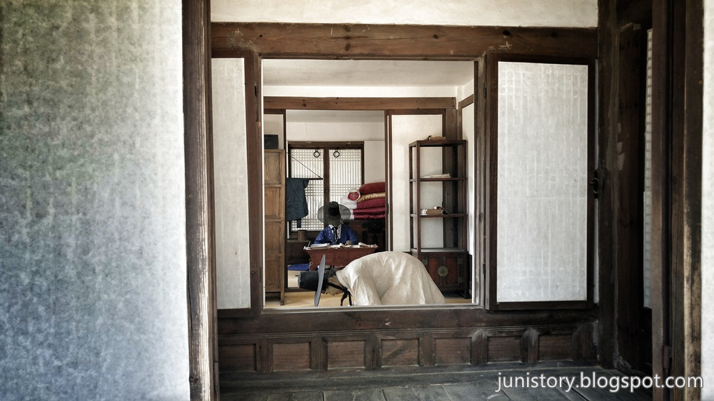
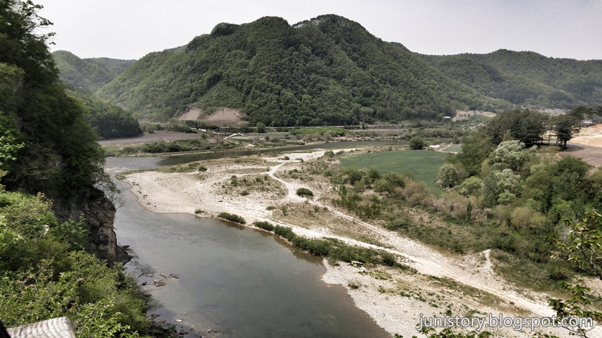
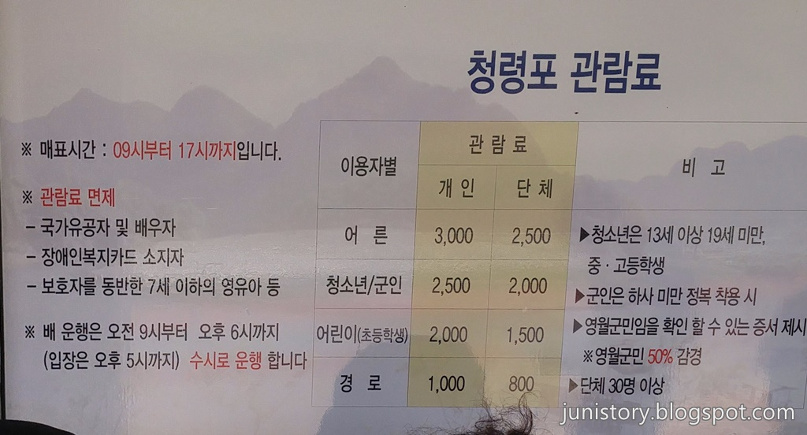

문종의 아들로 어린나이에 임금이 되었지만 **수양대군**(세조)에 의해 패위되어 유배를 간 조선의 6대 임금인 **단종**의 유배지인 **청령포**에 다녀왔습니다. 단종은 청령포를 벗어나지 못하고 결국 17살의 어린나이에 숨졌다고 합니다.
청령포는 **서강**으로 삼면이 둘러싸여 있고 나머지 한 면은 산세가 험한 육육봉으로 되어 있어서 천혜의 요새같은 곳입니다. 그당시 누군가를 가둬놓기에 최적인 유배지인 것은 확실한것 같습니다.
이 청령포를 들어가기 위해서는 배를타고 서강을 건너야만 합니다.

▲ 청령포에 들어가려면 배를 타고 가야하기때문에 먼저 매표소에서 표를 구매를 해야 합니다. 표 가격에는 배를 타는 비용과 입장료가 포함되어있다고 보시면 됩니다.

▲ 입장권 1장에 4명의 구매내역이 적혀있습니다.

▲ 사람이 많은 성수기나 단체인 경우 해설사가 청령포에 대한 해설도 해주는 것 같은데 사람이 많지 않아서 인지 시간을 가려놓았네요.

▲ 매표소 옆쪽으로 가면 **배타는 곳** 이정표가 보입니다. 그 뒤쪽으로 배가 보이네요.

▲ 강의 폭이 넓진 않습니다. 2~3분이면 건너가니 배에 있는 의자에 앉는 것이 큰 의미가 없습니다.

▲ 강을 건너서 **단종어소** 쪽으로 가다보면 가장 먼저 반기는 것이 소나무 숲입니다. 더울 때 는 시원할까 은근 기대하는 곳이기도 합니다.

▲ 소나무숲 입구에는 간략한 청령포의 약도가 있습니다. 그리 넓지 않기 때문에 쉬엄쉬엄 돌아볼 수 있습니다.

▲ 가장먼저 만나는 곳이 **단종어소**입니다. 단종이 머물던 숙소입니다. 단종만 있었던건 아니고 시중을 드는 하인들도 같이 있었던것 같습니다. 그들의 숙소도 옆쪽에 있습니다.

▲ 마네킹으로 만들어 놨네요. 아마도 저 끝에 있는 분이 **단종**이 아닐까 합니다.

▲ 망향탑을 지나 **전망대**에 올라서 **서강**의 모습을 찍어 봤습니다. 넓게 펼쳐진 서강의 모습이 너무 멋지네요.

▲ 전망대를 내려오던 중 망향탑을 지나 바로 옆쪽 **노산대**쪽으로도 올라가 봤습니다.

▲ **노산대**에 올라와 봤습니다. **노산대**에서 바라보는 서강도 경치도 너무 좋습니다. **노산대**는 단종이 상왕에서 **노산군**으로 강봉되어 청령포에 유배된 후 한양쪽을 바라보며 시름에 잠겼다 하여 노산대로 이름지어졌다고 합니다.

## 비용

비용은 어른 3,000원, 청소년 2500원, 어린이 2,000원 입니다.

## 입장시간

- 시작시간 : 09:00
- 마감시간 : 17:00 (배운행은 청령포에서 나오는 사람을 위해 18:00까지 운행)

## 여행지 정보

- 주소 : 강원도 영월군 남면 광천리 산 67-1
- 연락처 : 영월종합관광안내소 033-374-4215, 영월관광안내콜센터 1577-0545
- URL : http://www.ywtour.com/Enjoy?num=53200&g=7&b=2&m=8&s=10

    <iframe src='https://www.google.com/maps/embed?pb=!1m18!1m12!1m3!1d3179.0152152634446!2d128.44340001483468!3d37.1761093798729!2m3!1f0!2f0!3f0!3m2!1i1024!2i768!4f13.1!3m3!1m2!1s0x3563e8359d8f9c2b%3A0xc8a30f995080f732!2z7LKt66C57Y-s!5e0!3m2!1sko!2skr!4v1499500060760' class='embed-responsive-item' allowfullscreen></iframe>

## 주차정보

주차장은 넓은 편이고 주차비는 무료입니다. 성수기가 아니라서 그런지 빈자리는 많았습니다.

## 인근맛집

- 서부시장 일미닭강정
- 서부시장 메밀전병
- 만선식당
