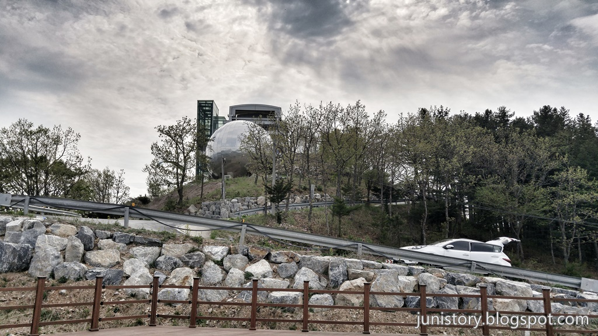
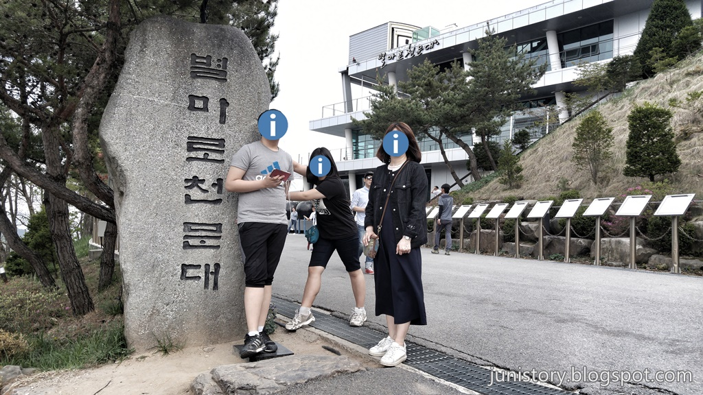
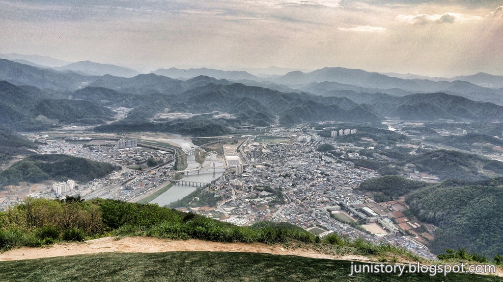
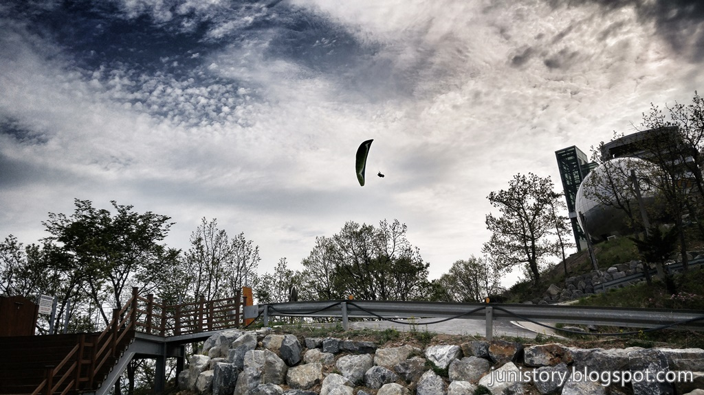
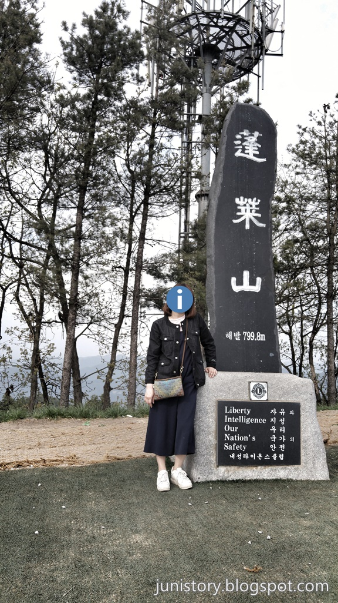
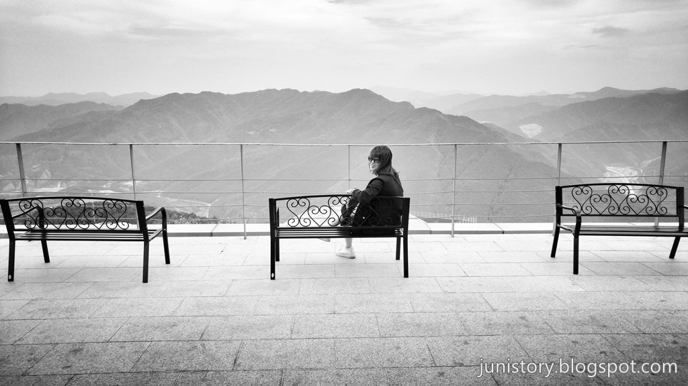
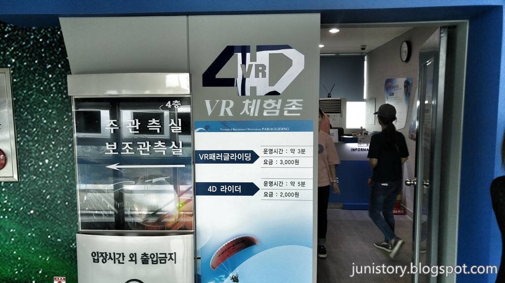
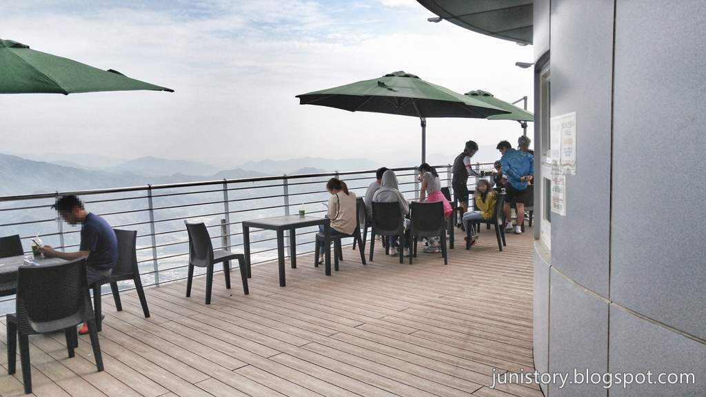
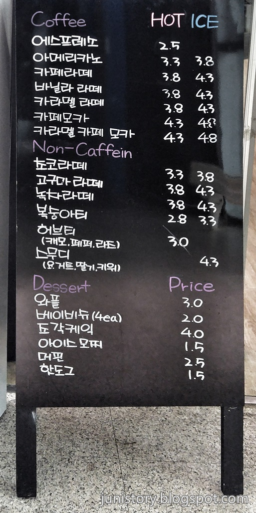

영월의 여행포인트인 **별마로천문대** 입니다. 아이들과 견학하기에도 좋고 어른들이 패러글라이딩을 하기에도 좋은 곳입니다.

산꼭대기로 올라가는 길입니다. 저기 별마로천문대가 보이네요.

주차장에 주차를 하고 별마로천문대로 걸어 들어가는 입구입니다.

천문대에 있는 패러글라이딩 활공장에서 바라본 영월시내입니다. 실제로 보면 정말 멋진 풍경입니다.

넓게 펼쳐진 **영월** 시내가 한눈에 들어오는 풍광과 자유롭게 날아다니는 패러글라이딩을 보는 것 만으로도 이 높은 곳을 힘들지만 잘 올라왔구나 하는 생각을 들게 합니다.

▲ 별마로천문대는 **봉래산**꼭대기에 있고 그 옆에는 **페러글라이딩** 활공장이 있습니다. 봉래산 비석이 떡하니 서있네요.

▲ 패러글라이딩 활공장 반대편쪽으로 천문대 한켠에는 한적하게 경치를 바라 볼 수 있게 바깥쪽으로 향해 있는 벤치도 여럿 놓여 있습니다.

▲ 천문대의 2층에 오르면 **4D VR 체험존**이 있습니다. 실제로 패러글라이딩이 무섭거나 돈이 없어 못타는 사람들을 위해 가상으로 체험해 볼 수 있는 공간이 있습니다.

`3,000원`을 내고 예약을 한 후 차례가 되면 3분 동안 줄에 매달려서 VR고글을 쓰고 체험을 할 수 있습니다.

▲ 2층에는 카페와 야외 테라스도 있어서 넓은 경치를 보면서 여유롭게 커피를 마실 수 있습니다. 가끔씩 바로 앞으로 페러글라이딩이 날아가는 것을 가깝게 볼 수 도 있습니다.

▲ 높은 곳의 카페임에도 음료값이 심할정도로 비싸지는 않습니다. 이정도면 납득할 만한 수준입니다.

## 비용

| 구분                         | 개인    | 단체 (20인 이상) |
| ---------------------------- | ------- | ---------------- |
| 일반                         | 7,000원 | 6,000원          |
| 청소년(중·고등) / 군인(사병) | 6,000원 | 5,000원          |
| 어린이(7세 ~ 초등학생)       | 5,000원 | 4,000원          |
| 경로(만 65세 이상)           | 3,500원 | 3,000원          |

## 입장시간

- 하절기 : 15시 ~ 23시 (22시까지 입장가능 / 매표는 21:50 까지)
- 동절기 : 14시 ~ 22시 (21시까지 입장가능 / 매표는 20:50 까지)
- 주말이나 연휴, 성수기에는 위의 관람시간 외에 프로그램이 추가로 운영될 수 있습니다.
- 별마로 천문대는 사전예약제로 운영하고 있습니다.
- **휴관일 : 매주 월요일, 공휴일 다음날, 1월 1일, 설 · 추석연휴 당일 휴무**

## 여행지 정보

- 주소 : 강원도 영월군 영월읍 천문대길 397
- 연락처 : 033-372-8445
- URL : http://www.yao.or.kr

<iframe src="https://www.google.com/maps/embed?pb=!1m18!1m12!1m3!1d25426.090861178225!2d128.47367190495476!3d37.1940212327592!2m3!1f0!2f0!3f0!3m2!1i1024!2i768!4f13.1!3m3!1m2!1s0x3563dd351c471251%3A0xea716d6600df3770!2z67OE66eI66Gc7LKc66y464yA!5e0!3m2!1sko!2skr!4v1500046100862" width="800" height="400" frameborder="0"  allowfullscreen></iframe>

## 주차정보

주차장이 넓지는 않습니다. 성수기라도 되면 주차하기 힘들 수 있습니다.

## 인근맛집

- 만선식당
- 일미닭강정
- 사랑방식당
- 장릉보리밥
