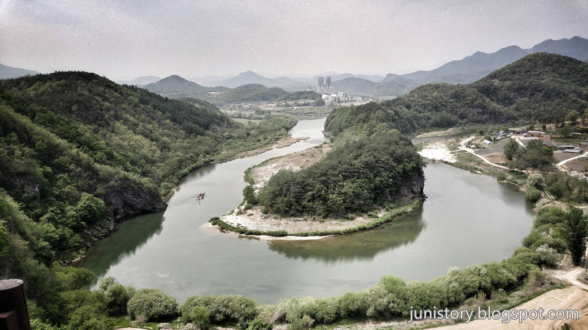
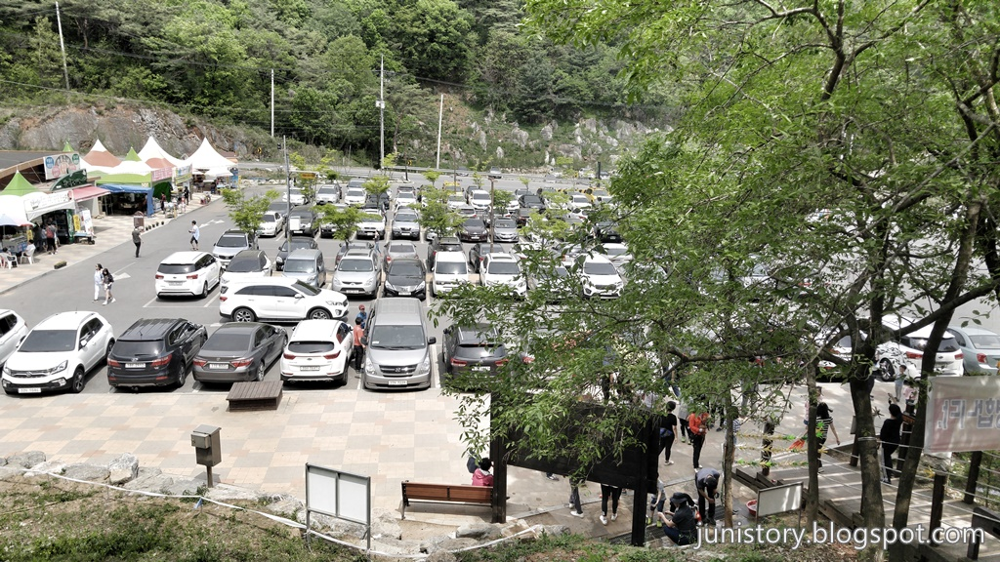
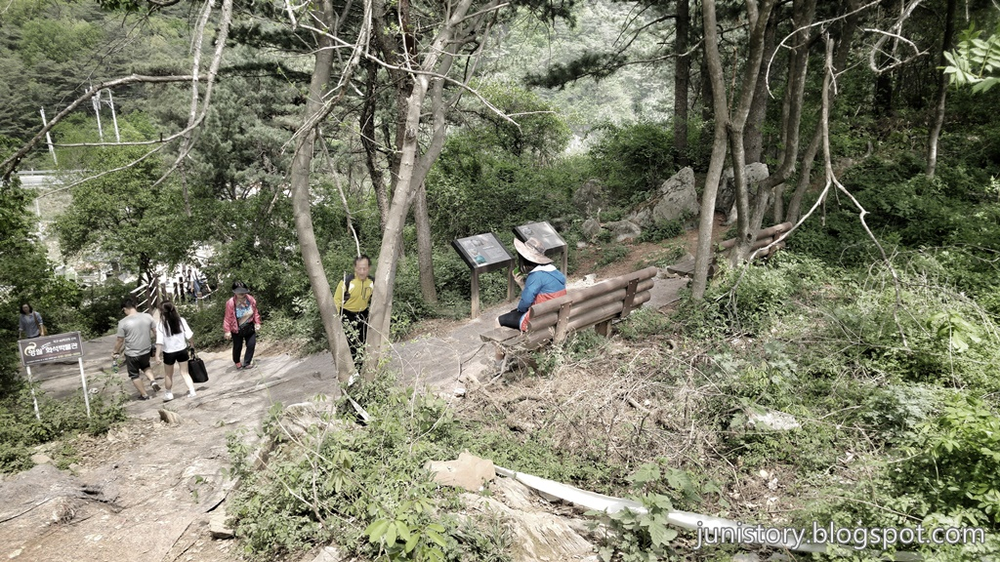
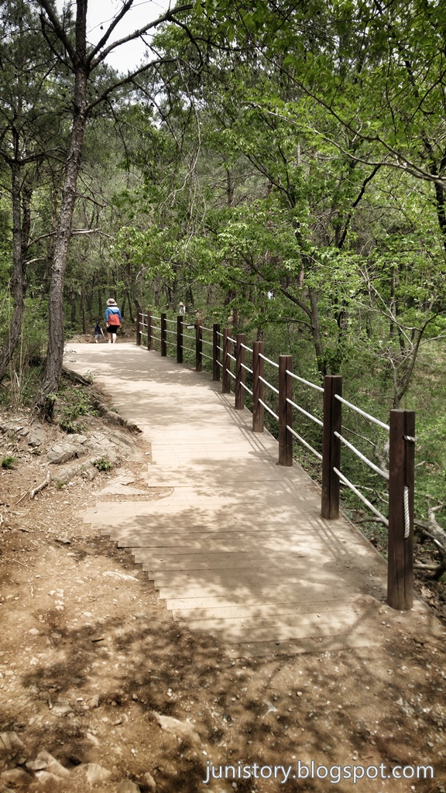
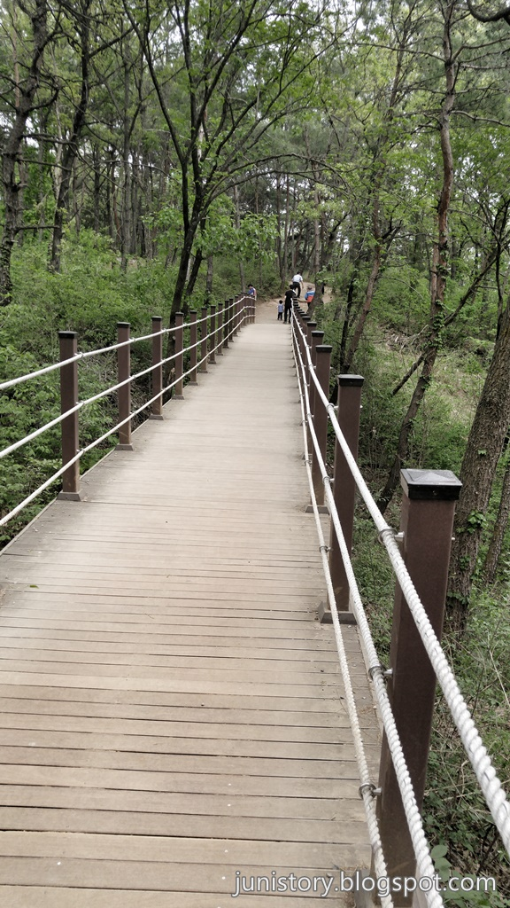
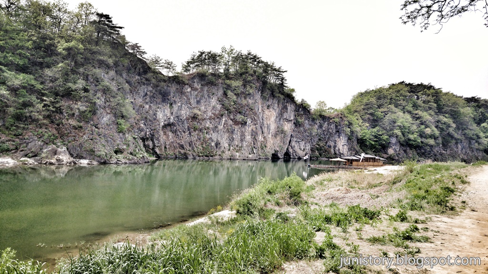
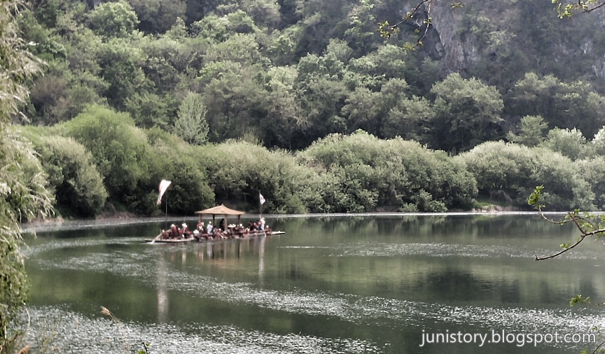

영월의 많지 않은 관광지 중 **한반도지형**을 볼 수 있는 곳이 있습니다. 여러 언론매체를 통해서 많이 소개된 곳이기도 한데요. **사행천**으로 흐르는 강물이 만들어 낸 이 땅이 꼭 한반도를 닮아 있습니다.

# 전망대 가는 길

▲ 한반도 지형을 볼 수 있는 전망대에서 본 모습입니다. 저 멀리 뗏목이 보이네요

▲ 주차장은 생각보다 넓고 무료입니다. 주차를하고 산쪽으로 가다보면 오름개단이 보입니다. 계단앞에서 얼음물을 파는데 날씨가 더우면 하나 사가지고 올라가는 것이 도움이 많이 됩니다.

▲ 처음 올라가는 길이 다소 가파라 보이지만 요기만 지나면 심한 오르막길은 없습니다.

▲ 한반도 지형을 볼 수 있는 전망대로 가기 위해서는 약 15~20분 정도의 트렉킹을 해야 합니다. 힘든 길은 아닙니다.

▲ 다리도 건너야 합니다.

# 한반도 뗏목마을인 선암마을

전망대에서는 한반도지형만을 볼 수 있습니다. 뗏목체험을 하기 위해서는 아래에 있는 **한반도 뗏목마을**이라고 하는 **선암마을**로 가야 합니다.
주차장에서 5분정도 내려가면 선암마을로 들어가는 이정표가 보입니다.

이곳 주차장은 임시주차장처럼 생겼습니다. 주차장에 차를 주차하고 3~5분정도 걸어서 선착장으로 가서 매표를 하고 기다리면 지정된 시간에 뗏목체험을 할 수 있습니다.

▲ 선착장으로 걸어가면 됩니다. 선착장 위쪽에 매표소가 있습니다.

▲ 뗏목은 약 10~20명정도 탑승을 하고 안내하시는 분이 재미있게 나레이션 설명을 해 주십니다.

## 비용

전망대로 가는 곳은 따로 비용이 들지는 않습니다만 뗏목체험은 비용이 있습니다.

**똇목체험 비용**

- 뗏목 뗏꾼 체험 (30분)
- 어른 : 6,000원
- 어린이 : 4,000원  
  (단체 20인 이상 1인 5,000원)

## 입장시간

**여름 성수기**

- 시작시간 : 09:00
- 마감시간 : 19:00

**비수기 주말**

- 시작시간 : 09:00
- 마감시간 : 17:00  
  (비수기 평일은 예약시 가능)

## 여행지 정보

- 주소 : 강원도 영월군 한반도면 선암길 66-9 (구: 옹정리 602번지)
- 연락처 : 체험 및 예약문의 010-9399-5060
- URL : http://hanbando.go2vil.org/index.html

<iframe src="https://www.google.com/maps/embed?pb=!1m18!1m12!1m3!1d3778.1946684588806!2d128.34598622498856!3d37.22230478935851!2m3!1f0!2f0!3f0!3m2!1i1024!2i768!4f13.1!3m3!1m2!1s0x3563ea8535763631%3A0xa213caf6ef51a18d!2zMjMwLTg0MCDshKDslZTrp4jsnYQ!5e0!3m2!1sko!2skr!4v1499520486037" width="800" height="400" frameborder="0"  allowfullscreen></iframe>

## 주차정보

- 전망대의 주차장은 크고 넓습니다. 그리고 무료입니다.
- 선암마을의 주차장은 임시주차장처럼 생겼고 많이 넓지 않습니다.
