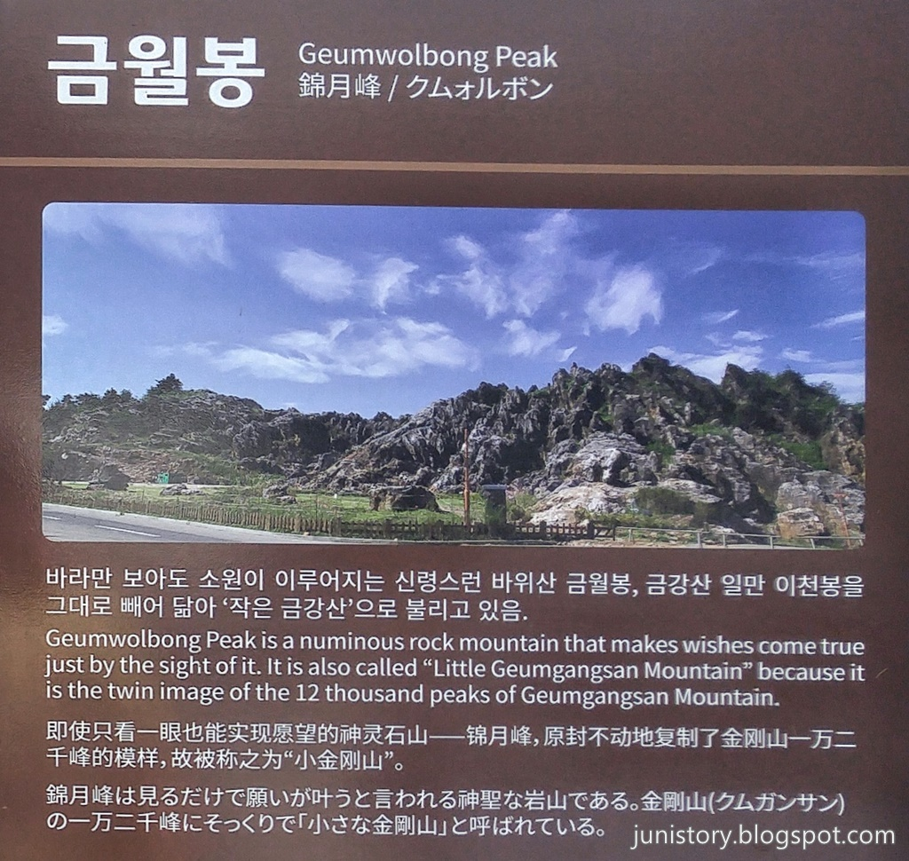
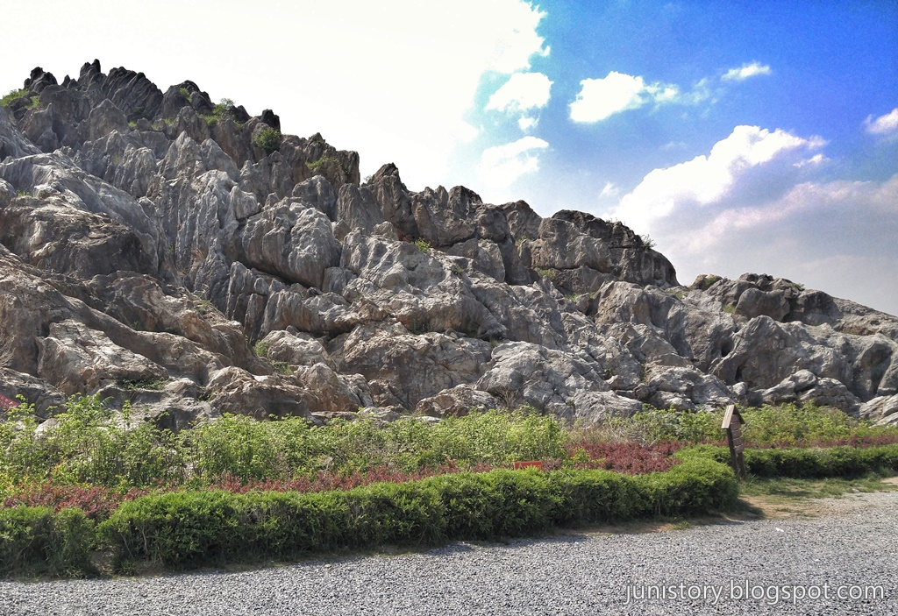
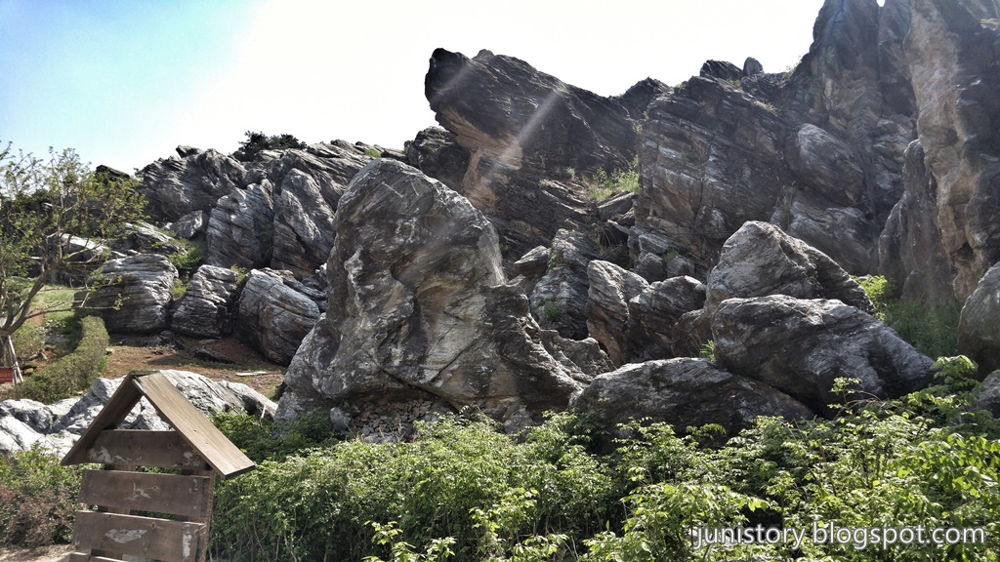
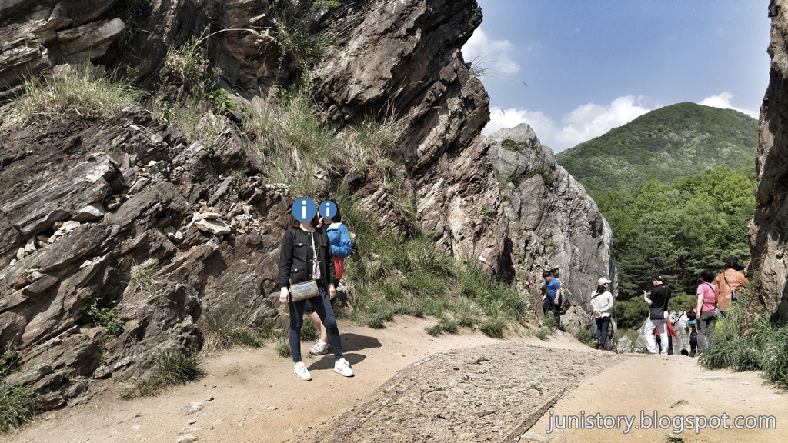

제천시에서 **청풍호**로 가는 초입에 눈에 딱~ 들어오는 풍경을 지닌 휴게소가 나타납니다. 금강산 일만이천봉을 그대로 빼어 닮아서 작은 금강산이라고 불리운다는데 제가 금강산을 가보지 못한 관계로 이부분은 패쓰~  
어째튼 지나가다 보면 휴게소에 들르게 될 정도로 멋진 모습에 사진기를 먼저 들고 내리게 됩니다.

▲ 휴게소는 **유준리조트**에서 운영을 하고 있으나 대부분 경치만 감상을 하고 바로 떠나기 떄문에 약간 미안한 마음도 없지 않습니다. **생칡즙**이라도 한잔 사먹어 주는 센스가 필요할 것 같습니다.

▲ **바라만 보아도 소원이 이루어지는 신령한 바위**라고 억지로 재방문을 유도하는 문구를 붙히고는 있으나 굳이 그런 문구가 없더라도 다시한번 보고 싶은 경치이긴 합니다.

▲ 주차장에서 바라본 바위산입니다. 마치 금강산의 모습과 닯았다고하는 바위산입니다. 자연석이고 하나의 바위로 되어 있다고 합니다.

▲ 바위산을 넘어가는 유일한 길목에 있는 경치입니다. 사진촬영 포인트라 많은 사람들이 기다렸다가 사진을 찍는 장소 입니다.

▲ 바위산으로 넘어가는 길목의 중간지점입니다. 사실 주차장에서 **10M**도 않되는 거리입니다. 가깝죠.. 그리고는 그 뒤의 풍경은 영~ **꽝**이라 여기에서 되돌아 오게 됩니다. 다시 말하면 이 이후로는 볼거리도 없고 힘들지도 않습니다.

## 방문시기

2017년 5월 5일 어린이날.. 영월을 구경하고 제천의 **문화재단지**로 넘어가는 중에 방문했습니다.

## 비용

무료입니다. 다만 휴게소에서 뭐라도 하나 팔아줘야 하지 않을까 합니다.

## 입장시간

연중무휴 상시가능

## 여행지 정보

- 주소 : 충북 제천시 금성면 청풍호로 1316
- 연락처 : 제천시 관광정보센터 043-641-6731~3
- URL : http://terms.naver.com/entry.nhn?docId=1998225&cid=42856&categoryId=42856

    <iframe src='https://www.google.com/maps/embed?pb=!1m18!1m12!1m3!1d5355.746823319117!2d128.16942002644436!3d37.044467172869524!2m3!1f0!2f0!3f0!3m2!1i1024!2i768!4f13.1!3m3!1m2!1s0x356388f4197f94e1%3A0x137361877b531439!2z6riI7JuU67SJ7Zy06rKM7IaM!5e0!3m2!1sko!2skr!4v1500080841997' class='embed-responsive-item' allowfullscreen></iframe>

## 주차정보

주차장은 넓은 편이고 차량이 바로바로 빠지기 때문에 조금만 기다리면 주차가 가능합니다.

## 인근맛집

- 제천중앙시장 빨간오뎅
- 두꺼비식당 (주메뉴 : 매운 등갈비)
