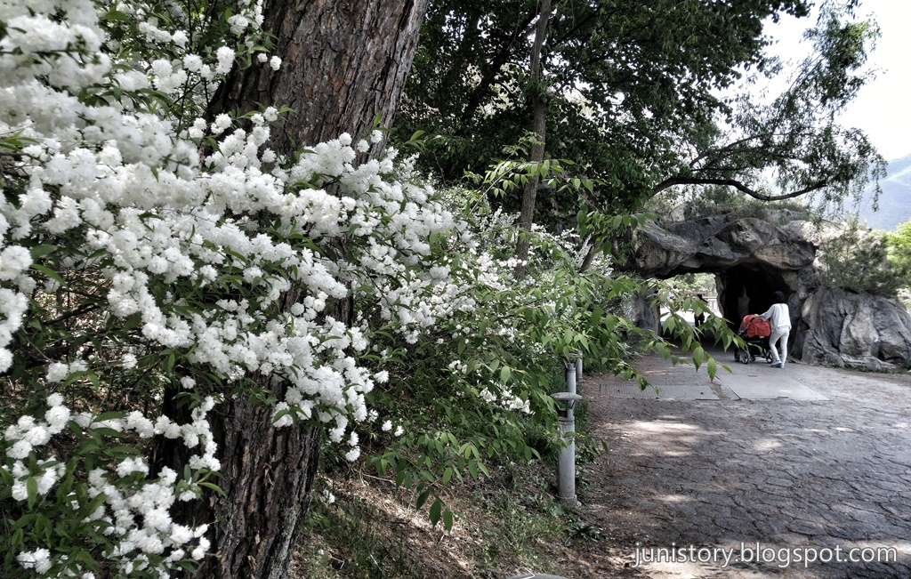

밀양 수산제, 김제 벽골제, 상주 공갈못, 제천 의림지 등 삼국시대에 축조한 인공 저수지 중에 아직도 사용중인 저수지인 **제천 의림지** 입니다.

> 충청북도 제천시 모산동에 있는 저수지. 호반둘레 약 2㎞, 수심 8∼13m. 명승 제20호. 우리 나라에서 오랜 역사를 가진 저수지로 신라 진흥왕 때 우륵이 처음 쌓았으며 약 700여년 뒤에 박의림이 쌓았다고 한다.
> 출처: 한국민족문화대백과

▲ 의림지의 상징처럼되어 있는 저수지 안의 섬입니다. 생각보다 물이 깨끗해서 바닥까지 볼 수 있습니다.

▲ 의림지의 입구에 있는 **파크랜드**입니다. 많이 오래된 느낌의 탈것들이 움직이고 있는것을 보면 운영은 하고 있는것 같습니다.

▲ 파크랜드 옆에 **의림지 프리마켓**도 있습니다. 수공예품들을 많이 가져와서 판매를 하고 있습니다.

▲ **의림지 프리마켓**입니다.

▲ 의림지의 광장을 지나 저수지를 가로질러 지나가는 학사촌길 위 입니다.

▲ 저수지의 물이 빠져나가는 곳입니다. 마치 폭포처럼 떨어지는 것이 시원해 보입니다.

▲ 의림지 활터 쪽에 조그만 커피집도 있습니다. **2007년 5월 어느날**이라고 하는것을 보니 10년은 된것 같습니다. 시원한 아이스아메리카노라도 한잔드시면 될 것 같습니다.

▲ 바로 옆쪽으로 보면 인공 동굴이 있습니다. 꽃이 이쁘게 피어있어서 기록에 남겨 봤습니다.

▲ 동굴안에서 의림지 관광안내소쪽을 바라보고 찍은 사진입니다.

▲ 동굴에서 솔밭공원쪽으로 가는 길은 길게 나무데크로 꾸며져 있습니다.

▲ 30M정도 지나고 나면 개울을 건너 다시 관광안내소쪽으로 갈 수 있게 다리를 놓아놨습니다.

## 방문시기

여행의 마지막날인 2017년 5월 5일입니다. 어린이날이라 어린이날 행사로 무척이나 붐볐던 의림지 였습니다. 여러가지 행사로 사람들과 어린이들이 많고 더욱이 꽃가루까지 날려서 힘든 산책이였습니다.

## 비용

무료로 주차 및 입장을 할 수 있습니다.

## 여행지 정보

- 주소 : 충북 제천시 의림지로 33 (모산동)
- 연락처 : 043-651-7101
- URL :

 <iframe src="https://www.google.com/maps/embed?pb=!1m18!1m12!1m3!1d3179.1394559621003!2d128.20834576483452!3d37.17315667987339!2m3!1f0!2f0!3f0!3m2!1i1024!2i768!4f13.1!3m3!1m2!1s0x3563910aa82921cb%3A0x4d00e24664fe13c0!2z7KCc7LKcIOydmOumvOyngOyZgCDsoJzrprw!5e0!3m2!1sko!2skr!4v1500104445356" class="embed-responsive-item" allowfullscreen></iframe>

## 주차정보

무료주차이고 주차장도 넓은 편입니다. 성수기때는 주차가 힘들 수 도있습니다. 저는 어린이날 행사가 있을 떄 가서 주차하기가 힘들었지만 그런 특별한 날이 아니라면 주차하기 어렵지는 않을것 같습니다.

## 인근맛집

- 제천중앙시장 빨간오뎅
- 두꺼비식당 (주메뉴 : 매운 등갈비)
