4시간30분을 날라 베트남 다낭을 여행했습니다. 주로 자유여행을 선호하는 여행 스타일인데 이번에는 경험상 **패키지여행**을 다녀왔습니다.  
**자유여행과 패키지 여행의 장단점**과 나름 알게된 **여행정보**를 포스팅해 보려고 합니다.
일단은 전체일정에 대해서 작성해 보겠습니다.

## 1일차

출발이 아침 7시40분 비행기라 새벽부터 집에서 출발해서 공항에 5시에 도착을 했습니다. 여행사와의 미팅도 5시30분 부터라서 우리는 생각보다 일찍왔다고 생각을 했지만 불행히도 우리가 마지막 팀이였더라구요. 결과적으로 우리 일행은 같은 자리에 앉지못하고 떨어져 앉게되었습니다.  
어찌되었든 2시전부터 티켓팅이라 하더라도 더 일찍부터와서 줄서서 기다리던가 아니면 **셀프 체크인**을 일단 먼저 하던가 해야 원하는 자리에 배정을 받을 수 있습니다.

1일차의 일정은...  
`영흥사` <i class="fas fa-arrow-right"></i> `다낭 대성당` <i class="fas fa-arrow-right"></i> `까오다이교 사원` <i class="fas fa-arrow-right"></i> `베트남 마사지` <i class="fas fa-arrow-right"></i> `한강 야경 투어`의 일정을 소화했습니다.

### 영흥사(영응사)

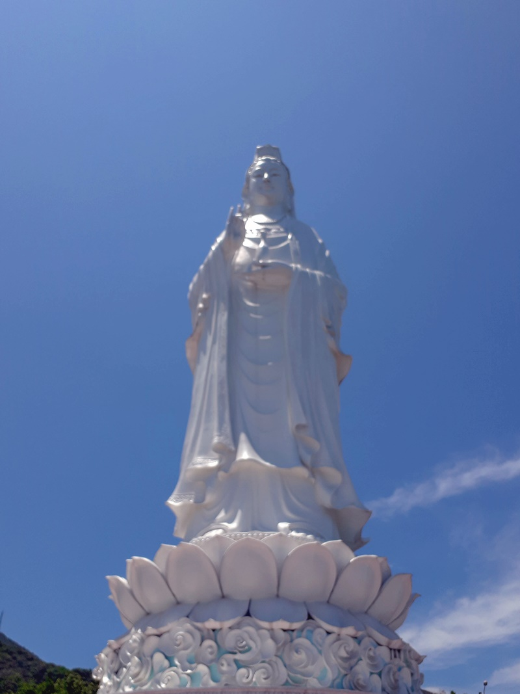

공항에서 나와 제일먼저 찾은 곳은 **영흥사** 입니다. 베트남의 최대크기의 **해수관음상**이 있는 불교사찰입니다.  
베트남전쟁 후 공산화된 베트남을 탈출하기위해 보트를 타고 바다로 나간 일명 `보트피플` 중에 물에빠져 죽은 수많은 난민들을 위로하고자 바다를 바라보는 해수관음상을 세웠다고 합니다.

공항에서 **20~30분정도** 거리에 있는 영흥사 주차장에 내려서 5분정도 올라가면 불교사찰이 있고 거대한 해수관음상을 볼 수 있습니다. **대략 30분정도**면 주변 관람을 할 수 있습니다.

[[슬픈역사를 위로하기 위한 해수관음상이 있는 영흥사 자세히 보기]](http://stories.tistory.com/232)

### 다낭 대성당

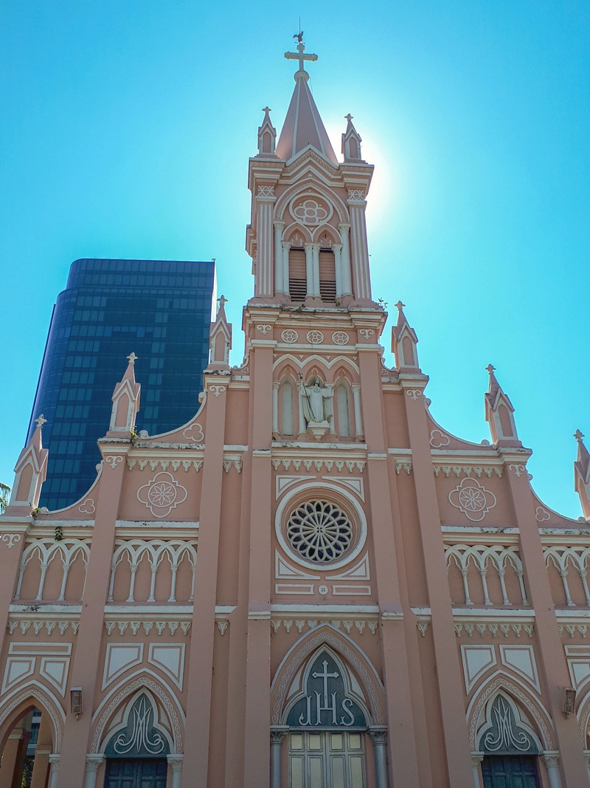

영흥사를 내려와서 2번째로 찾아간 곳이 **다낭 대성당**입니다.  
프랑스 식민지 시절 베트남에 들어와 있는 프랑스인들이 자신들을 위해 세운 성당이라고 합니다. **성당이 분홍색인 이유는** 여러 설이 있지만 당시에 분홍색은 상류층의 사람들이 사용하는 유행색이였다고 합니다.

성당은 그다지 크지 않고 우리나라 전주에 있는 **전동성당**과 크기나 분위기 면에서 비슷해 보였습니다. 이곳도 **대략 15분정도**면 관람을 할 수 있습니다.

[[분홍색 건물이 인상적인 다낭 대성당(수탉교회) 자세히 보기]](http://stories.tistory.com/233)

### 까오다이교 사원

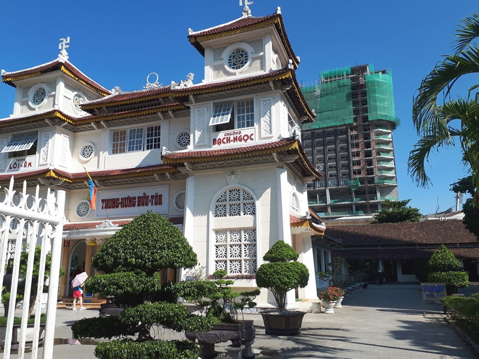

다낭 대성당 근처에 **까오다이교**라는 베트남 신흥종교 사원이 있습니다. 사실 볼 것은 별로 없는데 베트남에만 있는 종교라고해서 패키지여행에 포함을 시켰다고 합니다.  
사찰은 작아서 볼거리는 별로 없습니다. **자유여행이라면 굳이 찾아가 볼 필요는 없어** 보입니다.

1926년 프랑스 식민시절 응오 민 찌에우(Ngo Minh Chieu)가 설립하여 **베트남의 공식적인 종교**가 되었다고 합니다.
까오다이교는 `기독교`, `이슬람교`, `불교`, `유교`, `도교`를 짬뽕으로 섬기고 있으며 남여를 구분하여 사원의 출입구도 남자가 입장하는 문과 여자가 입장하는 문이 따로 있습니다. 사원내부의 중앙에는 `천안`이라는 지구본에 달린 `눈`을 상징으로 사용하고 있으며 그 눈이 세상을 살펴보고 있다는 의미를 갖는다고 합니다. 까오다이교를 믿는 사람들은 베트남인구의 약 3%정도라고 하네요.

### 베트남 마사지

동남아 국가에서 마사지로 유명한 나라가 태국이 있지만 **베트남 마사지**도 후발주자로 곽광을 받고 있다고 합니다. 마사지를 별로 좋아하지 않아서 별로 내키지는 않았지만 그래도 패키지에 포함되어 있어서 받아 봤습니다. 저는 아프기만 했지 별로 좋은지는 모르겠더라구요. 하지만 같이 참석한 다른 사람들은 만족도과 꽤 좋았다고 하네요. 베트남 마사지는 특이하게 스톤(돌)을 데워서 몸에 비비는 **스톤마사지**가 대세인 것 같습니다.  
베트남은 팁문화가 있어서 **마사지 1시간에 2달러**, **2시간에 4달러**라고 정해져 있다고 합니다. 이전에는 팁을 손님 마음대로 많이 주거나 또는 주지 않거나 하는 경우가 있어서 다낭 마사지협회에서 지정을 했다고 하네요.

### 한강 야경 투어

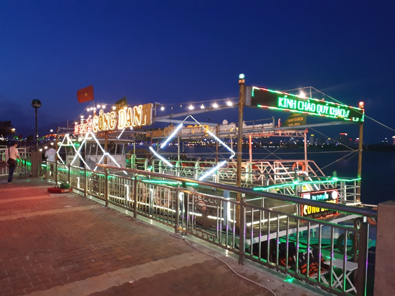

마사지를 받고 저녁에 다낭을 흐르는 한강에서 **배를 타고 야경 투어**를 했습니다.
한마디로 **왜 탔나~** 할 정도로 **만족도가 낮았습니다.**  
배를 타고 이동하면서 본 다낭의 야경은 베트남에서는 상위에 랭크할 만큼 보기 좋을지는 모르나 우리나라의 서울 야경에 견줄 만큼 좋지는 않습니다. 그리고 한마디의 해설도 없이 그냥 배타고 올라갔다가 다시 내려오는 것이 전부입니다. 볼것도 없고 지루하기만 합니다. **다시 타고 싶지는 않네요**.

[[다낭 한강 유람선 야경 투어 자세히 보기]](http://stories.tistory.com/234)

## 2일차

세븐씨호텔에서 숙박을 하고 아침 조식을 먹고 **9시10분** 부터 일정을 시작했습니다. 세븐씨호텔의 대부분이 한국사람 이더라구요
2일차는 가장 알찬 일정이였습니다. 먼저 전날 받았던 베트남 마사지를 오전에 다시한번 받고 일정을 시작했습니다.

`오행산(마블마운틴)` <i class="fas fa-arrow-right"></i> `코코넛 햇 바구니배 체험` <i class="fas fa-arrow-right"></i> `목공예마을 & 도자기마을` <i class="fas fa-arrow-right"></i> `호이안 방문`의 꽉~ 찬 스케쥴이였습니다.

### 오행산(마블마운틴)

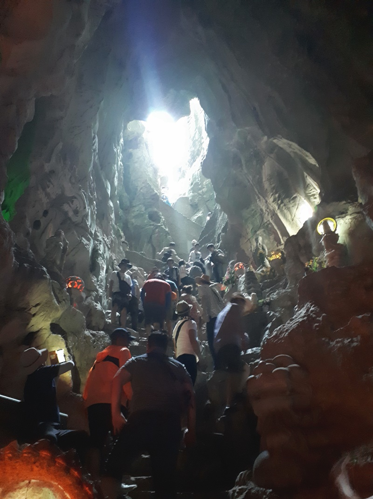

아침을 먹고 **오행산**으로 향했습니다. 오행산은 다낭 시내에서 남쪽에 있는 **호이안으로 가는 길**에 있으며 **논느억 해변** 근처에 위치해 있습니다. 석회암으로 이루어져 있는 오행산은 5개의 산이 볼록 솟아나 있으며 목(木), 화(火), 토(土), 금(金), 수(水)의 이름을 따서 이름을 지었다고 합니다.  
보통은 여행객들이 **수산(水山)을 많이 가지만** 우리는 시간때문에 그런지 바로 주차장 옆에 있는 **암푸 동굴**만 갔다왔습니다.  
암푸동굴을 들어가면 **천국으로 가는 길**과 **지옥으로 가는 길**로 나누어져 있는데 **천국으로 가는길**은 경사가 매우 가파른 산 위쪽으로 가는 길이라 잘못 가다가는 정말 하늘나라로 갈 수 도 있으니 조심을 해야 합니다. 전망은 멋지나 오르고 내려오는 길이 많이 가파르고 위험해서 굉장히 조심을 해야 합니다.  
**지옥으로 가는 길**은 아래쪽으로 내려가는 길이며 힘들기는 하나 그다지 위험한 길은 아닙니다. 다만 별로 볼만한 것은 없습니다.

[[오행산 포스팅 자세히 보기]](http://stories.tistory.com/235)

### 코코넛 햇 바구니배 체험

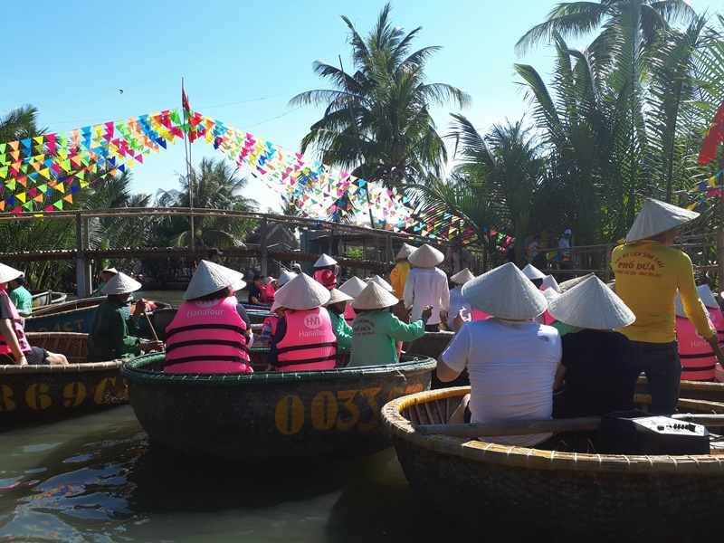

호이안의 동쪽에 위치해 있는 **Coconut Hat**으로 이동을 했습니다.  
다낭여행 중에 알짜코스라 할 수 있는 바구니배를 탈 수 있는 곳 입니다. 다낭여행 또는 호이안으로 여행을 간다면 꼭 한번 타보기를 권하는 **추천 코스**입니다. 코코넛잎으로 둥그렇고 커다랗게 만든 배에 **2~3명이 타고** 강을 한바퀴 돌면서 다양한 체험을 할 수 있는 액티비티 입니다.

### 목공예마을 & 도자기마을

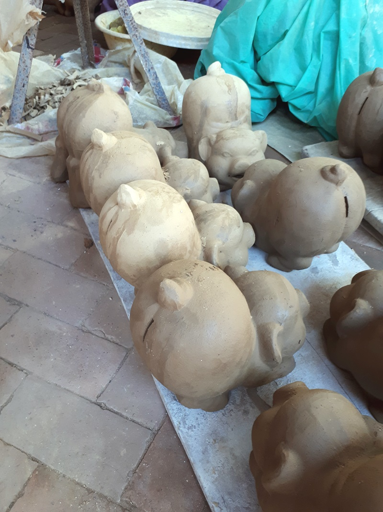

코코넛 마을에서 관광버스를 타고 호이안으로 가기 전에 **목공예마을 & 도자기마을**로 갔습니다.  
사실 도자기마을에서는 별로 볼 것은 없습니다. **자유여행이라면 굳이 갈필요는 없을 것 같습니다**. 우리야 패키지여행이라 입장료를 따로 내지는 않았지만 개별적으로 갈때는 이곳도 입장료가 있어야 들어갈 수 있다고 합니다.

### 투본강 투어 후 호이안 구시가지로...

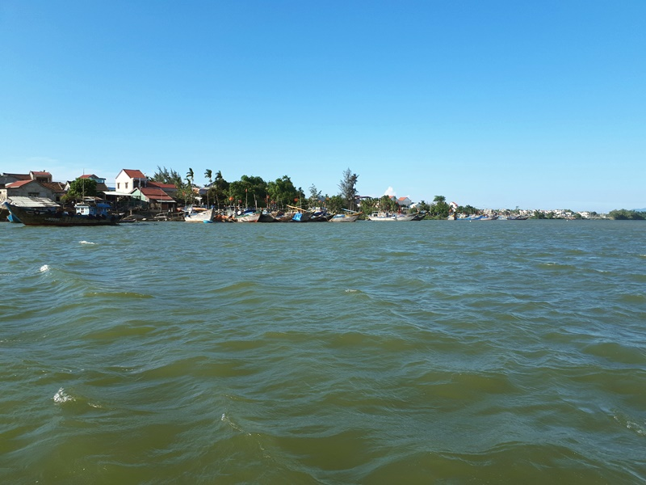

도자기마을은 투본강을 끼고 있어서 도자기마을에서 배를타고 투본강을 거슬러 올라가서 호이안쪽으로 이동을 했습니다. 무더운 베트남 날씨인데 강을 타고 달리는 배안에서 강바람을 맞으면 잠시나마 더위를 잊을 수 있었습니다.

### 호이안 구시가지

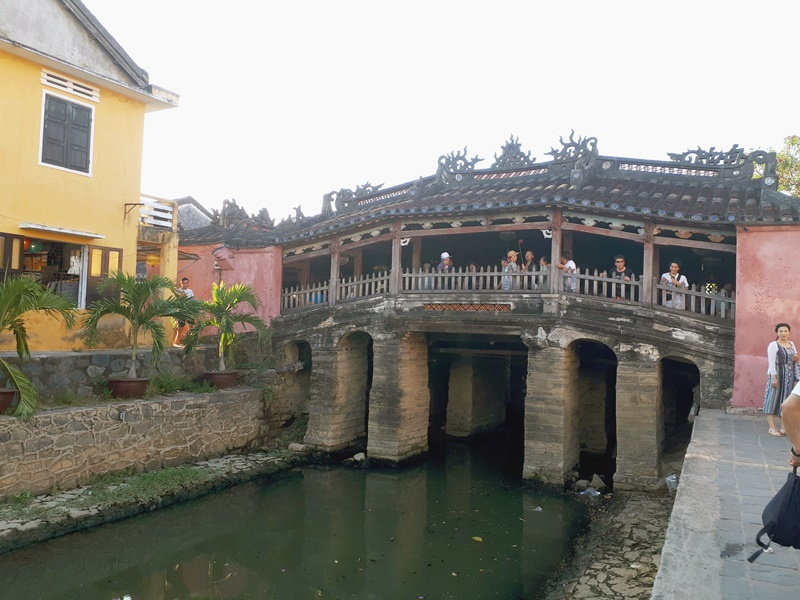

호이안에 도착하자마자 자전거를 타고 구시가지를 한바퀴 도는 **씨클로**를 탔습니다. **대략 10~20분정도 투어**를 하고 호이안의 거상이였던 **Tan Ky**의 집앞에서 내렸습니다. 호이안의 구시가지에 있는 `**Tan Ky**의 집`과 `화교회관`, `일본교`, `**Phung Hung**의 집`을 구경하고 저녁식사를 먹었습니다.

### 호이안 신시가지

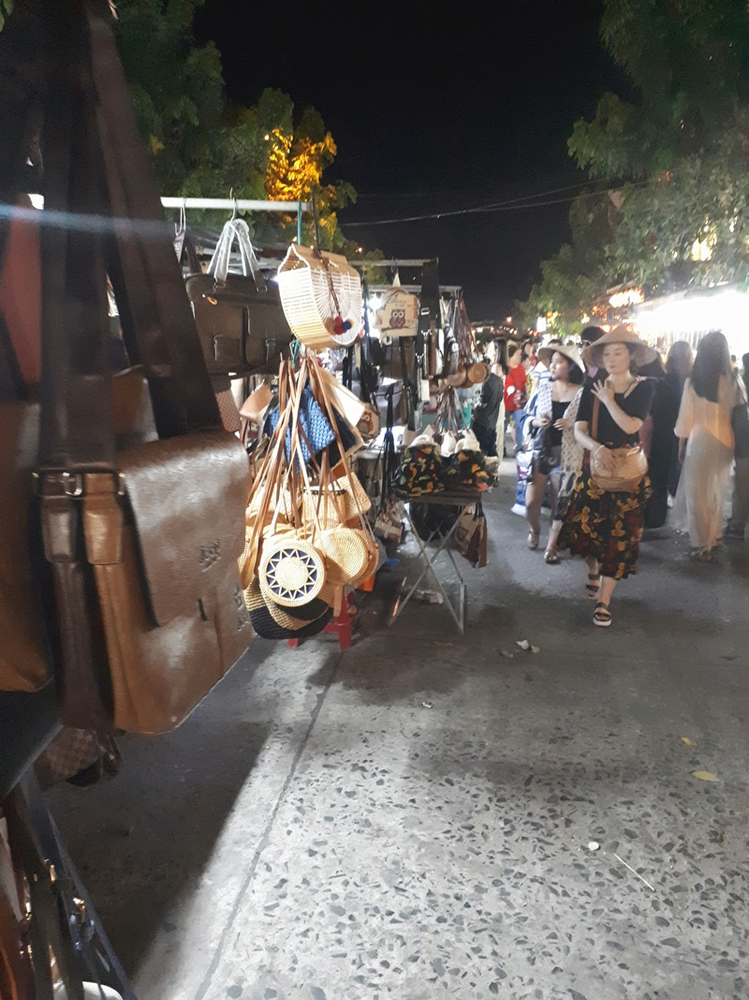

저녁을 먹고 해가 진 후에 신시가지로 넘어가서 야경을 구경하며 2시간 정도 자유시간을 가졌습니다.**신시가지에 있는 시장을 구경**하며 먹거리도 먹고 여러가지 잡화들도 구매를 했습니다.

### 배타고 연등띄우기

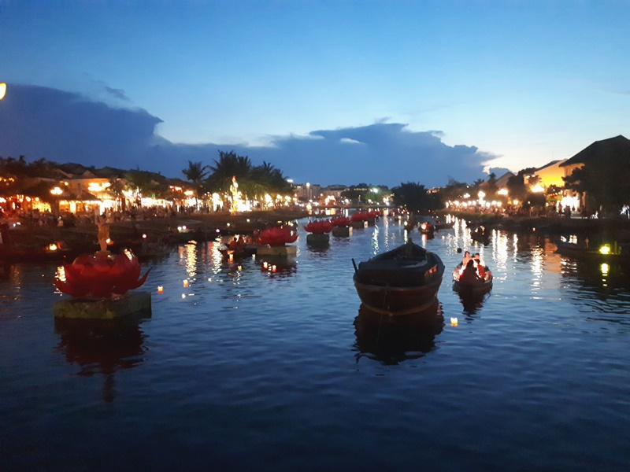

마지막으로 신시가지에 있는 투본강 줄기에서 **배를 타고** **연등띄우기**를 하며 강의 아래쪽에 있는 **호이 조각공원**으로 내려와서 기다리고 있던 관광버스를 타고 다낭으로 돌아왔습니다.

## 3일차

`바나힐 국립공원` <i class="fas fa-arrow-right"></i> `쇼핑센터 3곳방문` <i class="fas fa-arrow-right"></i> `커피전문점 방문(위즐커피)` <i class="fas fa-arrow-right"></i> `미케비치` <i class="fas fa-arrow-right"></i> `다낭 차밍쇼 관람` 까지 패키지여행 일정이고 그 후에 개별적으로 `다낭의 롯데마트`에 방문했습니다.
3일차는 쇼핑센터 방문 때문에 오후를 망친 듯 한 느낌이 였습니다.

### 바나힐 국립공원

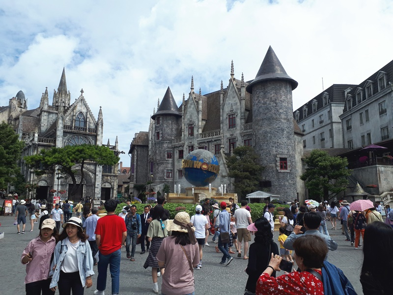

**바나힐 국립공원**을 가기위해 (오후에 있을 쇼핑센터를 방문하기 위해 --;) **아침 8시에 일정을 시작**했습니다.
바나힐은 베트남의 대기업이라 할 수 있는 **SUN WORLD**에서 프랑스 식민지 시절에 프랑스인들이 더위를 피하기 위해 산꼭데기에 별장마을을 지었던 곳을 구매하여 **놀이공원식으로 꾸며 놓은 곳**입니다. 지상보다 대락 **5~10도 정도** 기온이 더 낮다고 합니다.  
바나힐은 지상에서 바나힐까지 오르는 **케이블카**가 압권이라 할 수 있습니다. `길이`, `고도`, `노선`, `하중`의 4개의 **기네스북 기록**을 가지고 있으며 길이는 장가계에 빼앗기고 현재는 3개의 기록을 유지하고 있다고 합니다.  
이곳에서 오전 2시간정도의 자유시간을 보내고 내려왔습니다.

### 쇼핑센타 방문(노니, 라텍스, 잡화)

오후에는 패키지여행의 고통이라 할 수 있는 **3곳의 쇼핑센터**를 다녀왔습니다.  
거의 강의수준의 설명을 듣고 꼭 사야할것만 같은 분위기를 잘 참고 견디며 **내가 왜 패키지여행을 왔을까?**라는 자괴감을 갖게 하는 시간이였습니다.  
그래도 노니, 라텍스, 잡화 3곳 중 대중의 분위기를 봤을때 **라텍스**는 분위기가 좋았습니다. 제가봐도 라텍스는 필요하다면 구매하고 싶기는 했습니다.

### 커피샵 방문

가이드가 커피를 선물하겠다며 속이듯 데리고 간 **커피전문점**입니다. 난 또 카페에서 유명한 베트남 커피를 여유있게 먹을 수 있게 제공하겠다고 하는줄 알았는데.. 결국은 여기도 쇼핑센터 4곳중 한곳을 방문한 느낌이였습니다.  
그래도 사향고양이똥 커피인 **루왁커피**와 다람쥐똥 커피라고 하는 **콘삭커피**, 그리고 사항족제비똥 커피인 **위즐커피**에 대해서 알게 되었고 **베트남 핀커피**에 대해서 배울수 있는 그나마 유익했던 시간이긴 했습니다.

### 미케 비치(미케 해변)

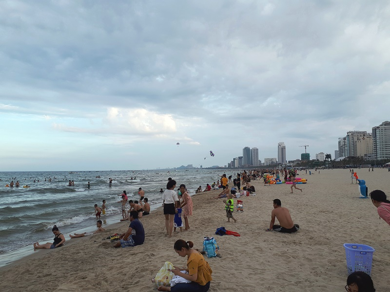

미케비치도 잠깐들렀습니다. 해수욕을 하지는 못하고 모래를 만지고 해변의 경치를 사진에 담는정도의 시간만을 보냈습니다.
미케비치 해변의 길이가 28Km로 이루어져 있어서 세계에서 가장 긴 해변에 속한다고 합니다.  
주로 현지인들이 많았고 관광객은 그다지 많아 보이지 않았습니다. 그리고 약간의 냄새가 나는듯했습니다.  
아직 베트남의 휴가철이 아니라서 사람이 많지는 않은데 한창 휴가시즌에는 현지인들이 엄청나게 많이 온다고 합니다.

### 챠밍쇼 관람

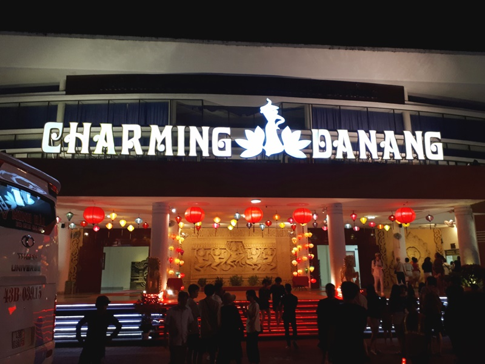

패키지여행의 마지막 옵션여행인 챠밍쇼를 관람했습니다.  
차밍쇼는 베트남의 과거와 현재에 대한 모습을 쇼 형태로 보여주었는데.. 별로 감흥은 없었구요. **자유여행이였다면 결코 보지 않았을 코스**였습니다.

### 롯데마트 방문

패키지여행은 챠밍쇼로 마무리가 되었고 그 후에 개별적으로 다낭에 있는 **롯데마트에 방문**을 했습니다.  
차밍쇼가 끝난 시간이 저녁 8시쯤이였고** 롯데마트는 10시에 문을 닫기 때문**에 대략 2시간 쇼핑을 했습니다.  
다낭 차밍쇼가 열린 **노동문화원**에서 길을 건너 택시를 타고 롯데마트까지 대략 5분정도를 이동했습니다.

자유여행객들이 많이 찾는 곳중의 하나인 롯데마트에서 이것저것 물건들을 많이 샀습니다. 가이드는 굳이 갈필요가 없다고 비추를 했지만 그래도 여기서 베트남 물건들을 사니 그나마 베트남을 다녀온 느낌이 나는 물건들을 다수 살 수 있었습니다.

## 4일차

마지막 날인 4일차는 아무것도 못하고 아침 9시에 가이드를 만나 공항으로 이동하고 바로 패키지여행 일정이 종료되었습니다.
출국비행기가 11시 15분이라 9시에 바로 티켓팅을 하고 면세점에서 1시간정도 구경을 하고 돌아왔습니다.

## 총평

처음가본 패키지 여행에 대한 총평은...  
이제 패키지 여행은 `꼭 필요한 곳이 아니라면 그냥 자유여행을 가는 것이 좋을 것 같다` 입니다.  
마치 국내가이드와 여행사 배만 불려주는 느낌이 들었습니다.

### 패키지여행 장점

- 아무 생각 없이 가이드가 시키는데로만 이동하면 됨 (편함)
- 여행지에 대한 해설, 현지에 대한 분위기에 대한 설명을 들을 수 있음
- 식사에 대해 크게 걱정하지 않아도 됨

### 패키지여행 단점

- 내가 원하는 여행지를 갈 수 없음(개별행동이 어려움)
- 추가비용을 내고 추가 옵션을 할 수 밖에 없는 분위기가 조성됨
- 현지 식당이 거의 대부분 한국사람이 운영하는 식당임(거의 패키지 손님들만 상대하는 식당임)
- 가이드의 배만 불려주는 것 같은 억울한 생각이 듦(옵션 추가비용이 있음)
- 같이 다니는 사람들과 일정을 맞추어서 다녀야 함.
- 결과적으로 전체 경비에서 예상보다 더 많은 비용이 소요됨
- 가장 싫었던건 3군데의 쇼핑센터를 방문하여 꼭 구매를 해야할 것 같은 강압적인 분위기를 이겨내야 함
