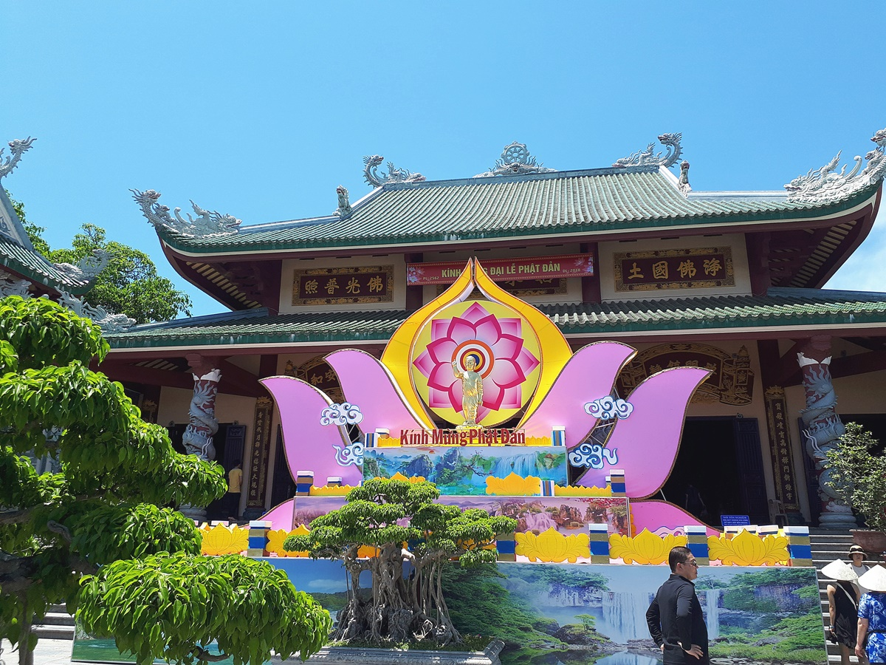

오전 10시에 다낭공항에 도착한 여행의 **첫번째 날**은 다낭 인근의 관광지를 돌아보는 것이였습니다.

공항에서 20~30분 정도 거리에 있는 영흥사는 바다를 바라보고 있는 거대한 **해수관음상**이 압권인 불교사찰입니다. 이곳은 **대략 30분 정도**면 관광을 할 수 있습니다.

### 영흥사(영응사)

베트남전쟁이 끝날무렵 공산화된 베트남을 빠져나가기 위해 조그만 보트에 올라타고 남중국해로 나오다가 죽은 수 많은 난민들을 위로하고자 바다를 바라보고 있는 해수관음상을 세웠다고 합니다.

  
▲ 다낭시내를 지나 미케비치를 타고 북쪽으로 올라가다보면 마치 그때의 모습을 보는 듯한 미케비치의 배들을 볼 수 있습니다.  
계속해서 `선짜반도`(손짜반도)에 올라서면 `영흥사(링엄사)`에 오를 수 있습니다.

  
▲ `영흥사`오르기 위해서는 `유물의 탑` 앞에 있는 주차장에 주차를 하고 `10여분` 걸어서 올라가야 합니다. 이 유물의 탑 앞에는 누워있는 부처인 거대한 **부처와상**이 있습니다.

▲ 다행히 영흥사에 올라가는 길에는 타는 듯한 태양을 피할 수 있는 낮게 드리워진 나무그늘이 있습니다.

▲ 그렇게 올라가다 보면 곧 해수관음상의 엉덩이를 볼 수 있습니다. 워낙 커서 어디에서도 해수관음상을 보는것이 어렵지는 않습니다.

▲ 영흥사 자체가 그렇게 크거나 웅장하지는 않지만 영흥사 앞마당에는 다양한 `분재`와 `동상들`이 즐비해 있습니다.

  
▲ 영흥사에서 바다쪽에 세워져있는 상징적인 문이 있습니다. 이곳에서 바라보는 **미케해변**과 **다낭의 모습**은 정말 멋집니다.

  
▲ 영흥사에서 바라 본 다낭의 모습은 해수관음상 외에 영흥사를 오게하는 2번째 이유라고 할 수 있습니다.

  
영흥사의 앞마당에는 마치 **에버랜드에 있는 매직트리**같은 나무가 있습니다. 이나무의 정확한 이름이 궁금하네요.

  
▲ 영흥사 앞마당에서 조그만 길을 따라 계단 몇개만 내려가면 **해수관음상** 앞에 다다를 수 있습니다.

  
▲ 이 앞마당에는 일부 원숭이들 무리가 있습니다. 관광객들이 주는 여러가지 음식들을 주워먹으면서 살고 있습니다.

> 길들여지지 않은 야생의 원숭이이므로 항상 조심해야 합니다.

다음은 다낭에 살던 프랑스인들이 자신들을 위해 지은 분홍색의 성당 **다낭 대성당**을 포스팅하겠습니다.
