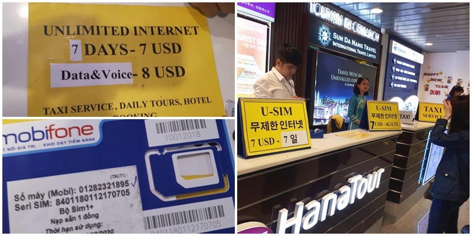
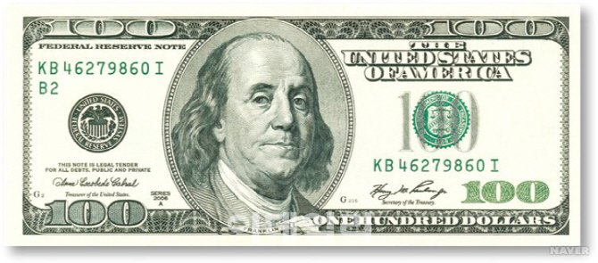
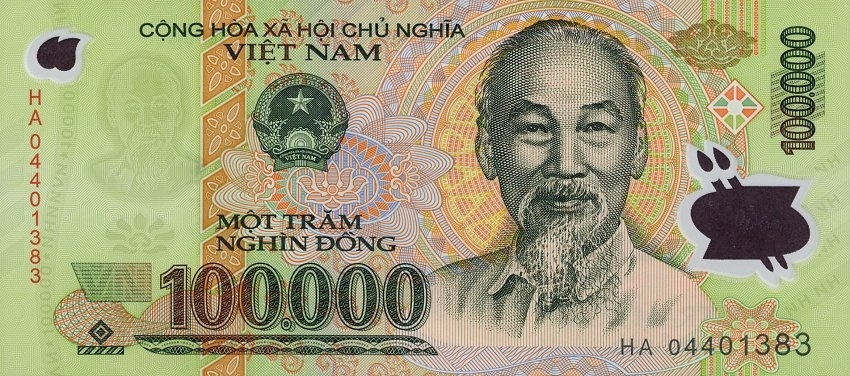
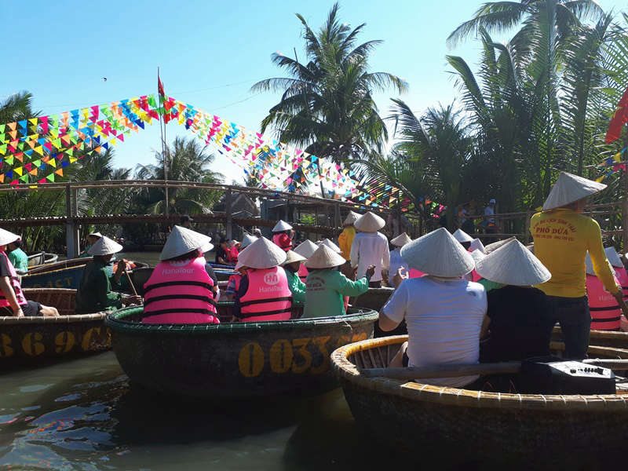
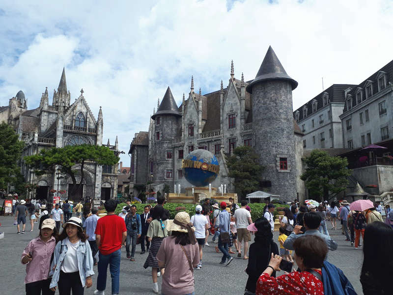
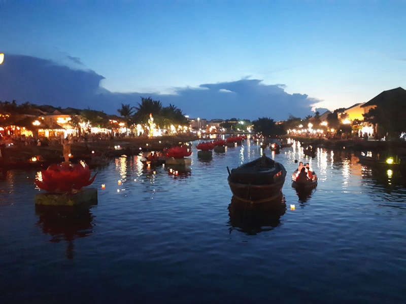

이번에 다낭여행을 하면서 알게된 깨알정보를 포스팅합니다.

옛날과 달리 요즘에는 웬만한 해외여행을 가더라도 인터넷을 사용할 수 있는데요. 베트남도 마찬가지로 인터넷을 사용할 수 있습니다.

여행하는 사람이 **1~2명이면 유심칩**을 구매하는것이 좋고 **3명 이상이고 다같이 움직인다면 포켓 와이파이**를 대여하는 것이 좋습니다.

유심칩은 보통 몇일 동안 무제한으로 인터넷을 사용할 수 있게 해줍니다.  
종류는 2가지인데 **인터넷(4G)만 사용 가능한 것**과 **인터넷(4G)과 Voice가 모두 가능한 것** 입니다.  
그리고 해당 기간이 지나면 그냥 유심칩을 빼서 버리면 됩니다.

포켓 와이파이같은 경우는 국내공항 또는 현지공항에서 대여를 할 수 있고 포켓 와이파이 주변에 있는 사람들 중에 비밀번호를 알고 인증된 사람은 대부분 사용할 수 있습니다.

인터넷만되면 카카오톡같은 메신저에 내장되어 있는 음성통화기능을 통해 일반 전화처럼 음성통화를 할 수 있습니다.

## 1. 다낭 공항에서 유심칩 구매하기

우리는 유심칩을 구매했고 구매하면서 알게된 정보입니다.  
공항에서 수하물을 찾는 곳에 각 여행사에서 **유심칩**을 판매하고 있습니다.
여러군데가 있는데 가격은 거의 동일하니 마음 내키는 곳 에서 대여를 하면됩니다.  
인터넷(4G)만 가능한 것과 인터넷(4G)과 Voice가 가능한 2가지 종류이며 1달러가 더 비쌉니다.
만약 통화까지 가능한 유심칩을 구매한다면 꼭 전화번호를 확인하셔야 합니다. 해당 전화번호는 다낭 로컬에서 사용가능한 번호입니다.(한국으로 전화를 하게되면 국제전화비가 발생함)
사실 여행내내 로컬전화를 사용할 일은 없으나 혹시나 하는 마음에 구매를 했었습니다. 대부분은 **카카오톡을 통해서 한국에 있는 사람들과 전화 가능**합니다.

- **유심 데이터 7일** : 7달러
- **유심 더이터+통화 7일** : 8달러

유심칩은 판매하는 곳에서 유심칩을 교환해 주고 확인까지 해줍니다. 기존에 있던 내 유심칩은 잃어버리지 않게 스카치테이프를 이용해서 스마트폰케이스 속에 붙혀 줍니다. 나중에 귀국할 때 구매한 유심칩을 빼버리고 다시 내 유심칩을 바꿔넣으시면 됩니다.
요즘나오는 유심칩은 바늘같은 것으로 눌러야 나오기 때문에 여행 전에 바늘이나 클립같은 것을 미리 준비하는 것이 좋습니다.

## 2. 환전 및 현지 금액 (동)

환전은 일단 국내에서 베트남 돈인 `동`이 아니라 `달러`로 환전을 하고 베트남에 가서 `달러`를 `동`으로 환전을 하는 방법을 추천합니다.

**자유여행**이라면 베트남 공항에서 달러를 `동`으로 환전을 하고 가는 것이 좋지만 **패키지여행**이라면 굳이 환전을 할 필요는 없습니다.  
다낭 시내나 웬만한 호텔에서도 환전을 해주고 있고 **현지가이드**가 소액에 대해 환전을 해주기 때문에 필요할 때마다 현지가이드에게 요청을 하면 됩니다.  
그리고 **패키지여행**인 경우는 대부분 **달러를 사용하는 장소**로 다니고 **팁도 달러로 지불**하기 때문에 특별한 경우가 아니고는 거의 달러를 사용합니다.(롯데마트는 달러 사용이 않되고 `동`과 `카드`로만 결제가 됩니다.)

`동`은 계산하기가 까다롭지만 조금만 생각하면 쉽게 계산이 가능합니다.

 1달러 <i class="fas fa-arrow-right"></i> 1100원 <i class="fas fa-arrow-right"></i> 20,000동 

`동`에서 `0`을 하나 빼고 1/2로 나눈 것이 대략적인 한국 돈이라고 보시면 됩니다.

> 예 1) `200,000동` 에서 `0`을 하나 빼면 `20,000`!!, 그것을 반으로 나누면~ `10,000원` 입니다.

> 예 2) `10,000동` 에서 `0`을 하나 빼면 `1,000`!!, 그것을 반으로 나누면~ `500원` 입니다.

## 3. 팁 지불

다낭에서 대부분 서비스를 이용하면 팁을 지불하게 됩니다. 팁은 몇가지만 빼고 **주로 1달러 수준**으로 지불하면 됩니다.

호텔에 들어갈 때 짐을 날라주는 **벨보이에게도 1달러**를 줘야 합니다.  
호텔에서 아침에 나올때 **메이트를 위해 1달러**를 나두고 나옵니다.  
**바구니배**를 타고 내릴때 쯤에 **1달러**를 뱃사공에게 지불을 합니다.  
다만 **마사지 같은 경우**는 현지 마사지협회에서 대략 **1시간에 2달러** 정도로 팁을 지정했다고 합니다. **2시간 풀코스를 받게 되면 4달러**를 팁으로 주면 됩니다. 우리는 패키지여행이라서 그랬었는데 자유여행도 그런식으로 강제가 되는지는 모르겠습니다.

## 4. 추천 여행코스

패키지 여행을 다녀왔지만 여러가지 체험중에 그래도 기억에 남거나 재미있었던 여행코스 3 군데를 추천합니다.

### 1. 바구니배 체험

호이안의 동쪽에 위치해 있는 코코넛 햇 마을에서 진행하는 바구니배는 꼭 타볼만한 여행코스입니다.
보통 다낭에서 호이안 갈 때 같이 체험을 하는 것 같습니다.

### 2. 바나힐 국립공원

바나힐은 우리나라의 에버랜드와 비슷한 놀이공원입니다. 물론 우리나라의 에버랜드가 훨~씬 좋기는 하지만 바나힐도 나름대로 볼만한 곳이긴 합니다.

바나힐에도 어트렉션이 있기는 한데 우리나라에 워낙 좋은 놀이동산들이 많기 때문에 패스를 하고 프랑스마을과 **프랑스마을 꼭데기에 있는 전망대**에 올라서 사진을 찍기에는 너무 좋습니다.

### 3. 호이안 시가지

호이안은 구시가지와 신시가지로 나누어져 있고 두개의 시가지는 투본강을 사이에 두고 있습니다. 밤에는 이 투본강에서 배를 타고 연등을 띄워보는것도 색다른 체험입니다.  
호이안은 우리나라의 경주랑 비슷한 느낌으로 베트남의 전통을 느껴볼 수 있는 건물과 거리풍경으로 되어 있습니다.  
저녁에는 신시가지쪽에 있는 호이안 야시장을 가보는 것도 좋습니다.
