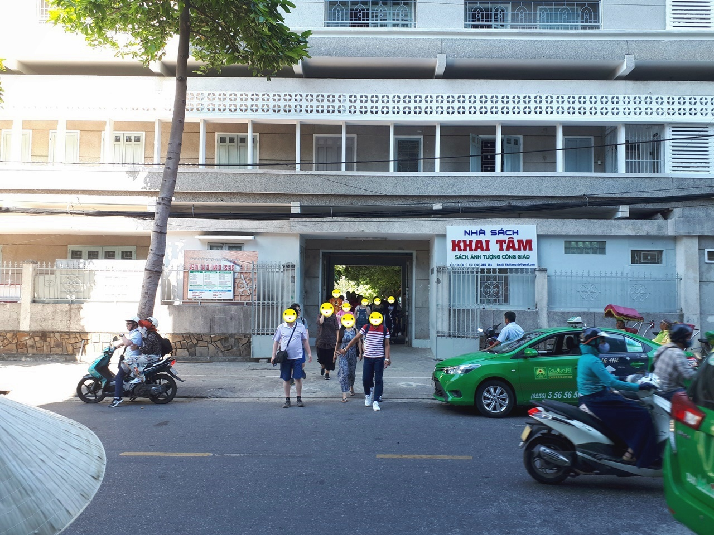
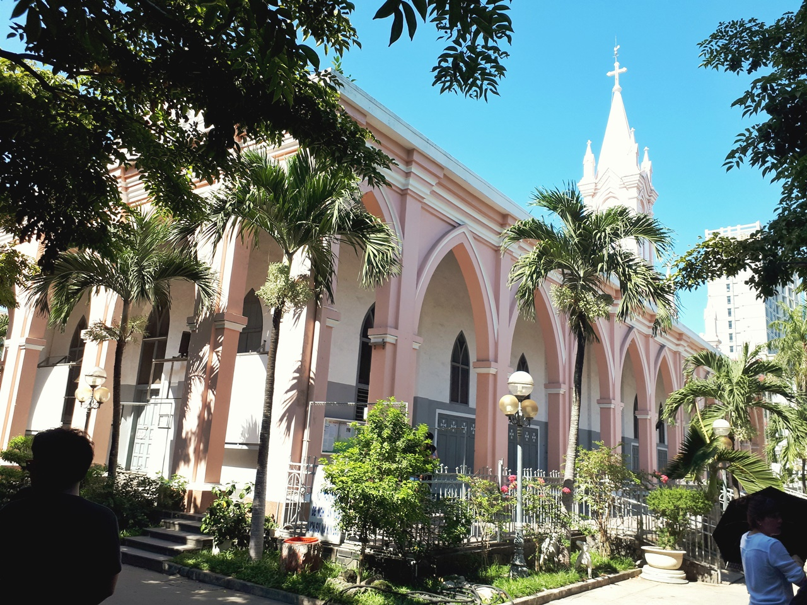
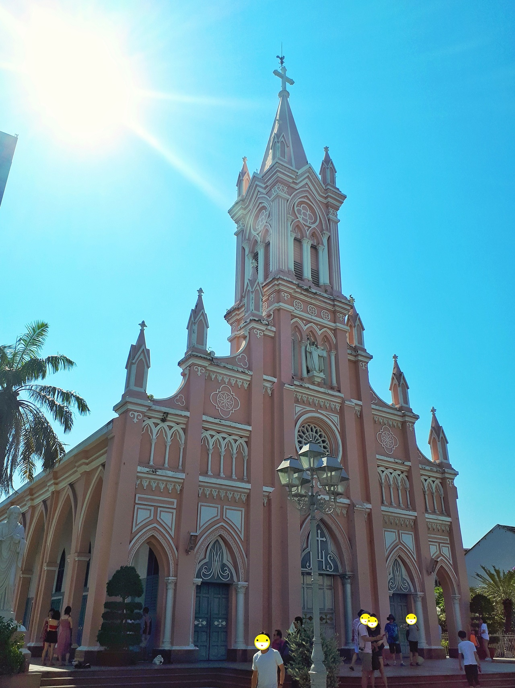
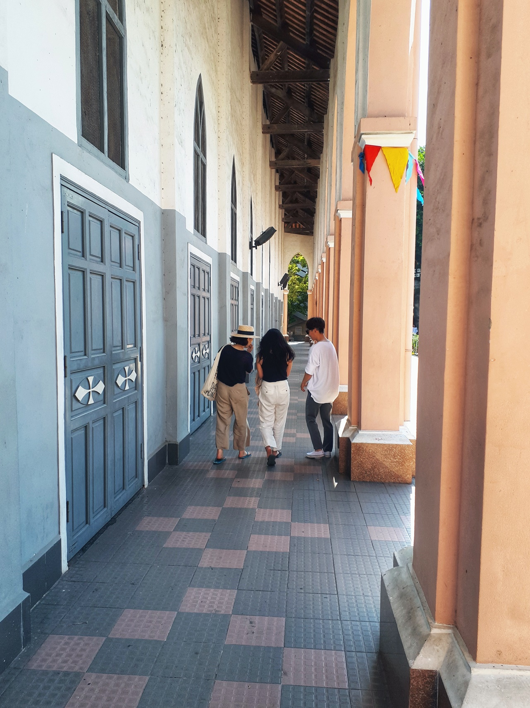
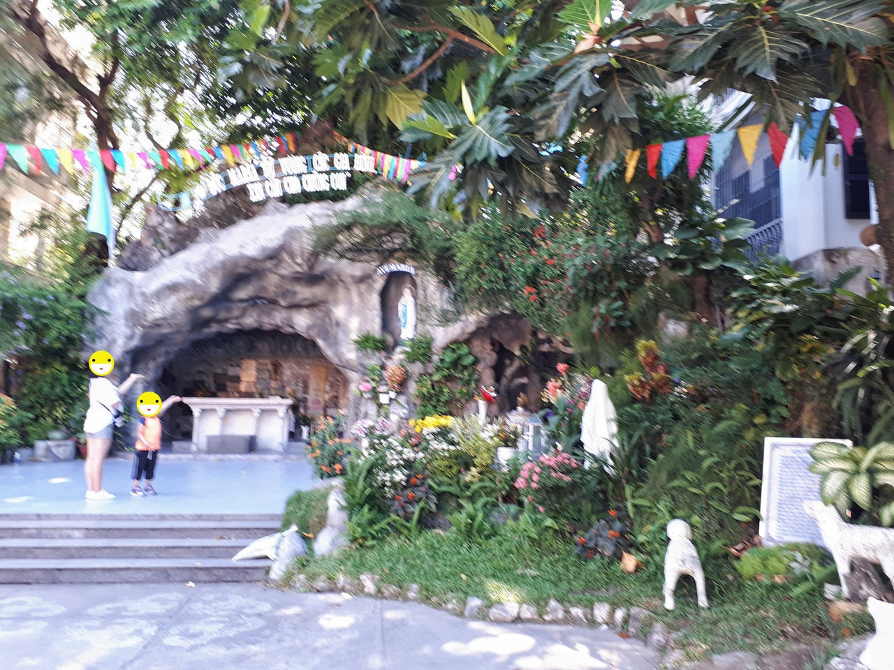

영흥사를 내려와서 2번째로 찾아간 곳이 **다낭 대성당**입니다.

다낭 대성당의 첨탑 꼭데기에 수탉이 있다고 해서 현지인들은 **수탉교회**(Nha Tho Con Ga)라고 하며 프랑스 식민지 시절 프랑스인들이 자신들을 위해 세운 카톨릭 성당이라고 합니다.  
성당이 외부는 분홍색, 내부는 노란색으로 되어 있다고 하는데 **성당이 분홍색인 이유는** 여러 설이 있지만 당시에 분홍색은 상류층의 사람들이 사용하는 유행색이였다고 합니다.

성당은 그다지 크지 않고 우리나라 전주에 있는 **전동성당**과 크기나 분위기 면에서 비슷해 보였습니다.

시내에 위치해 있고 성당이 닫혀있어서 주차할 곳이 었어 인근에 주차를 하고 걸어서 이동을 했습니다.
우리는 성당의 후문쪽으로 입장을 했습니다.

  
▲ 후문 앞에는 도로가 있는데 길을 건널때는 항상 조심해야 합니다. 오토바이나 차들이 서지를 않습니다. 오토바이같은 경우는 피해다닐려고 하지 멈추려고 하지 안흡니다.

  
▲ 후문을 들어서면 바로 보이는 것이 성당의 뒷모습니다. 분홍색의 건물과 함께 첨탑의 십자가 위에 수탉이 조그맣게 보입니다.

  
▲ 드디어 네오고딕양식의 성당의 앞모습을 볼 수 있습니다. 역시 꼭데기에 수탉이 보이네요.

▲ 성당 외부의 옆으로난 길입니다.

성당의 후문에는 성모 마리아상이 있는 인조동굴을 볼 수 있습니다.

> 이곳도 **대략 15분정도**면 관람을 할 수 있습니다.
