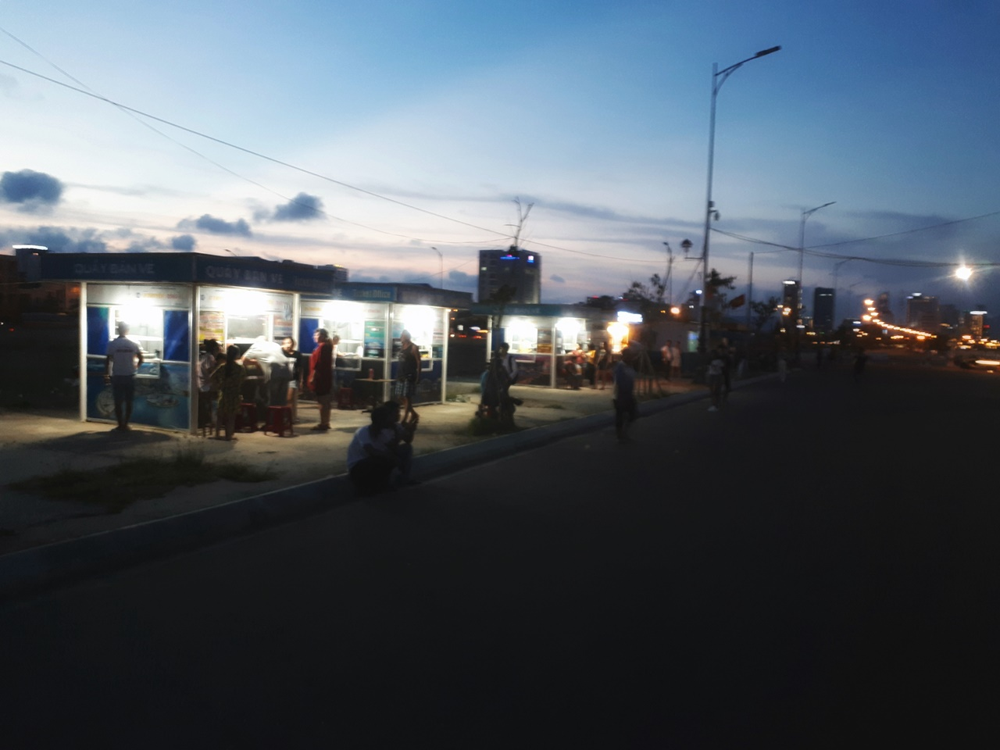
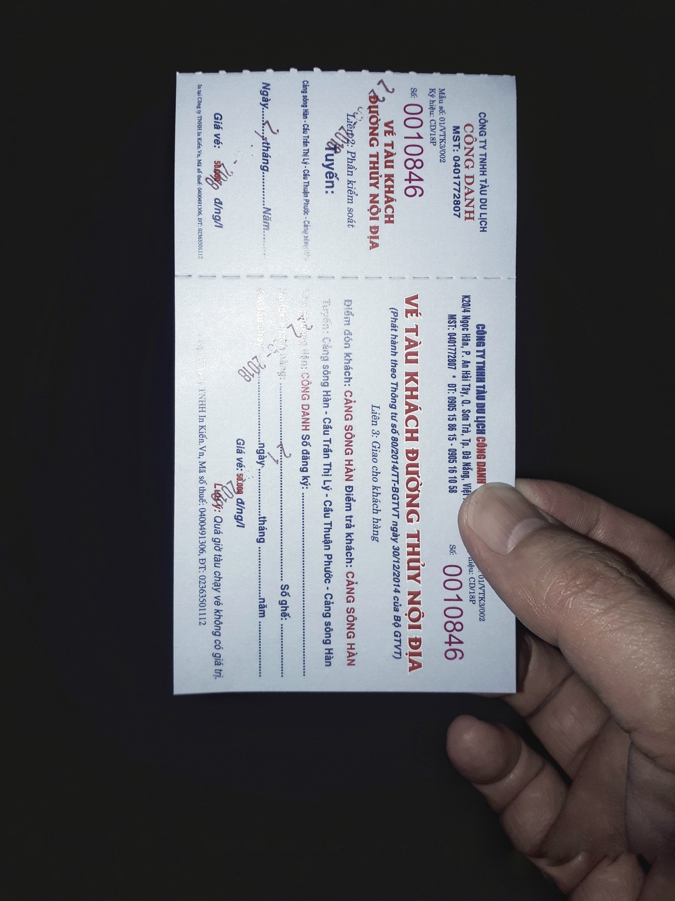
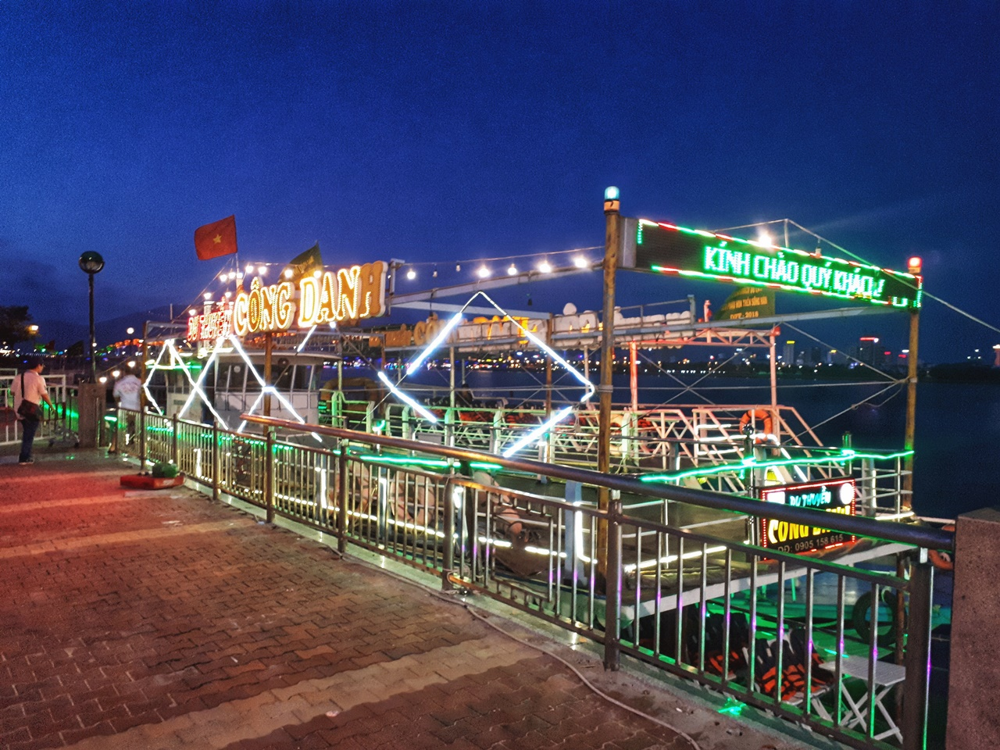
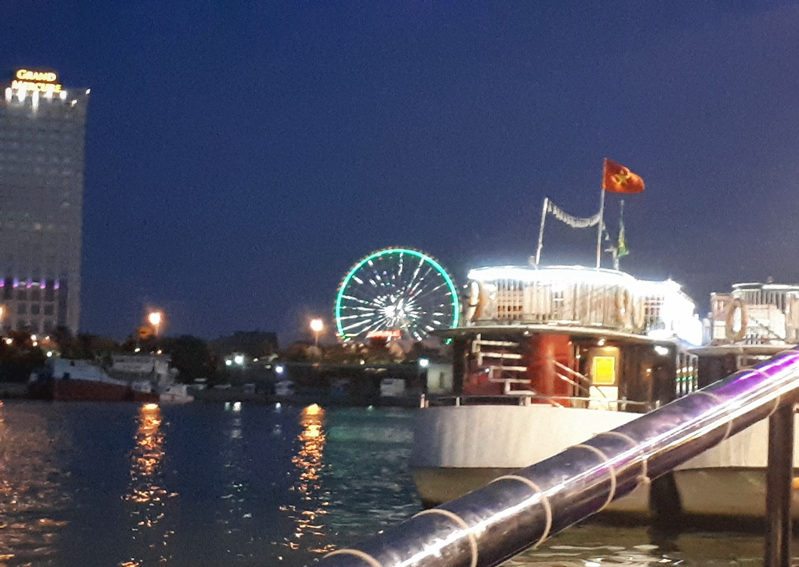
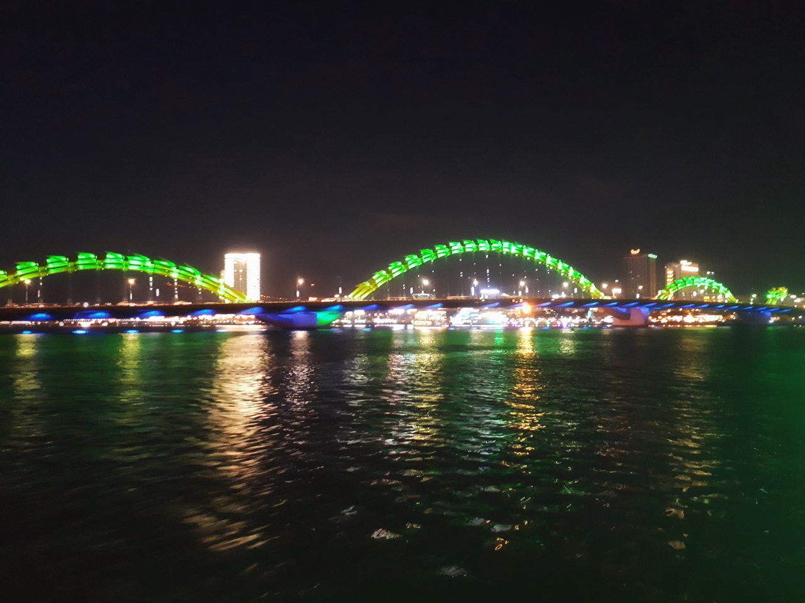
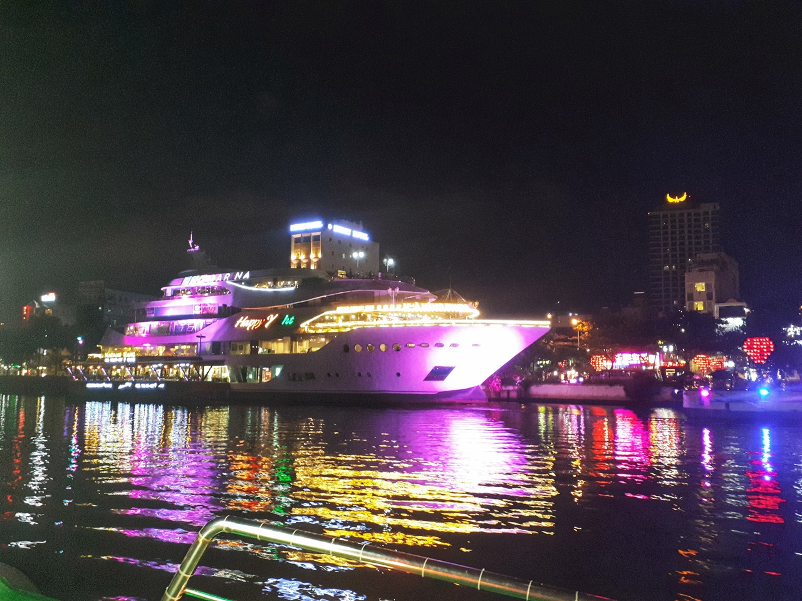
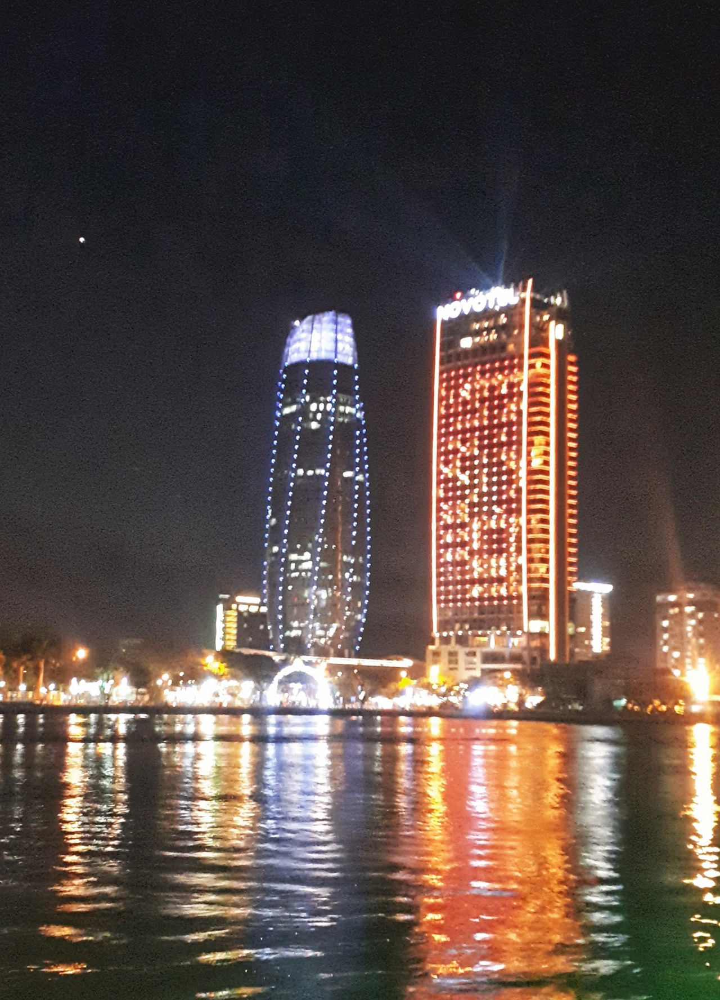

패키지여행 중 **옵션사항**으로 다낭 한강 유람선을 타고 야경을 즐겼습니다.  
우리나라의 한강처럼 다낭의 강물줄기도 **한강**이라고 부릅니다. 이 한강을 타고 **용다리**를 지나 **다낭 노보텔**까지 올라가면서 다낭의 야경을 즐기는 여행코스 입니다.

▲ 배를 타기 위해서 매표를 해야 합니다.  
우리는 패키지라 가이드가 미리 매표를 한 상태라 사진에 보이는 매표소를 지나쳐서 바로 배로 탑승하러 갔습니다.

▲ 배를 탑승하기 위해서는 **탑승티켓**을 가지고 있어야 합니다. 아까 그 매표소에서 구매를 하고 배로가서 확인하고 타면 됩니다.

한강을 투어하는 배 입니다. 엄청 요란하게 꾸며져 있습니다.  
한국사람들이 많아서 그런지 **한국노래**가 끊임없이 나옵니다.  
다만 아쉬운점은 노래만 나오지 설명은 전혀 없습니다. 배를 타고 올라가면서 강 옆에 있는 건물이라던가 **용다리**라던가 역사에 대한 설명을 해주면 지루하지 않고 좋았을 것 같은데 그런 것이 전혀 없습니다.  
그냥 보는 것 이라면 차라리 한국에 있는 한강 유람선을 타고 올라가면서 보는 것이 훨~씬 더 멋있습니다.

저멀리 **아시아파크**의 **대관람차**가 보입니다. 이번 여행에서 아시아파크는 가지 않았습니다. 나중에 자유여행을 하게 되면 한번 가볼까 합니다.

다낭에서 **랜드마크**라 할 수 있는 **용다리** 입니다. 다낭의 웬만한 곳에서도 보이기 때문에 자유여행을 할때도 도움이 많이 되는 곳입니다.

한강의 한쪽에 있는 배모양의 레스토랑입니다. 움직이지는 않는것 같고 그냥 식당으로 쓰는것 같습니다.

한강 야경투어의 마지막 위치인 **노보텔**입니다. 여기에서 유턴하여 다시 출발지로 돌아갑니다.

## 총평

패키지여행의 옵션사항으로 추가한 코스인데 **추천하고 싶지는 않습니다.**  
배타고 올라갔다가 내려오는 건데 리버사이드가 한국보다 이쁜것도 아니고.. 그렇다고 이렇다 저렇다 설명을 해주는 것도 아니고...
옵션에서 뺄 수 있으면 뺐으면 하는 코스입니다.
