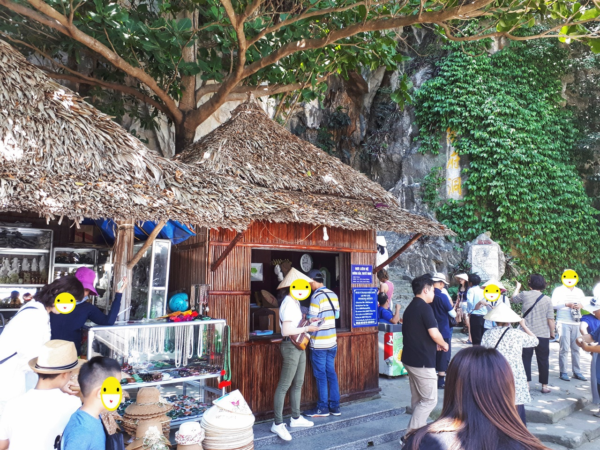
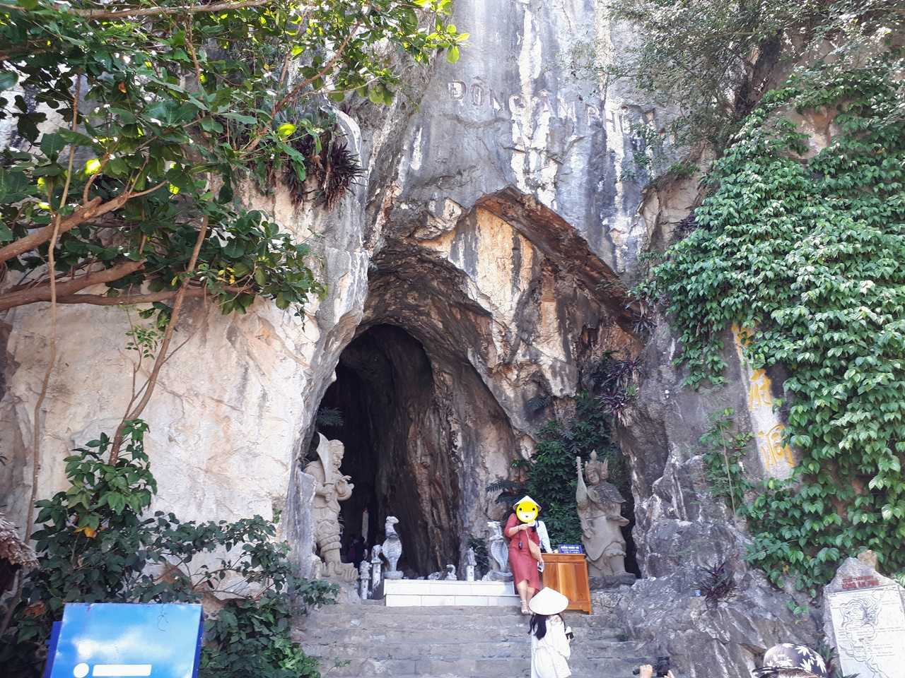
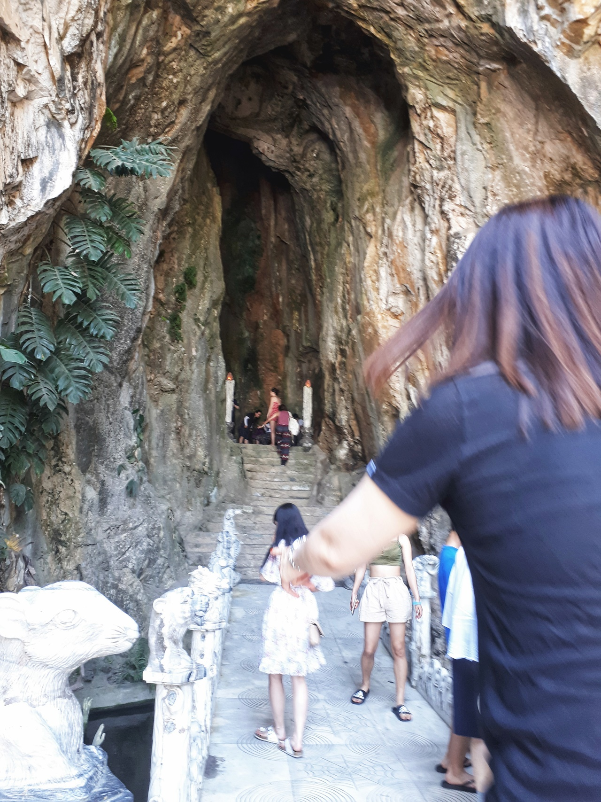
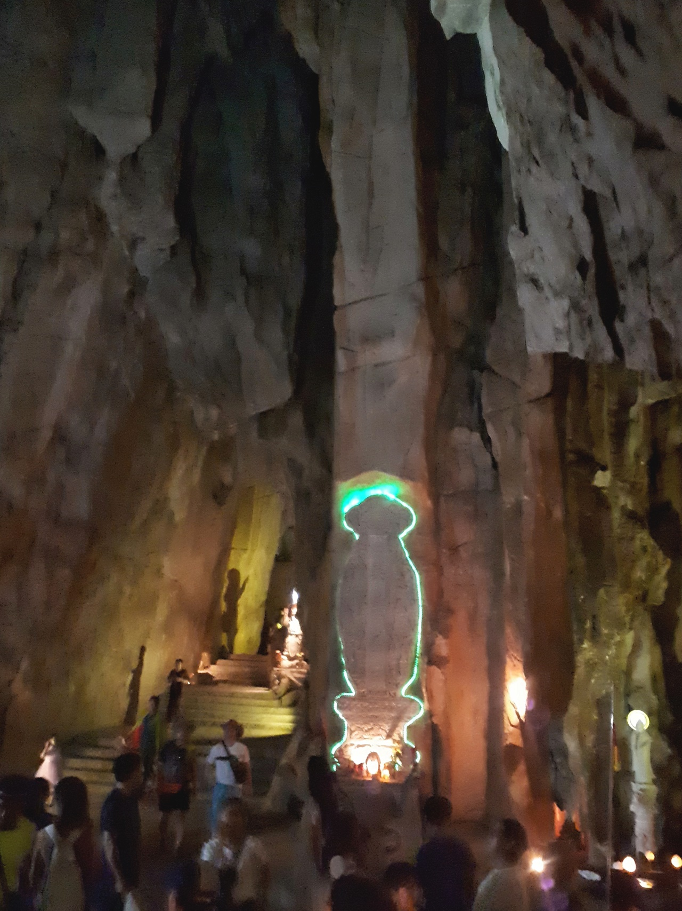
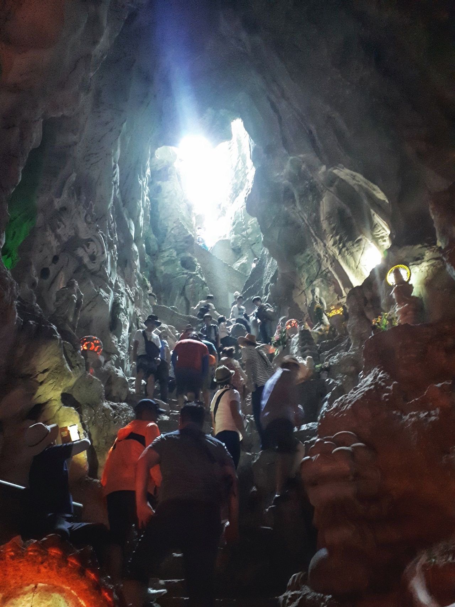
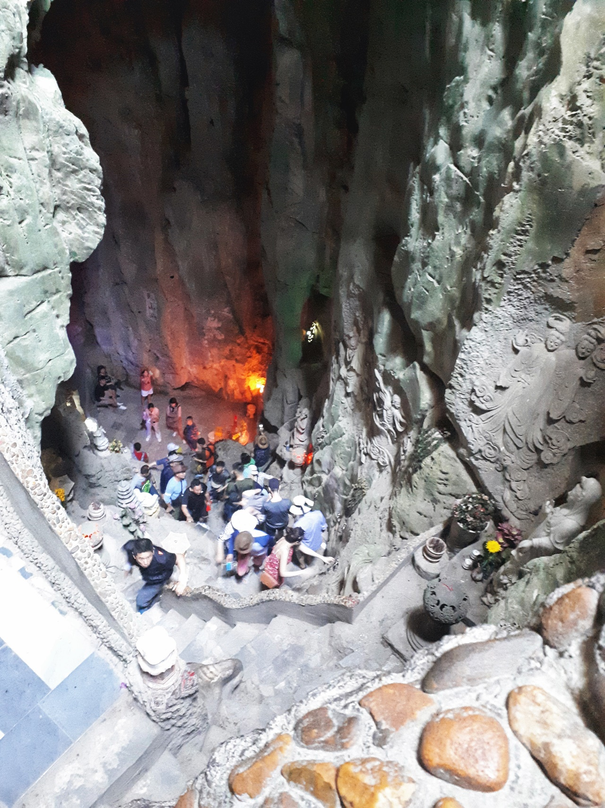
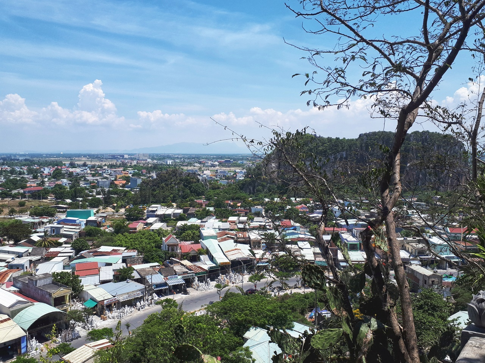
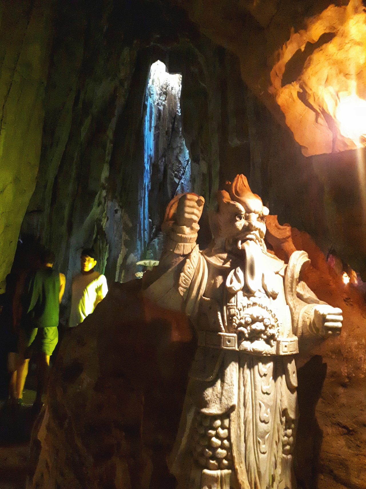
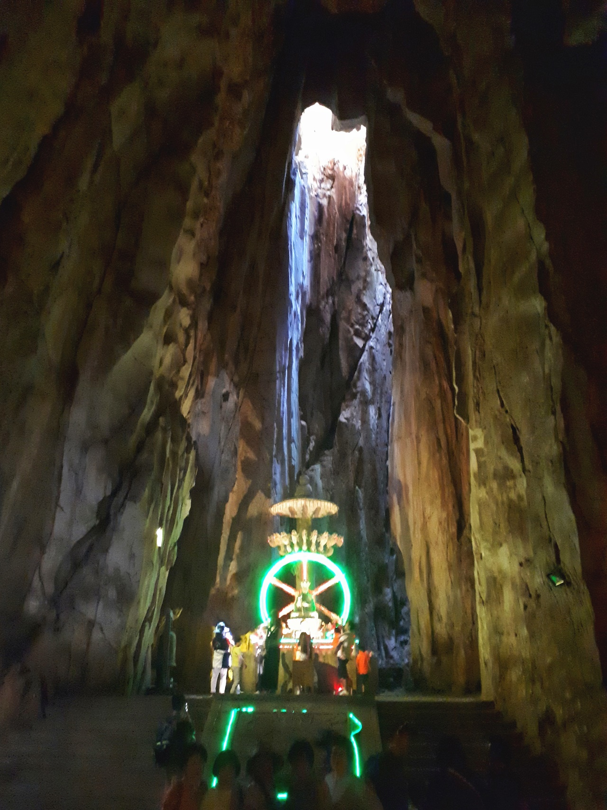

다낭 2일차에 처음으로 방문한 곳은 **오행산** 입니다.

서유기에서 손오공이 석가여래에게 져서 커다란 바위(산)에 눌려 갇히게 되는데 그산이 바로 **오행산**입니다. 아마도 이 산이 그 산인 것 같습니다. ^^

다낭 시내에서 남쪽에 있는 **호이안으로 가는 길**에 있으며 **논느억 해변** 근처에 위치해 있습니다. 석회암으로 이루어져 있는 오행산은 5개의 산이 볼록 솟아나 있으며 목(木), 화(火), 토(土), 금(金), 수(水)의 이름을 따서 이름을 지었다고 합니다.

보통은 여행객들이 **수산(水山)을 많이 가지만** 우리는 시간 때문에 그런지 비용때문에 그런지 바로 주차장 옆에 있는 **암푸 동굴**만 갔다왔습니다.

암푸동굴을 들어가면 **천국으로 가는 길**과 **지옥으로 가는 길**로 나누어져 있는데 **천국으로 가는길**은 경사가 매우 가파른 산 위쪽으로 가는 길이라 잘못 가다가는 정말 하늘나라로 갈 수 도 있으니 조심을 해야 합니다. 전망은 멋지나 오르고 내려오는 길이 많이 가파르고 위험해서 굉장히 조심을 해야 합니다.  
**지옥으로 가는 길**은 아래쪽으로 내려가는 길이며 힘들기는 하나 그다지 위험한 길은 아닙니다. 다만 별로 볼만한 것은 없습니다.

  
암푸동굴로 입장하기 전 매표를 합니다. 저는 패키지로 여행중이라 가격이 얼마인지는 모르겠네요 ^^;

  
대리석으로 되어 있다고하는데 동굴입구가 저렇게 뚫려있다는 것도 신기합니다.

  
입구로 들어가기전에 조그만 다리가 있고 아래에는 물이 흐르는데 커다란 매기도 있고 다양한 물고기들도 있습니다.

  
암푸동굴로 들어가면 얼마가지 않아 보이는 앞마당입니다. 이곳에서 **오른쪽**으로 가면 **지옥으로 가는 길**, `왼쪽`으로 가면 `천국으로 가는 길`입니다.

저희는 두곳을 모두 가봤는데..
먼저 `천국으로 가는 길`로 갔습니다.

 앞마당에서 바로 위로 올라가는 길이 천국으로 가는 길 입니다. 보시는 것처럼 사진도 잘나오고 멋지기도 하지만 **위험**합니다. 자칫 잘못하면 정말 천국으로 가는 수가 있습니다.  
올라가는 길과 내려오는 길이 하나 밖에 없어서 올라갈 때와 내려갈 때 기다림이 필요합니다.  
또한 경사도로 굉장히 가파릅니다.

아래를 보면 정말 아찔합니다. 내려갈때가 더 무섭습니다.

  
천국으로 가는 길의 꼭데기에 올라서면 밖을 볼 수 있습니다.

 다시 앞마당으로 내려와서 **지옥으로 가는 길**로 가 봤습니다.

  
지옥으로 가는 길 입구에 있는 동상입니다. 무협영화에서 많이 보던 장면 같습니다.
**지옥으로 가는 길**은 일반적인 동굴을 다니는 정도의 난이도 입니다. 그리 위험하거나 힘들지는 않습니다. 하지만 보는 것도 그냥 일반적이지요. 그래서 사진을 찍지는 않았습니다.

## 총평

비록 오행산 중 암푸동굴만 갔다왔지만 다낭에 놀러오면 한번은 들러서 볼만한 수준입니다.  
수산의 엘리베이터를 타고 올라가서 정상을 보고 암푸동굴을 들렀다 간다면 좋은 여행코스가 될 것 같습니다.

**천국으로 가는 길**은 잘 판단해서 올라가세요. 어르신이나 어린이가 있다면 굳이 올라가지 말고 한 3분 1지점에서 사진만 찍고 내려오시는 것을 추천합니다.

 총점 : ★★★☆☆ 

