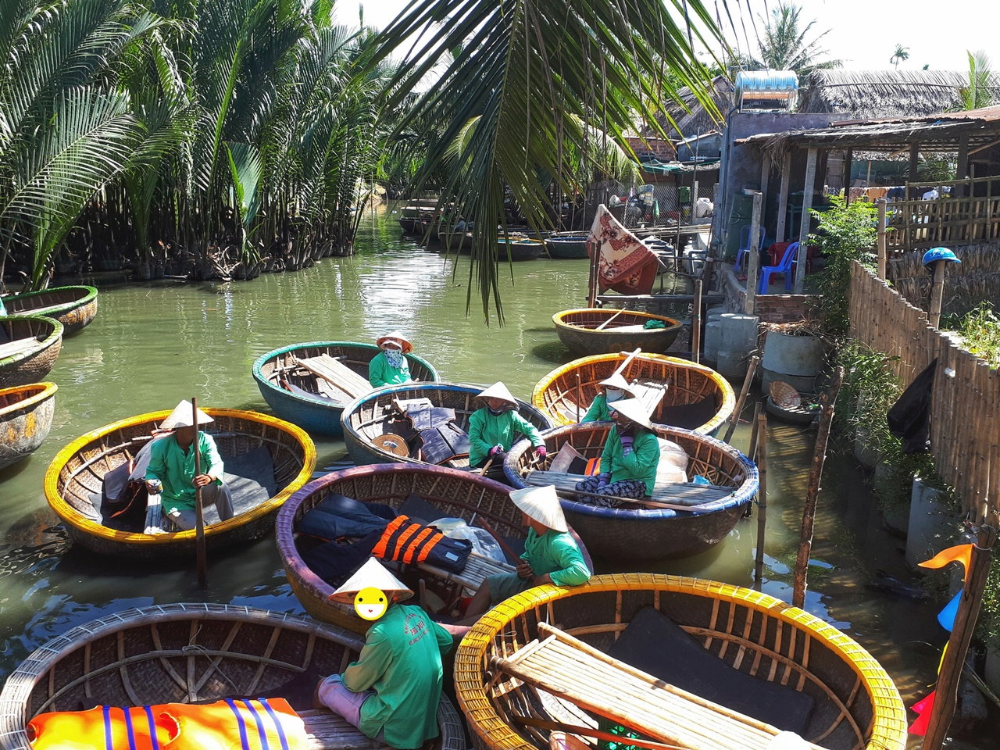

호이안의 동쪽에 위치해 있는 **Coconut Hat**으로 이동을 했습니다.  
다낭에서 호이안 쪽으로 여행을 갈 때 들러서 가기에 좋은 곳에 위치해 있기 때문에 한번쯤은 꼭 들러봐야 할 알짜코스라 할 수 있습니다.

바구니 배는 코코넛 잎으로 둥그렇고 커다랗게 만든 배에 소똥을 발라서 방수 처리를 하고 강에서 물고기도 잡고 이동도 하는 용도로 사용하던 것인데 지금은 관광용으로 개량을 하여 사용하고 있다고 합니다. 물론 지금은 소똥이 아니라 방수제를 발라서 만든다고 하네요.

바구니배에 **2~3명**정도 타고 강을 한바퀴 돌면서 몇가지 체험을 할 수 있는 액티비티 입니다.

▲ 바구니배를 타기 위해서는 코코넛햇이라고 하는 코코넛마을로 걸어 들어가야 합니다.  
가는 길에 길거리에서 마을사람들이 가방도 팔고 망고도 팔고 있습니다. 망고도 맛있고 가방도 그렇게 비싸지 않으므로 필요하면 구매를 해도 됩니다.

▲ 바구니배를 타는곳에 가면 이렇게 바구니배를 운전하는 사공이 한명 타고 있습니다.  
여기에 2명 정도의 관광객이 타고 출발을 합니다.

  
▲ 바구니배를 타고 코코넛나무가 우거진 작은 강줄기를 타고 큰 강쪽으로 나갑니다.  
보통 5~10개정도의 바구니배가 한팀으로 움직이는데 나가는 길에 코코넛 나무 그늘 쪽에 모여서 리더같은 분이 한바탕 노래를 부르고 춤을 춥니다. 거의 모든 음악이 **우리나라 트로트**가 나옵니다.

  
▲ 큰 강줄기인 **쿠아 다이 강**으로 나오면 운이 좋은 경우 현지인이 투망을 던지는 모습도 볼 수 있습니다. 이분도 항상 관광객을 봐와서 그런지 쇼맨쉽이 좋습니다.

<iframe width="560" height="315" src="https://www.youtube.com/embed/kC6Z8hcQCpw" frameborder="0" allow="autoplay; encrypted-media" allowfullscreen></iframe>

▲ 한무리 중에 몇개의 바구니배는 위의 동영상 처럼 회전쑈를 해줍니다. 우리는 멀미를 한다고 하니 저렇게까지 하지는 않네요

  
▲ 이렇게 **쿠아 다이 강**을 지나 다른쪽 강줄기를 타고 돌아 왔습니다. 하나투어가 보이네요~

## 총평

코스는 이렇게 총 **40분~1시간** 정도 소요가 됩니다.
그래도 이번 다낭여행 중에 손꼽히게 기억에 남는 바구니배 투어였습니다. 꼭 체험해 볼만한 코스입니다.

 총점 : ★★★★☆ 

