**호이안**은 오래전부터 인도, 프랑스, 중국, 일본 등 여러 나라와 무역을 하던 **무역도시** 였다고 합니다.  
현재는 **호이안 구시가지**가 **유네스코 세계문화유산**으로 등록이 되어있어서 옛날 전통의 모습을 그대로 간직을 하고 있다고 합니다.  
무역도시답게 일본교로 불리는 내원교를 깃점으로 왼쪽은 일본마을, 오른쪽은 중국마을로 나눠져 있습니다.
유적으로 일본마을에 있는 **풍흥 고가(古家)**, **쩐가 사당**, 중국인들의 회합장소인 **복건회관** 등이 있습니다.

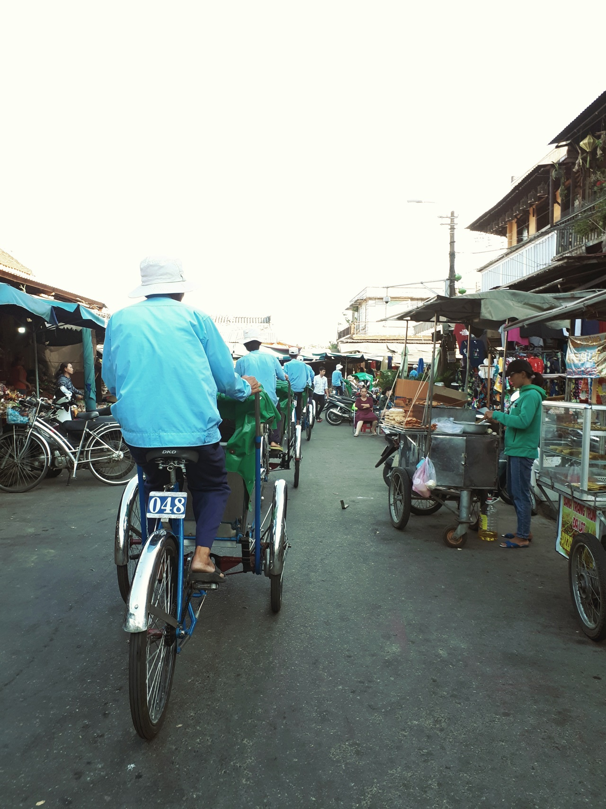
▲ 호이안에 도착을 해서 먼저 **씨클로 투어**를 했습니다. 씨클로 투어는 그냥 **자전거 투어** 입니다.  
손님이 자전거 앞쪽에 있는 의자처럼 생긴 탈 것에 타고 뒤에서 현지인이 자전거를 타며 호이안 구시가지를 한바퀴 도는 코스 입니다.  
씨클로로 먼저 한바퀴 돌고 그다음에 걸어서 구시가지를 구경하였습니다.

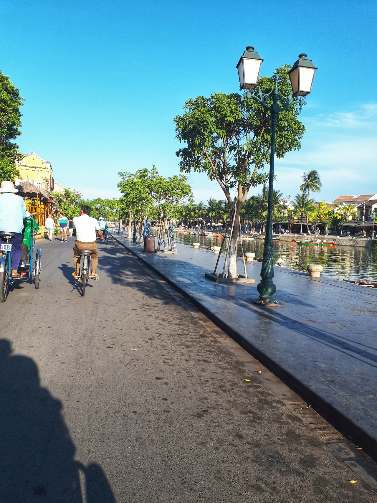
▲ 씨클로를 타고 **떤키**(Tan ky)의 집앞에서 내렸습니다.

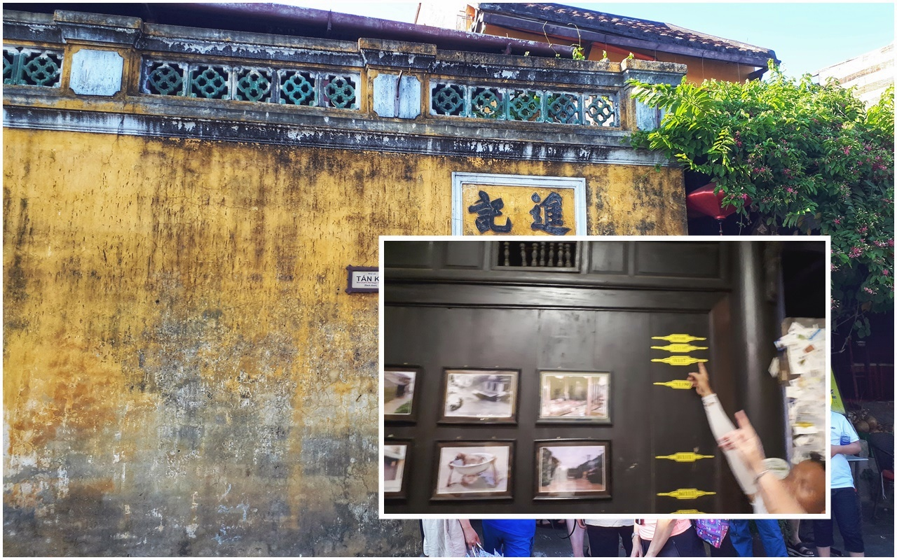
▲ 떤키의 집으로 먼저 들어갔습니다. 떤키는 16세기 무역도시 시절 무역으로 호이안에서 손꼽히는 부자가 되었다고 합니다. 떤키의 집이 투본강에서 호이안으로 들어오는 초입에 있어서 외국과 무역을 하기에 좋은 위치에 있어서 갑부가 되었다는 이야기를 들었습니다.  
집안으로 들어가면 바로 보이는 것이 노란색 표시를 볼 수 있는데 그 표시가 매년 베트남의 우기때 1층이 잠기는 높이라고 합니다. 예전에는 매년 그만큼씩 잠겼었는데 지금은 댐공사를 해서 우기때도 그렇게 잠기지는 않는다고 하네요.

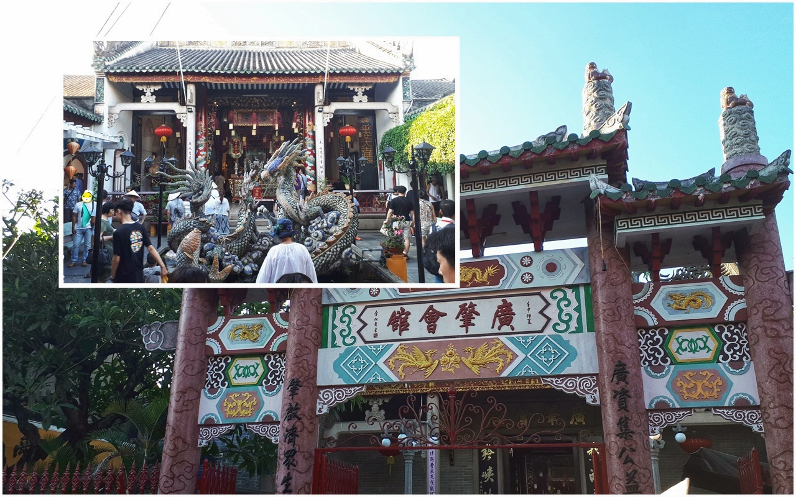  
▲ 떤키의 집에서 5분정도 걸어가면 **복건회관**을 볼 수 있습니다. **복건회관**은 중국마을에 있는데 무역도시 시절 중국인들이 정기적으로 모이는 회관이였다고 합니다. 복건회관의 안쪽으로 들어가면 관우 사당도 볼 수 있습니다.

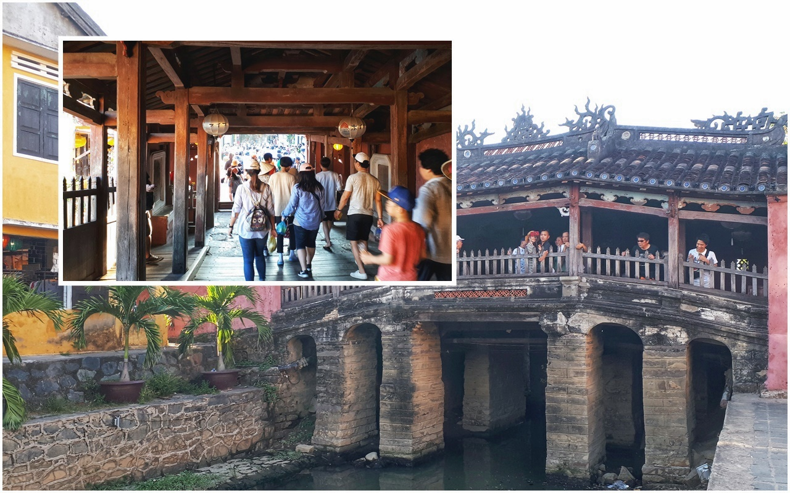  
▲ 복건회관을 나와서 오른쪽으로 2~3분 걸어가면 **일본교**라고 하는 **내원교**를 볼 수 있습니다.  
이 내원교는 베트남 돈인 20,000동의 뒷면에도 나오는 유명한 유적이라고 합니다.  
이 내원교를 건너면 바로 일본마을로 넘어가게 됩니다.

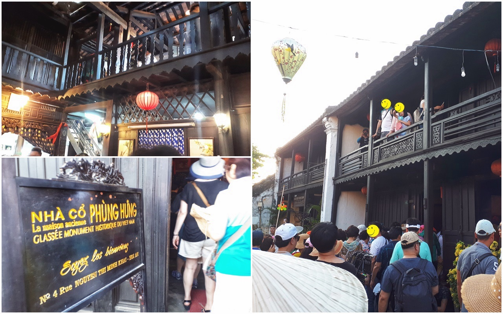
▲ 내원교를 넘어가면 바로 앞에 2층으로 되어 있는 **풍흥 고가**를 만날 수 있습니다.
1780년대에 지은 풍흥고가는 호이안 구시가지에서 가장 오래된 집이라고 합니다. 안으로 들어가서 2층까지 올라가 볼 수 있습니다.

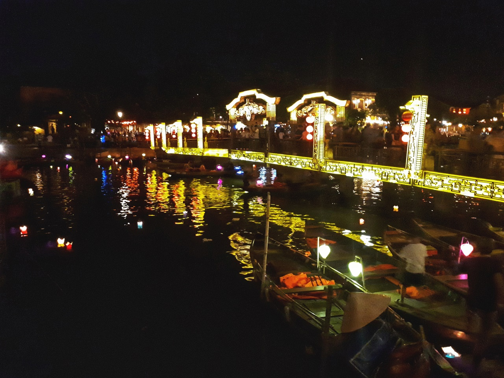
▲ 저녁을 먹고 호이안의 신시가지로 갔습니다. 호이안의 신시가지는 투본강을 끼고 섬에 위치해 있습니다.  
구시가지에서 신시가지로 넘어가지 위해 **안호이(An Hoi)다리**를 건너야 합니다.

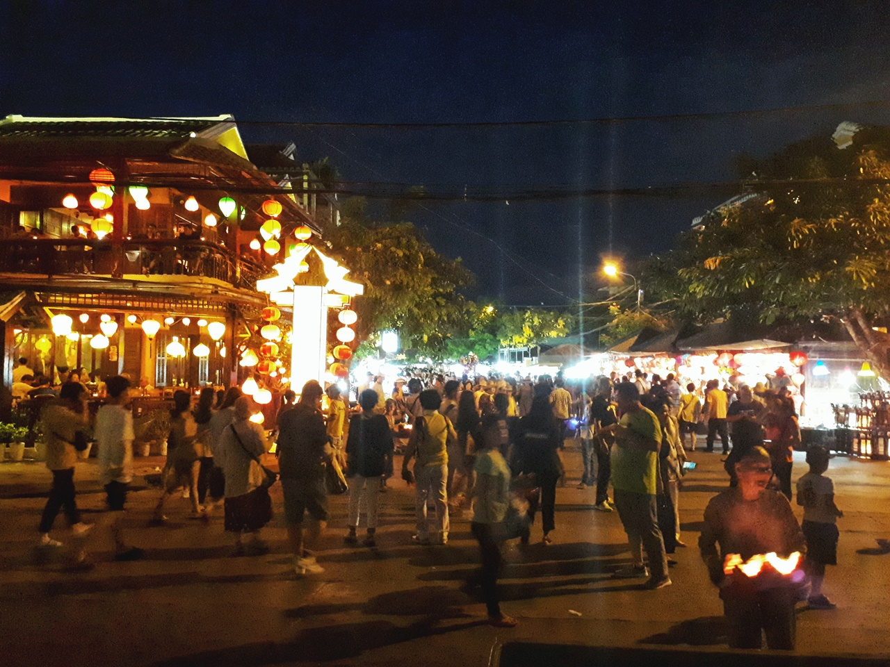
▲ 호이안 신시가지의 야경입니다.

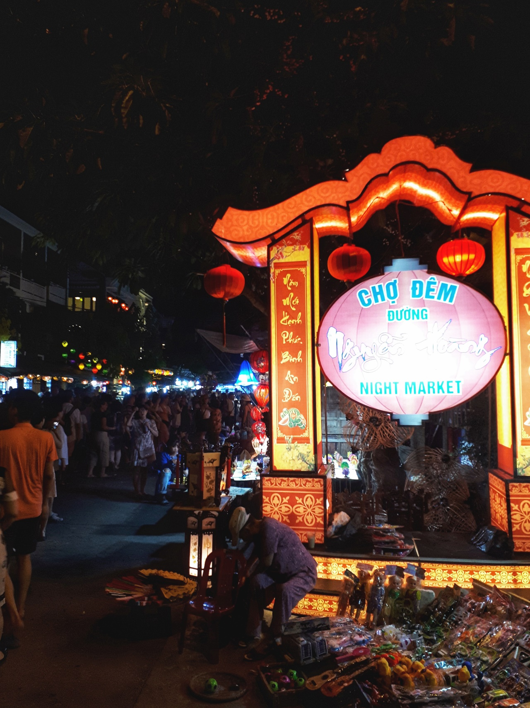  
호이안 신시가지에 있는 **야시장**입니다.

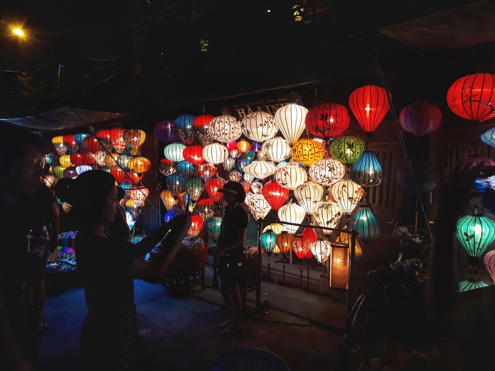

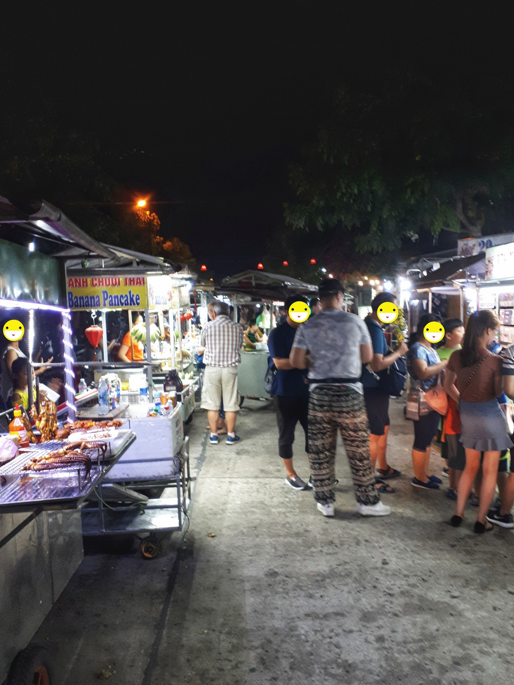  
 다양한 살거리와 먹거리를 팔고 있습니다.

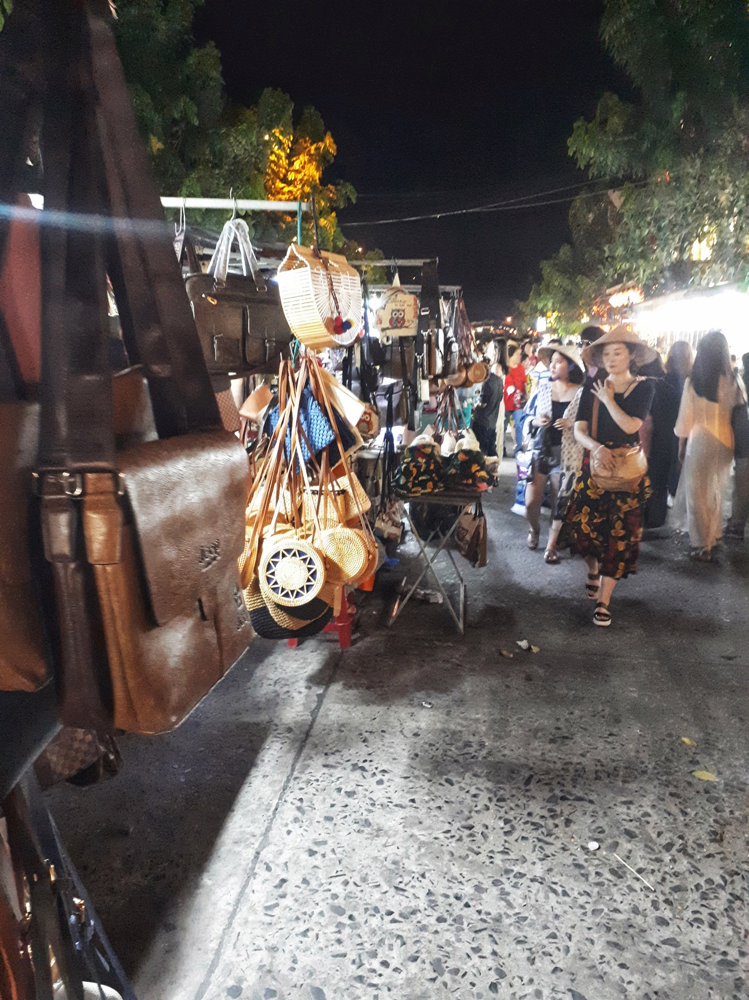  
핸드백, 가방 등 비교적 저렴하니 가방을 구매할 생각이라면 여기서 구매를 해도 손해는 보지 않습니다. 다만 에누리를 시도해야 합니다. 거의 `30~50%` 까지 깍아 내릴 수 있습니다.

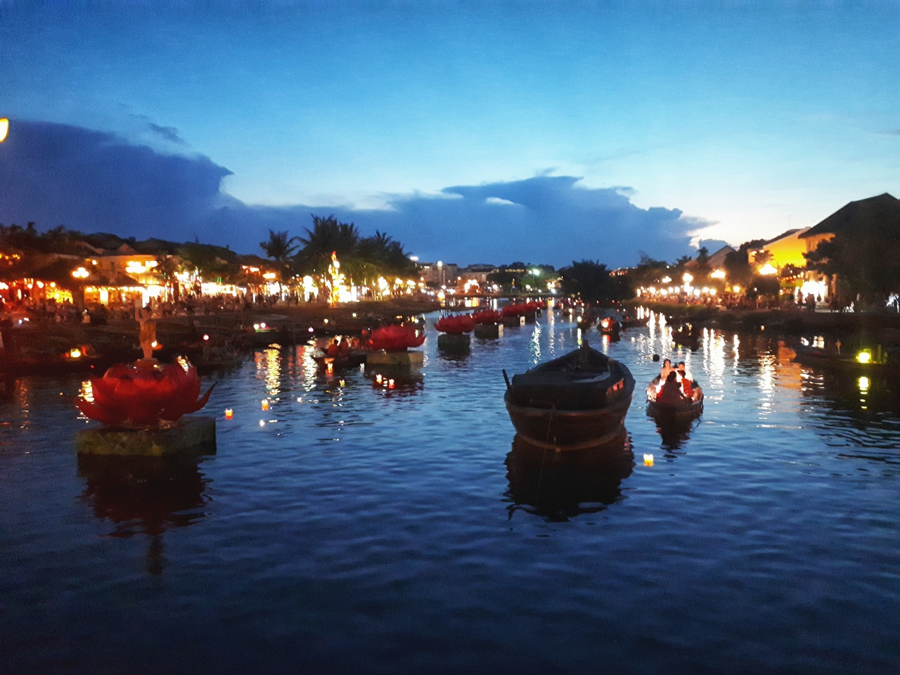  
신시가지에서 야시장 구경과 연등띄우기를 할 수 있습니다.  
구시가지와 신시가지 사이를 흐르는 투본강에서 배를 타고 연등을 띄울 수 있습니다.

## 총평

호이안의 신시가지와 구시가지를 구경하는데 오후와 저녁을 보낼 수 있습니다. 다낭여행중에 꼭 방문을 해봐야 하는 곳이라 할 수 있습니다.

 총점 : ★★★★☆ 

