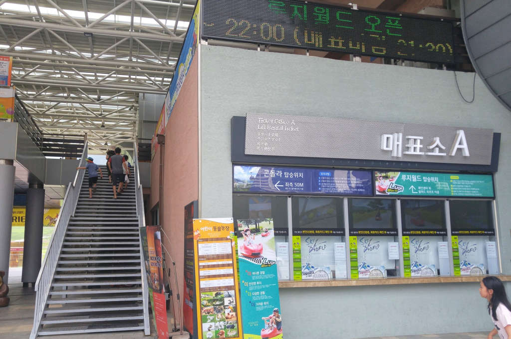
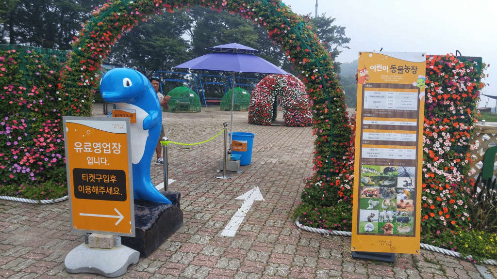
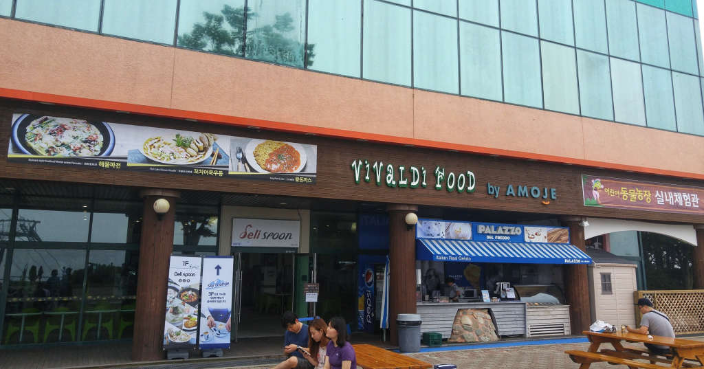

**비발디파크**의 매인 놀이시설은 당연히 **오션월드**입니다. 그러나 몇일을 놀러갔는데 주구장창 오션월드만 갈 수는 없는 노릇이고
식구 중에 어린이라도 있으면 한번쯤 다른 곳도 다녀올 필요가 있을 것 입니다.  
비발디파크가 겨울시즌에는 스키를 운영하지만 여름에는 팔봉산 꼭데기를 올라갈 수 있게 곤돌라를 운영합니다.  
팔봉산 꼭데기에는 약간의 **휴게공간**과 **동물농장**, 그리고 녹색으로 넓게 펼쳐저 있는 **골프장**이 있습니다.

  
▲ 먼저 매표를 해야 합니다.  
매표소는 비발디파크의 중앙 입구에 위치해 있습니다.  
우리가 갔을때는 사람이 별로 없어서 쉽게 구매를 할 수 있었습니다.

  
▲ 매표를 하고 바로 옆에 있는 계단을 이용하여 2층으로 올라갑니다. 2층에 곤돌라 탑승 입구가 있습니다.

  
▲ 푸드코트가 있는 입구가 곤돌라 탑승장입니다. 푸드코트에서 잠깐 요기를 해도 되지만 맛은 보장되지 않습니다.

  
▲ 곤돌라 내부에서 찍어서 화질이 썩 좋지는 않는데..
사진과 같이 곤돌라를 타고 팔봉산으로 올라 갑니다. 생각보다 길이가 기네요.

  
▲ 팔봉산 꼭데기에 있는 곤돌라 하차장입니다.

  
▲ 이게 왜 여기에 있는지~ 의미는 도대체 몬지 모르겠지만 그냥 특이해서 찍어봤습니다. 팔봉산꼭데기 곤돌라 승강장에 있습니다.

  
▲ 팔봉산의 꼭데기가 생각했던것 보다는 넓고 이것저것 볼거리 즐길거리들이 있습니다.  
사진의 앞쪽으로 보이는 곳이 **동물농장**입니다.

  
▲ 어린이 **동물농장**은 유료입니다. 우리는 어린이가 다 커 버린 관계로 들어가지는 안았으나 어린이가 있다면 한번쯤은 들어가서 체험해 볼 만합니다.

  
▲ 동물농장 옆쪽으로 Amoje에서 운영하는 **푸드코트**가 있습니다. `파전`이나 `돈까스`, `우동` 같은것을 팔고 있습니다.

  
▲ 중앙에는 사진을 찍기 좋은 꽃나무가 있습니다. 이곳에서 사진찍기 좋은 포토스팟입니다.

  
▲ 동물농장 반대편으로 가면 가슴이 탁~ 트이는 골프장이 있습니다.  
보면 골프를 치시는 분들도 더러 있더라구요.

---

올라가는 곤돌라나 동물농장이나 비용이 들기는 하지만 한번쯤 올라가서 구경해 볼만한 곳입니다.
