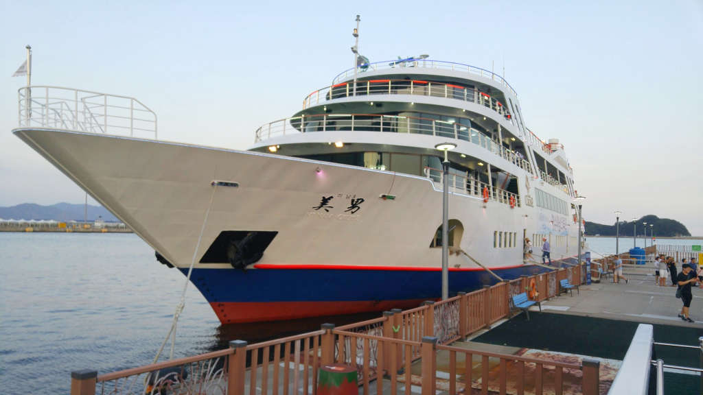

여수밤바다를 볼 수 있는 최적의 장소는 바다쪽에서 여수의 밤거리를 보는 것이 아닐까 합니다. 그래서 이번에는 여수 크루즈의 명물 `미남크루즈`를 소개할까 합니다.

엑스포 스카이타워 선착장에 가면 여수를 한바퀴 돌면서 관광도 하고 먹기도 하고 라이브음악을 듣기도 하면서 즐길 수 있는 **미남 크루즈**가 있습니다.  
표는 현장에서 매표를 하기도 하고 미리 인터넷에서 구매를 하기도 합니다.

배가 생각보다 규모가 큽니다. 탑승시간이 되면 선착장에서 입장표를 확인하고 배로 탑승을 합니다.

배는 4층으로 구성되어 있고 입구가 있는 1층은 연회장으로 사용되고 있어서 특별한 경우가 아니면 개방을 하지 않고 바로 2층으로 올라가게 되어 있습니다.

2층으로 올라가면 의자도 있고 뽑기도 있고 식당, 카페 등 다양한 즐길거리들이 있습니다.

의자에 앉아서 창밖을 바라보면 여수엑스포의 오링이 보입니다. 오링 공연은 특별한 날에만 가동을 하는것 같습니다. 제가 갔을때는 공연을 보지 못했네요.

선내 자리에 앉으면 다양한 음식들을 주문해 먹을 수 있습니다. 우리는 파전과 돈까스를 시켜서 먹었는데 상당히 맛이 있습니다.

돈까스도 맛이 좋습니다. 배를 타기전에 먼저 식사를 할 필요는 없을것 같습니다. 선내에서도 맛있는 음식을 먹을수 있습니다.

크루즈의 옥상을 올라가면 많은 사람들이 나와 있습니다. 바다바람도 쐬이고 음료도 마실 수 있습니다.

바람만 쐬이는 것 뿐만 아니라 사진을 찍을 수 있는 뷰포인트도 여러곳 있습니다.

배에서 대피장소는 항상 확인해 놀 필요가 있을 것 같습니다. 미남크루즈에서는 3층에 대피장소가 있습니다.

VIP룸은 배의 앞쪽에 있으며 앉아서 전체를 편하게 바라볼 수 있는 뷰를 가지고 있습니다. 다만 사람이 많으면 화면을 가리네요 ㅠㅠ;

이제 해가 뉘엇뉘엇 저물기 시작합니다. 미남크루즈의 오후 타임은 해가 있을때 출발하여 밤이 되서 `여수밤거리`를 보는 것이 가장 좋습니다.

여객선터미널을 출발해서 밤이되면 돌산대교를 지나게 됩니다. 밤에 보는 돌산대교는 정말 멋집니다.

`여수 밤바다`에서 바라본 여수구항 해양공원에 있는 `낭만 포차 거리` 입니다.

낭만포차거리에 사람들이 많이 나와 있습니다. 크루즈에서 손을 흔들면 거리에 나와 있는 많은 사람들이 다시 인사를 건네 줍니다. 소소하지만 낭만적입니다.

이렇게 여수구항 해양공원을 지나 **장군도**를 돌아서 다시 출발한 엑스포 스카이타워 선착장으로 돌아 오게 됩니다.

---

## 총평

여수에 여행을 오셨다면, 여수 밤바다를 보려고 한다면 꼭 타봐야 할 미남크루즈 입니다.

별점 : ★★★★☆

> 홈페이지 : http://yeosucruise.co.kr/main/main.asp
