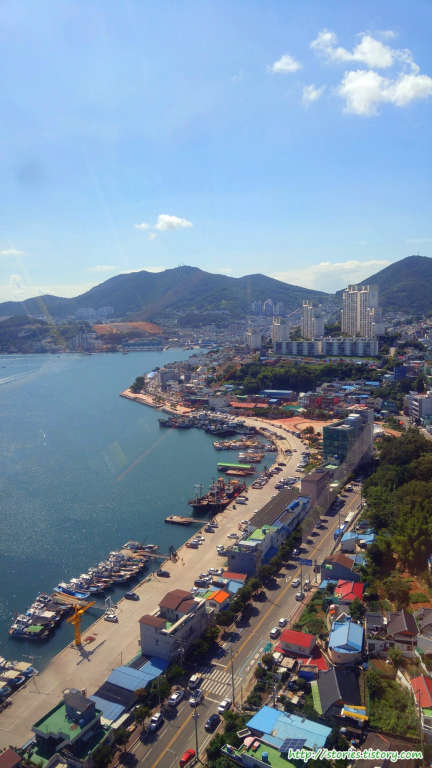

여수의 명물이라 할 수 있는 **해상케이블카**를 타 봤습니다. 육지와 섬을 연결하는 국내 최초의 해상케이블카라고 합니다.  
케이블카를 타는 곳은 **오동도** 쪽에 있는 `지산탑승장`과 돌산 쪽에 있는 `돌산탑승장`이 있는데 우리는 지산탑승장으로 가서 왕복으로 탔습니다.

지산탑승장은 지상의 주차장에 주차를 하고 엘레베이터를 타고 지산 꼭대기로 올라가야합니다. 올라가는 중간에 오동도의 모습을 찍어봤습니다. 역시 여수는 바다가 정말 멋집니다.

오동도에서 왼쪽으로 얼굴을 살짝돌리면 엑스포공원이 보입니다. 잘 보면 `오링`도 보이네요.

지산탑승장에서 바라 본 엘레베이터와 오동도, 엠블호텔 입니다. 날씨도 좋고 너무 멋진풍경이라 사진을 찍어봤습니다.

지산탑승장으로 들어서면 이정표가 있습니다. 여기서는 `해야정류장`이라고 써 있네요. 다양한 먹거리들도 있습니다. 쉴수있는 공간도 충분하기 때문에 여기에서 시간을 가지고 쉬었다가 가는 것도 좋을것 같습니다.

케이블카를 타고가다가 본 최고의 풍경인 `거북선대교`입니다. 거북선대교 너머서 돌산섬도 보입니다.

저멀리 `여수구항 해양공원`에 있는 `낭만포차거리`가 보입니다. 여수의 핫플레이스입니다.

돌산주차장에도 주차장이 있습니다. 주차장이 꽉차있네요

마지막으로 돌산탑승장에서 바라본 케이블카입니다. 어디 엽서에서 본듯한 사진처럼 찍혔네요. 뿌듯합니다.

## 비용

### 일반 캐빈 (8인승)

#### 개인

| 구분 | 왕복     | 편도     |
| ---- | -------- | -------- |
| 대인 | 15‚000원 | 12‚000원 |
| 소인 | 11‚000원 | 8‚000원  |

#### 단체

(경로우대자, 국가유공자, 장애인 및 동반보호자 1인까지 포함)

| 구분 | 왕복     | 편도     |
| ---- | -------- | -------- |
| 대인 | 13‚000원 | 10‚000원 |
| 소인 | 9‚000원  | 7‚000원  |

#### 여수시민

| 구분 | 왕복     | 편도    |
| ---- | -------- | ------- |
| 대인 | 11‚000원 | 9‚000원 |
| 소인 | 8‚000원  | 6‚000원 |

### 크리스탈 캐빈 (5인승)

#### 개인

| 구분 | 왕복     | 편도     |
| ---- | -------- | -------- |
| 대인 | 22‚000원 | 17‚000원 |
| 소인 | 17‚000원 | 12‚000원 |

#### 여수시민

| 구분 | 왕복     | 편도     |
| ---- | -------- | -------- |
| 대인 | 18‚000원 | 14‚000원 |
| 소인 | 14‚000원 | 11‚000원 |

## 입장시간

- 시작시간 : 09:00
- 마감시간 : 21:30 (토요일은 22:30)
- 휴무일 : 연중무휴

## 여행지 정보

- 주소
  - 돌산탑승장 : 전라남도 여수시 돌산로 3600-1
  - 지산탑승장 : 전라남도 여수시 오동도로 116
- 연락처 : 061-664-7301
- URL : http://yeosucablecar.com

<iframe src="https://www.google.com/maps/embed?pb=!1m18!1m12!1m3!1d11600.612883710315!2d127.74307269440614!3d34.73287928002653!2m3!1f0!2f0!3f0!3m2!1i1024!2i768!4f13.1!3m3!1m2!1s0x356dd920e8b2a773%3A0xf3a9228fd778a463!2z7Jes7IiY7ZW07IOB7LyA7J2067iU7Lm0IOuGgOyVhOygleulmOyepQ!5e0!3m2!1sko!2skr!4v1530980353961" width="600" height="450" frameborder="0"  allowfullscreen></iframe>

## 주차정보

돌산탑승장도 지산탑승장도 주차할 곳은 충분합니다. 주차비가 있습니다.
