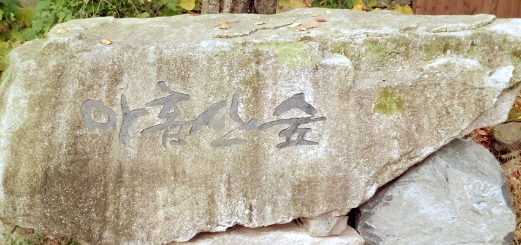
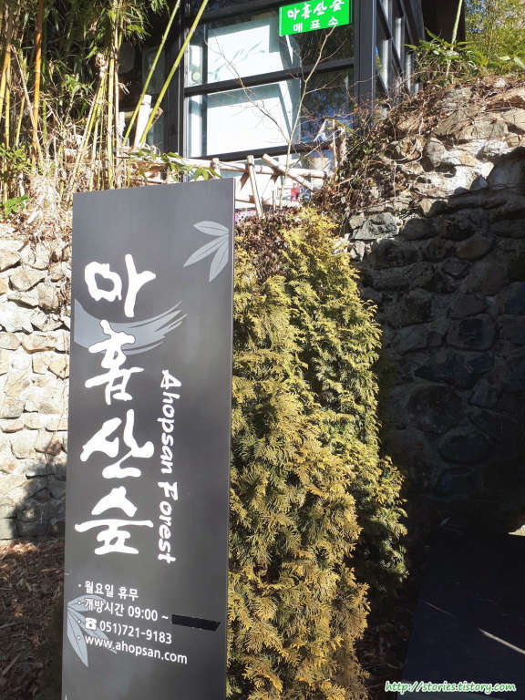
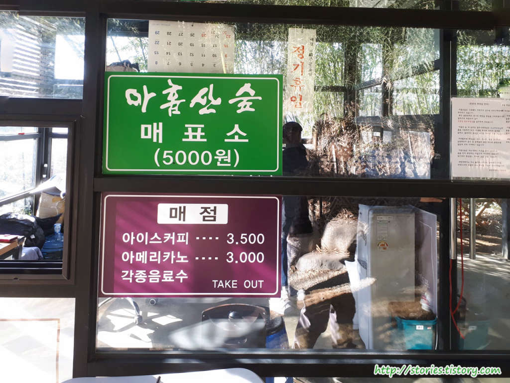
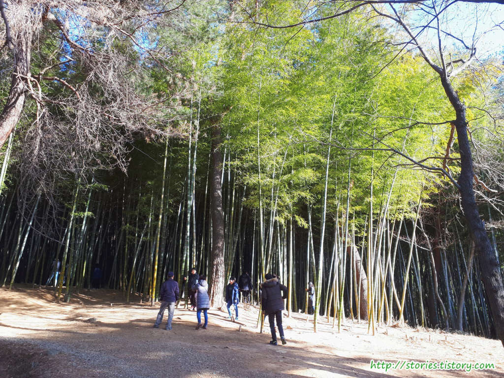
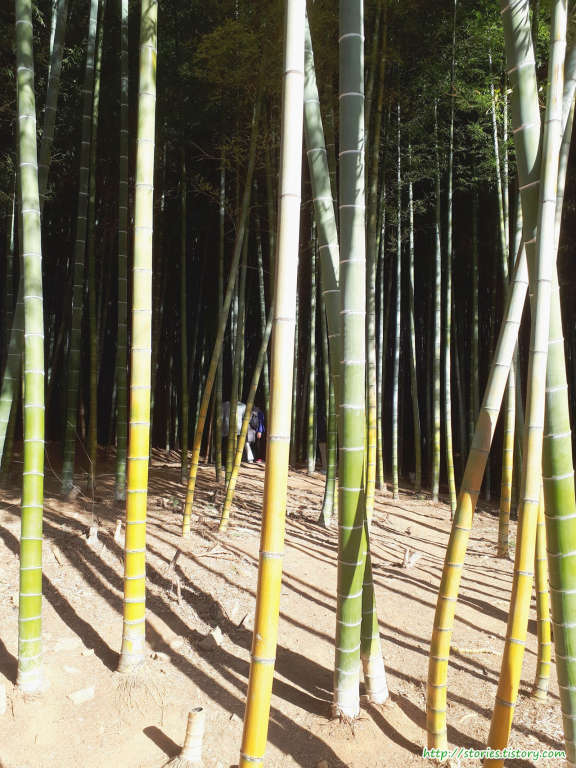
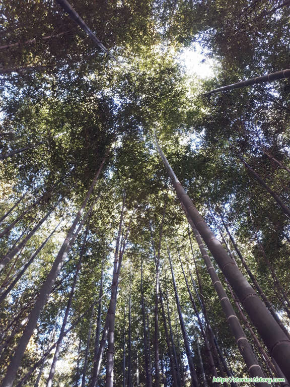
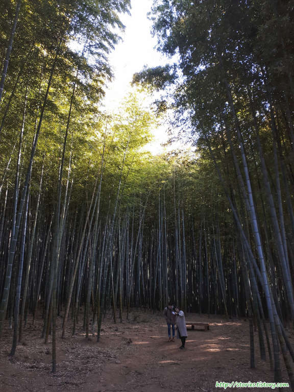

대나무숲은 담양에만 있을 줄 알았는데 부산에도 힐링하기 좋은 대나무숲이 있습니다.  
해운대에서 30분안에 도착할 수 있는 기장군에 있는 `아홉산숲`이 있습니다.

400년 가까이 개인 사유지로 사람들에게 개방을 하지 않았으나 이제는 모두에게 개방이 되었습니다. 그런만큼 자연환경도 잘 보존이 되어 있고 힐링하기에도 좋습니다.

주차장에 주차를 하고 5분정도 걸어 올라가면 아홉산숲 푯말을 볼 수 있습니다. 이 표말쪽으로 올라가면 메표소가 보입니다.

예전에는 미리 예약을 해야지만 방문이 가능했으나 이제는 예약없이 상시 방문이 가능하게 바꼈습니다. 바로 찾아가서 매표를 하면 입장이 가능합니다.

입장료는 남여노소 구분없이 모두 `5000원` 입니다.

아홉산숲에서의 압권은 대나무숲입니다. 산길을 걸어 올라가다보면 첫번째 대나무숲을 만날 수 있습니다.

이곳의 대나무숲은 영화촬영지로도 유명하다고 합니다.

대나무숲에서 하늘을 쳐다보면 너무 멋집 모습을 볼 수 있습니다.

2번째 대숲입니다. 대나무숲이 안쪽으로 들어가 있어서 사진촬영하기에 너무 좋은 장소 입니다.

## 입장시간

- 시작시간 : 09:00
- 마감시간 : 18:00(마지막 입장시간은 16:30까지입니다.)
- 휴무일 : 매주 월요일 (단, 죽순기간인 4월 30일, 5월7일, 5월14일, 5월 21일 월요일은 개방합니다.)

## 여행지 정보

- 주소 : 부산광역시 기장군 철마면 웅천리 480번지
- 연락처 : 051) 721 - 9183
- URL : http://www.ahopsan.com

## 주차정보

주차는 입구쪽에 있는 비포장 공간에 주차를 하도록 되어 있습니다.
생각보다는 주차장이 넓은 편인것 같습니다.
