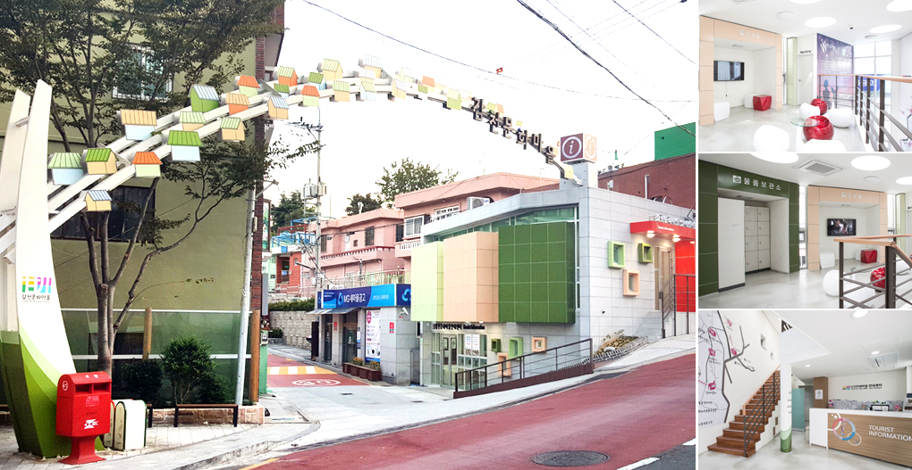
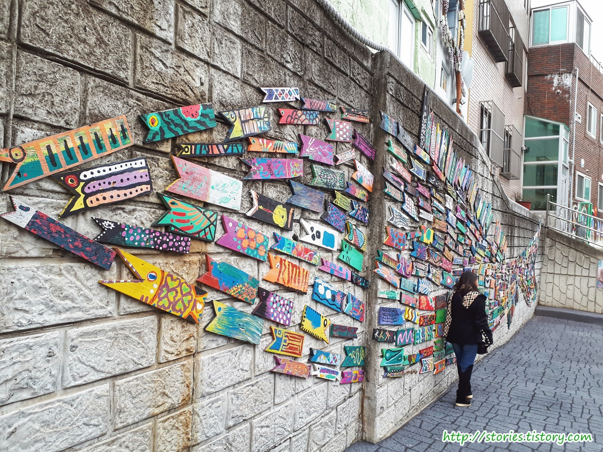
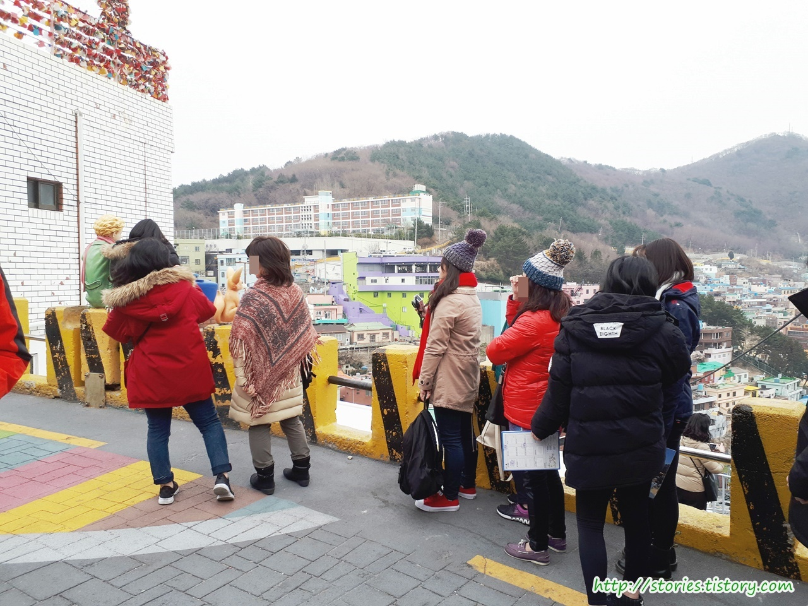
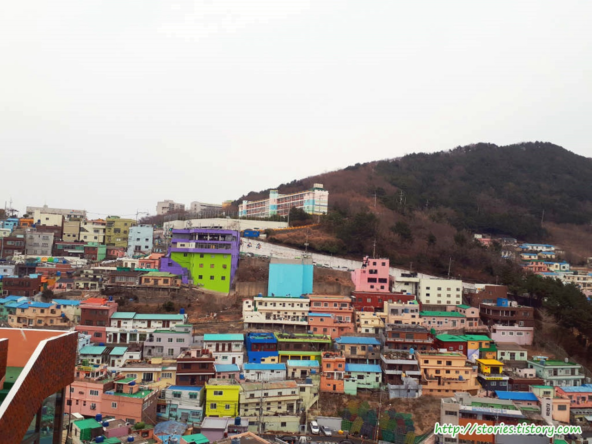

`감천문화마을`은 한국에서 초기 벽화마을로 성공한 케이스 중에 대표적인 마을 이라고 할 수 있습니다.  
1950년대에 6.25 피난민 촌으로 시작한 마을이였으나 시대에 뒤떨어지고 노후된 마을이라고 재개발을 하려고 하였으나 일부 뜻있는 사람들이 마을을 살리기 위해 모여서 골목 골목 벽화를 그린 것이 마을을 살릴 뿐 아니라 부산의 경제까지도 도움이 되는 마을로 탈바꿈 하였습니다.

지금은 촬영지, 공예, 작가 등 다양한 문화가 공존하는 공간으로 무엇보다도 외지에 있는 사람들이 관광을 하러 많이들 찾아오는 관광지가 되었습니다.

감천문화마을의 입구입니다. 입구쪽에 안내센터가 있으므로 궁금한 사항은 안내센터에 방문하시면 도움을 받으실 수 있습니다.

감천문화마을의 초입에 있는 작품이라 그런지 가장많은 사랑을 받는 포토스팟입니다. 사진을 찍기위해 계속 줄을 서고 있어서 아무도 없을 때 사진찍기가 너무 힘든 곳입니다.

감천문화마을의 중간쯤에 위치해 있는 `가장 유명한 포토스팟`인 `어린왕자`가 있는 곳입니다.  
처음에는 마을의 절벽같은 담벼락에 걸터 앉아 있었으나 너무나 많은 사람들이 사진을 찍어서 그런지 덜 위험한 담벼락으로 위치를 옮겼습니다. 이제는 혹시나 사진을 찍다가 떨어져 다리가 부러질 지언정 죽을 일은 없을 것 같습니다. 사진의 왼쪽 끝에 어린왕자의 뒤통수가 보이네요. 위험한 곳에 걸터 앉아 있는것 같지만 그렇게 높지 안은 곳에 있습니다.
**여기서 사진을 찍으려면 한참을 줄서서 기다려야 합니다.**

조금만 더 가면 감천문화마을을 바다와 함께 전체적으로 감상할 수 있는 곳이 나옵니다. 저 위에 `감정초등학교`가 보이네요

## 비용

입장료는 기본적으로 없습니다.  
다만 단체손님에게는 스템프지도를 1인 1매 구매하는 것을 요구하고 있습니다. 이 비용으로 마을사람들과 마을 유지비용에 사용한다고 하니 구매를 하는것이 좋을 것 같습니다.

## 입장시간

- 시작시간 : 09:00
- 마감시간 : 18:00 (동절기는 17:00)

## 여행지 정보

- 주소 : 부산광역시 사하구 감내2로 203
- 연락처 : 051-204-1444
- URL : gamcheon.or.kr

## 주차정보

입구쪽에 공영주차장이 있습니다. 10분당 100원이라 비용도 비싸지 않아서 이곳에 주차를 하면 됩니다. 다만 주말이나 공휴일이 같은 경우는 사람들이 많아서 주차하기가 힘듭니다. 그래서 저희도 주차장에 주차를 못하고 길 옆에 주차를 하였습니다. 운좋게 내려가는 길에 길옆에 있던 차가 빠져나가서 그곳에 주차를 했습니다.
