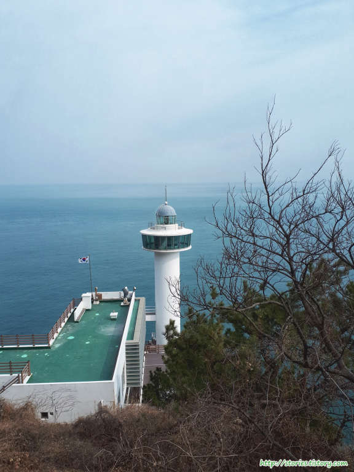

부산의 대표적인 관광지 태종대를 다녀왔습니다. 처음에는 무슨 대학교캠퍼스인 줄 알았는데 아니더군요 -,.-;
태종대는 영도의 가장 끝자락에 있는 해안절벽으로 아름다운 풍경을 가지고 있습니다.  
태종대로 오르는 길은 소나무가 우거진 완만한 산책로로 이루어져 있어서 트렉킹을 하기에도 좋은 코스입니다.
하지만 산책보다는 관광이 목적인 경우를 위해 `다누비열차`라는 차량을 운행 하고 있어서 편하게 태종대까지 이동할 수도 있습니다.

그림과 같은 다누비열차로 태종대를 한바퀴 순환운행을 하고 있습니다.

매표를 하고 줄을 서고 있으면 한바퀴 돌고 온 다누비열차에 차례로 탑승을 할 수 있습니다. 줄이 길어도 다누비열차가 워낙 많은 사람을 태울 수 있어서 금방 탈 수 있습니다.

보통은 전망대에서 내려서 관람을 하고 걸어서 영도등대까지 이동한 후 그곳에서 다시 다누비열차를 타고 입구쪽으로 오는 코스로 이용합니다.  
전망대에서는 간단한 음식을 먹을 수 있는 식당이 있습니다.

`전망대`에서 `영도등대`까지는 걸어서 `3분`~`5분`정도 밖에 걸리지 않습니다. 다만 큰 길에서 영도등대까지 내려가는 길이 조금 힘들 수 있습니다.

차가 다니는 길에서 영도등대까지 내려가려면 `5분`~`15분`정도 소요가 됩니다.
내리막길을 내려갔다가 다시 올때는 오르막길로 올라와야 하므로 더운 여름인경우는 힘이 들 수도 있습니다.

일단 내려가면 풍경은 보장합니다. 너무 멋진 모습을 볼 수 있습니다.

등대 자갈마당쪽에서 바라본 영도등대입니다.

태종대 바위입니다. 사실 여기를 보려고 온 것이라 할 수 있습니다.  
예전에는 이 바위까지 올라 갈 수 있었는데 이번에는 갈수 없게 막아놨습니다. 계속 막아논것인지 잠시 막아놓은 것인지 모르겠습니다.

등대쪽에도 조그만 카페가 있습니다. 또한 화장실도 있으니 소변정도는 해결할 수 있습니다.

등대의 아래쪽 바다로 내려가면 자갈마당이 있습니다. 좌판을 깔고 간단한 해산물을 팔고 있습니다.  
자갈마당 쪽으로 배가 옵니다. 태종대 입구에서 배를 타고 태종대를 한바퀴도는 코스도 있는데 이곳에서 배를 타고 이동하는 코스도 있는 것 같습니다.

등대를 올라오는 길에 등대 바로 아래쪽에 인어상이 있네요. 뱃사람들이 무사히 돌아오기를 기원하는 듯한 느낌이 드네요.

이렇게 구경을 하고 다시 다누비열차가 다니는 길로 올라가야 합니다.

## 비용

입장료는 따로 없습니다. 주차비와 다누비열차를 타는 비용만 있다고 보시면 됩니다.

## 입장시간

- 시작시간 : 하절기 3~10월(04:00), 동절기 11~2월(05:00)
- 마감시간 : 하절기 3~10월(24:00), 동절기 11~2월(24:00)

## 여행지 정보

- 주소 : 부산광역시 영도구 전망로 24
- 연락처 : 다누비열차 및 주차장 운영·관리(부산관광공사) : (051) 405-8745~6
- 연락처 : 시설물 관리(부산시설공단) : (051) 405-2004
- URL : http://taejongdae.bisco.or.kr

## 주차정보

커다란 주차장이 있어서 웬만하면 주차에 문제는 없습니다.
유료주차로 운영을 하고 있습니다.

중형차량 기준으로 **3시간에 3,500원**정도 하고 30분당 500원씩 추가 합니다.

자세한 사항은 [홈페이지](http://taejongdae.bisco.or.kr/about/about04/about04_3)를 참고하세요.
