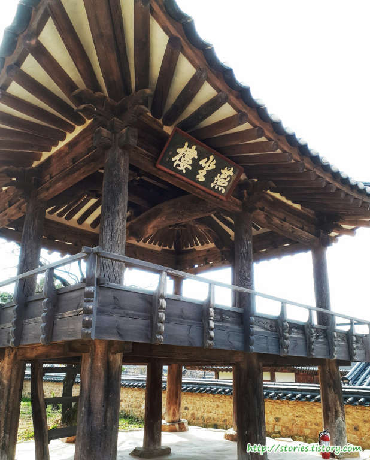
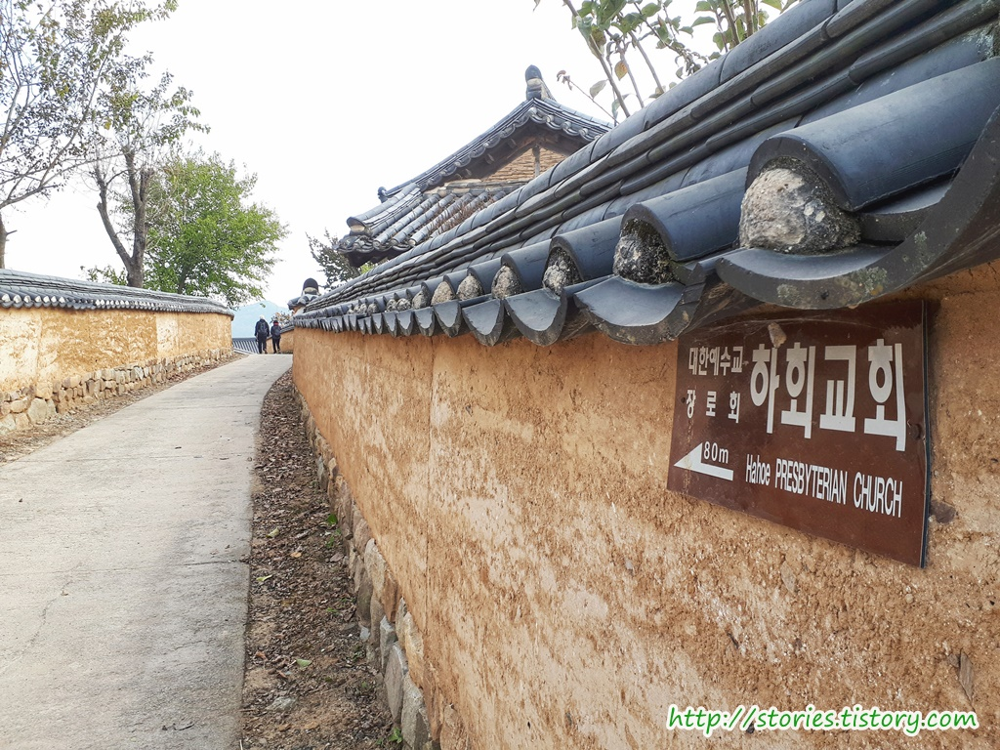
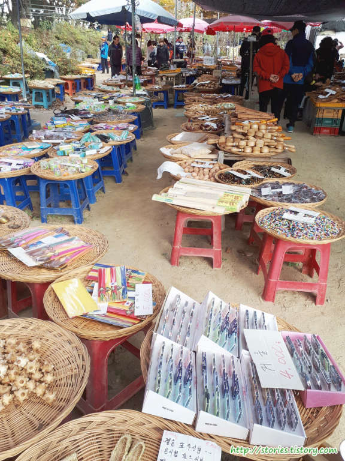

국내 몇 안되는 세계문화유산 중에 가장 유명하다면 유명할 수 있는 안동 하회마을을 다녀왔습니다.

낙동강이 S자 형태로 휘돌아 나가는 마을이라고 해서 이름 붙혀진 **하회마을**은 `서애`(西厓) `유성룡`(柳成龍, 1542~1607)을 배출할 정도의 양반고을 입니다. 임진왜란의 피해도 없어서 옛 고을의 모습을 고스란히 간직하고 있습니다.

하회마을은 자가용을 타고 바로 이동할 수는 없습니다. 먼저 하회장터가 있는 주차장에 주차를 하고 셔틀버스를 타고 마을로 이동하는 형태로 되어 있습니다.

▲ 주차를 하고 아래쪽으로 5분정도 내려가면 하회장터를 만날 수 있습니다.

▲ 하회장터에서는 장터답게 먹거리와 기념품등을 팔고 있습니다. 간단하게 식사를 해도 좋을 듯합니다.

대충 먹거리 종류와 가격을 참고하시라고 가격표를 올려봅니다.

장터를 지나서 가면 매표소가 보입니다. 입장표는 대략 1000원~3000원정도 합니다. 입장표에는 버스비와 마을 입장료가 포함되어 있습니다.

매표를 하면 바로 앞쪽에 출발지 버스정거장이 있습니다. 정거장에서 버스를 타고 5분~10분정도 이동을 하면 하회마을 입구에 도착을 합니다.

일반버스를 순환버스로 활용하고 있습니다. 찾아오는 사람수에 따라 순환버스를 유동적으로 활용하는것 같습니다.

마을 입구에 전동차를 대여할 수 있습니다. 마을이 넓기 때문에 전동차로 관광하는것이 대안이 될 수 있습니다.  
1시간에 `20,000원` ~ `40,000원` 정도 합니다.

우리는 건강하기 때문에 걸어다니며 구경을 하기로 했습니다. 걷는 것이 특별히 어렵지 않다면 걸어다니는 것을 추천합니다. 쉬엄쉬엄 걸어다니면서 사진도 찍고 구경도하기에 좋습니다.

옛고을을 잘 간직하고 있기때문에 골목길도 고즈넉한 모습입니다.

첫번째 만나는곳은 양진당입니다. 양진당은 풍산류씨 대종택으로 원래 아흔아홉 칸이었으나 지금은 쉰세 칸만 남아 있다고 합니다.

  
  

충효당은 하회마을을 대표하는 반가로 서애 류성룡의 종택이라고 합니다. 류성룡이 돌아가신 후에 그의 손자와 증손자에 의해 확장 증축했다고 하네요.

  

밖에서 보면 그렇게 넓어보이지는 않지만 안으로 들어가 보면 굉장히 넓은 공간을 차지하고 있다는 것을 알수 있습니다.

얼마나 오래된 나무인지는 모르겠지만 딱~ 봐도 상당히 오래된 것이 확실해 보입니다. 오래된 나무라서 그런지 성황당으로 사용하고 있는것 같습니다.

마을을 돌아 좀 외곽으로 나오면 원자정사를 만날 수 있습니다. 외곽에 있어서 그런지 찾아오는 사람의 발길이 많지는 않습니다.

원자정사 내부에는 2층으로 되어 있는 정자가 있습니다. 올라가지는 못합니다.

하회마을에 어울리게 몇명의 아이들이 한복을 입고 사진을 찍고 있습니다. 아무래도 근처에 한복을 빌려주는 곳이 있지 않나 싶습니다. ^^

좀 낮설긴 하지만 교회도 있습니다. 하회교회는 이 지역의 신자들을 위해 지어지고 운영되고 있는것 같습니다.

하회마을 북쪽에 관광객을 위한 조그만 장터가 열려있습니다. 주로 기념품을 팔고 있습니다.

만송정숲 앞에서 바라본 깍아지른 절벽의 부용대 입니다. 이 부용대에 오르면 하회마을을 전체적으로 볼 수 있습니다.

만송정숲에서 조금만 더 내려오면 하회솔밭쉼터가 보입니다. 말그대로 쉬면서 음식이나 차를 마실 수 있는 곳입니다.

하회마을을 한바퀴 돌아서 버스에서 내린 곳으로 가기 위한 뚝방길입니다. 이 길마저 고즈넉한 시골의 모습을 간직하고 있습니다.

이곳에서 걸어서 5분~10분정도 걸어가면 처음에 버스에서 내렸던 정거장이 나옵니다. 버스를 타고 다시 주차장으로 이동하면 하회마을을 모두 보시게 됩니다.  
여기에 소개하지 못한 곳도 여러곳이 있습니다. 직접가서 한번 보는 것도 좋지 않을까 합니다.

## 비용

대략 1000원~ 3000원정도 합니다. 버스 탑승비용까지 포함되어 있습니다.

## 입장시간

| 구 분  | 시 간         |
| ------ | ------------- |
| 하절기 | 09:00 ~ 18:00 |
| 동절기 | 09:00 ~ 17:00 |

## 여행지 정보

- 주소 : 경북 안동시 풍천면 하회종가길 2-1
- 연락처 : (054)853-0109, 853-0103
- URL : http://hahoe.or.kr

## 주차정보

주차장은 생각보다 큽니다. 웬만해서는 주차에 문제는 없을 것 같습니다.
