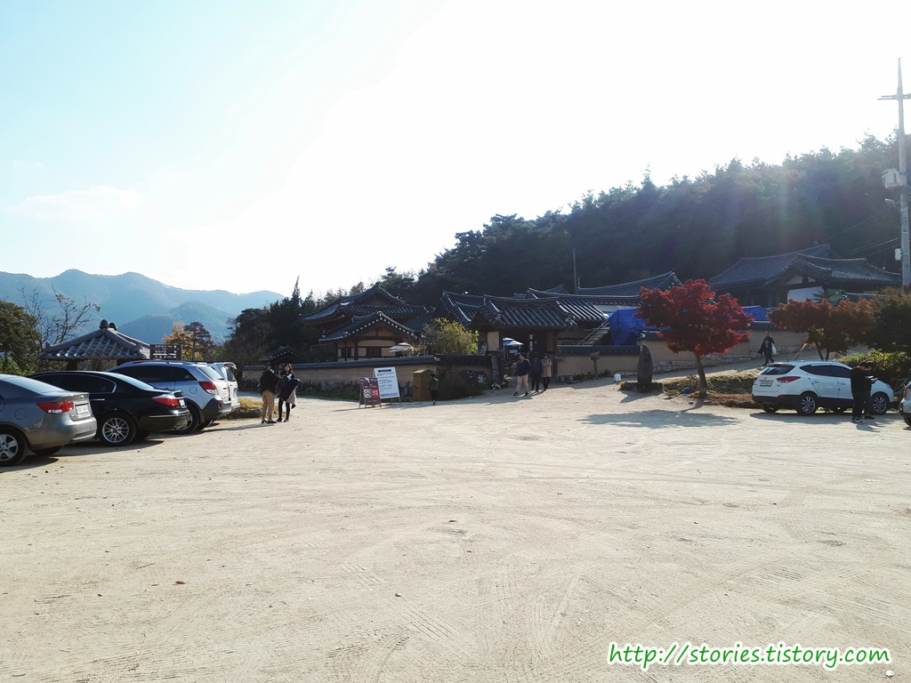
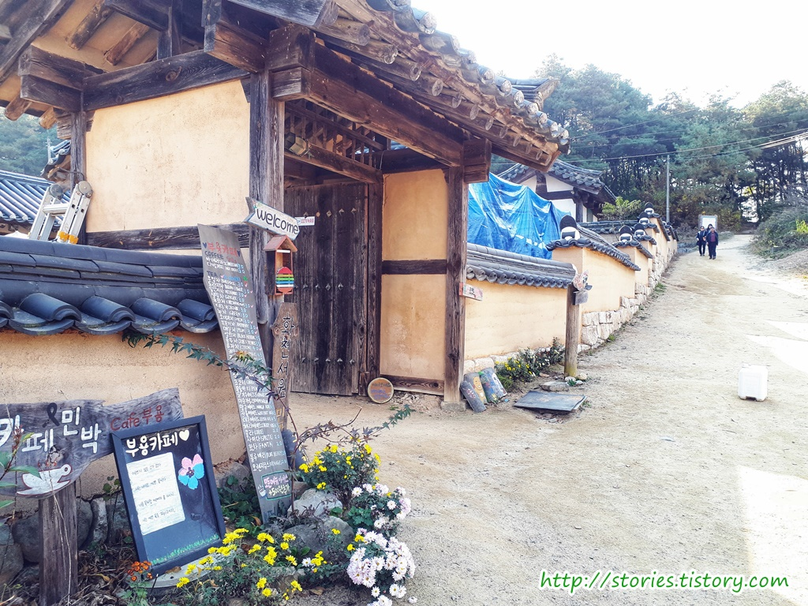
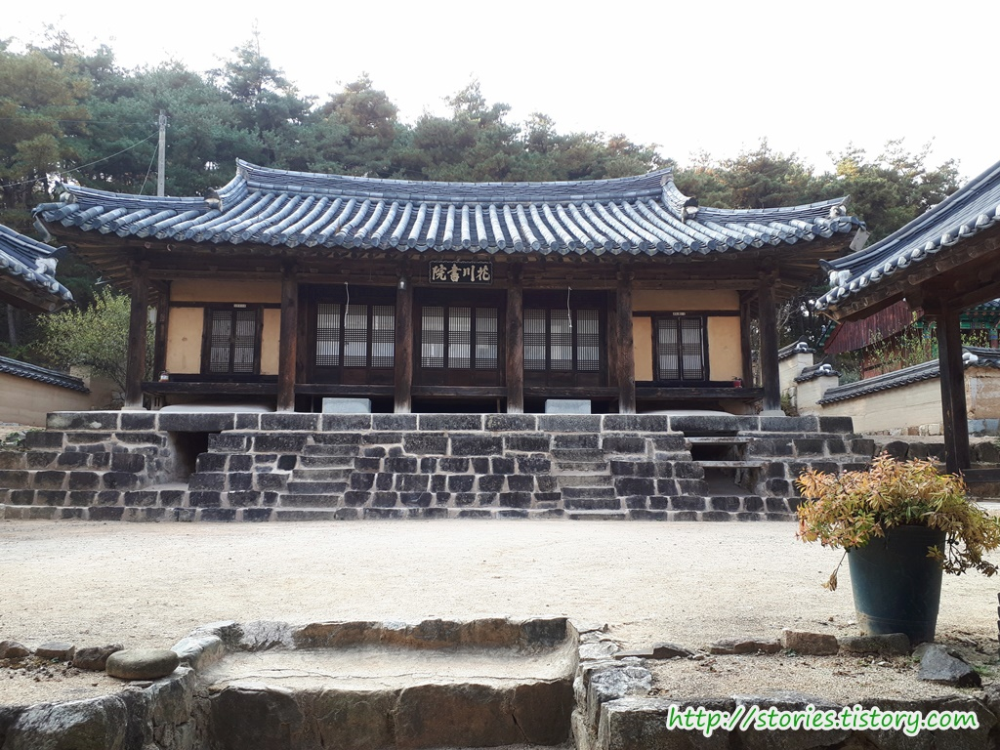
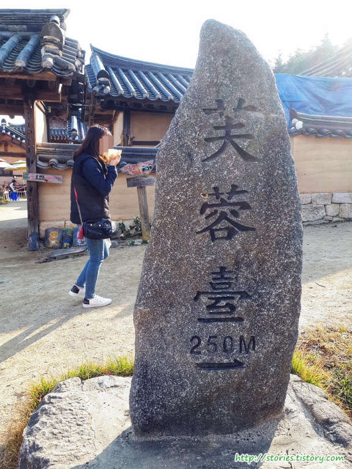
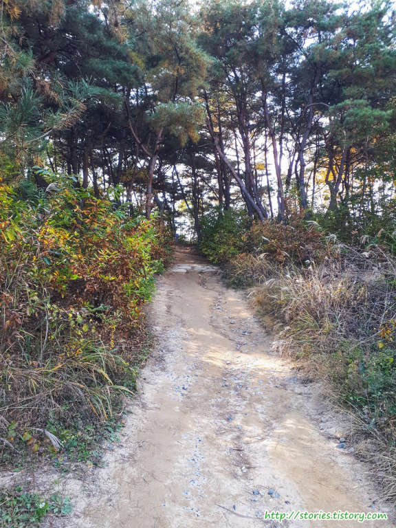
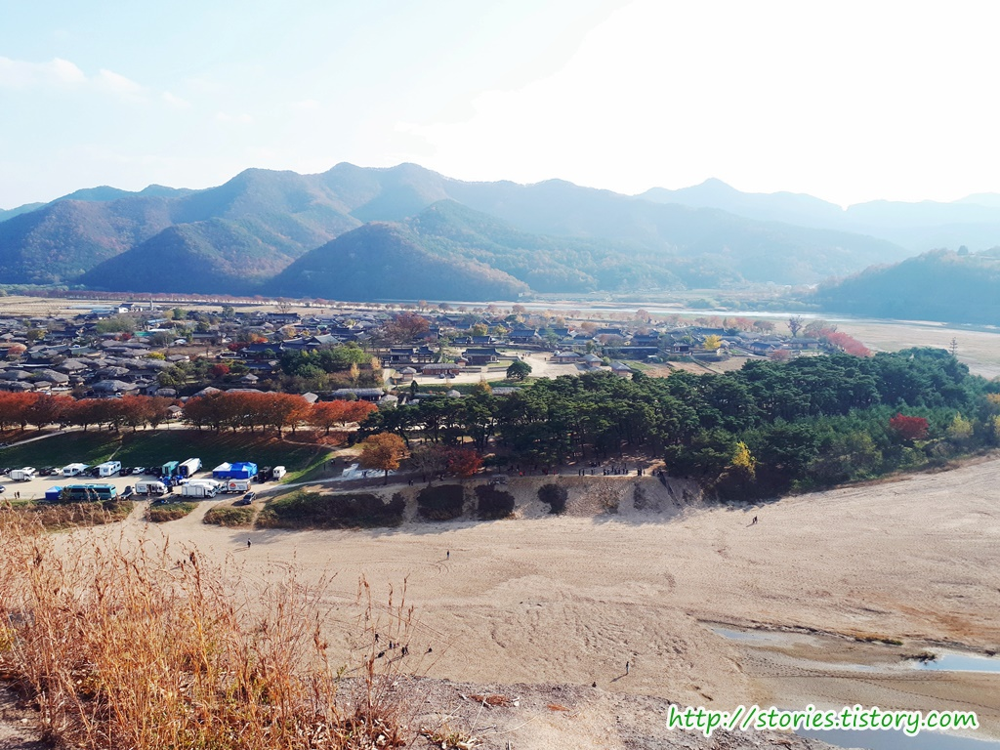
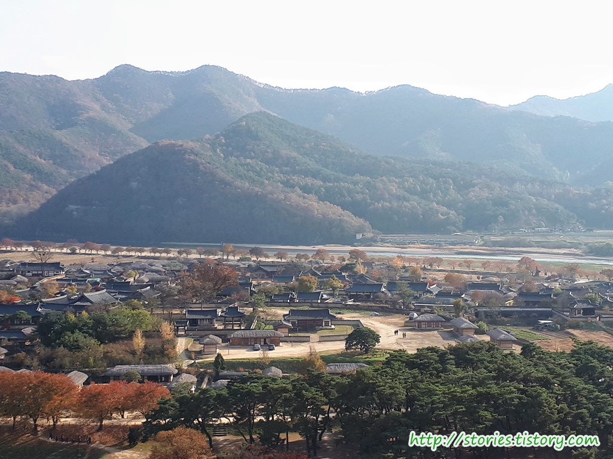

어디가서 `하회마을`을 갔다왔다고 말 하려면 부용대는 꼭 가봐야 할 코스입니다. 왜냐하면 `부용대`에서는 하회마을의 전체 모습을 볼 수 있기 때문입니다.

부용대를 오르기 위해 부용카페 앞에 있는 주차장에 주차를 해야 합니다. 주차장이 그렇게 넓지는 않지만 차가 별로 없어서 주차하는데 어려움은 없었습니다.

부용대에 오르기전 또는 내려와서 잠깐 차를 마실 수 있는 카페가 있습니다. 보시는 것 처럼 화천서원의 입구에 간단히 차를 마실 수 있게 꾸며 놓은 곳입니다.

화천서원 입니다. 지금은 거의 카페로 활용되고 있는것 같습니다.

부용대라는 것을 표지석으로 표시를 해 놨네요. 부용카페 바로 앞에 있습니다.  
이쪽 방향으로 쭉~ 올라가면 됩니다.

부용대가 바로 앞에 있지는 않고 산길을 따라 조금 올라가야 합니다. 그렇게 힘들지 않은 길이니 올라갈 만 합니다.

부용대에 올라서면 하회마을의 전체 모습을 볼 수 있습니다. 너무 멋진 장관입니다.  
낙동강이 휘돌아 나가는 곳에 생긴 마을이라고 해서 하회마을이라고 합니다.

내가 걸었던 하회마을을 전체 뷰에서 찾아 보는 것도 또다른 재미가 있습니다.

## 비용

무료입니다. 부용카페에서 차 한잔 마시려면 그정도 비용만 있으면 됩니다.  
주차도 무료입니다.

## 여행지 정보

- 주소 : 경상북도 안동시 풍천면 광덕솔밭길 72
- 연락처 : 054-856-3013
