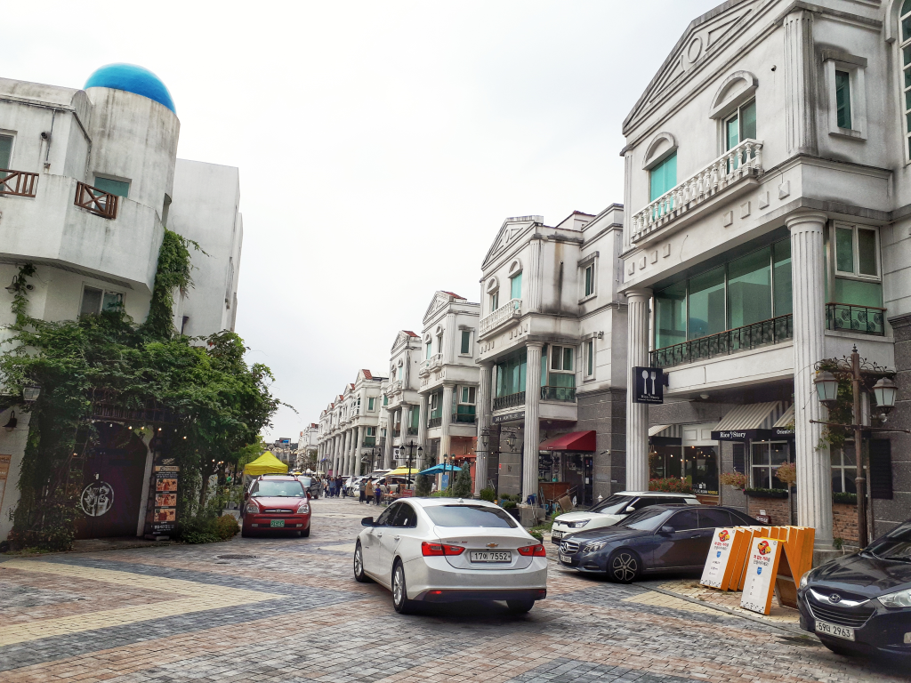
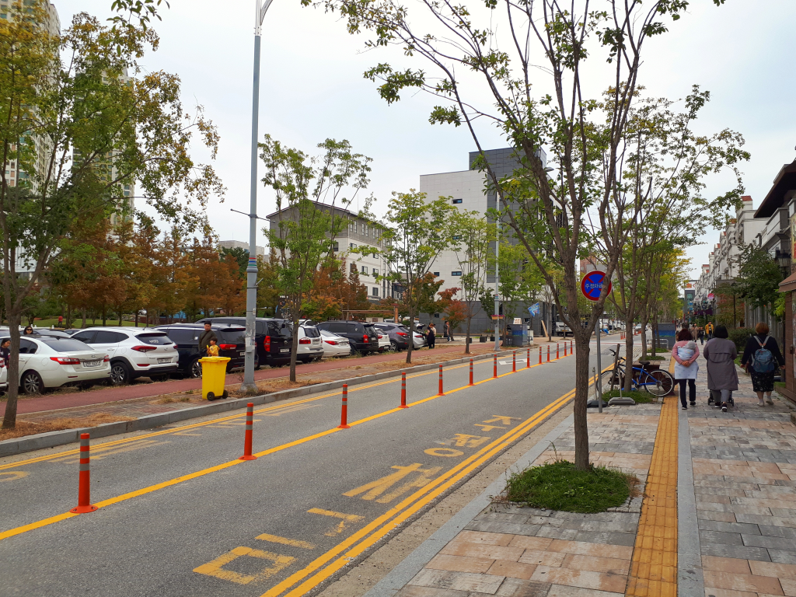
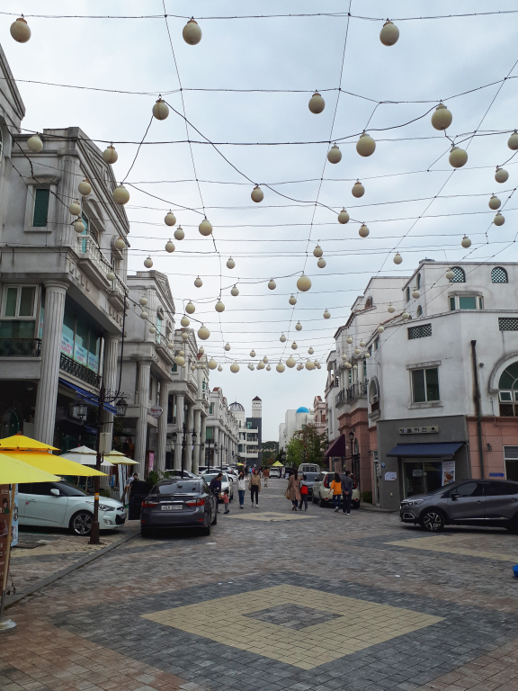
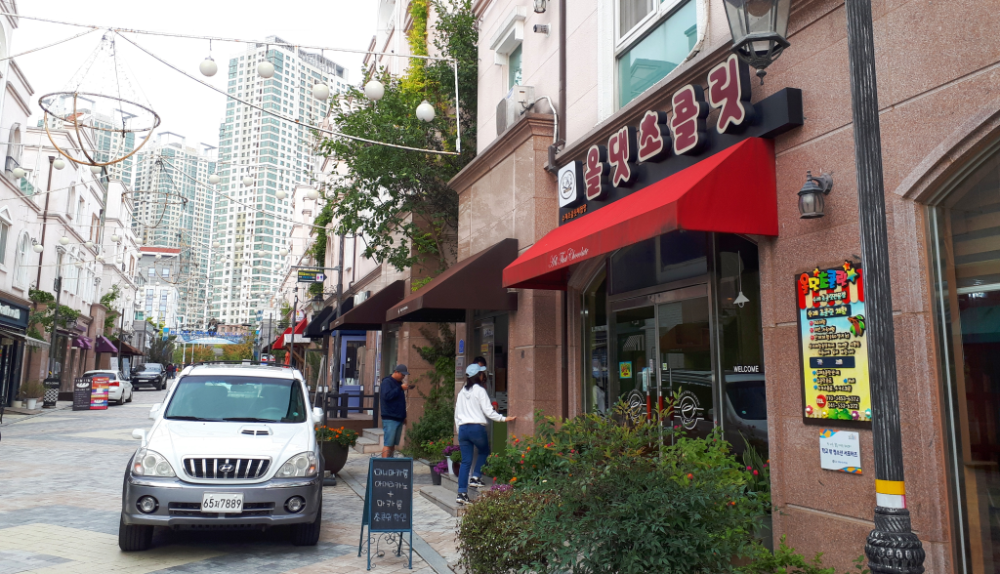
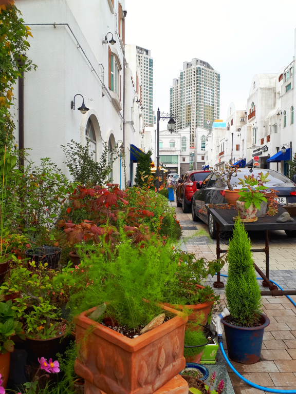
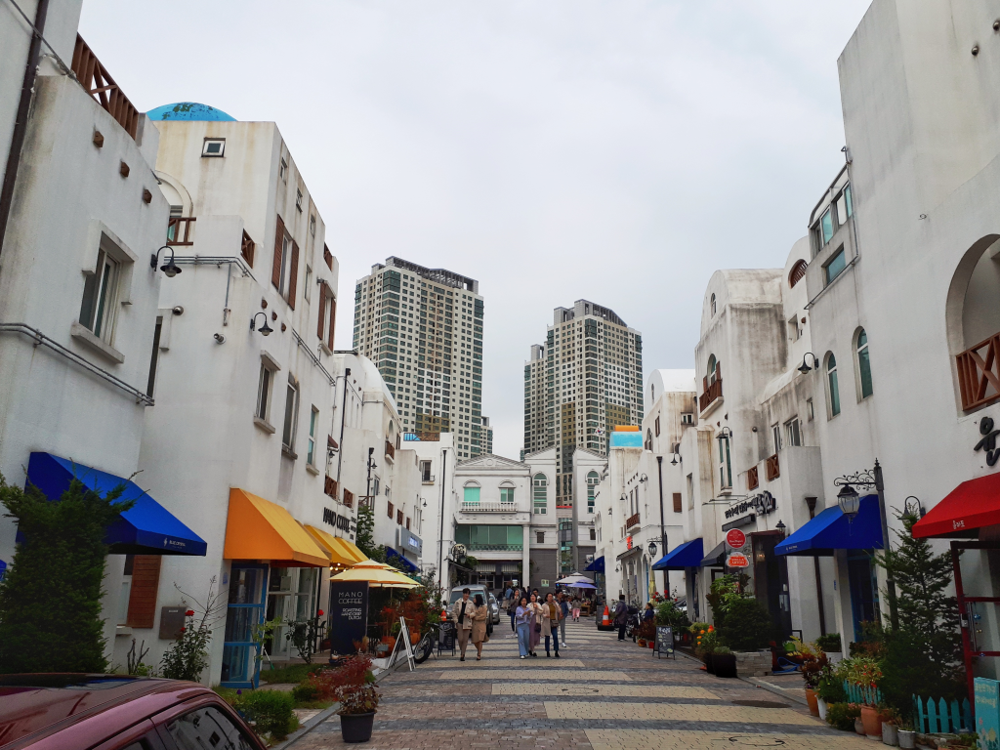
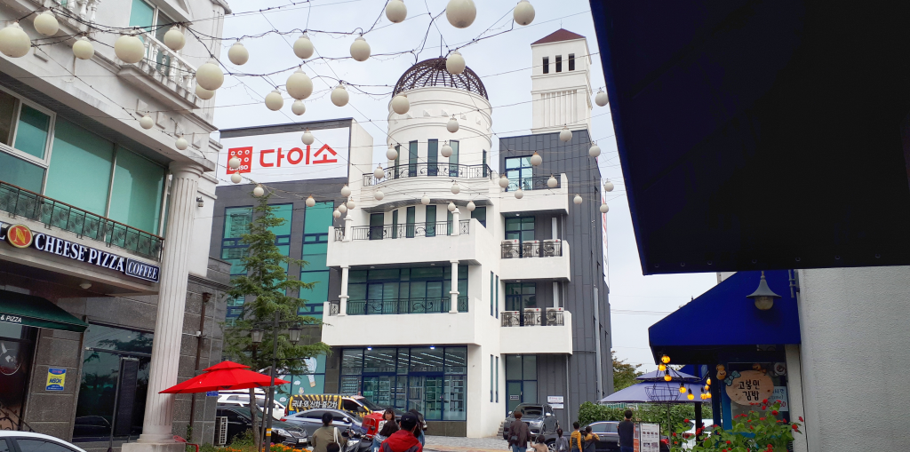

  
 천안과 아산의 많지 않은 관광지 중에 그래도 검색을 하면 항상 등장을 하는 곳이 바로 `지중해 마을`입니다.  
그래서 갈곳을 찾지못한 저도 부득히 이번에 `지중해 마을`에 다녀왔는데요.  
다녀온 느낌을 가감없이 포스팅을 하도록 하겠습니다.

  
비포장 주차장에 주차를 하고 걸어서 지중해마을로 가는 길입니다. 초봄이라 그런지 조금 쓸쓸해 보이는 느낌이네요.

  
지중해마을 초입입니다. 평일이라 그런지 사람이 많지 않네요.
전구가 하늘에 매달려 있어서 저녁풍경을 예상할 수 있을 것 같습니다.
우리는 일정 상 낮에만 보고 왔지만 저녁에는 더 멋진 풍경이 있을 것 같습니다.

  
수공예 상품점에도 아기자기한 상품들이 많이 있습니다. 이런가게들이 지중해마을의 아이덴티티를 만들어나가는 것 같습니다.

직접 초코릿을 만들 수 있는 체험공간도 있습니다. 밖에서 보니 초코릿을 만들수도 있고 안에서 커피도 마실 수 있게 되어 있는것 같았습니다.

  
조경을 이쁘게 꾸며놓은 카페도 있습니다.

  
조금 낯선모습이긴 하지만 다이소도 있네요..

## 방문시기

2018년도 10월 평일 오후 1시정도 쯤에 다녀왔습니다. 덥지도 춥지도 않은 전형적인 가을날씨 였습니다.

## 비용

지중해 마을은 별도의 입장료나 주차비는 따로 받지 않습니다. 다만 마을 곳곳에 있는 상가나 식당을 이용할때 사용할 비용만 있으면 됩니다.

## 여행지 정보

- 주소 : 충청남도 아산시 탕정면 탕정면로8번길 55-7
- 연락처 : 041-547-2246
  [지도] http://naver.me/xeYsngUb

## 주차정보

주차는 지중해 마을 입구쪽에 비포장 주차장이 있습니다. 따로 관리 되어지는 것 같지는 않는 모습입니다.  
지중해 마을 안에도 곳곳에 주차할 곳도 있습니다. 음식점 앞이나 공원앞쪽에도 몇대씩 주차가 가능합니다.

## 총평

다른 여행지에 비한다면 지중해마을은 아직 부족한 점이 많은것 같습니다.  
멀리서 보면 이쁜것 같은데 가까이에서 보면 생각보다 깨끗해 보이지는 않습니다. 마을 자체도 넓지않고, 보고 즐긴만한 것들도 그다지 많지 않았습니다. 빈 상가도 좀 보이구요. 하지만 그래도 몇몇 상가들은 들러 볼만한 곳 들도 있긴 합니다.  
꼭 찾아봐야 할 여행지는 아니지만 그래도 시간이 있다면 잠깐 들러볼 정도는 되지 않을까 합니다.

지극히 개인적인 평점 : ★★☆☆☆
