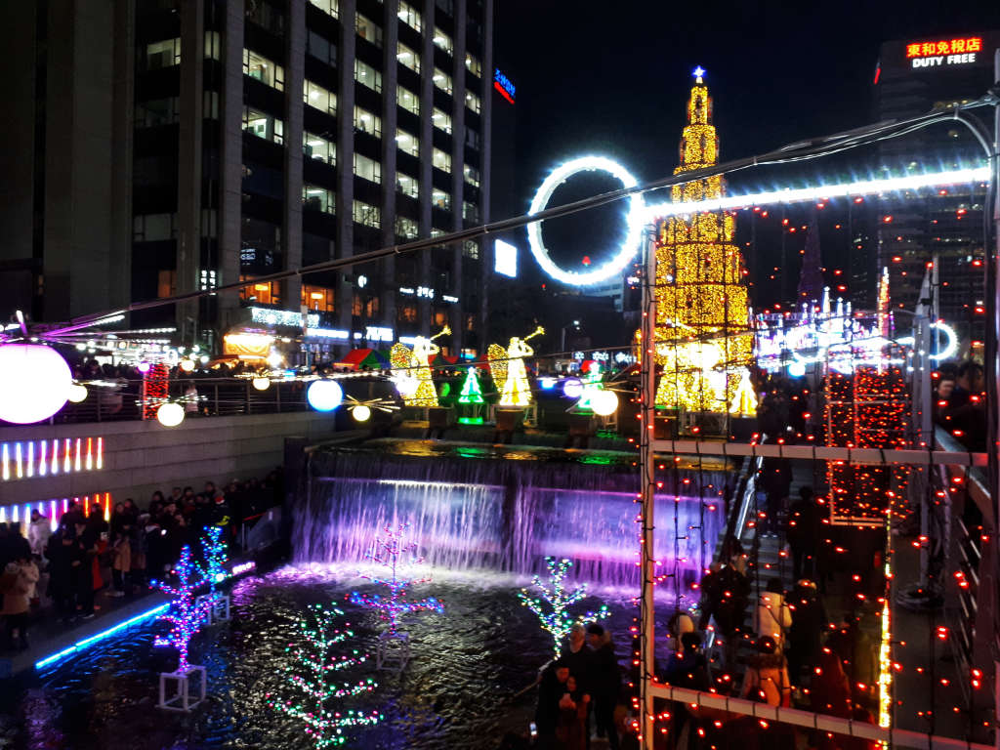

사무실에서 잠깐 휴식을 위해 나왔다가 청계광장에서 진행하는 **2018크리스마스페스티벌**을 하고 있는 것 같아 현장 사진을 몇장 남겨봅니다. 

2019년 1월 1일까지 행사를 한다고 합니다.  

제 경험상 딱~!! 보니 데이트코스로 너무 좋은 것 같습니다. 날씨도 추우니 손도 꼭 잡고 붙어 다니기에 좋구요. 천계천을 따라 걷다가 추우면 가까이에 있는 카페에서 따뜻한 커피 한잔 마시면서 대화 하기도 너무 좋구요.

# 낮에 찍어 본 크리스마스페스티벌

  
아직은 점등이 되지않은 크리스마스 트리입니다. 

   
점등이 되지도 않았지만 사진을 찍기위해서 줄지어 서있네요. 점등이 되지 않아도 사진은 잘 나올듯 합니다.  

   
소라탑에서 천계천을 따라 내려오면 제일먼저 보이는 모전교입니다. **I SEOUL U**라고 서울의 브랜드 명칭이 써있네요. 처음에 이게 뭔뜻인가 했어요 I LOVE YOU도 아니고, `너와 나의 서울`이라는 뜻이라네요 ^^  

   
곳곳에 운영안내소가 있습니다. 방이되면 더 추울텐데 운영안내소에 있으면 얼어죽을 수도 있을 것 같은 느낌입니다. 

  
눈내리는 마을을 표현한 전시물입니다. 눈처럼 보이지만 그냥 솜인것 같아요

기타 여러가지 다양한 전시품이 있습니다. 낮에 보면 감흥이 별로지만 밤에 점등이 되면 굉장히 멋있을것 같습니다. (아래에 점등이 된 밤에 찍은 사진을 몇장 올려놓았습니다.)

  
출사를 나온 아줌마 아저씨 사진 동호회 인것 같습니다.  
전문가 포스가 폴폴~ 나네요

# 밤에 찍어본 크리스마스페스티벌

역시 점등이 된 밤에 본 모습이 더 멋지긴 합니다. 

   
  
사람들이 너무 많아서 트리까지 접근하기가 만만치 않아서 멀찌감치 찍었습니다. 아무래도 크리스마스 이브라서 사람들이 많은가 봅니다.  
크리스마스라고 25일날 종료되는 것이 아니라 2019년 1월 1일까지 행사를 진행한다고 하니 아직 기회가 있습니다. 

  
밤에 본 조형물들입니다. 역시 점등된 모습이 더 멋있고 로멘틱하네요.

  
역시나 아직 커플들이 많은가 봅니다. 하트조형물에서 사진을 찍기위해 줄을 서서 기다리고 있네요.  

  
광교 아래에 사람들이 많이 모여 있더라구요. 보니까 무슨 등 띄우기 3,000원이라고 써있는 것을 보니 무슨 행사를 하는가 봐요. 데이트할 때 딱 좋은 아이템일 것 같네요 ^^

## 기간
- 시작일자 : 2018.12.8(토)
- 마감일자 : 2019.1.1(화)

## 여행지 정보
- 주소 : 서울 청계광장 ~ 장통교까지
- 연락처 : 02-904-1159 (조직위원회)
- URL : http://www.seoulcf.com
[지도](https://goo.gl/maps/nB9tcojDJc82)

