여행계획을 세울 때 보통 어떻게 하시나요?  
저는 주로 `구글 드라이브`의  `내지도`와 `스프레드시트`를 활용하여 세우는데요.  
구글 드라이브를 활용 할 경우 **장점**은 인터넷이 되는 곳이나 포켓 와이파이를 가지고 다닌다면 언제 어디서든지 여행장소와 일정을 확인할 수 있으며 혹시 모를 변수가 생길 경우도 재빠르게 **Plan B**를 찾아 당황하지 않고 순조롭게 여행을 소화할 수 있습니다.   

# 여행지의 모든 정보를 구글맵 내지도에 저장  
제가 이번에 도쿄로 여행을 가려고 하는데요.  
처음가는 곳이라 인터넷 서핑으로 검색하면서 찾게되는 도쿄의 여행지, 맛집 등을 구글맵의 **내 지도**에 기록을 합니다.  
그러기 위해서 먼저 내 지도를 만들어야 합니다.  

## 내지도 만들기  
네이버맵이나 카카오맵도 이런 저장 기능이 있으면 좋으련만..  
제가 알기로는 구글맵에만 이런 장소 저장하는 기능이 있는 것으로 알고 있습니다. (아니면 댓글 부탁드립니다.)  

먼저 구글에 회원가입을 하게 되면 기본적으로 구글 드라이브가 생깁니다.  
일단은 구글 드라이브에서 시작을 하면 됩니다.  

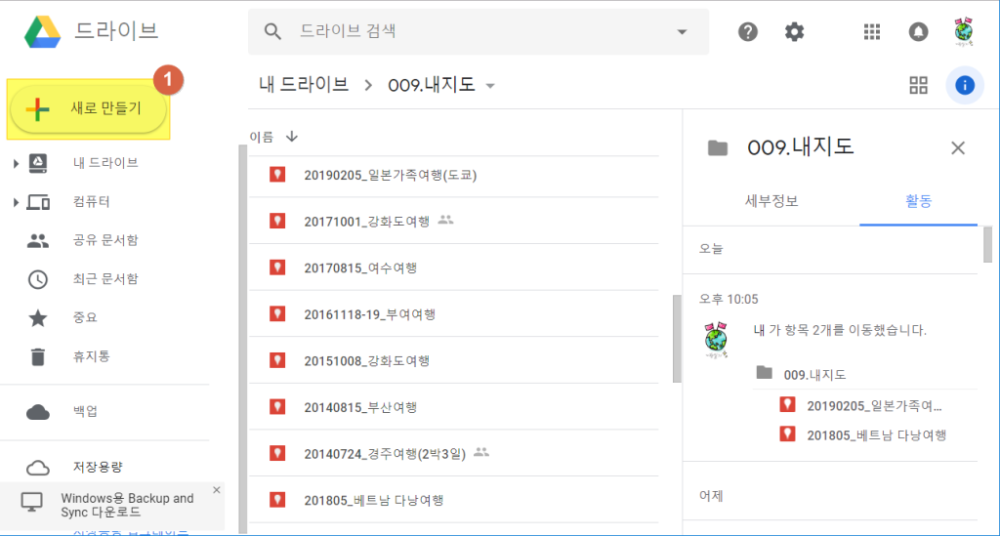  
구글 드라이브에서 **새로만들기** 를 선택합니다.  

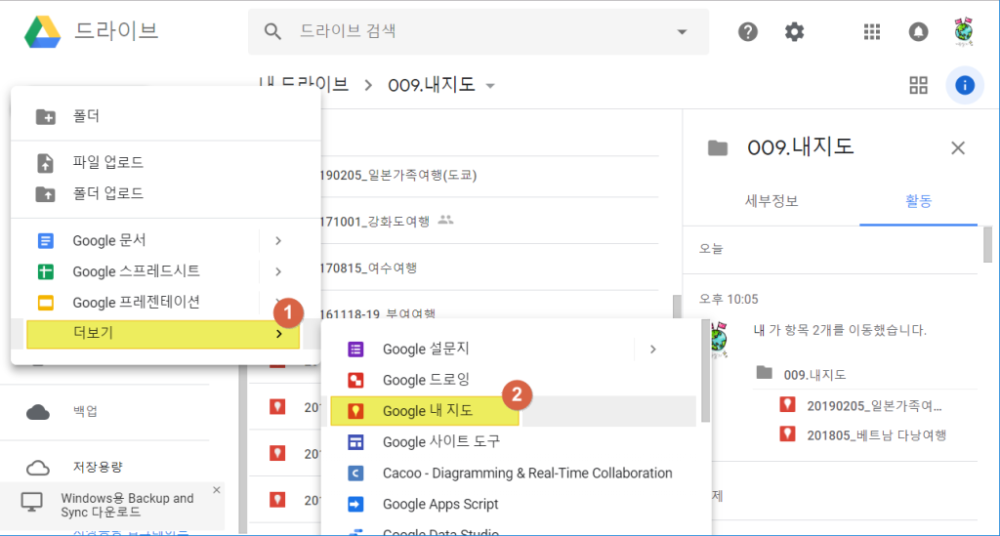  
1. 하단에 있는 **더보기**를 선택합니다.  
1. **Google 내 지도**를 선택합니다.   

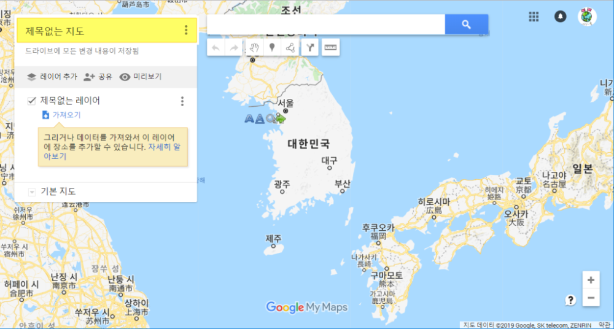  
생성된 **내지도**의 좌 상단에 보면 **제목없는 지도**라는 부분을 클릭하면 지도이름을 작성할 수 있습니다.  

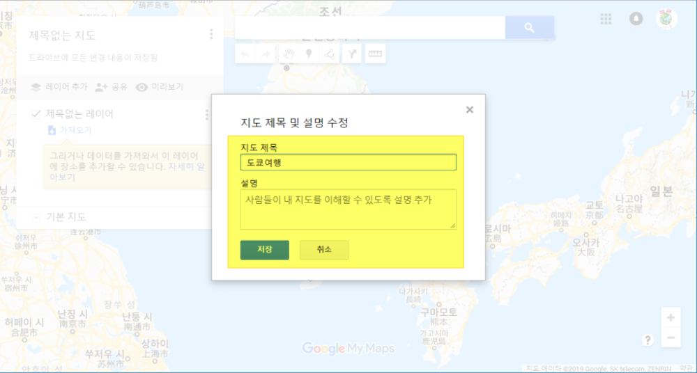   
지도제목과 간략한 설명을 입력하고 **저장**을 합니다. 

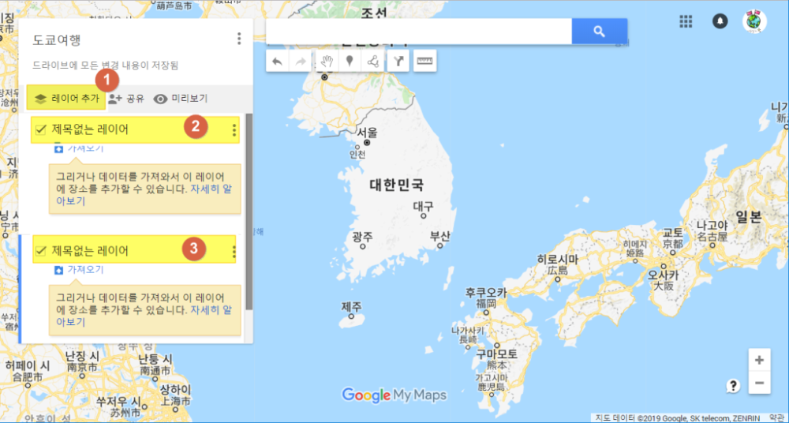  
지도 제목을 붙혔으면 이제는 최소 레이어 2개를 생성합니다.  
하나는 여행지 스팟을 저장할 레이어이고 하나는 맛집 스팟을 저장할 레이어 입니다.  
여기서는 본인 좋으실 때로 여러개의 레이어를 만들어 활용하셔도 됩니다. 꼭 절 따라하실 필요은 없어요 ^^  

처음에는 **제목없는 레이어**가 하나만 있습니다. 

1. **레이어 추가**를 눌러서 레이어 하나를 더 추가 합니다. 
1. 처음 **제목없는 레이어**를 클릭하여 **여행지**라고 변경합니다.
1. 두번쨰 **제목없는 레이어**를 클릭하여 **맛집**이라고 변경합니다.  

## 내지도에 스팟 등록하기  

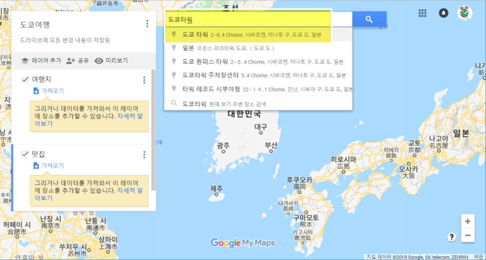  
이렇게 기본 **내지도**가 만들어 졌습니다.  
이제 이 지도에 스팟을 추가할 차례입니다.  

인터넷에서 찾은 여행지(여기서는 도쿄타워)를 **검색창**에 입력을 하면 대부분 해당 여행지 리스트가 나옵니다.  
그중에 적당한 것을 클릭하면 해당위치에 핀이 꽂히게 됩니다.   

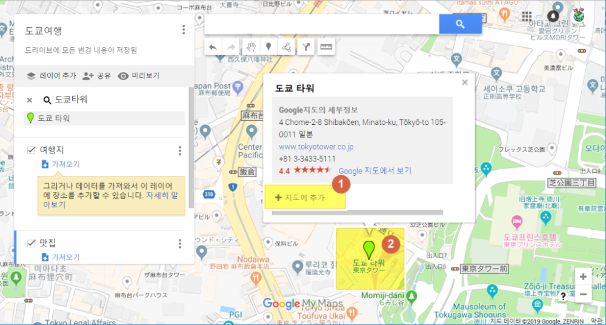  
원하는 위치라면 등록을 하면 됩니다.

1. **지도에 추가**를 클릭하면 **내지도**에 실제로 등록이 됩니다.  
1. 실제 지도에도 핀이 꽂힙니다. `초록색 핀`은 아직 등록이 되지 않은 상태고 **지도에 추가**를 클릭하면 다른색으로 변경이 됩니다. 

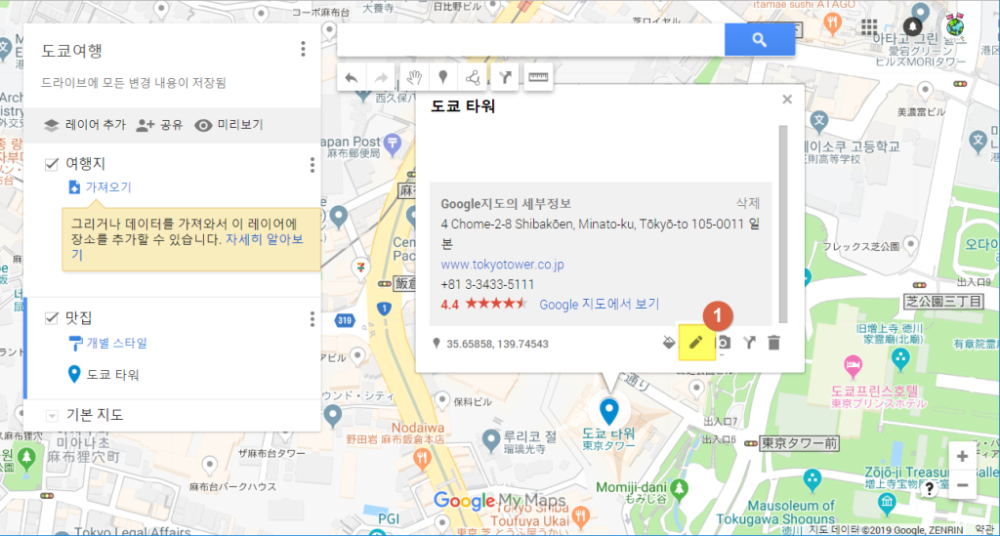  
1. **수정**버튼을 클릭하여 나에게 필요한 정보를 손수 입력하면 나중에 정보를 찾아보기에 좋습니다.  

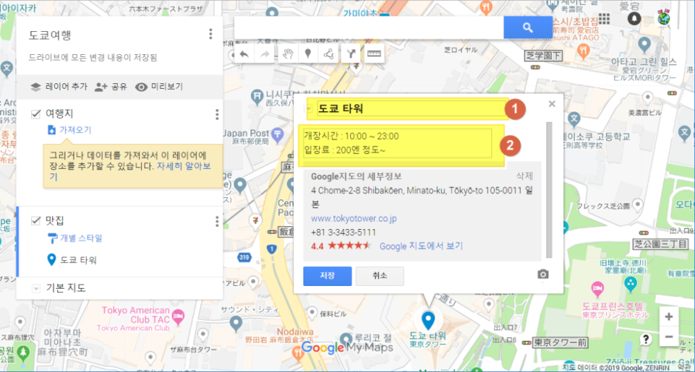  
1. 기본적으로 이름이 나오지만 나에게 맞게 수정도 가능합니다.  
1. 나에게 필요한 간략정보를 넣습니다. 저는 `개장시간`, `입장료`, `가격`, `주메뉴명`등등을 적는데 활용합니다.  

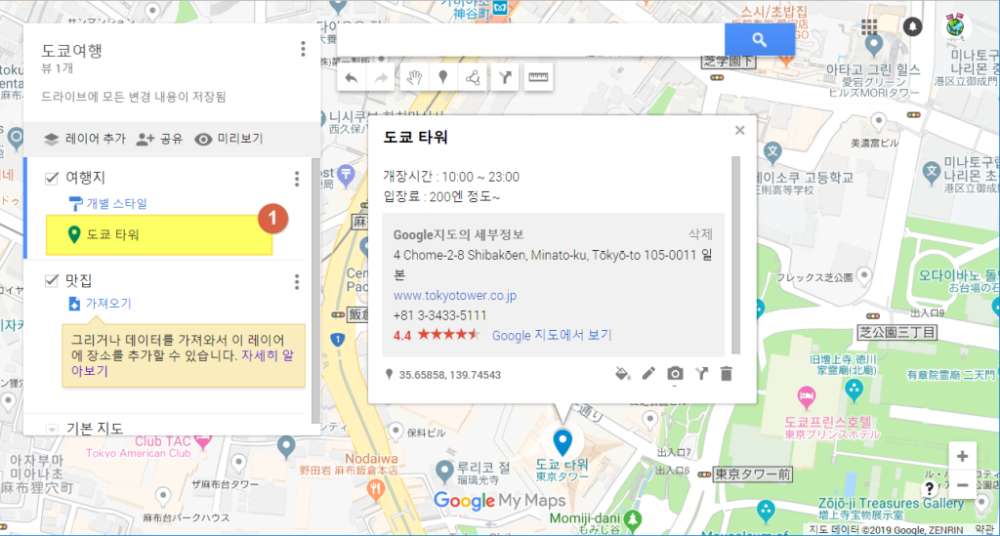  
1. 이렇게 등록된 **도쿄타위** 리스트를 볼 수 있습니다. 

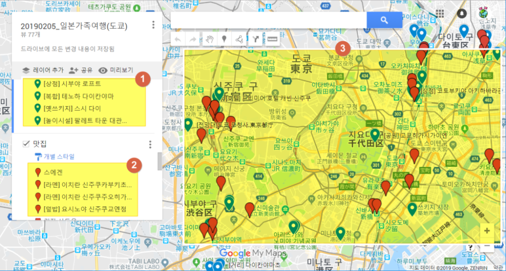  
위의 방법대로 맛집과 여행지 전체를 등록한 모습입니다. 

1. 여행지에 대한 리스트입니다.(파란색 깃발) 
1. 맛집에 대한 리스트입니다.(빨간색 깃발)
1. 동시에 지도에도 빨간 깃발과 파란깃발이 보입니다. 

# 날짜별 여행일정 잡기  

보통 3박4일 또는 4박5일로 여행을 할 텐데 알차게 여행을 하기 위해서는 여행 동선을 생각하면서 일정을 잡아야 합니다.   
이때 내가 열심히 등록한 **내 지도**를 활용하여 날짜별로 가까운 곳끼리 묶어서 여행 일정을 잡고 그 여행 동선 중 가까운 곳에 있는 맛집을 활용하여 식사 장소를 잡으시면 실패없는 여행일정을 잡으실 수 있을 것입니다.  

다음포스팅에는 **구글 스프래드시트**를 활용하여 어떻게 여행일정을 잡고 기록하는지 포스팅하겠습니다.  

