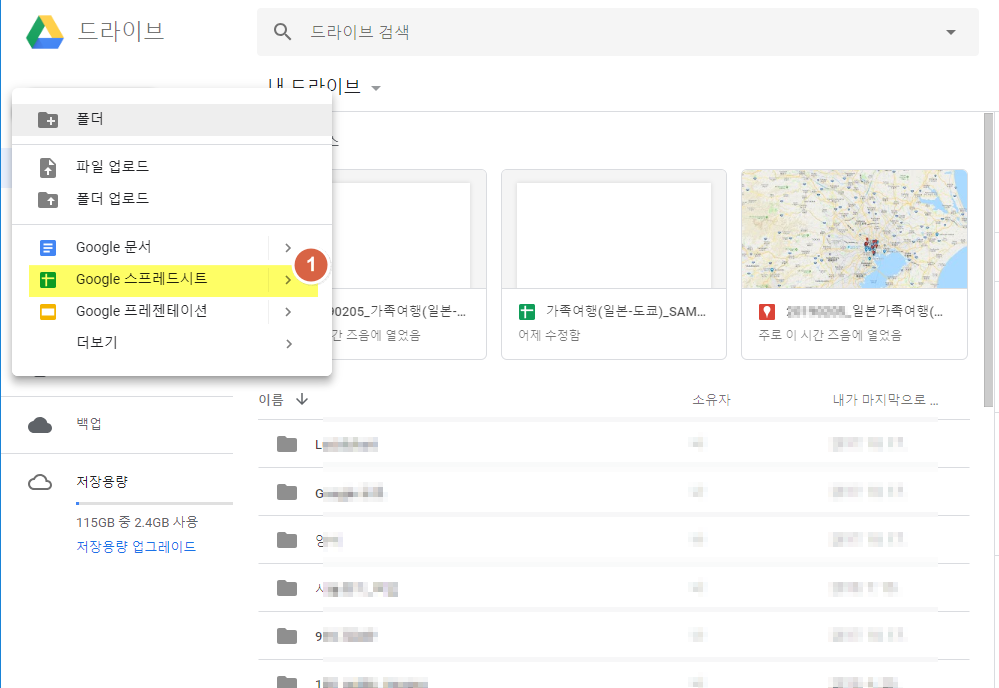
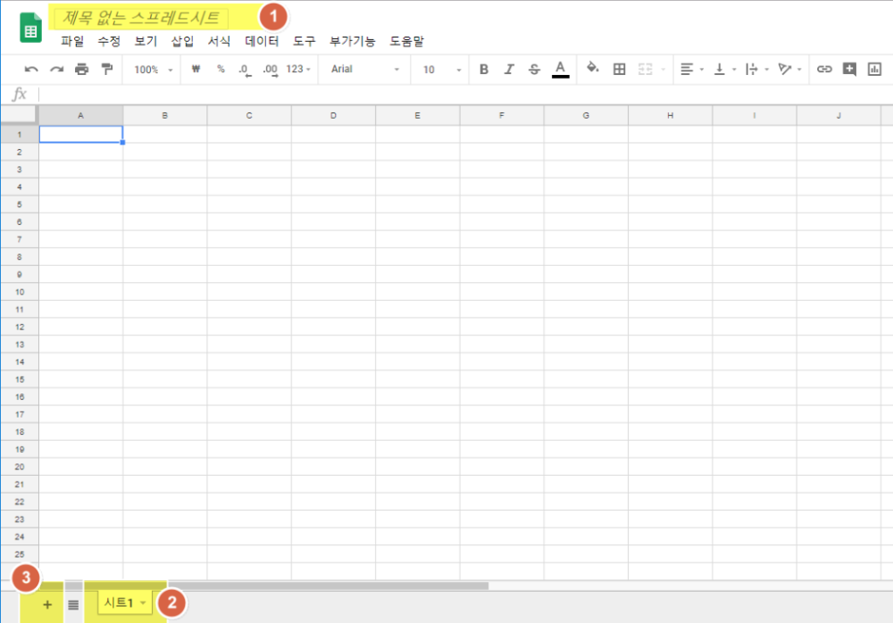
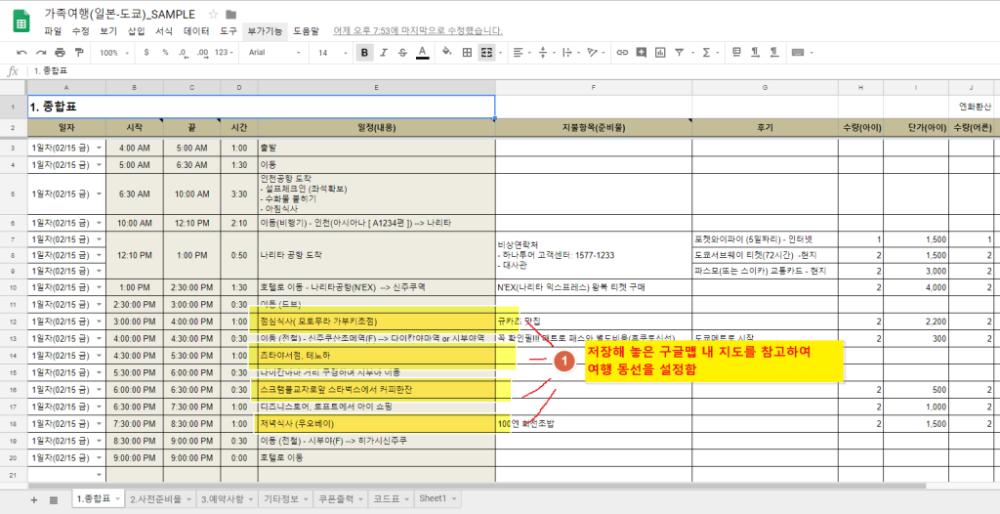
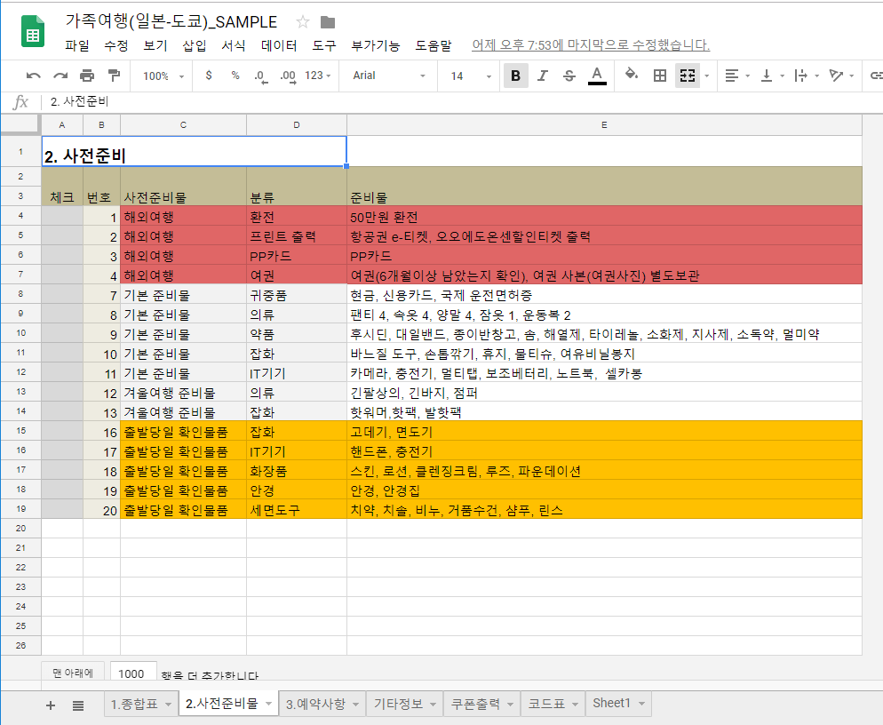
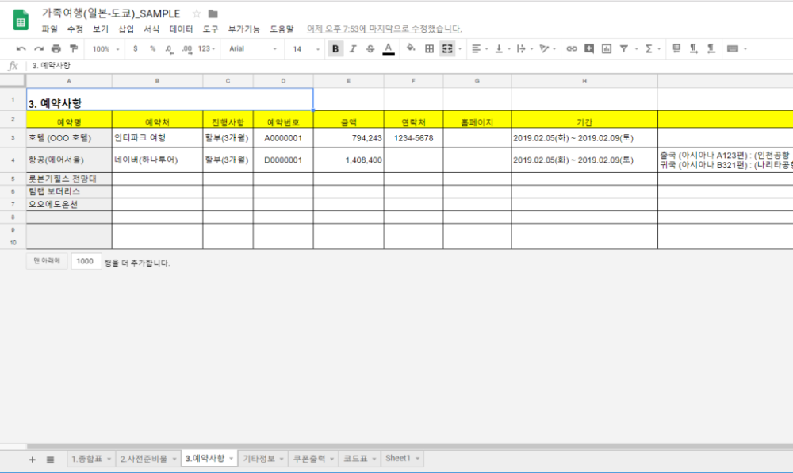
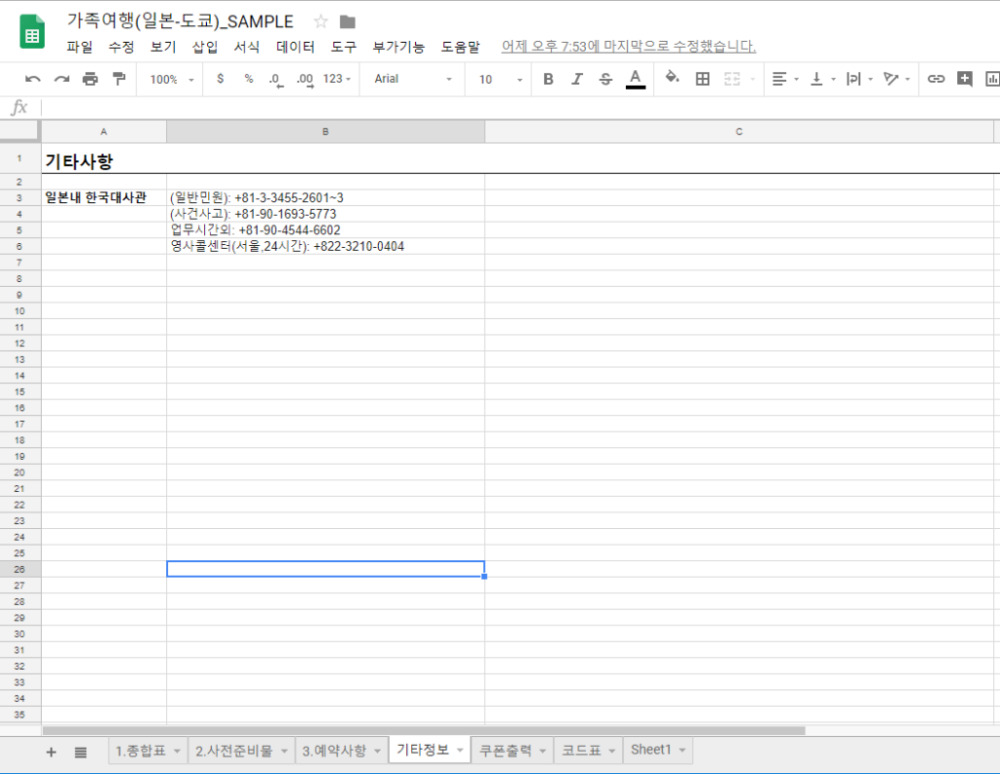
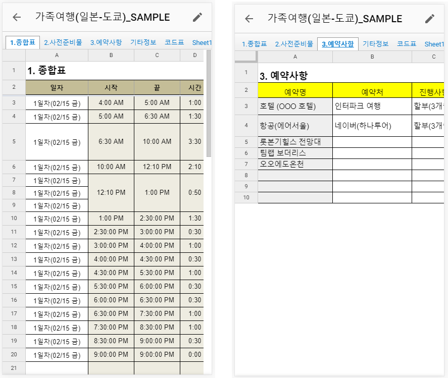

이전에 구글맵의 **내 지도**으로 을 포스팅을 했었는데요.  
**내 지도**를 활용하여 **구글 스프레드시트**로 여행일정을 계획하는 방법을 포스팅하려고 합니다.  

구글 드라이브를 사용하는 장점은 인터넷이 되는 어디에서든지 해당 내용을 볼 수도 있고 수정을 할 수도 있다는 것입니다.  
요즘에는 해외 어디를 가든지 **포켓와이파이**나 **현지 유심**을 활용하면 저렴한 가격으로 인터넷을 할 수 있는데요.  
두꺼운 여행책자를 들고 갈 필요없이 단지 스마트폰만 가지고 가면 내가 미리 구글 드라이브에 계획해 두었던 여행계획을 볼 수 있습니다.   

## 구글 스프레드시트 만들기  

먼저 구글 드라이브에서 스프레드시트를 하나 만들어야 합니다. 구글 스프레드시트는 마이크로소프트 엑셀과 동일한 역활을 하는 구글의 웹프로그램이라고 보시면 됩니다. 엑셀은 로컬컴퓨터에 설치를 해야 사용할 수 있는 반면에 구글 스프레드시트는 인터넷브라우저만 있으면 실행를 할 수가 있습니다. 또한 중요한 것은 무료입니다. 너무 좋습니다.  

  
**내지도**를 만든것 처럼 구글 드라이브에서 **스프레드시트**를 만들면 됩니다.  

1. `새로만들기` > `Google 스프레드시트`를 클릭합니다. 

## 구글 스프레드시트 활용하기  

  
그러면 아무것도 없는 엑셀과 비슷한 화면을 만날 수 있습니다.  

1. `제목없는 스프레드시트`를 클릭하여 나에게 맞는 이름을 붙혀줍니다. 이것은 이 문서의 제목이 됩니다.  
1. `시트1`을 클릭해서 시트명을 변경해 줍니다. 저는 `1.종합표`라고 수정했습니다. 
1. `+`버튼을 클릭하여 이러한 시트를 여러개를 만들 수 있습니다. 

  

생성된 `종합표`시트에 일정을 작성하면 됩니다.  
첨부된 위의 이미지는 제가 보통 작성하는 방식인데 `일자`, `시작`, `끝`, `시간`, `일정`... 으로 기록을 합니다.  
`시간`은 `시작`시간과 `끝`시간을 입력하면 계산에 의해 자동으로 `시간이 작성되어집니다.
또한 비용을 미리 예상으로 작성해서 대략 적인 여행경비도 산출해 볼 수 있습니다.  

1. 일정은 순서대로 작성을 하는데 미리 등록한 구글맵의 **내 지도**를 참고하여 가까운 거리에 있는 여행지와 맛집을 일정에 맞게 순서대로 기록을 하면 됩니다. 

  
저는 보통 사전준비물 시트를 통으로 작성해 놓고 `계절별`, `국내/해외`, `기본준비물`, `출발당일 확인물품` 등으로 구분하여 복사해서 기록해 놓습니다.  
이것은 여행 짐을 쌀때 참조를 합니다.  
사전준비물은 매번 여행을 할때마다 거의 비슷하기때문에 미리 작성해 놓으면 다음번에 여행갈 떄 참조하기 좋습니다.  
그리고 가방을 챙길때 꼭 하나씩 빼먹는 경우가 있는데, 가방에 넣은 것은 앞쪽에 있는 `체크`에 표시를 하면서 넣으면 낭패를 볼 일이 없어 집니다.  
`출발당일 확인물품`은 여행 출발하는 날 아침에도 사용하는 경우가 있는 물품들입니다. 출발하는 당일날 체크해봐야할 목록이라고 보시면 됩니다. 

  
이번 여행을 위해 예약한 내용들을 기록해 놓습니다.  
물론 필요가 없을 수도 있지만 긴급하게 찾아봐야 할때는 요긴한 정보 일 수 있습니다.  
**아~~! 예매번호가 어떻게 되더라???** 이럴때 필요할 수 있습니다. 

  
기타사항은 말 그대로 이번여행에 필요한 기타 정보들을 기록해 두시면 됩니다.   

## 여행시 활용  
여행 시 스마트폰으로 보는 경우의 화면입니다.  
다소 스크롤의 압박이 있긴 하지만 크게 불편하지 않습니다.  
내가 저장해 놓은 여행계획표를 모두 볼 수 있습니다.  

## 참고용 구글 스프레드시트 공유합니다.   
아래에 참고할 수 있는 구글 스프레드시트를 공유합니다.  

[참고 구글 스프레드시트](https://docs.google.com/spreadsheets/d/1Okl9YssHqtJpUrf5qc3WpzEnMVkNi-KyB12LKPylDb4/edit?usp=sharing)

