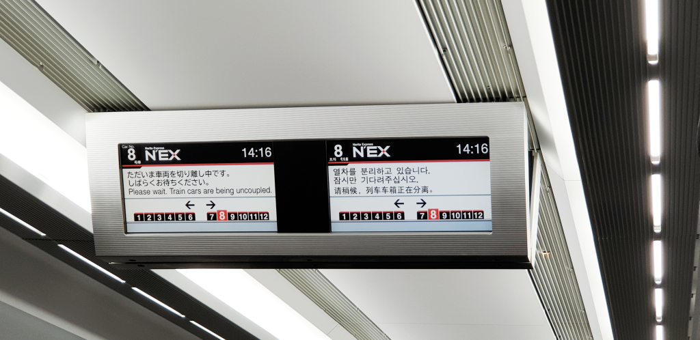
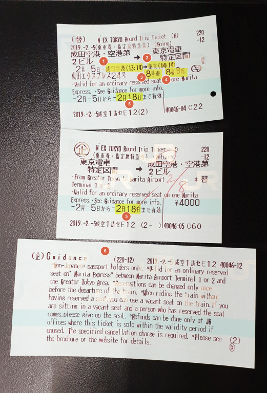
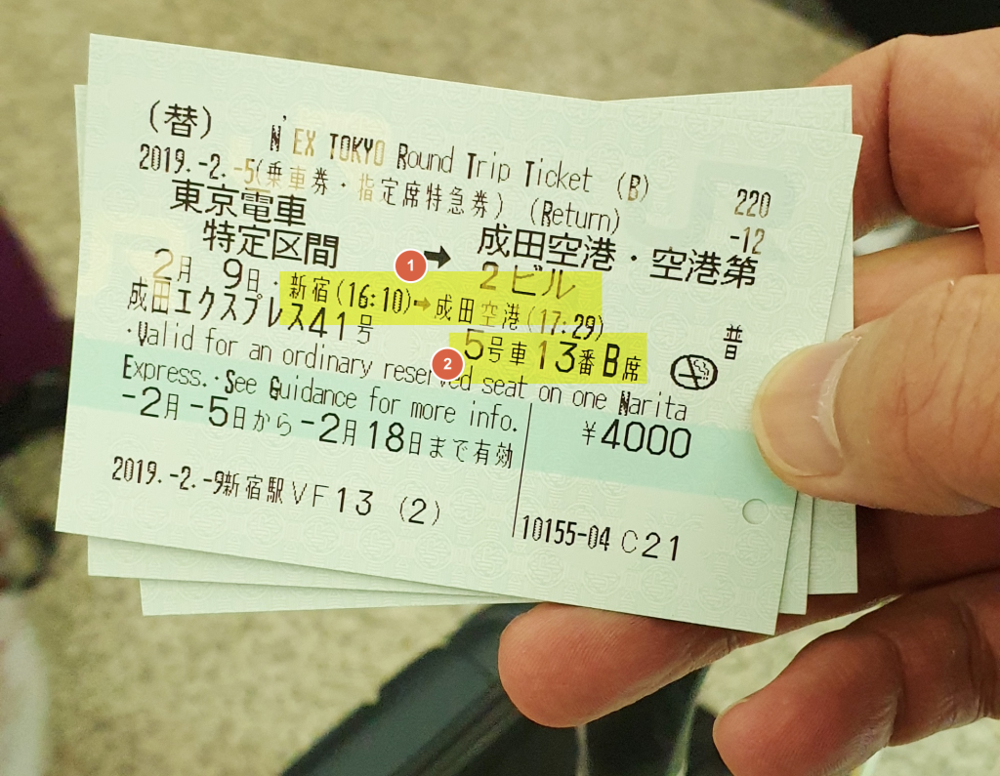
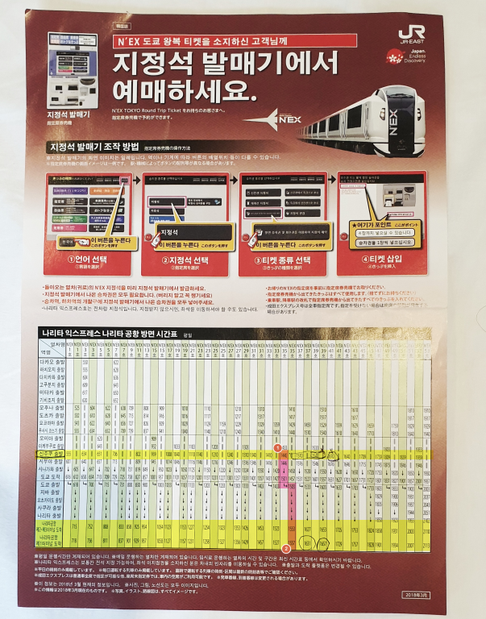
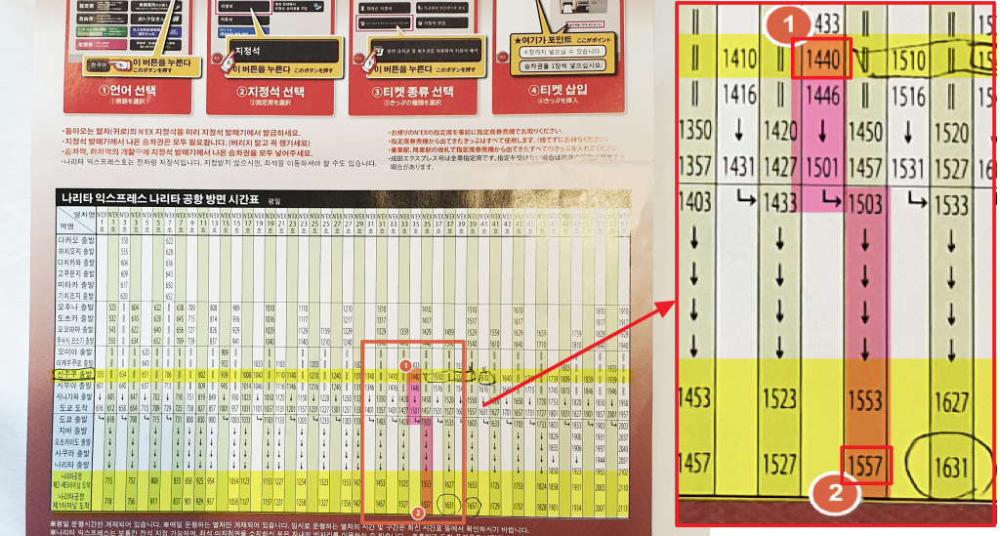

[도쿄여행 1일차]
1. **나리타익스프레스**(N'EX) 이용기
1. [도쿄의 책 문화를 느낄 수 있는 문화공간 다이칸야마 츠타야서점](https://stories.pe.kr/317)
1. [도쿄 시부야 스타벅스에서 바라본 스크램블 교차로의 풍경](https://stories.pe.kr/318)

--- 

2019년 2월 일본여행 여행기 입니다.  
에어서울을 타고 **나리타 공항**에 오후 12시에 도착해서 **나리타익스프레스**(N'EX)를 타고 **신주쿠**로 가는 경험담과 정보를 공유하려고 합니다.  
저도 폭풍서치로 여러 블로그의 정보를 끌어 모아 다녀왔는데요.  
현재 시점에서 필요한 정보와 유의 해야 할 사항을 기록해 보려고 합니다.  

대한항공이나 아시아나 같은 비행기를 타면 대부분 도쿄와 가까운 하네다공항으로 가지만   
 LCC(로우 코스트 캐리어)라고 하는 저가항공을 타면 대부분 **나리타공항**에 내리게 되어 있습니다.   

나리타공항과 도쿄와는 거리가 좀 있기 때문에 공항에서 도쿄로 가려면 보통 1시간에서 2시간 정도 시간이 소요됩니다.  
만약 **우에노** 쪽으로 간다면 **스카이라이너**가 편하고 빠르겠지만   
**도쿄**, **신주쿠**, **시부야** 쪽으로 간다면 **N'EX**(나리타익스프레스)가 정답이라고 할 수 있습니다.  

**스카이라이너**는 종착역이 **우에노**이기 때문에 그 외의 지역으로 가려면 환승을 해야 합니다.  
첫날 캐리어며 가방이며 많은 짐을 가지고 이동을 해야 하는 상황에서 환승은 정말 죽을 맛입니다.  

시간이 10분~20분정도 늦더라도 환승이 적은 **N'EX**(나리타익스프레스)가 좋습니다.  
그렇다고 **N'EX**가 거북이 같은 속도로 이동하는 것은 아니라 **1시간 20분** ~ 30분정도면 나리타공항에서 신주쿠까지 이동을 할 수 있습니다.   

## 비용
경험담 이므로 NEX의 비용만 소개해 드리겠습니다.  
NEX는 내국인 그러닌까 일본 사람은 도착역에 따라 편도 3,020엔 ~ 3,190엔으로 책정이 되어 있으나   
**여권**이 있고 **왕복**으로 구매를 하는 경우 모든 도착역에 대해 동일한 금액인 **4,000엔**에 구매를 할 수 있습니다. (6세~12세 어린이는 반값인 왕복 **2,000엔**)  
단, **14일 이내**에 나리타공항으로 돌아오는 기차를 타야 합니다.(신데렐라도 아니고....)   

## **N'EX(나리타익스프레스)** 타기  
저는 나리타공항 **1터미널**에서 내렸습니다.   
출국장을 나오면 JR티켓을 판매하는 곳이 바로 보입니다. 찾는데 어렵지 않습니다  
그곳에 보면 **N'EX** 어쩌구 저쩌구 써있는 이정표를 볼 수 있는데 그곳에서 구매를 하면 됩니다.  
저희는 티켓 구매 안내원이 있어서 구매요청을 했고 구매 시 구매 매수에 맞는 여권을 보여주고 구매를 했습니다.  
영어를 어느 정도 구사하시는 안내원이라서 일본어를 몰라도 어렵지 않게 구매가 가능합니다.  
보통 **목적지**와 **탑승열차 시간**, **지정석**을 물어 보고 발권을 도와 주십니다.   

나리타공항 **1터미널**에서 NEX 왕복권 발권 후 **NEX탑승장**으로 가는 것은 어렵지 않습니다.  
이정표에 **N'EX**가 써있기 때문에 **N'EX** 표시를 보고 가면 됩니다.  
대략 5분정도면 탑승장에 도착을 합니다.   

   
> ※ 중요사항 !!  
> 표 구매할 때 목적지를 정확히 이야기 해야 합니다.  
> 모든 목적지의 비용은 동일하나 도쿄역에서 열차를 분리해서 2개의 다른 목적지로 이동을 합니다.  
> 도쿄가 목적지인 경우는 문제 없지만 시부야, 신주쿠가 목적지인 경우는 정확히 목적지를 말해야 합니다. (목적지에 따라 탑승열차 칸이 달라집니다.)   

  

발권이 되면 총 3장의 티켓을 주는데..   
1개는 갈 때 사용할 티켓으로 탑승열차 시간, 칸과 자리가 기록되어 있습니다.   
1개는 올 때 사용할 티켓인데 탑승열차 시간과 자리가 기록되어 있지 않습니다. 나중에 올 때 자리를 지정해야 합니다. 절대 버리면 안되고 소중히 간직하셨다가 돌아올 때 사용해야 합니다.    
1개는 그냥 안내서 입니다.   

1. 열차의 출발역과 출발시간  
1. 열차의 도착역과 도착 예정시간  
1. 열차 칸 번호  
1. 자리 번호  
1. 돌아오는 마지노선 날짜 (이 날짜 이전에 돌아가는 N'EX를 타셔야 합니다.)   
    > 저희는 목적지를 도쿄로 잘못 끊었는데 다행히 **8칸**에 있어서 문제없이 신주쿠로 갈 수 있었습니다. **7칸 ~ 12칸**이 신주쿠로 가는 열차였습니다.  
    > 도쿄역에서 열차가 2개로 분리되어 서로 다른 목적지로 이동하므로 정확한 칸에 앉으셔야 합니다. 혹시 저희처럼 목적지를 잘못 발권했는데 다른 목적지의 칸에 있다면 도쿄에 도착하기 전에 목적지로 이동하는 열차 칸으로 이동하시면 문제없이 하차는 가능합니다.
1. 안내서 

   
5일 후 돌아올 때 2번째 표를 이용하여 새로 발권한 표 입니다.   

1. 열차의 출발역과 출발시간, 도착역과 도착 예정시간 
1. 열차칸과 자리번호   

돌아올 때는 열차 칸번호가 크게 중요하지 않습니다. 다만 지정석이라 본인 자리에 잘 찾아 앉으시면 됩니다.  
다만 나리타공항의 터미널이 **2, 3터미널에 먼저 정차**하고 그 다음에 **1터미널**에 정차를 하니 잘 확인하고 내리셔야 합니다.

## N'EX 열차 시간표 보는 방법  

  
NEX표를 구매하면 위와 같은 팜플렛을 줍니다.  
이 표를 보고 돌아올 때 출발역과 시간, 그리고 공항도착예정 시간을 확인 할 수 있습니다.  

  
신주쿠를 출발하여 나리타 1터미널로 이동한다는 가정 하에 열차표를 보는 방법입니다.   

1. 역명이 신주쿠인 가로 시간표를 확인하고 출발시간을 확인합니다.  
   예제에서는 **1440**인데 **오후 2시 40분**(14시40분) 이라는 뜻 입니다.   
   도착역의 시간은 도쿄역에서 다른 목적지에서 온 열차와 합쳐지기 때문에 약간 기다리는 시간이 추가 됩니다.  (시간표가 꺽어지죠?)
1. 나리타 **1 터미널에 도착예정 시간**입니다. **1557**인데 **오후 3시 57분**(15시57분) 이라는 뜻 입니다.   

## 기타사항  
N'EX 이용 설명이 잘 되어 있는 포스팅이 있어서 아래에 공유합니다.  
저도 도쿄갈 때 도움이 많이 되었습니다.  

- https://blog.naver.com/onlyonej/221414023377 
- https://uh.dcmys.kr/856 
- https://livejapan.com/ko/in-tokyo/in-pref-chiba/in-narita/article-a0000938

--- 

[도쿄여행 1일차]
1. **나리타익스프레스**(N'EX) 이용기
1. [도쿄의 책 문화를 느낄 수 있는 문화공간 다이칸야마 츠타야서점](https://stories.pe.kr/317)
1. [도쿄 시부야 스타벅스에서 바라본 스크램블 교차로의 풍경](https://stories.pe.kr/318)
