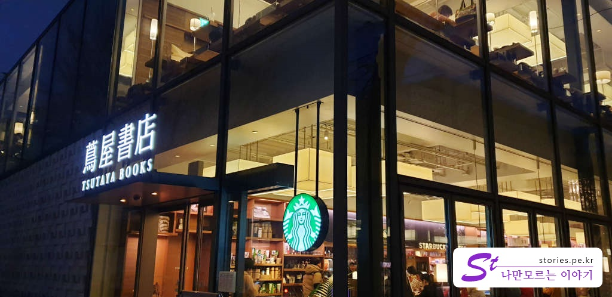

[도쿄여행 1일차]
1. [나리타익스프레스(N'EX) 이용기](https://stories.pe.kr/315)
1. [도쿄의 책 문화를 느낄 수 있는 문화공간 다이칸야마 츠타야서점](https://stories.pe.kr/317)
1. [도쿄 시부야 스타벅스에서 바라본 스크램블 교차로의 풍경](https://stories.pe.kr/318)

---

## 방문시기  
2019년 2월 도쿄를 방문한 첫날 시부야에서 걸어갈 수 있는 **츠타야 서점**을 다녀왔습니다.  
츠타야 서점이 여러 곳에 있기는 하지만 우리는 골목과 가게가 이뻐서 걷기 좋은 **다이칸야마**에 있는 츠타야 서점에 들렀습니다.  

다이칸야마역이 있기는 하지만 시부야에서 다이칸야마역까지는 도쿄메트로에 해당되지 않아 그냥 걸어가 보기로 했습니다.  

  

츠타야 서점은 그냥 책방이라기 보다는 문화를 즐길 수 있는 공간이라고 생각되는 곳입니다.  

2층으로 되어 있는 건물 3채가 서로 붙어있고 인테리어도 편안하게 책을 볼 수 있게 구성이 되어 있습니다.  

보통 서점이면 책을 읽지 못하게 비닐로 싸놓거나 의자가 없거나 하는데 츠타야 서점은 그냥 당연히 서점에 있는 책을 누구나 볼 수 있게 해 놨고 구석구석 곳곳에 앉아서 책을 볼 수있게 의자를 비치해 놨습니다.  

  
서점이 작게 보이지만 실제로는 3채의 건물이 붙어있어서 상당히 넓은 느낌입니다. 또한 책 뿐만이아니라 CD 판매점, 그리고 청음을 할 수 있는 공간도 있습니다.  

  
1층과 2층에 스타벅스가 있어서 커피를 마시며 책을 읽거나 공부를 할 수 있게 되어 있습니다.  
일본의 스타벅스는 우리나라 스타벅스보다 가격이 더 저렴해서 크게 부담없이 커피를 마시며 쉴 수 있습니다.   
1층에서 커피를 사서 1층이나 2층에서 마실 수 있습니다. 날씨만 좋다면 야외에서도 마실 수 있게 자리가 있습니다.   

  
시간에 약간 해가져가는 시간이라 오히려 사진이 더 이쁘게 나온것 같네요..

그냥 서점이라고 하기 보다는 문화공간이라고 하는것이 더 맞을 것 같습니다.  
시부야에 간다면 한번쯤 들려볼 만한 스팟입니다.  

## 입장시간  
- 시작시간 : 07:00(오전 7시)
- 마감시간 : 26:00(새벽 2시겠지요?)

## 여행지 정보  
- 주소 : 〒150-0033　渋谷区猿楽町17-5 (다이칸야마 츠타야서점)   
- 연락처 : 03-3770-2525  
- URL : http://real.tsite.jp/daikanyama  
[지도] https://goo.gl/maps/uhsWWFvQ8YM2

---

[도쿄여행 1일차]
1. [나리타익스프레스(N'EX) 이용기](https://stories.pe.kr/315)
1. [도쿄의 책 문화를 느낄 수 있는 문화공간 다이칸야마 츠타야서점](https://stories.pe.kr/317)
1. [도쿄 시부야 스타벅스에서 바라본 스크램블 교차로의 풍경](https://stories.pe.kr/318)
