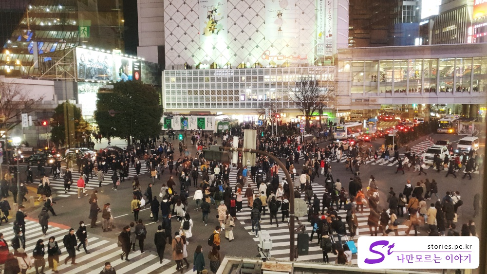
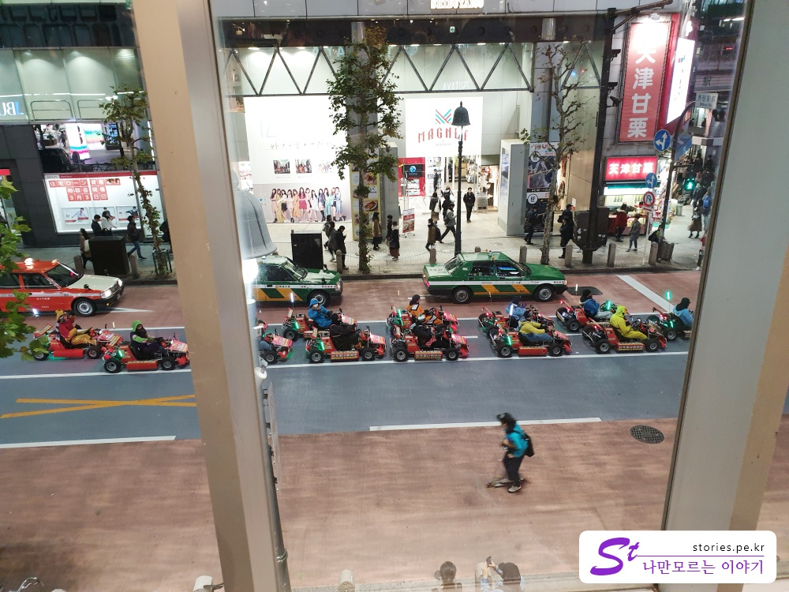

[도쿄여행 1일차]
1. [나리타익스프레스(N'EX) 이용기](https://stories.pe.kr/315)
1. [도쿄의 책 문화를 느낄 수 있는 문화공간 다이칸야마 츠타야서점](https://stories.pe.kr/317)
1. [도쿄 시부야 스타벅스에서 바라본 스크램블 교차로의 풍경](https://stories.pe.kr/318)

--- 

## 방문시기  
2019년 2월, 도쿄여행 첫날 다이칸야마에 있는 츠타야 서점을 들른 후 시부야쪽으로 걸어왔습니다.   
이전 포스팅은 아래의 링크를 참조하시면 됩니다.  
[츠타야서점 다이칸야마점 방문기](https://stories.pe.kr/317)  

뉴스에 일본이 나오면 종종 나오는 스크램블교차를 편안히 감상하기 위해 최적의 장소라고 하는 스타벅스에 들어와 봤습니다.  
역시나 많은 사람들이 자리에 앉아서 스크램블 교차로 쪽으로 얼굴을 돌리고 있는 모습을 볼 수 있습니다.  
누군가는 사진으로 찍고, 누군가는 동영상으로 찍는 모습을 심심치 않게 볼 수 있습니다.  

공교롭게도 이 스타벅스도 시부야 중심가에 있는 츠타야서점 건물의 1층과 2층에 있습니다.  
말하자면 하루에 츠타야서점을 2군데 다녀온 것이 되어 버렸습니다.  

역시나 인기장소라 그런지 빈자리가 많지 않았습니다.  

일본도 마찬가지로 자리에 짐을 하나 놓고 맡아 놓는 문화가 있습니다.  
다이칸야마의 스타벅스때도 그렇고 여기 시부야의 스타벅스 때도 그렇고 가방만 하나 덩그러니 놓여있거나 외투가 하나 덩그러니 놓여 있는 경우가 많았습니다.  

저도 창가가 아닌 쪽에 앉아 있다가 한참이 지나서야 창가 쪽에 자리가 비는 것을 포착하고 외투를 이용해 찜해 놓기 신공을 발휘해서 잽싸게 자리를 옮겼습니다.
그리고 저도 멋진 사진과 동영상을 찍어 보았습니다.  

<iframe width="560" height="315" src="https://www.youtube.com/embed/6EKeyCc2tR0" frameborder="0" allow="accelerometer; autoplay; encrypted-media; gyroscope; picture-in-picture" allowfullscreen></iframe>

앉아 있다보니 요즘 방송에서 몇번 봤던 카트라이더가 지나가는 모습도 볼 수 있었습니다.  
   
다양한 캐릭터 옷을 입고 운전을 하고 있네요.
우리나라같으면 도로교통법상 불법일것 같은데 일본은 문제가 없나 봅니다.  

## 여행지 정보  
- 주소 :  일본 〒150-0042 Tōkyō-to, Shibuya-ku, Udagawachō, 21−６ 
- 연락처 : +81 3-3770-2301  
- URL : https://www.starbucks.co.jp/store/search/detail.php?id=2003    
[지도] https://goo.gl/maps/zsSTdrdp11H2

---

[도쿄여행 1일차]
1. [나리타익스프레스(N'EX) 이용기](https://stories.pe.kr/315)
1. [도쿄의 책 문화를 느낄 수 있는 문화공간 다이칸야마 츠타야서점](https://stories.pe.kr/317)
1. [도쿄 시부야 스타벅스에서 바라본 스크램블 교차로의 풍경](https://stories.pe.kr/318)
