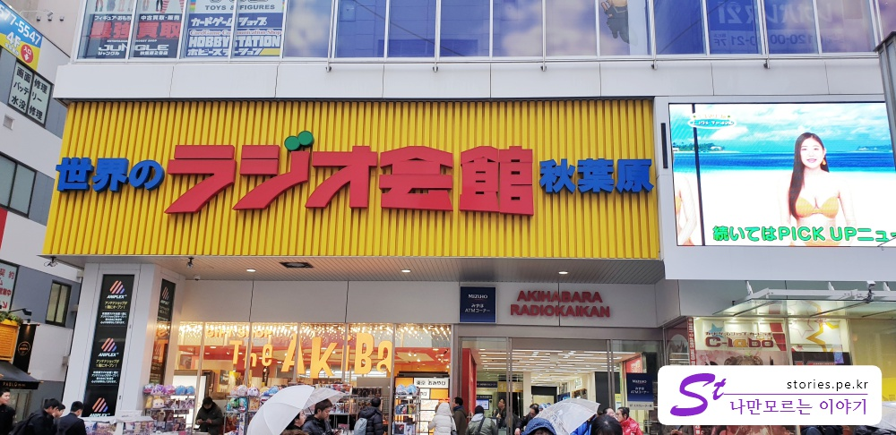
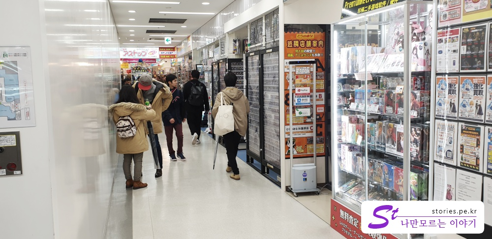
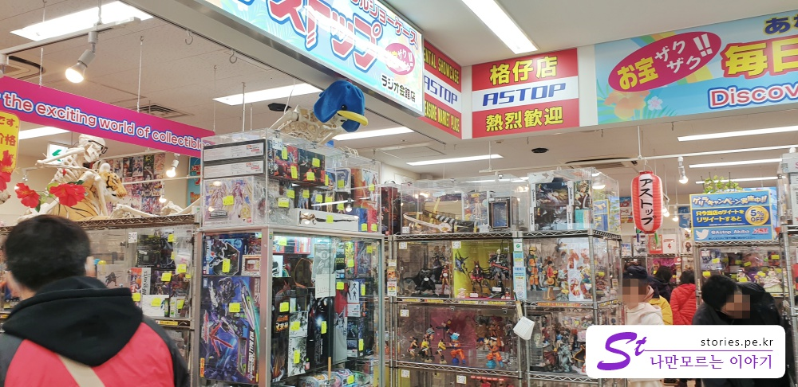
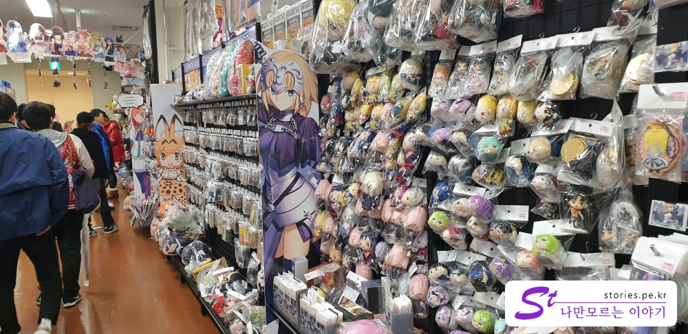

저는 아키하바라에 큰 관심이 없어서 하루종일 사진도 많이 못 찍고 힘들게 끌려다녀야만 했습니다.   
아이들이 너무 가보고 싶은 곳이라고 해서 일본 여행 중 하루를 온종일 할애해서 다녀봤습니다.  
마치 남편이 아내에게 일끌려 백화점 이곳 저곳을 다니는 기분이였습니다. 힘들었지요.  
아키하바라의 그 어떤 건물에서도 건물을 돌아다니는 내내 안아서 쉴만한 곳이 없었습니다.  
의자도 없구요, 벤치도 없어요, 계단에 앉아 있지도 못하게 합니다. 지옥같았지요. 

그렇게 애니메이트도 가보고 북오프도 다녀보고, 이름모를 건물들도 다니면서 한가지 중요한 것을 알게 되었습니다.  
비전문가의 눈으로 본 것이라는 한계가 있지만~~~~

아키하바라의 애니메이션, 캐리거, 프라모델에 관련된 건물들이 수십 개 있는데, 그중에서 아키하바라의 아카하바라 같은 건물이 하나 있다는 것을 발견하게 되었습니다.   
모든게 있어요. 아키하바라에 왔다면 그냥 그 건물 하나 들어가서 보고 나오면 다 본것 같아요. 다 있더라구요..

그곳이 아시는 것처럼 아키하바라역 바로 앞에 있는 **라디오회관** 입니다. 
라디오회관은 **JR야마노테선 아키하바라 역** 바로 앞에 있어서 찾기도 쉽습니다  

라디오회관은 **지하 1층부터 지상 10층까지** 있고 각 층마다 다른 테마를 가지고 있는 건물입니다.  

   
일본어를 모른다면 입구를 찾기가 쉽지 않습니다. 건물은 대단히 큰데, 영문으로 **RADIO KANKEN** 은 상당히 작게 써있습니다. 

  
내부는 그렇게 화려하진 안지만 예전의 용산전자상가 같은 느낌의 건물내부 입니다.  

  
각 층마다 다른 테마를 가지고 있는데, 여기는 프라모델이 있는 층이였던것 같습니다.  
9층인가 10층에는 밀리터리 용품을 파는 곳도 있더군요.

   
캐릭터의 인형들이나 뺏지, 사진 같은것들을 판매하는 곳입니다.  

어떤 층은 카드만 파는 층도 있습니다. 우리나라의 포켓몬카드(포켓몬카드로 우리나라것은 아니겠군요 ㅎ) 같은 정말 다양하고 고급진 카드들이 즐비합니다.  
그런 카드들이 여케, 남케 등 다양한 캐릭터의 이미지를 담고 있어서 수집하는 재미가 쏠쏠할 것 같습니다.  
우리나라의 한정된 카드와는 정말 상상도 할 수 없을 정도로 다양합니다.  
저도 수집을 시작할 뻔 했어요.  
품질은 무슨 어느 나라 지폐 마냥 홀로그램도 들어있고 그림의 디테일이며 색감도 너무 뛰어났구요. 
가격도 만만치 않구요. 저는 그래서 포기했어요.  내가 혼자사는 오타쿠였다면 수집했을것 같아요.

2층인가 3층에는 18세이상만 볼 수 있는 야한 상품들도 있는데 미성년자도 별다른 제재없이 볼 수 있게 되어 있어서 조금 걱정은 되었습니다.  좀 막든가....

아이들은 좋다고 구경을 다니는데 어른들은 힘들어서 커피숍에서 시간을 많이 보냈네요. 

참고로 저희는 포켓 와이파이를 2개 구입해서 갔습니다. 
일행이 떨어지면 꼭 2개 그룹으로 떨어지고 와이파이를 하나씩 나눠가졌습니다.  
그래도 가끔씩 인터넷이 연결이 안될때는 정말 조마조마 합니다. 국내가 아니다 보닌까.
그래서 단체로 가시면 얼마 비싸지도 않으니 포켓와이파이를 2개이상 대여하시는 것을 추천합니다. 

## 입장시간  
- 시작시간 : 10 : 00
- 마감시간 : 20 : 00

## 여행지 정보  
- 주소 : 〒101-0021 Tōkyō-to, Chiyoda-ku, Sotokanda, 1 Chome−15−16  
- URL : http://www.akihabara-radiokaikan.co.jp
- 지도 : https://goo.gl/maps/FATJzSDseC52 

## 인근맛집  

- [규슈 장가라 라멘 - 포스팅 참고](https://stories.pe.kr/320)

## 기타사항  

미처 사진을 많이 찍지 못한것이 아쉽네요. 힘들어서 정신이 없었어요.
