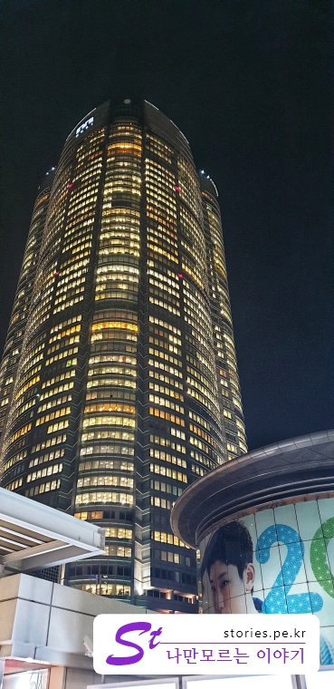

[도쿄여행 3일차]  
1. [우에노공원에 가기 전 꼭 들러봐야 할 재래시장, 아메요코시장](https://stories.pe.kr/322)  
1. [일본 도쿄의 대표 공원 우에노공원 방문기](https://stories.pe.kr/323)  
1. [아사쿠사 센소지 방문기](https://stories.pe.kr/325)  
1. [아내가 좋아하는 갓파바시 도구거리](https://stories.pe.kr/326)  
1. [도쿄의 야경을 보기 위한 최적의 장소 롯폰기 힐즈 전망대](https://stories.pe.kr/327)  

---

오늘의 마지막 일정은 **롯폰기힐즈 전망대**에서 야경을 보는 것입니다.  
**갓파바시 도구거리**에서 약 40분정도 도쿄메트로를 타고 이동을 해서 히비야선의 **롯폰기**역에서 하차를 합니다.  
조금 걸어서 밖으로 나오면 커다란 **MORI**라고 써져있는 **롯폰기힐즈** 건물을 만날 수 있습니다.   

  
롯폰기힐즈를 보고 발길을 옮기면 길을 잃어버릴 일은 없습니다.  
이 큰 롯폰기힐즈에서 우리의 목적지는 **TOKYO CITY VIEW**입니다. **TOKYO CITY VIEW**라고 써져있는 이정표를 보고 이동을 해야 합니다.  
**TOKYO CITY VIEW**는 지하철에서 내린 지상에서 한층 위쪽에 있으니 계단으로 오르던지, 에스컬레이터를 타고 오르던지, 한층을 올라간다고 보시면 됩니다.  

  
만약 눈앞에 이런 거미모양의 조형물을 만난다면 거의 다 찾아왔다고 보면 됩니다.  
이 거미 모양의 조형물에서 주위를 살펴보면, **TOKYO CITY VIEW**라고 써있는 이정표를 볼 수 있을 것입니다.  

  
이 이정표를 보고 이동을 합니다.  대략 20~30미터 정도 가면 아래와 같이 **TOKYO CITY VIEW**로 올라가는 입구를 만날 수 있습니다.  

  
**TOKYO CITY VIEW**의 매표소는 한층을 더 올라가야 합니다. 입구를 통해 엘레베이터를 타든 계단을 걸어서 올라가든 한층을 더 올라가면 옆 건물로 이동할 수 있는 통로가 있습니다.  

  
국내에서 미리 구매를 했다면 꼭 프린터로 출력을 해서 가져가야 합니다.  

   
출력한 구매내역을 매표소에 제출을 하면 입장권으로 바꿔 줍니다.  

이제 매표소 바로 옆쪽에 52층으로 빠르게 이동할 수 있는 엘레베이터를 타고 올라가면 됩니다.   

  
입장을 하면 바로 도쿄타원가 보이는 방향의 뷰가 보입니다.  
대부분 여기에 오랫동안 머물며 도쿄타워를 배경으로 사진을 찍기 시작합니다.  

  
도쿄타워도 조명이 들어와 있어서 매우 아름답게 보입니다.  
**내가 도쿄에 왔다!!!** 라고 인증샷을 남기기에 매우 좋은 장소임에는 분명합니다.   

  
역시 사진찍기 가장 좋은 장소에는 찍사 대행이 있네요.  
네온 하트하나 놓고 사진을 찍어 줍니다.  
찍는 것 까지는 무료인것 같고 맘에 들어 인화를 하면 돈을 받는 것 같습니다.  
제가 일본어가 짧아서 다 해석은 못했는데 무료 어쩌구 저쩌구 했습니다. 

   
대부분 입장하는 곳 앞에 도쿄타워가 보이는 창문에 붙어서 사진찍을라고 난리 난리를 치는데,  
옆으로 조금만 더 이동을 하면 한적하고 쉴수도 있으며 사진도 여유롭게 찍을 수 있는 장소들이 계속 있습니다.  

   
    
옆으로 다시 이동을 하면 편하게 쇼파에 앉아서 야경을 구경할 수 있는 장소도 있습니다.  
또는 난간게 걸터 앉아서 볼 수도 있구요  

  
조금 더 옆으로 이동을 하면 확~ 트인공간에 개인용 바 의자가 있는 곳이 있습니다. 이곳에서도 멋진 야경을 볼 수 있습니다.  

  
이제 야경을 볼 수 있는 장소를 모두 지나면 마지막쯤에 구매를 유도하는 기념품점이 있습니다.  

   

그중에서 NANO NANO 라는 브랜드의 캐릭터 들이 있는데, 나사같은 것으로 만든 묵직한 기념품입니다. 여유가 있으면 하나 사고 싶었어요.

이렇게 52층의 건물을 한바퀴 돌면서 야경을 볼 수 가 있습니다.  

## 비용  
티켓 가격은  현지 구매 시 성인 기준 **1,800엔** 입니다.  
하지만 국내에서 미리 구매를 해서 가면 대략 반값정도에 구매를 할 수 가 있습니다. 
우리는 **kkday**에서 **성인 11,000원**, **아동(13~18세) 6,080원**에 구매를 했습니다.   
구매 시 예약날짜를 선택해야 하는데 선택한 날짜의 전후로 3일내로 사용을 할 수 있습니다.  

## 입장시간 

##### 모리미술관   
- **월·수∼일요일** : 10:00∼22:00(입장 마감 21:30)
-  **화요일**       : 10:00∼17:00(입장 마감 16:30)

##### TOKYO CITY VIEW
- **월∼목요일·일** :  10:00∼23:00(입장 마감 22:30)
- **금·토·휴일 전날** : 10:00∼25:00(입장 마감 24:00)

## 여행지 정보  
- 주소 : 6 Chome-11-1 Roppongi, Minato-ku, Tōkyō-to 106-6108 일본   
- 연락처 : +81 3-6406-6000   
- URL : https://art-view.roppongihills.com/ko/index.html  
- 지도 : https://goo.gl/maps/2s4Vx3shj6P2    

---

[도쿄여행 3일차]  
1. [우에노공원에 가기 전 꼭 들러봐야 할 재래시장, 아메요코시장](https://stories.pe.kr/322)  
1. [일본 도쿄의 대표 공원 우에노공원 방문기](https://stories.pe.kr/323)  
1. [아사쿠사 센소지 방문기](https://stories.pe.kr/325)  
1. [아내가 좋아하는 갓파바시 도구거리](https://stories.pe.kr/326)  
1. [도쿄의 야경을 보기 위한 최적의 장소 롯폰기 힐즈 전망대](https://stories.pe.kr/327)  
