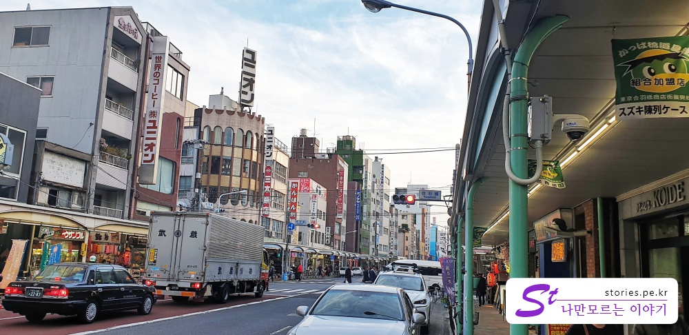
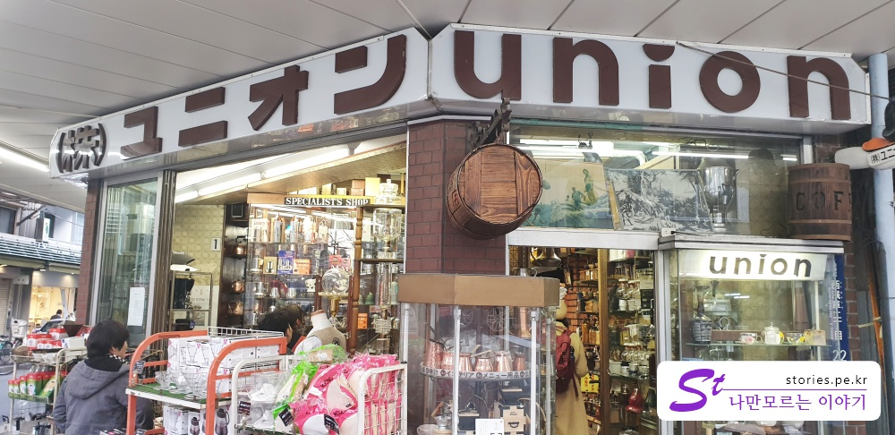

[도쿄여행 3일차]  
1. [우에노공원에 가기 전 꼭 들러봐야 할 재래시장, 아메요코시장](https://stories.pe.kr/322)  
1. [일본 도쿄의 대표 공원 우에노공원 방문기](https://stories.pe.kr/323)  
1. [아사쿠사 센소지 방문기](https://stories.pe.kr/325)  
1. [아내가 좋아하는 갓파바시 도구거리](https://stories.pe.kr/326)  
1. [도쿄의 야경을 보기 위한 최적의 장소 롯폰기 힐즈 전망대](https://stories.pe.kr/327)  

---

센소지에서 **갓파바시 도구거리**까지는 대략 10분정도 걸어가야 합니다.  
대중교통을 이용하기도 애매해서 우리는 그냥 걸어서 갔습니다.  
찾아가는 것은 그리 어렵지 않습니다. 

센소지의 서쪽문에 있는 멜론빵을 먹고 계속 그길로 가면 되닌까요.  
구글지도를 손에들고 앞으로 계속 나가다가 보면 **갓파바시 도구거리**가 나타납니다.  
처음에 구글지도에는 분명히 도구거리라고 나와 있는데, 아무리 봐도 그릇 가게도 안보이고, 여기가 맞나 싶었습니다.  
하지만 곧 알게 되었는데, 그렇게 도착한 곳은 도구거리의 마지막 끝지점이였습니다.  
그곳에서 부터 길을 따라 좌측으로 내려오면서 쭉~ 길옆에 가게들이 즐비해 있습니니다.  

   
여자라고 다 좋아한다는 것은 편견일 수 있지만 그래도 살림에 관심이 있는 아내들은 아마 너무 좋아할 수 있는 곳이 아닐까 합니다.  
다양한 그릇과 각종 주방도구들이 눈을 휘어잡습니다.  

  
그렇게 다양한 수많은 가게들이있는데 그중에 나무그릇가게도 있습니다.  

   
가격은 정찰제로 대부분 상품에 가격표가 붙어있습니다. 그리고 구매하기 전에 꼭 부가세가 포함된 건지 확인도 하셔야 합니다.  
일본은 우리나라와 달리 부가세가 포함되지 않은 가격을 붙혀놓은 곳이 상당히 많았습니다.  

   
칼만 파는 가게 입니다. 다른건 없고 칼만 있어요. 이러닌까 전문점 같아 보여서 하나 구매를 할까 했는데,
비행기에 탈 수 있을까? 없을까? 고민하다가 혹시나 해서 구매하지 않았어요.  ㅠㅠ

  
도구거리에서 본 귀여운 버스입니다. 우리나라의 타요버스 정도는 우스울 정도입니다. 우리나라 타요버스는 스티커로 눈, 코, 입을 붙히는 수준인데 여기는 아예 형태를 변형 시켰네요. 근대 귀엽기는 한 것 같은데, 좀 무섭기도 하고......

  
주방에서 사용할 만한 만물잡화점입니다. 없는게 없습니다. 웬만하면 다 있는 것 같아요.  
해외로 배송도 해준다고 한글로 써져있네요.  

  
여기도 가격을 다 붙혀놔서 막 싸게 샀다고 할 수는 없을지언정 심하게 바가지를 쓸일은 없을 것 같습니다.  

  
  
커피도구를 파는 가게 입니다. 드립커피, 주전자 등 커피에 관한 모든 도구를 팔고 있습니다.  

  
빠질 수 없는 사기/도자기 그룻 가게입니다.  
우리도 여기에서 조그만 반찬그릇을 하나 샀네요. 이쁘고 아기자기 합니다.  

  
젓가락만 파는 가게 입니다. 젓가락이 무슨 칼도 아니고, 이렇게 팔아서 남겠나 싶은데..
꽤 고급스러운 인테리어 가게에서 판매를 하고 있습니다.  

  
식당의 다양한 음식모형을 만들어주는 가게입니다. 리얼한 효과를 보여주고 있군요. ㅎㅎ

  
**갓파바시 도구거리**를 내려와 **다와라마치**역 쪽으로 이동하면서 본 거의 마지막 도자기 가게입니다.  
아기자기하고 이쁜 도자기들이 많이 있었습니다.  

이렇게 갓파바시 도구거리를 구경하니 해가 어느정도 내려가서 저녁이 되었습니다.  
도쿄의 야경을 보고자 **다와라마치**역에서 **긴자선**을 타고 긴자에서 **히비야선**으로 환승 후 미리 구매해 놨던 **롯폰기힐스 전망대**로 쪽으로 이동했습니다. 
  

## 입장시간  
- 시작시간 :  ?? 
- 마감시간 : **오후 5시에 종료를 알리는 종소리가 울리고 거리의 가게들이 하나 둘씩 문을 닫기 시작합니다.** 대략 5시30분에서 6시 사이에는 모두 종료합니다.   

## 여행지 정보  
- 주소 : 3 Chome-18-2 Matsugaya, Taitō-ku, Tōkyō-to 111-0036 일본    
- 지도 : https://goo.gl/maps/gSMXzEsWFDr    

---

[도쿄여행 3일차]  
1. [우에노공원에 가기 전 꼭 들러봐야 할 재래시장, 아메요코시장](https://stories.pe.kr/322)  
1. [일본 도쿄의 대표 공원 우에노공원 방문기](https://stories.pe.kr/323)  
1. [아사쿠사 센소지 방문기](https://stories.pe.kr/325)  
1. [아내가 좋아하는 갓파바시 도구거리](https://stories.pe.kr/326)  
1. [도쿄의 야경을 보기 위한 최적의 장소 롯폰기 힐즈 전망대](https://stories.pe.kr/327)  
