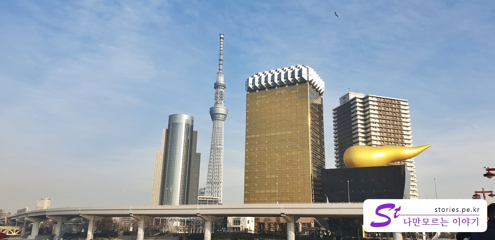
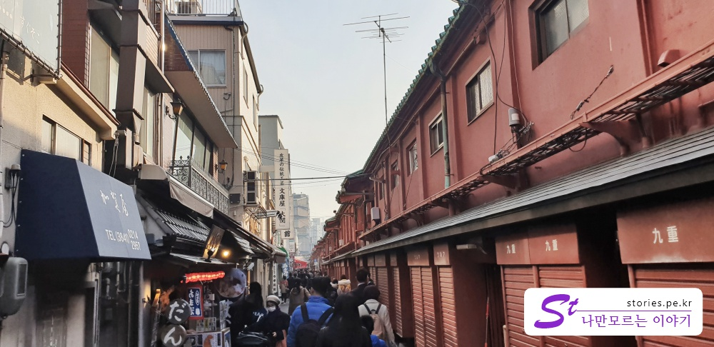
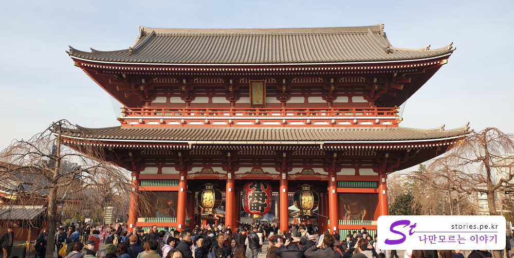
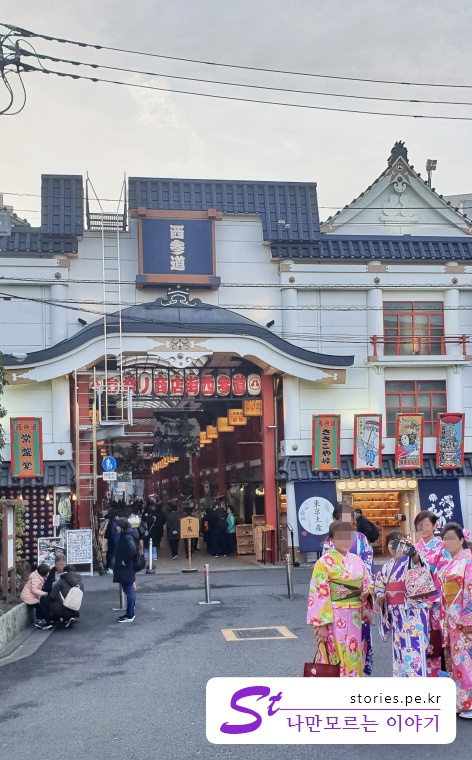

[도쿄여행 3일차]  
1. [우에노공원에 가기 전 꼭 들러봐야 할 재래시장, 아메요코시장](https://stories.pe.kr/322)  
1. [일본 도쿄의 대표 공원 우에노공원 방문기](https://stories.pe.kr/323)  
1. [아사쿠사 센소지 방문기](https://stories.pe.kr/325)  
1. [아내가 좋아하는 갓파바시 도구거리](https://stories.pe.kr/326)  
1. [도쿄의 야경을 보기 위한 최적의 장소 롯폰기 힐즈 전망대](https://stories.pe.kr/327)  

---

 우에노공원 앞에 있는 **우에노히로코지**역에서 도쿄메트로 긴자선을 타고 가까이 있는 **아사쿠사**역으로 이동했습니다.  
**아사쿠사**는 **센소지**라는 **사원**이 있는 지역 명입니다.  
아사쿠사역을 나와 지상으로 올라오면 동쪽 방향에 **수미다강**쪽으로 사거리가 있는데   
굉장히 눈에 띄는, 거품 모양이라고는 하는데 마치 황금 똥 같은 모양의 **아사히 건물**이 보이고 그 옆으로 커다란 **스카이트리**가 보이는 광경을 볼 수 있습니다.  

  
만약 **스카이트리**를 방문 예정이라면 **센소지**를 먼저 구경한 이후에 가면 될것 같고  
우리처럼 사진만 찍고 말 것이면 센소지를 가기 전에 사거리 건너 **수미다강** 건너기 전에 있는 다리 앞에서 사진을 찍고 다시 돌아와서 센소지 쪽으로 이동하면 적당한 동선이 됩니다. 

## 아사쿠사 센소지   
다시 센소지 방향으로 이동하다 보면 바로 **센소지 문**이 보입니다.  
사람들이 바글바글합니다.  
센소지 문에 메달려있는 거대한 풍선(?)같은게 있는데(이름을 모르겠어요 ^^;)   
요기가 포토 스팟이라 그런지 많은 사람들이 사진을 찍습니다. 

  
사진의 왼쪽에는 천둥을 상징하는 **라이진(뇌신)** 상이 있고 오른쪽에는 바람을 상징하는 **후진(풍신)** 상이 있습니다.  

이 **센소지 문**을 통과하여 **센소지호조 문**까지 이동하는 길에 상점들이 즐비해 있어서 여러가지 먹거리와 관광 상품을 팔고 있습니다.  

   
사실 사찰인 센소지에서 참배를 하는 것이 목적인 사람들이 몇이나 있겠습니까?  
관광 차 요기 상점구경도 하고 먹거리도 먹고 특이한 형태의 사찰 앞에서 사진을 찍는 것이 목적일 것입니다.  

  
경단을 꼬치에 꽂아서 달콤한 설탕인지 꿀인지를 뭍혀서 파는 **경단꼬치**입니다.  
**120엔**이니 한번 먹어 볼 만해서 먹어봤는데 그냥 예상했던 맛입니다. 그냥 저냥 먹을 만 해요.

   
우리나라 관광지에도 이런 관광상품을 파는 가게들이 많이 있는데,  
**이걸 누가살까?** 했는데요.  
외국인들이 사더라구요. 여기서는 우리가 외국인이닌까 우리가 사겠지요.  
사고싶게 이쁘고 다양한 물건들이 많이 있더라구요. 하나터면 하나 살뻔했어요.  

  
센소지로 가는 메인스트리트가 있기도 하지만 바로 옆 골목에는 또다른 작은 뒷골목이 있습니다.  
가게가 있긴한데 별건 없습니다.  

  
옛 전통의 형태를 가지고 있는 길만 있지는 않습니다.  
센소지로 가는 길을 십자형태로 가로지르는 큰 길이 하나 있는데, 
여기에는 **맥도날드**도 있고 옷가게도 있고해서 현대적인 형태의 재래시장도 같이 존재합니다.  

   
그렇게 구경하며 100~200미터쯤 가면 또하나의 문이 보입니다.  
**센소지 호조몬**이라고 하는데 **몬**은 우리나라말로 **문**입니다.    

호조몬을 기점으로 센소지를 한바퀴 둘러보는데는 그리 오래 걸리지 않습니다.  

센소지 호조몬을 좌측으로 돌아가면 운세를 첨칠 수 있는 **오미쿠지** 라는 곳이 있습니다   

  
오미쿠지라는 제비뽑는 곳입니다. 이거 뽑으려면 **100엔**을 내야 합니다.  

  
방법은 간단합니다. 앞에있는 오미쿠지 막대기가 들어있는 통을 흔들어서 무작위로 하나를 뽑으면 그 막대기에 번호가 적혀있습니다.  
그 번호에 맞는 서랍을 열어서 종이를 꺼내 읽으면 됩니다.   
오미쿠지의 종류는 **대길**, **길**, **반길**, **소길**, **말소길**, **말길**, **흉** 등 7종류가 있다고 하네요.  

  
그렇게 오미쿠지가 있는 건물을 끼고 센소지 서쪽문으로 이동을 하면  
센소지 먹거리 명물 중 하나인 **아이스크림 메론빵집** **화월당**을 만날 수 있습니다.  

   
가게앞에 많은 일본 유명인사들의 사진이 있고, 줄을 서있는 사람 중에도 일본사람들이 꽤 있는것을 보니, 
화월당의 메론빵은 국내보다는 일본사람들에게 인기가 더 많은 것 같습니다.  

  
난 모르겠지만 일본의 유명인사들인가 봅니다.  

  
주문을 하고 결제를 하면 위와 같은 번호표를 주고 번호표에 맞게 메론빵을 만들어 주십니다.  
아이스크림 이닌까요. 녹을까봐 그때 그떄 만들어요.

  
요게 녹차라고 말하는 말차 아이스크림이 들어간 메론빵입니다.  
저는 그냥 그랬어요. 저랑 일본음식이랑은 잘 맞지 않은가 봅니다.  
다들 맛있다는데.. 난 별로입니다.  

화월당을 지나 아내가 좋아할 만한 **갓파바시 도구거리**로 걸어서 이동을 했습니다.  

 **갓파바시 도구거리**까지는 대략 10분정도 걸어가야 합니다. 조금은 부담스러울 수 있는 거리더라구요.  
 그렇다고 대중교통을 이용하기도 애매하고, 택시는 너무 비싸고, 그래서 우리는 그냥 걸어서 갔습니다.  

## 여행지 정보  
- 주소 : 2 Chome-3-1 Asakusa, Taitō, Tokyo 111-0032 일본   
- 연락처 : +81 3-3842-0181  
- URL : http://www.senso-ji.jp  
- 지도 : https://goo.gl/maps/f3Y61mxN5DS2 

---  

[도쿄여행 3일차]  
1. [우에노공원에 가기 전 꼭 들러봐야 할 재래시장, 아메요코시장](https://stories.pe.kr/322)  
1. [일본 도쿄의 대표 공원 우에노공원 방문기](https://stories.pe.kr/323)  
1. [아사쿠사 센소지 방문기](https://stories.pe.kr/325)  
1. [아내가 좋아하는 갓파바시 도구거리](https://stories.pe.kr/326)  
1. [도쿄의 야경을 보기 위한 최적의 장소 롯폰기 힐즈 전망대](https://stories.pe.kr/327)  
