[도쿄여행 3일차]  
1. [우에노공원에 가기 전 꼭 들러봐야 할 재래시장, 아메요코시장](https://stories.pe.kr/322)  
1. [일본 도쿄의 대표 공원 우에노공원 방문기](https://stories.pe.kr/323)  
1. [아사쿠사 센소지 방문기](https://stories.pe.kr/325)  
1. [아내가 좋아하는 갓파바시 도구거리](https://stories.pe.kr/326)  
1. [도쿄의 야경을 보기 위한 최적의 장소 롯폰기 힐즈 전망대](https://stories.pe.kr/327)  

--- 

**아메요코시장**을 지나 **우에노 공원**으로 이동을 했습니다.     

> [우에노공원에 가기 전 꼭 들러봐야 할 아메요코시장](https://stories.pe.kr/322)   

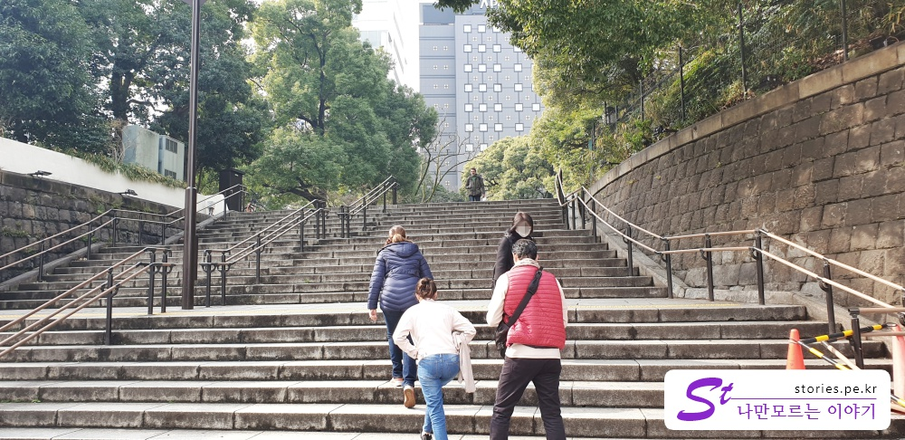    

**아메요코시장**의 입구 쪽에 보면 **우에노공원**으로 이동하는 계단이 보입니다.  
그 계단을 올라서면 큰 공터를 만날 수 있습니다.   

그 공원에는 그냥 앉아서 쉬는 사람도 꽤 있고 그림을 그리며 퍼포먼스를 하는 사람도 있습니다.  

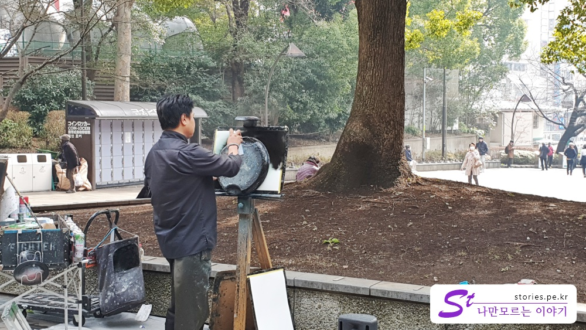   
**밥 아저씨**가 "**참 쉽죠?**" 하는 것처럼 멋진 그림을 아주 간단하게 그리는 퍼포먼스를 합니다. 

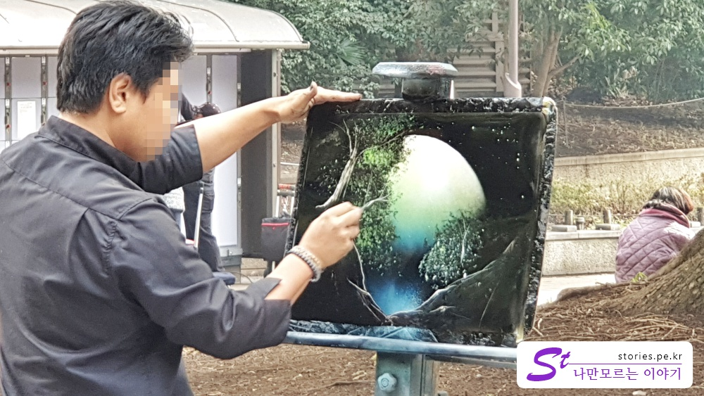  
꽤 그럴듯한 완성도의 그림이 아주 쉽게 나왔습니다.   
세상에는 대단한 사람들이 너무 많은 것 같습니다.  
 
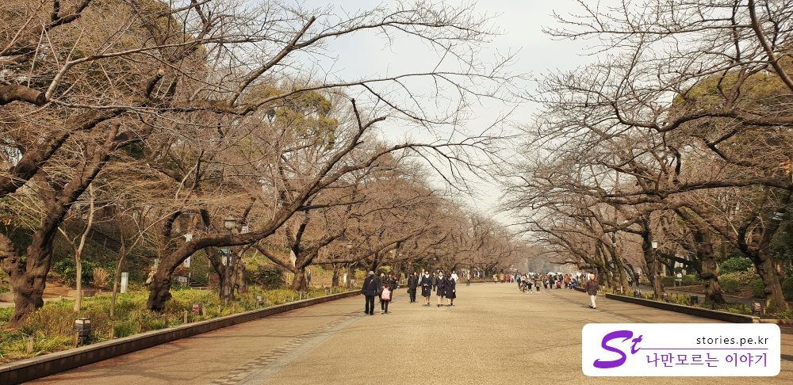   
그 광장에서 한번 더 계단을 오르면 우에노공원으로 갈 수 있는 아주 넓은 길이 나타납니다.  
지금은 2월달이라 넓은 길만이 볼거리의 전부지만 벗꽃이 필 무렵에는 굉장한 장관이 펼쳐질 것 같습니다.   

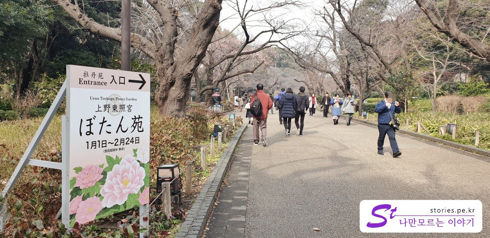   
1월1일부터 2월 24일까지 **우에노도쇼구**(우에노 동조궁)옆의 **모란정원**을 개방하는가 봅니다.  

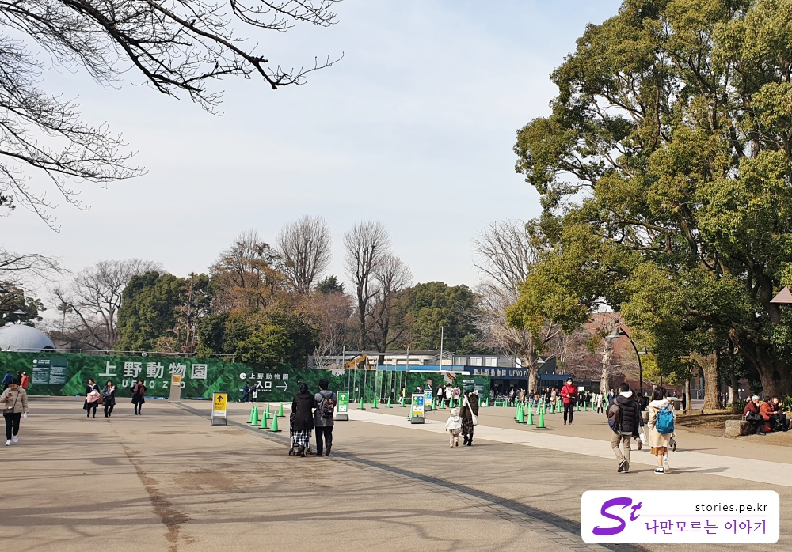  
공원길을 따라 직진을 하다보면 스타벅스가 자리하고 있는 큰 광장이 나타납니다.  
직진은 **도쿄국립박물관**이 나오고 왼쪽으로는 **우에노동물원**이 나옵니다.   
우에노동물원은 입장 시 유료라 들어가지는 안았습니다.   

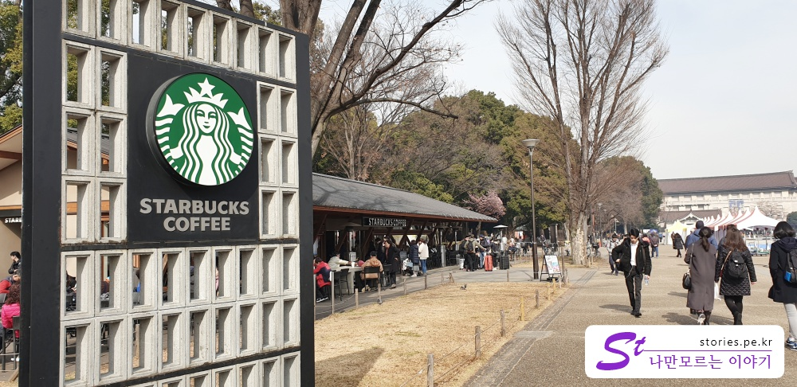  
다리가 아플때 쯤해서 커다란 스타벅스가 나타납니다.  
맛이야 스타벅스가 거기서 거기겠지만 사람들이 앉아서 쉬기위해 많이들 찾아 옵니다.  
우리도 겨우 야외 테이블에 자리를 잡고 앉았습니다. 
날씨는 약간 춥긴했지만 테이블 마다 난로를 설치해 놔서 추운줄 모르고 쉴 수 있었습니다. 

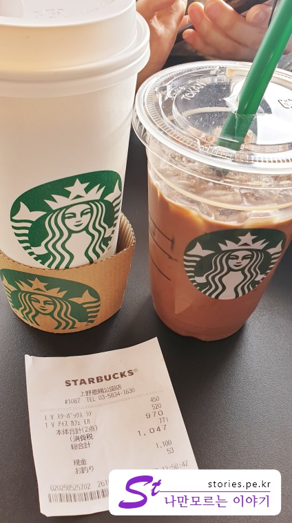  
도쿄를 돌아다니면서 그나마 앉아서 쉴수있는데가 커피집이 대부분이라 스타벅스를 많이 가봤지만 역시 스타벅스는 일본이 한국보다 더 싼것 같습니다.  
한국 스타벅스는 비싸요. 나쁜 스타벅스 넘들...   

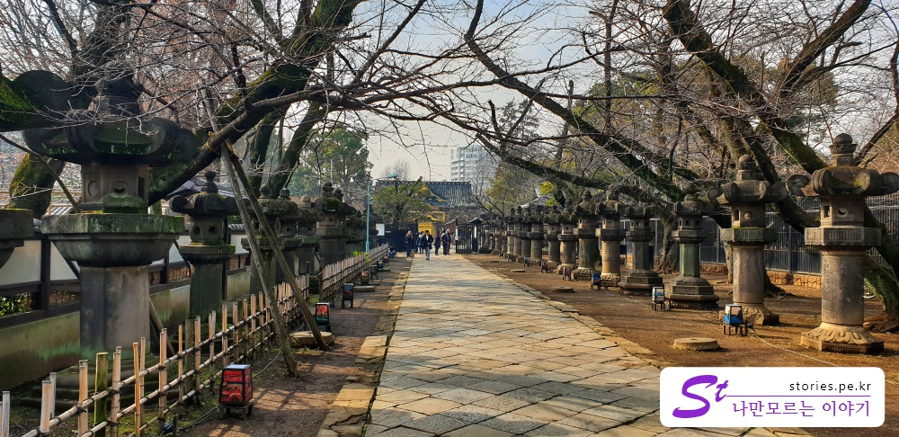  
공원에서 왔던길로 조금만 내려가면 우에노도쇼구(우에노 동조궁)으로 가는 길이 보입니다. 
우리는 여기를 갈생각이 없었고 다만 공원 아래에 있는 호수로 이동을 하려고 길을 헤메다가 할 수 없이 가게 되었습니다.  
그래도 길은 동양스럽고 이쁘기는 했습니다.   

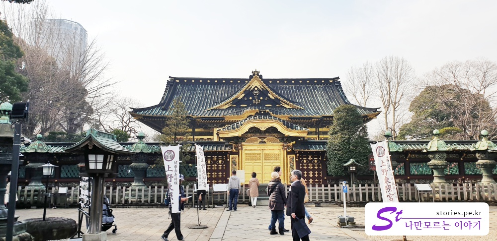  
길을 따라 가다보면 **우에노도쇼구(우에노 동조궁)** 신사가 보입니다. 
금색으로 칠해져있다고 해서 **금색전**이라고도 한다고 합니다. 
실제로 신사앞에서 절하는 사람들이 꽤 있었습니다. 일본인들이겠지요.  

호수로 내려가는 지름길이 있나 해멨으나 길이 없었습니다.  
동물원에 입장을 하면 호수까지 연결되서 갈 수 있는 길이 있지만 그렇지 않은 경우는 처음에 왔던 우에노공원 입구 정도까지 나가야 호수쪽으로 가볼 수 있습니다.   

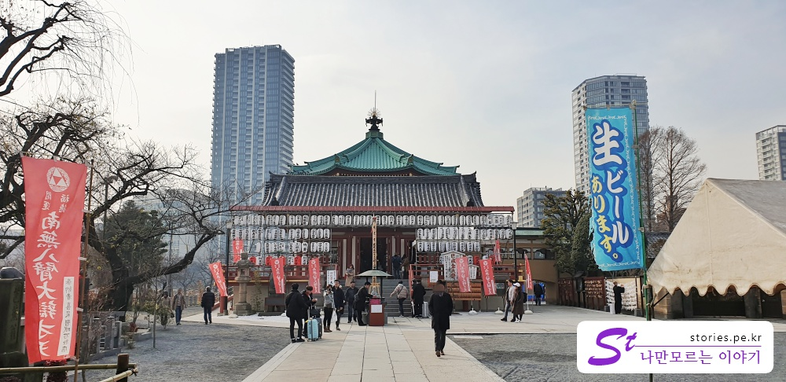   
호수쪽으로 걸어가다 보면 호수 한복판에 건물이 하나있습니다.  
이것이 **시노바즈노이케 벤텐도**라고 합니다. 여기는 신사는 아닌것 같고 절의 전각중 하나라고 합니다.  
여기서도 향을 태우는 사람들이 있었습니다. 
저희의 관심사는 아니니 우리는 그냥 지나쳐서 더 호수 쪽으로 이동을 했습니다.  

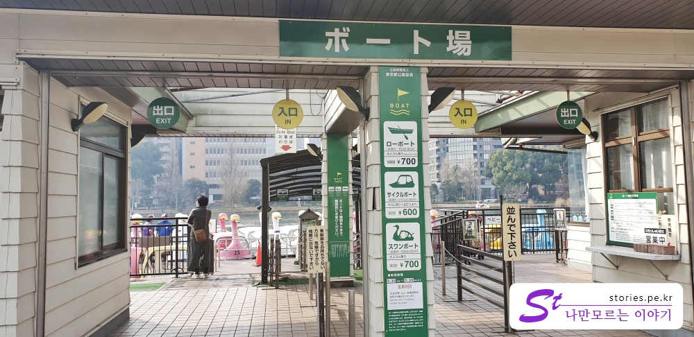  
이제야 유원지 다운 모습을 볼 수 있습니다  
바로 오리배를 탈 수 있는 선착장이 나타납니다. 비용은 600~700엔 정도되네요.  
우리는 아무도 노를 저으려는 희생 정신을 보이지 않았기 때문에 패쓰~~  

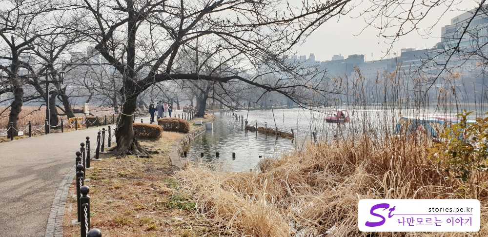  
선착장에서 바로 고개만 왼쪽으로 돌리면 굉장한 풍광과 함께 포토스팟을 볼 수 있습니다. 
사진찍기에 너무 좋은 비주얼을 만날 수 있습니다.  
쌀쌀한 날씨에 연인과 함꼐 걷는다면 좀더 붙어서 다닐 수도 있겠습니다.  

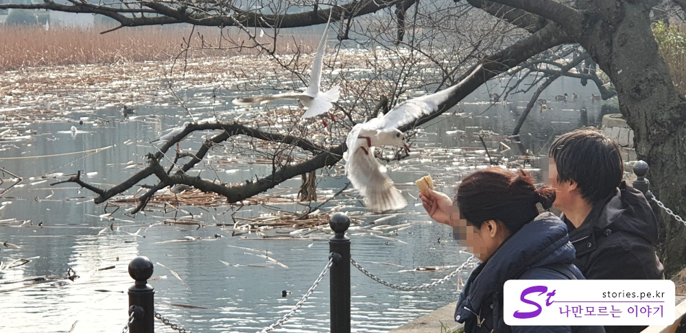  
호수에 왜~~ 바다도 아닌데!! 갈매기가 있다니...  
분명 갈매기 같은데.. 제가 잘못알고 있는건지 모르겠지만,  
갈매기(?)같이 생긴 새들이 사람을 두려워 하지 않고 과자를 받아 먹고 있습니다. 

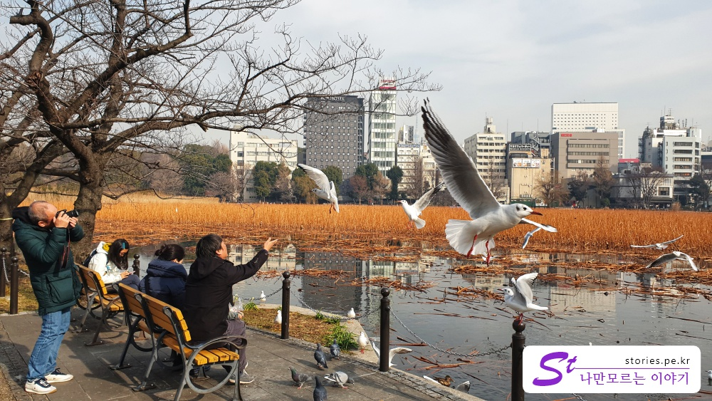  
밥 받아먹는 갈매기의 모습을 사진에 담는 사진사를 담은 사진입니다.  

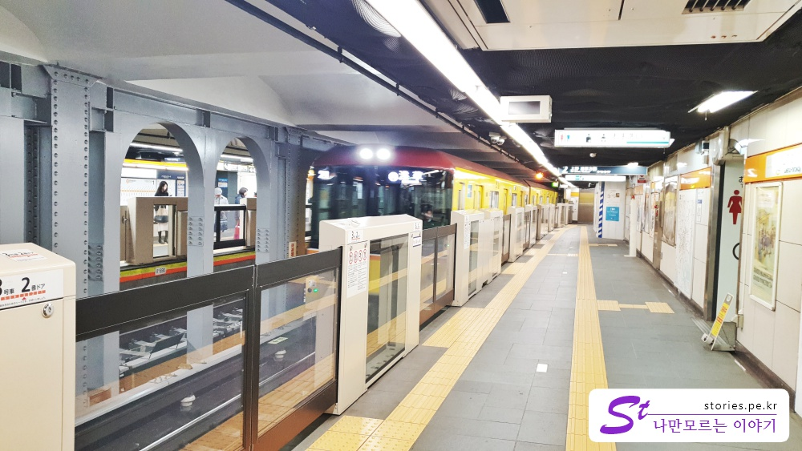   
그렇게 한바퀴돌아 **우에노히로코지역**으로 이동하여 **긴자선**을 탔습니다.   
**긴자선**은 약간 지하철계의 **마을버스**같은 모습입니다. 좀 작아요. 노랗구요. 귀여워요.

**긴자선**을 타고 다음 스팟인 **센소지**가 있는 **아사쿠사**로 이동했습니다. 

> 아사쿠사 센소지 방문기 

## 입장시간  
-  24시간 방문이 가능합니다 

## 여행지 정보  
- 주소 : 5-２０ Uenokōen, Taitō-ku, Tōkyō-to 110-0007 일본    
- 연락처 : +81 3-3828-5644  
- URL : tokyo-park.or.jp 
- 지도 : https://goo.gl/maps/errosfpjryP2  

--- 

[도쿄여행 3일차]  
1. [우에노공원에 가기 전 꼭 들러봐야 할 재래시장, 아메요코시장](https://stories.pe.kr/322)  
1. [일본 도쿄의 대표 공원 우에노공원 방문기](https://stories.pe.kr/323)  
1. [아사쿠사 센소지 방문기](https://stories.pe.kr/325)  
1. [아내가 좋아하는 갓파바시 도구거리](https://stories.pe.kr/326)  
1. [도쿄의 야경을 보기 위한 최적의 장소 롯폰기 힐즈 전망대](https://stories.pe.kr/327)  
