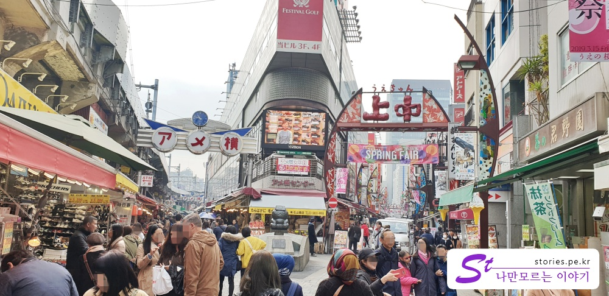

[도쿄여행 3일차]  
1. [우에노공원에 가기 전 꼭 들러봐야 할 재래시장, 아메요코시장](https://stories.pe.kr/322)  
1. [일본 도쿄의 대표 공원 우에노공원 방문기](https://stories.pe.kr/323)  
1. [아사쿠사 센소지 방문기](https://stories.pe.kr/325)  
1. [아내가 좋아하는 갓파바시 도구거리](https://stories.pe.kr/326)  
1. [도쿄의 야경을 보기 위한 최적의 장소 롯폰기 힐즈 전망대](https://stories.pe.kr/327)  

--- 

도쿄여행 3일차에 히가시 신주쿠를 나와서 첫 일정이였던 **아메요코시장**입니다.  
평일이라 그런지 다니는 사람들은 너무 많지도, 적지도 않게 적당했습니다. 딱 좋았지요.  
**아메요코시장**은 **우에노공원**을 가기 전에 꼭 들러봐야 할 재래시장입니다.  
도쿄에서 마지막(?) 남은 재래시장이라고 들은것 같은데....,  
어찌되었든 우리나라의 **남대문시장** 정도의 느낌이 납니다.   

  
아메요코시장에 들어가는 길이 여러가지가 있긴한데,
우리는 **도쿄메트로** **오에도선**에 있는 **우에노우카치마치**역에서 내려서 들어갔습니다.  
그래서 입구가 **ABC마트**가 있는 아래쪽에서 우에노공원쪽으로 이동하며 구경을 했습니다.  

  
재래시장이 그렇듯이 만물잡화에, 먹거리에, 사람들로 북적이는 곳입니다.  
아메요코시장도 별반 다르지 않습니다. 다른것이라곤 내가 모르는 일본어가 즐비하다는 것뿐.

   
**마츠모토키요시**도 있습니다. 마츠모토키요시는 약국체인이라는데, 약만 팔지는 않는것 같습니다. 곤약젤리도 파네요.  

   
이 곤약젤리가 생각보다 맛이 상당히 좋더라구요. 우에노공원을 거닐면서 다 먹어 버렸네요.  

아메요코시장은 곳곳에 먹거리들이 있습니다.  

  
만두를 파는 곳이 있습니다. 우리는 점식식사를 하려고 먹지는 않았지만 상당히 먹음직 스러웠습니다. 먹을뻔 했거든요.  
가격은 세금포함해서 대략 400~450엔정도 하는 것 같습니다.  

  
조금 더 올라오면 생선을 판매하는 가게도 있습니다. 생물과 건어물을 같이 팔고 있네요. 
생물을 판다는 건 현지인들도 많이 찾아 온다는 것이겠지요. 

  
미요시 화장품가게도 있습니다. 없는 품목이 없는가 봅니다. 

  
태국음식인가요? 베트남음식인가요? 뭔지 잘 모르겠지만 뭔가 맛있어 보입니다.  
주인아주머니가 반갑게 인사합니다. 빨리 이리로 오라고~~~  

  
세계적으로 유명한 터키의 케밥도 팝니다. 호객행위가 장난아닙니다.   
아저씨가 정말 밝에 웃으면서 오라고, 이쪽으로 오라고~~  

  
한국인이 많이 찾아가니 당연히 한국음식을 파는 가게도 있었습니다.  
떡볶이, 파전, 라면, 짜장라면...   
먹어볼까 하다가 그냥 지나쳤습니다. 가격도 500~700엔정도로 많이 비싸지도 않았는데..
"**먹어 볼 껄~**"하고 후회를 했던 집입니다.  

   
오락실도 빠질 수 없겠지요.. 아키하바라에서도 봤던 오락실입니다. 이것도 체인점인가 봐요..

  
남들은 여기가 입구라고 하던데, **우에노우카치마치**역에서 출발한 우리는 여기가 거의 끝지점이였습니다.  
양갈래 길이 있는데 우리는 **상중**이라고 써있는곳은 가보지 않았구요. **야메요코초**라고 써있는곳만 지나왔습니다. 

  
지인에게 선물하기 위해 나무젓가락을 구매했습니다.  
남자아이세트, 여자아이세트, 어른용세트가 있어서 우리는 각각 골고루 구매했습니다.  사진은 남자아이세트만 올립니다. 

조금만 더 올라가면 크레페 가게도 나옵니다. 예쁘게 생겼고 아들이 한번 먹어보고 싶다고 해서 사 먹어 봤습니다. 

   
과자도우에 생크림과 딸기를 말아서 먹는 크레페인데, 맛있다고 하네요. 

  
야메요코시장의 부타동(돼지고기덮밥) 맛집으로 블로그에 많이 소개된 **쿠시아게 주라쿠**에서 식사를 했습니다. 

식당소개는 아래의 URL을 참고하세요.   

> 참고 : [우에노 아메요코 시장의 부타동 맛집 이라는 쿠시아게 주라쿠](https://stories.pe.kr/324)

여기서 아침겸 점심을 먹고 **우에노 공원**으로 이동했습니다. 

## 입장시간  
- 시작시간 : 오전 10:00 
- 마감시간 : 오후 8:00 

## 여행지 정보  
- 주소 : 4-9-14 Ueno, Taitō, Tokyo 110-0005 일본    
- 연락처 : +81 3-3832-5053  
- URL : http://www.ameyoko.net  
- 지도 : https://goo.gl/maps/KQDcUmy8ERQ2 

--- 

[도쿄여행 3일차]  
1. [우에노공원에 가기 전 꼭 들러봐야 할 재래시장, 아메요코시장](https://stories.pe.kr/322)  
1. [일본 도쿄의 대표 공원 우에노공원 방문기](https://stories.pe.kr/323)  
1. [아사쿠사 센소지 방문기](https://stories.pe.kr/325)  
1. [아내가 좋아하는 갓파바시 도구거리](https://stories.pe.kr/326)  
1. [도쿄의 야경을 보기 위한 최적의 장소 롯폰기 힐즈 전망대](https://stories.pe.kr/327)  
