[도쿄여행 4일차]  
1. [신주쿠에서 오다이바 갔다가 오는 길](https://stories.pe.kr/328)  
1. [오다이바 비너스포트 방문기](https://stories.pe.kr/329)  
1. [빛의 축제! 오다이바 팀랩 보더리스 방문기](https://stories.pe.kr/330)
1. [다이버시티와 자유의여신상에서 사진찍기](https://stories.pe.kr/331)
1. [오오에도온천 모노가타리에서 여행 피로 풀기](https://stories.pe.kr/332)

--- 

비너스포트와 팀랩 보더리스를 보고 자연스럽게 넘어간 곳이 다이버시티 앞에 있는 실물크기의 **건담 모형**입니다.  
사실 다이버시티에서 구경도 하고 점심도 먹으려고 했으나 쌓여있던 피로과 일정 때문에 그렇게 할 수 없었습니다.    

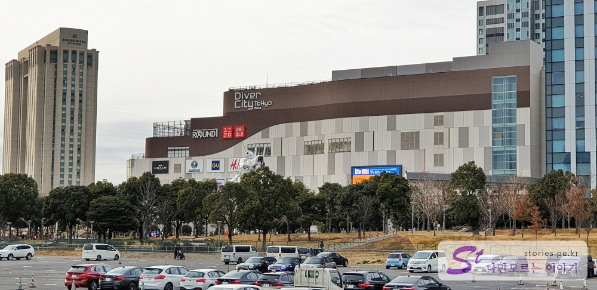  
비너스포트와 팀랩 보더리스에서 기력을 모두 소진한 식구들의 지친 몸뚱아리를 관심 1도 없는 건담에 붙잡아 놓을 수가 없었습니다.  
결국 건담 앞에서 사진 몇 장만 찍고 바로 다이버시티로 들어가서 커피숍 빈자리에 착석 할 수 밖에 없었습니다.  

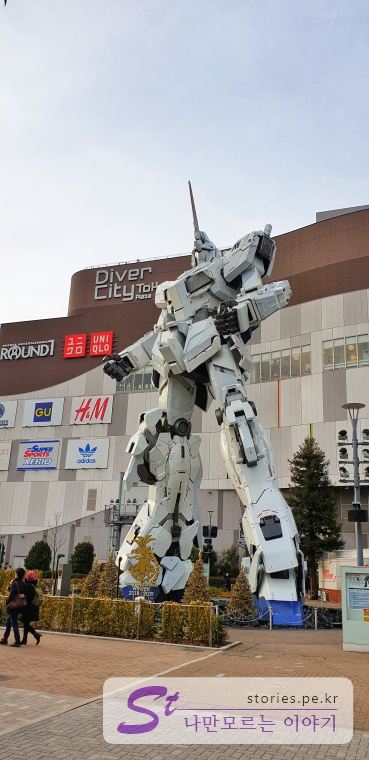    
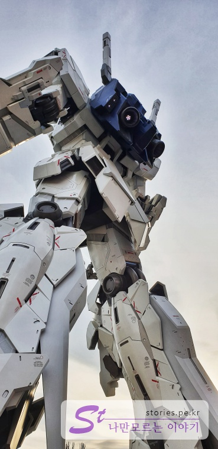  
아쉬운 마음에 저만 다시 나와서 건담 사진을 여러방 찍었습니다. (야~ 멋지다!! 건담!!)   

식구들은 모두 여기에서 퍼져 버렸습니다. 마지막 남은 **오오에도 온천**만을 기다린 채..  
저는 좀 더 달려봤습니다. 저 혼자 **자유의 여신상**으로 갔습니다.  

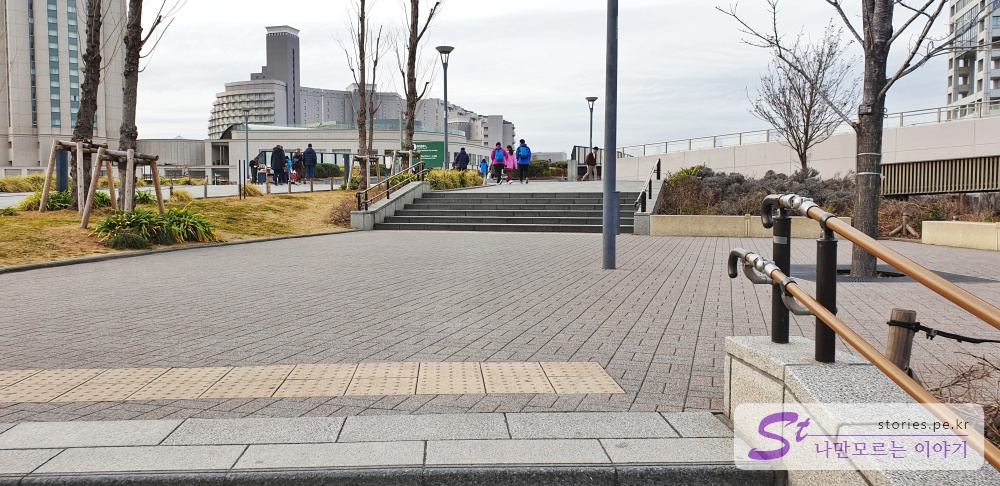   
다이버시티에서 자유의 여신상까지는 아주 큰길이 편하게 나 있습니다.  
다이버시티에서 자유의 횟불쪽으로 나가면 아주 큰길을 만날 수 있습니다.   

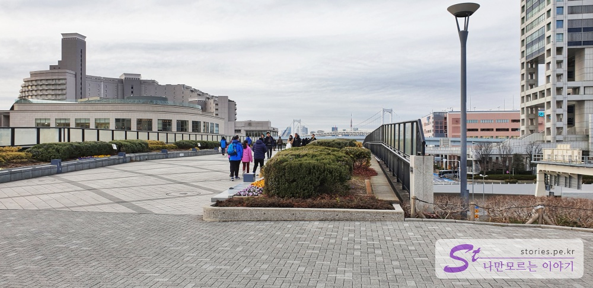  
아래는 차가 싱싱달립니다. 자유의 여신상까지는 직진만 하면 됩니다.  

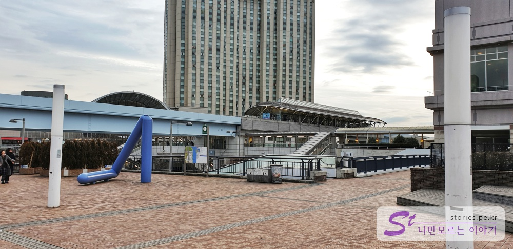  
저 멀리 다이바역이 보입니다.  
오다이바 여행의 시작을 다이바역에서 부터 하는 경우도 있습니다. 오다이바에서 내리면 자유의 여신상까지 바로 이동이 가능합니다.  

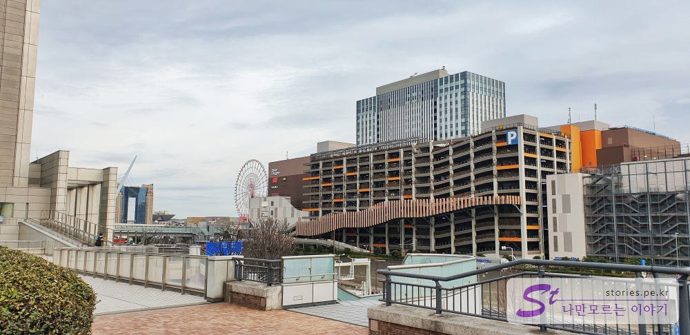  
가다가 뒤를 돌아보고 사진을 찍었습니다.  
다이버시티 뒤쪽으로 우리가 처음 관광을 했던 대관람차가 보입니다.  

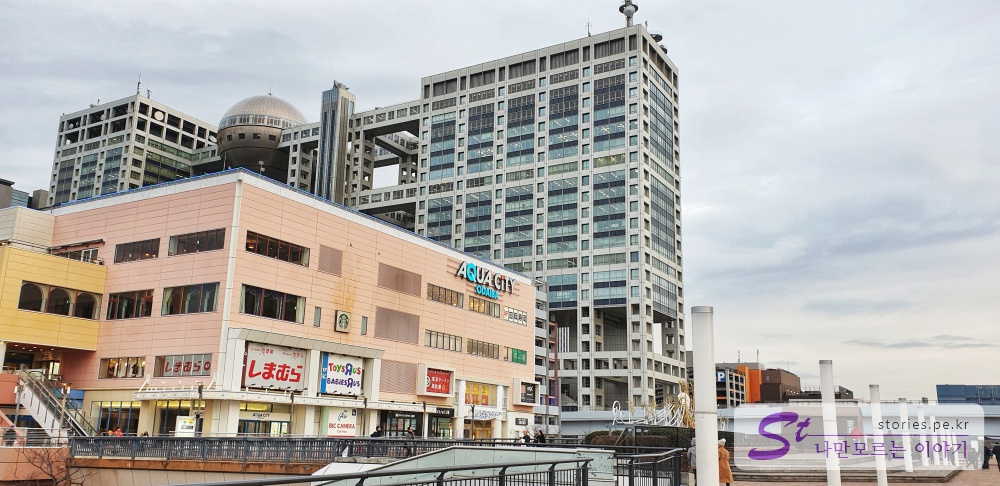  
조금 더 가면 자유의 여신상 바로 앞쪽에 **아쿠아시티**가 보입니다.  
추운 겨울이나 더운 여름날, 또는 비가오는 날 자유의 여신상에 왔을 경우 잠시 몸을 피할 수 있는 아주 좋은 위치에 자리를 잡고 있습니다.  
뒤에 **후지텔레비** 건물도 보입니다.  
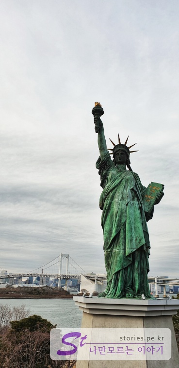  
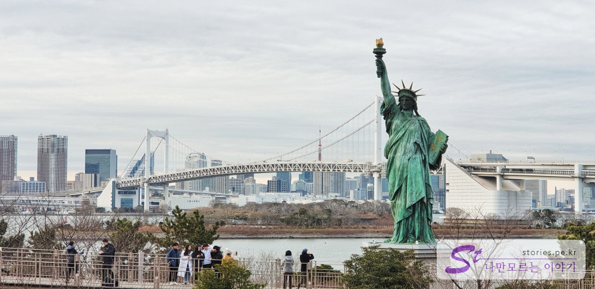  
이게 뭐라고, 이게 뭐라고 힘들고 지친 몸뚱이를 끌고 왔을까... 다리 아프다.. 
나 혼자 와서 사진 한장 건지고 다시 식구들이 기다리고 있는 다이버시티로 갔습니다. 다리 아프다... 정말 아프다...

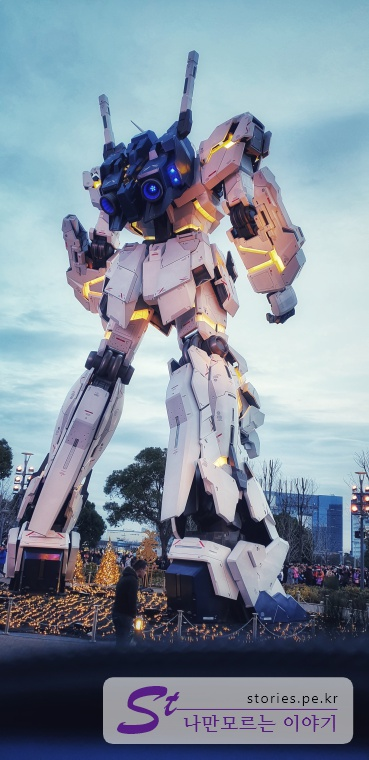
가는 길에 억울해서 불 들어 온 건담 엉덩이를 찍어봤습니다.  

이렇게 식구들은 1시간 이상 휴식을 취하고 저는 식구들과 조우하고 바로 **오오에도 온천**으로 향했습니다. 
오오에도온천 모노가타리는 도쿄텔레포트역에서 셔틀버스를 탈 수 있습니다.  또다시 걸어서 도쿄텔레포트역으로 이동했습니다.  

--- 

[도쿄여행 4일차]  
1. [신주쿠에서 오다이바 갔다가 오는 길](https://stories.pe.kr/328)  
1. [오다이바 비너스포트 방문기](https://stories.pe.kr/329)  
1. [빛의 축제! 오다이바 팀랩 보더리스 방문기](https://stories.pe.kr/330)
1. [다이버시티와 자유의여신상에서 사진찍기](https://stories.pe.kr/331)
1. [오오에도온천 모노가타리에서 여행 피로 풀기](https://stories.pe.kr/332)
