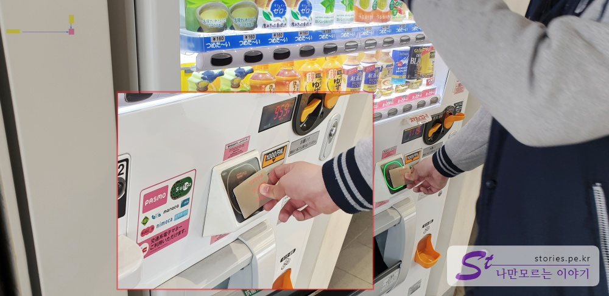

[도쿄여행 4일차]  
1. [신주쿠에서 오다이바 갔다가 오는 길](https://stories.pe.kr/328)  
1. [오다이바 비너스포트 방문기](https://stories.pe.kr/329)  
1. [빛의 축제! 오다이바 팀랩 보더리스 방문기](https://stories.pe.kr/330)
1. [다이버시티와 자유의여신상에서 사진찍기](https://stories.pe.kr/331)
1. [오오에도온천 모노가타리에서 여행 피로 풀기](https://stories.pe.kr/332)
---

도쿄여행의 4일 차인 마지막 날입니다. 마지막 날은 하루종일 **오다이바**에서 보냈습니다.  
이유는 오다이바에 **오오에도 온천**이 있기 때문이죠.  
힘들게 달렸던 도쿄여행의 마지막 피로를 풀기 위해 마지막날 마지막 코스에 온천을 넣어놨습니다.

  

우리의 숙소인 **신주쿠**에서 출발하여 오다이바로 갔다가 오는 교통편을 포스팅 하려고 합니다.  
먼저 우리 도쿄여행의 발이 되어 준 **도쿄메트로 패스 72시간 사용권**이 오늘 오후로 종료가 되기 떄문에 아침에는 **도쿄매트로패스**를 사용하여 오다이바로 이동하고 밤에 돌아올 때는 **린카이선**을 타고 신주쿠까지 오는 코스입니다.  
**린카이선**은 도쿄 메트로 패스로는 이용할 수 없으므로 별도 표를 구매하거나 **파스모** 또는 **스이카**카드를 사용해야 합니다. 저희는 미리 파스모 카드를 구매했었기 때문에 파스모 카드를 이용했습니다.   

## 신주쿠에서 오다이바로 가는 교통편   
신주쿠에서 오다이바로 가는 교통편은 크게 3가지가 있습니다. 

### 린카이선 이용하는 방법   
첫번째는 야마노테선과 린카이선을 환승없이 가는 방법입니다. 

**장점**  
- 가장 빠르게 가는 방법입니다. 
- 환승없이 갈 수 있습니다.  

**단점**
- 도쿄메트로패스를 이용할 수 없습니다. (별도의 요금을 지불하거나 파스모, 스이카등의 교통카드를 이용 해야 합니다.)
- 유리카모메를 타 볼 수 없습니다. (장점이자 단점으로 무인 전철인 유리카모메를 타볼 수 없습니다.)
- 가격이 제일 비싼 편 입니다. (유리카모메 편도비용이 380엔이고 린카이선이 500엔이므로 200엔 더주고 편하고 빠르게 갈 수는 있습니다.) 

나머지 2가지는 **도쿄 메트로를 이용하여** 가는 방법입니다.   

### 마루노우치선 -> 긴자선 -> 유리카모메를 이용하는 방법
먼저 간략하게 **마루노우치**선을 이용하는 방법의 장단점을 설명하겠습니다.  

**장점**  
- 몇 분 차이기는 하지만 도쿄메트로를 이용하는 방법 중에 제일 빠릅니다. 
- 유리카모메의 출발역인 **신바시**역을 이용합니다. 무인열차인 유리카모메의 가장 앞자리에 앉을 수 있는 기회가 있습니다. 

**단점**
- 마루노우치선에서 긴자선으로 환승이 1차례 있습니다.  

### 오에도선 -> 유리카모메를 이용하는 방법   
마지막으로 우리가 이용한 방법인데,  **신주쿠니시구치**역에서 **오에도선**을 타고 **시오도메**역까지 가서 **유리카모메**를 타는 방법 입니다.    
니시구치는 서쪽 출구라는 뜻입니다. 말하자면 **신주쿠 서쪽 출구역**이네요.  
요기서 저희가 헷갈린 부분이 있었는데 **신주쿠니시쿠치**에서 오에도선을 타면 **도초마에**(도쿄도청)역으로 가는데 거기에서 또다시 오에도선의 반대로 가는 열차로 갈아타야 한다는 것입니다. 이상하지만 갈아타야 합니다. 
바로 옆의 철도가 아니라 반대편으로 넘어가서 **신주쿠역 방면**의 오에도선을 다시 타야 합니다. 그래서 완벽히 환승이 없다고는 할 수 없습니다.  
  
오에도선에서 오에도선 반대방향으로 환승을 하여 달리다 보면 어느센가 **시오도메**역에 도착합니다.  

  
시오도메역에서 유리카모메를 타는 사람이 많은지 이정표가 많이도 붙어 있습니다.  
7~10번 출구로 나가라고 합니다. 

  
지하에서 한층 올라오면 또한번 올라가야 하는데, 9~10번출구로 나가면 됩니다.  
나가는 출구가 좀 좁은 편이라, 이쪽이 출구 맞나? 하는 의구심이 살짝 들기는 하지만 그쪽이 맞습니다. ^^

  
그렇게 지상으로 올라오면 유리카모메를 타기 위해 위로 올라가야 합니다.  

  
유리카모메 개찰구가 나타납니다.  
이곳은 도쿄메트로패스가 적용이 되지 않습니다.  
별도로 비용을 지불하여 표를 구매하거나 교통카드인 **파스모**, **스이카** 카드를 이용해야 합니다.  

  
표를 보는 방법은 출발지와 목적지의 가로/세로 만나는 지점의 요금이라고 보시면 됩니다. 
대략 목적지까지 이용하는데 성인 **380엔**정도 되네요. 생각보다 비싸네요.  

  
저희는 도쿄에 도착한 첫날 혹시 사용할 수 있을 것 같아 미리 파스모를 구매했었습니다.  
3000엔으로 구매하면 보증금 500엔 빼고 2500엔을 충전해 주는데, 2500엔이면 5일동안 사용하기에 충분합니다.  
대부분 도쿄메트로를 사용할 것이고 도쿄메트로가 불가한 교통편에 대해서 보조수단으로 사용되기 때문입니다.   

  
우리나라 교통카드인 티머니처럼 교통카드 외에 자판기에서 음료수도 사먹을 수 있습니다. 목 마를 때 사용해 보세요.  

  
개찰구를 통과하여 한층 더 올라오면 유리카모메를 탈 수 있는 플랫폼이 있습니다.  
유리카모메는 운전사가 없는 무인 전철이라 앞쪽이 텅 비어 있습니다.  
가능하면 앞쪽 칸에 있는 것을 추천 합니다. 정면에서 보는 뷰도 볼만 합니다.  

  
정면에서 찍은 사진입니다. 마주보며 달려오는 유리카모메를 보고 우리가 타고 있는 기차도 똑같이 생겼거니 유추해 봅니다.  

<iframe width="560" height="315" src="https://www.youtube.com/embed/B5DJANp8S2A" frameborder="0" allow="accelerometer; autoplay; encrypted-media; gyroscope; picture-in-picture" allowfullscreen></iframe>

   
레인보우 브릿지를 건널 때 교각과 함꼐 찍어봤습니다.  

  
저 멀리 우리의 첫번째 목적지인 팔레트 타운의 **대관람차**가 보입니다. 우리는 여기 **아오미**역에서 부터 시작할 예정입니다.  

  
비너스포트는 쇼핑몰입니다. 비너스포트와 메가웹스터디, 팔레트 타운 대관람차, 팀랩 보더리스까지가 같은 건물로 묶여 있어서 한번에 보기에 좋습니다.  

> 1. [신주쿠에서 오다이바 갔다가 오는 길](https://stories.pe.kr/328)  
> 1. [오다이바 비너스포트 방문기](https://stories.pe.kr/329)  
> 1. [빛의 축제! 오다이바 팀랩 보더리스 방문기](https://stories.pe.kr/330)
> 1. [다이버시티와 자유의여신상에서 사진찍기](https://stories.pe.kr/331)
> 1. [오오에도온천 모노가타리에서 여행 피로 풀기](https://stories.pe.kr/332)

다음은 여행을 마치고 오다이바에서 신주쿠까지 가는 교통편입니다.  

## 오다이바에서 신주쿠로 가는 교통편   
오다이바에서 실컷 놀고 다시 신주쿠로 돌아가는 교통편입니다.  
도쿄메트로가 아직 살아있다면 왔던 방식대로 다시 돌아가면 가장 저렴하게 교통편을 이용하게 됩니다.  
하지만 도쿄메트로가 끝났거나, 노느라 심신이 지쳐서 환승없이 좀 더 편안히 가고자 한다면 **린카이선**을 이용하는 것을 추천합니다.  

### 린카이선 이용하는 방법   
올 때 유리카모메도 타봤겠다, 도쿄메트로패스도 종료되었겠다, 노느라 다리도 아프고 심신이 피로해 있겠다, 저희로써는 린카이선을 이용하지 않을 이유가 전혀 없었습니다. 
그래서 돌아 올 떄는 린카이선을 이용했습니다. 
**이용요금**은 현재 2019년 2월 기준으로 **500엔**이였고 파스모를 이용했습니다.  

#### 시간표 보기  
린카이선은 시간표 대로 운행을 하고있습니다.  
열차는 오사키역에서 야마노테선으로 환승없이 전환하여 신주쿠로 가는 경우도 있지만 그렇지 않은 경우도 있어서 조금 주의해서 타야 합니다.  
아무 생각없이 타면 엉뚱한데로 갈 수 있으니 아래의 시간표 보기를 잘 참고해서 타야 합니다.  

  
위의 표에서 보는 바와같이 오사키역에서 **시부야**, **신주쿠**, **이케부쿠로**로 가는 방향도 있지만, 요코하마방면으로 갈 수도 있고 후타코다마가와로 갈 수도 있습니다. 그렇다고 겁먹을 필요는 없습니다.  
제가 알려드리는 시간표만 잘 보고 타시면 문제없이 시부야, 신주쿠, 이케부쿠로로 갈 수 있습니다.  

먼저 오다이바의 린카이선 정착역인 **도쿄텔레포트역**의 시간표를 찾아봅니다.  
- [린카이선 도쿄텔레포트역 시간표 바로가기](https://www.twr.co.jp/ko/tabid/282/Default.aspx) 

  1. 역이  **도쿄텔레포트역**인지 확인을 합니다. 
  1. 평일인지, 토요일이나 공휴일인지 확인하고 해당하는 것을 선택합니다.  

  
시간표 화면에 들어가면 위와 같은 시간표를 볼 수 있습니다.  
아무 표시없이 시간(분)만 나와있는 것을 타시면 안됩니다.  
이 중에 노란색으로 표시한것 처럼 **시간(분)에 한문으로 뭔가가 붙어있는 열차를 타시면 됩니다**.  
표시가 되어 있는 것은 JR샤이쿄선(야마노테선)으로 환승없이 바뀌져서 가는 목적지 역들을 표시하고 있습니다. 
타고 있는 사람은 바뀌었는지도 모르게 목적지까지 갑니다.  

> 시부야, 신주쿠, 이케부쿠로로 가려면 **시간(분)에 한문으로 뭔가가 붙어있는 열차를 타세요**

그러면 대략 30분안에 신주쿠까지 한번에 갈 수 있습니다. 상당히 편합니다.  
해당 열차는 현지인들이 많이 이용을 합니다. 꼭 우리나라 1호선타는 기분이 듭니다. ^^ 

--- 

[도쿄여행 4일차]  
1. [신주쿠에서 오다이바 갔다가 오는 길](https://stories.pe.kr/328)  
1. [오다이바 비너스포트 방문기](https://stories.pe.kr/329)  
1. [빛의 축제! 오다이바 팀랩 보더리스 방문기](https://stories.pe.kr/330)
1. [다이버시티와 자유의여신상에서 사진찍기](https://stories.pe.kr/331)
1. [오오에도온천 모노가타리에서 여행 피로 풀기](https://stories.pe.kr/332)
