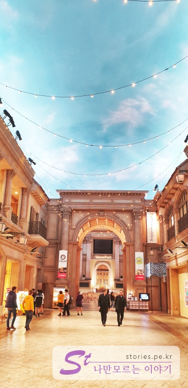

[도쿄여행 4일차]  
1. [신주쿠에서 오다이바 갔다가 오는 길](https://stories.pe.kr/328)  
1. [오다이바 비너스포트 방문기](https://stories.pe.kr/329)  
1. [빛의 축제! 오다이바 팀랩 보더리스 방문기](https://stories.pe.kr/330)
1. [다이버시티와 자유의여신상에서 사진찍기](https://stories.pe.kr/331)
1. [오오에도온천 모노가타리에서 여행 피로 풀기](https://stories.pe.kr/332)

--- 

우리는 오다이바 여행을 시작하기 위해 **비너스포트**가 있는 유리카모메의 아오미역에서 하차를 했습니다.  

  
유리카모메는 도쿄메트로 적용구간이 아니기 때문에 우리는 미리 준비했던 **파스모카드**를 이용하였습니다.  

  
아오미역에서 내려오면 바로 비너스포트가 눈앞에 보입니다. 그리고 아오미역과 2층에서 연결이 되어 있어서 쉽게 들어갈 수 있습니다.  

  
그렇게 비너스포트에 들어서면 이정표가 보입니다.  
비너스포트의 각 층별 안내도가 나와 있고 오른쪽으로 **메가웹(MegaWeb)**, **대관람차**, **팀랩 보더리스**까지 안내가 되어 있습니다.  
모두가 한 건물처럼 연결되어 있어 같이 보기에 좋게 되어 있습니다.   
우리는 비너스포트의 각 층을 먼저 관람 및 이용을 했고 메가웹을 지나 팀랩 보더리스를 관람하러 갔습니다.  

  
비너스포트와 아오미역이 2층에서 연결이 되어 있어서 **비너스포트 GRAND**가 먼저 보였고 여기먼저 관람을 시작 했습니다.   

  
다른이들의 블로그에서 많이 봤던 비너스포트의 내부 모양입니다.  
천정이 막히고 하늘 모양으로 색칠해 놔서 이색적인 모습을 하고 있습니다.  

  
평일이라 그런지 사람이 많지는 안았습니다.  

  
천정을 하늘처럼 꾸며 놓으니 상당히 개방감이 있어보였습니다.  

  
전체적인 모습을 파노라마로 찍어봤습니다.   

  
캐리커쳐도 그려주는 것 같습니다. 내 얼굴도 저렀게 그려줄까봐 그냥 지나쳤습니다.  

  

  
비너스포트 중심부에 있는 분수광장입니다.  사진찍기에 너무 좋습니다. 잘나와요..

조금 더 올라가면 올리브 플라자에 풍선으로 만든 나무가 있습니다. 팀랩 보더리스에서 제작한 나무로 올리브 플라자에 있는 사람에 대해서 반응하며 색을 바꿉니다.  
얼핏 보면 바뀌는지도 몰라요. 계속 보고있으면 다양한 무늬로 색상을 변경합니다.  

  
마지막 끝 지점에 있는 교회광장입니다. 특별할 것은 없습니다. 그냥 넓은 공간이 존재하고 그 위로는 푸드코드들이 둘러싸여 있습니다.  

  
교회광장에 토토로샵이 있습니다. 예전에 토토로 애니메이션을 봐서 그런지 굉장히 정감이 갑니다. 

  
토토로에 나왔던 캐릭터들을 한 상자에 전시를 하고 있네요.  

  
애니메이션에 나왔던 토토로가 식물을 키우는 과정을 만들어 놨습니다. 옛날 생각이 나네요.  
아이들 뿐만아니라 어른들도 관심을 가질만한 샵이였습니다.  

저희도 기념으로 토토로 인형을 하나 샀습니다. 

토토로샵을 나와서 2층으로 눈을 올리면 푸드코드를 볼 수 있습니다.  
원래 계획은 식사를 다이버시티쪽에서 먹으려고 했는데, 비너스포트에서 너무 많은 시간을 보냈기 때문에 어쩔 수 없이 비너스포트에서 식사를 했습니다.  

   
3층으로 올라가면 아울렛도 있지만 푸드코트도 있습니다.  
가격은 대략 800~1000엔정도에 형성이 되어 있습니다.  

  
저는 인도식 카레와 난을 시켰습니다.  

  
또하나는 카레밥을 시켰습니다.  

맛은 전체적으로 그냥 그랬습니다. 그냥 푸드코트 그 이상도, 그렇다고 그 이하도 아니였습니다. 
적당히 배를 채울 수 있는 가격과 맛이였습니다.  

다음 포스팅은 **팀랩보더리스**에 대한 내용입니다. 

---

[도쿄여행 4일차]  
1. [신주쿠에서 오다이바 갔다가 오는 길](https://stories.pe.kr/328)  
1. [오다이바 비너스포트 방문기](https://stories.pe.kr/329)  
1. [빛의 축제! 오다이바 팀랩 보더리스 방문기](https://stories.pe.kr/330)
1. [다이버시티와 자유의여신상에서 사진찍기](https://stories.pe.kr/331)
1. [오오에도온천 모노가타리에서 여행 피로 풀기](https://stories.pe.kr/332)
