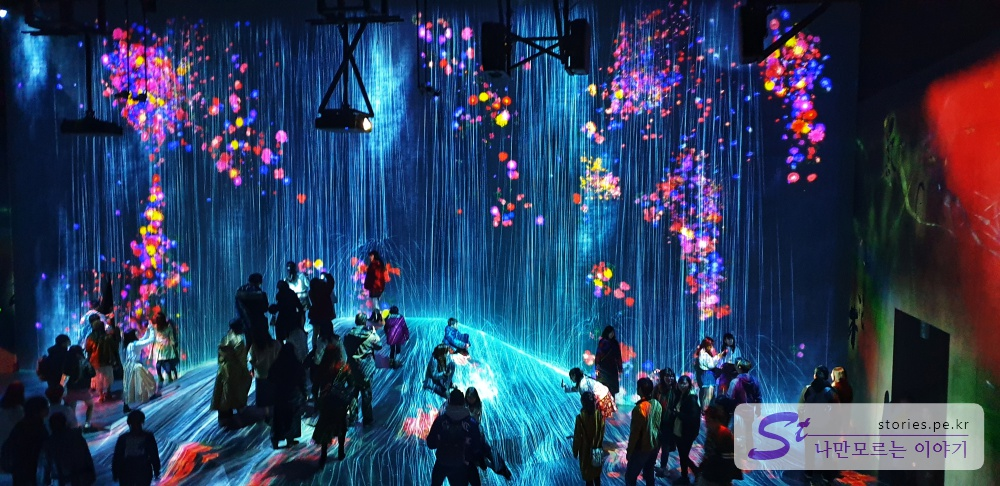

[도쿄여행 4일차]  
1. [신주쿠에서 오다이바 갔다가 오는 길](https://stories.pe.kr/328)  
1. [오다이바 비너스포트 방문기](https://stories.pe.kr/329)  
1. [빛의 축제! 오다이바 팀랩 보더리스 방문기](https://stories.pe.kr/330)
1. [다이버시티와 자유의여신상에서 사진찍기](https://stories.pe.kr/331)
1. [오오에도온천 모노가타리에서 여행 피로 풀기](https://stories.pe.kr/332)

--- 

비너스포트 구경과 쇼핑을 마치고 빛의 축제라고 하는 **팀랩 보더리스**를 보러 갔습니다.  
2층에서 처음에 들어왔던 유리카모메의 아오미역으로 통하는 중앙 원형 공간으로 다시 이동을 합니다  

   
이번에는 비너스포트 반대쪽으로 이동을 합니다. 비너스포트 반대편을 쳐다보면 **메가웹**(Megaweb)이 먼저 보입니다.  
이 **메가웹**(Megaweb)을 지나야 대관람차가 있는 곳을 갈 수 있습니다.   

> 사실 헷갈리게 비너스포트 반대쪽 끝에도 애견놀이터 근처에 올드카를 전시해 놓은 **Megaweb**이 조그맣게 있습니다.  
> 메가웹만 생각하고 찾아갔다가는 헷갈리기 쉬울것 같습니다. 우리도 헷갈려서 왔다갔다 고생 좀 했습니다. 

  
이렇게 생긴 출입구로 들어가시면 됩니다  

   
   
우리나라 코엑스처럼 생긴 공간에 도요차자동차가 즐비해 있다면 일단 잘 찾아 온것입니다.  

메가웹을 지나 반대쪽으로 이동을 하면 **라이드스튜디오**(Ride Studio) 라고 써있는 입구를 볼 수 있습니다.  
계속 2층에서만 이동을 하시면 됩니다. 

  
라이드 스튜디오를 통해 밖으로 나오면 바로 팔레트 타운 대관람차를 만날 수 있습니다.  
우리는 대관람차 탐승은 패스했습니다.  

미리 한국에서 예매를 한 팀랩 보더리스로 이동을 했습니다.   

  
팀랩 보더리스의 입구는 대관람차 바로 아래에 위치해 있습니다.  
프린터 회사로 알고 있는 앱손이 만들었다고 하네요.  

## 팀랩 보더리스  
입구에서 어느정도 인원이 모이면 간단하게 주의 사항을 설명해 주고 입장을 합니다.  
들어가자마자 캄캄합니다. 조심히 들어가셔야 해요.  

  
들어가면 색다른 세상이 펼쳐집니다. 형형색색의 움직이는 그림들이 즐비해서 이것이 벽인지 바닥인지 헷갈릴 정도 입니다.  
아마도 수백대의 엡손 프로젝터로 비추고 있는 것이 분명해 보입니다   

  
제가 막 사진을 올리기는 하지만 사실 실제현장에서 보는 것 보다 사진으로 보는 것이 더 멋있어 보입니다. ㅋㅋ

 
높은곳에서 부터 내려온 유리구슬 발에 빛을 비추는 작품입니다. 빛의 움직임으로 여러가지 다양한 효과를 나타냅니다.  

  
팀랩 보더리스의 매인 공간입니다. 가장 넓고 가장 멋진 모습을 보여 줍니다  
마치 예전에 영화로 봤던 아바타의 신비로운 공간처럼 보입니다.  다양한 장소에서 이곳을 볼 수 있는데 어디에서 보든 멋진 모습을 보여줍니다  

  
가까에에서 찍어봤습니다. 빛 하나 하나가 모두 움직입니다.  

  
사진을 다 찍지는 못했으나 이런식의 테마공간도 여기저기에 많이 있습니다.  

모두 구경하는데 대략 1시간 30분에서 2시간까지 걸릴 것 같습니다. 
이정표가 없으니 왔던데 또가고 반대로 또가고 합니다. 아마 저희도 가보지 못한 곳이 분명히 있을것 같아요.  
팀랩 보더리스의 컨셉이 이렇게 헤메고 찾고 하는 기쁨?? 을 누리게 하는 거라네요. 그러고 보니 이름의 뜻에서 어느정도 유츄할 수 있을 것 같더라구요.  

## 비용   
할인은 없습니다.  
현장에서도 판매는 하지만 매진이 되는 경우가 많으니 예매를 하는 것이 좋습니다.  

예매 시 지정한 당일 날이 되야지만 **QR코드**가 발행이 됩니다. 
그렇기 떄문에 예매 시 지정한 일정의 하루 전(QR코드 발행전)까지는 다른 날짜로 일정 변경이 가능합니다.  
발행된 QL코드를 입장할때 리더기에 찍으면 확인 후 입장을 할 수 있습니다. 

- 성인 (14세 이상) : 3,200엔
- 어린이(4 ~ 14세) : 1,000엔

## 입장시간  
- (월～금) : 10:00 ~ 19:00
- (토・일・공휴일) 10:00 ~ 21:00
- 휴관일 : 2번쨰, 4번쨰 목요일 (또는 별도 지정한 날짜에 휴관하는 경우도 있으니 [홈페이지 참조](https://borderless.teamlab.art/ko/#opentime)) 

## 여행지 정보  
- 주소 : Odaiba Palette Town, 1-3-8 Aomi, Koto-ku, Tokyo, Japan  
- 연락처 : 03-6368-4292（10：00-18：00）   
- URL : https://borderless.teamlab.art/ko    
- 지도 : https://goo.gl/maps/kqKJs2dYQJ52  

### 주의 사항  
- 사진 촬영은 가능합니다만 셀카봉은 가져갈 수 없습니다.  
- 입구에서 불필요한 짐들은 별도의 공간에 보관할 수 있습니다. 
- 현장구매를 할 수도 있으나 마감이 빨리 되니 미리 예매를 하는 것이 좋습니다. 
- 미리 예매를 해도 할인은 없습니다. 비싸요.
- 한번 나오면 다시 들어갈 수 없습니다. (내부에 화장실이 있기는 있어요)

--- 

[도쿄여행 4일차]  
1. [신주쿠에서 오다이바 갔다가 오는 길](https://stories.pe.kr/328)  
1. [오다이바 비너스포트 방문기](https://stories.pe.kr/329)  
1. [빛의 축제! 오다이바 팀랩 보더리스 방문기](https://stories.pe.kr/330)
1. [다이버시티와 자유의여신상에서 사진찍기](https://stories.pe.kr/331)
1. [오오에도온천 모노가타리에서 여행 피로 풀기](https://stories.pe.kr/332)
