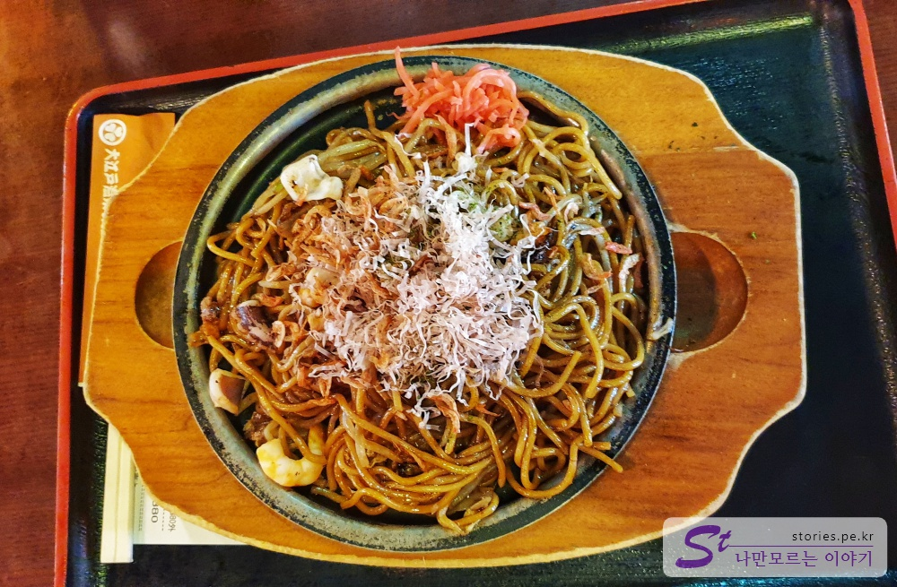

[도쿄여행 4일차]

1. [신주쿠에서 오다이바 갔다가 오는 길](https://stories.pe.kr/328)
1. [오다이바 비너스포트 방문기](https://stories.pe.kr/329)
1. [빛의 축제! 오다이바 팀랩 보더리스 방문기](https://stories.pe.kr/330)
1. [다이버시티와 자유의여신상에서 사진찍기](https://stories.pe.kr/331)
1. [오오에도온천 모노가타리에서 여행 피로 풀기](https://stories.pe.kr/332)

---

도쿄여행의 마지막날 마지막 밤입니다. 여행의 피로를 풀기 위해 마지막 코스로 온천을 찾아 갔습니다.  
도쿄의 유명한 온천중에 하나인 **오오에도온센 모노가타리** 입니다.

오오에도 온천은 국내의 온라인에서 미리 입장권을 구매할 경우 가장 저렴하게 구매를 할 수 있습니다.  
다만 대부분 구매를 하면 환불이 되지 않는다는 단점이 있습니다.  
어떤 곳은 실물 티켓을 집으로 보내주는 경우도 있고, 일본 공항에서 수령하는 방법도 있습니다.
네이버에서 **오오에도온천**을 검색하면 판매하는 곳이 많이 나옵니다.

만약 갈지 말지 잘 모르겠다면 **할인쿠폰**을 준비해서 온천 카운터에 제출하고 할인을 받을 수 있습니다.  
국내에서 구매하는것에 비해 아주 약간 비싸기는 하지만 일정이 확실하지 않을 경우는 좋은 방법입니다.  
  
할인쿠폰은 위의 이미지를 출력하거나 쿠폰의 기간이 지난 상태라면 아래의 웹사이트에 접속해서 프린터기로 출력해서 가지고 가면 됩니다.

> http://jptour.kr

그리고 반드시 쿠폰은 프린터로 출력을 해서 여권과 같이 제출해야 하고 일본사람은 해당 할인을 적용 받을 수 없으니 참고하세요.  
쿠폰은 한장 당 5명이 할인을 받을 수 있습니다.

## 오오에도 온천 가는 방법

오오에도 온천을 가기위해서 직접가는 방법과 셔틀버스를 타고가는 방법이 있습니다.

직접가는 방법은 유리카모메를 타고 아오미역 전에 있는 **텔레콤센터역**에서 내려서 걸어가는 방법이 있습니다.

셔틀버스는 **도쿄텔레포트역**, **시나가와역**, **도쿄역**, **신주쿠역**, **긴시쵸.고토지역** 으로 다니고 있습니다.
**도쿄텔레포트역**외에는 셔틀이 저녁에 일찍 끝나는 편이니 시간을 잘 확인해야 합니다.

우리는 **도쿄 텔레포트역**에서 셔틀을 타고 갔습니다.  
웹사이트에 나온 셔틀타는 곳이 워낙에 햇갈리게 되어 있어서 저희는 많이 헤메다가 결국 셔틀을 한대 놓치고서야 겨우 찾았습니다.

  
셔틀버스 타는 곳에서 바라 본 전경입니다.

  
구글지도에 나온 역앞의 삼각형 형태의 차도는 예전의 형태입니다.  
**2019년 2월**에 방문했을 때는 **사각형** 형태로 도로 공사를 하고 있었습니다. 빨간선을 참조하시면 되고 파란선의 길을 따라 셔틀이 들어옵니다.  
그 상태에서 빨간 점으로 표시한 곳이 셔틀이 서는 곳입니다. 멀리 메가웹 쪽의 관람차가 보이는 곳을 보고 참고하시면 됩니다.  
그리고 꼭 오오에도온천의 마크인 **빨간 세잎 클로버 모양**을 기억하시면 찾는데 도움이 됩니다.

  
셔틀버스 타는 곳에는 이렇게 표지판이 있습니다. 찾을 때는 이게 그렇게 안보이더라구요.

  
셔틀버스는 사진을 찍지 못해 웹사이트에서 찾아서 걸어 놓습니다. 이렇게 생겼습니다.

## 오오에도 온천 입장가기

셔틀버스에서 내리면 먼저 실내로 들어가서 신발을 신발장에 넣고 카운터로 가야 합니다.  
만약 일행이 여러명이라면 한명은 카운터로 가서 줄을 서고 나머지는 신발장에 신발을 넣는 병렬 일처리를 추천합니다.

#### 카운터

카운터에 줄을 섰다가 차례가 되면 본인의 카운터로 갑니다.  
국내에서 실물티켓을 구매했다면 그 티켓을 카운터에 제출하고(여권을 보여줘야하는지는 모르겠네요) 열쇠를 받으면 됩니다.

우리는 할인쿠폰을 들고 갔기 떄문에 미리 프린터로 인쇄한 할인쿠폰 한장과 여권 4장을 제출했습니다.  
비용은 후정산 이기 때문에 여기서 돈을 낼 필요는 없습니다. 직원이 열쇠에 입장 비용을 넣어서 줍니다.

열쇠는 우리나라의 오션월드나 캐리비안베이처럼 음식을 구매할 때나 서비스를 이용할 때 본인의 열쇠로 결제했다가 나중에 나갈때 정산을 하는 시스템으로 되어있습니다.

#### 유카타 선택

그렇게 열쇠를 가지고 바로 옆으로 이동하면 **유카타**를 선택해서 입을 수 있습니다.  
남자는 **1번~4번** 중에, 여자는 **5번~9번** 중에 디자인을 선택 하고 사이즈를 선택하면 됩니다. 그리고 허리띠 까지 선택을 하면 직원이 선택한 유카타를 줍니다.  
유카타를 들고 남자 출입구, 여자 출입구를 통해 탈의실로 들어가서 갈아 입으면 됩니다.

#### 탈의실

나의 모든 것을 홀라당~ 벗고 유카타를 입는 것은 아니고 속옷은 입고 유카타를 걸치면 됩니다. 저도 처음에 무지 고민을 하다가 하마터면 개망신을 당할 뻔 했습니다.
탈의실에서 유카타를 입고 온천 관내로 들어가면 남여가 모두 만날 수 있는 공간이 나타나게 됩니다. 우리나라 찜질방과 비슷하다고 보면 됩니다.

#### 오오에도 온천 관내

탈의실에서 관내로 들어가면 바로 온천이나 목욕탕이 나오는게 아니라 남녀가 모두 모여서 식사도 하고 게임도 하고 휴식도 취하는 공간이 나옵니다.  
실내 인테리어는 옛날 일본 에도시대 때의 테마로 되어 있습니다.

  
가장 중심이 되는 위치에 서있는 건물입니다. 보통 처음 이곳에서 사람들이 많이 만나는 것 같습니다. 가장눈에 뜨거든요.

  
여러가지 다양한 먹거리들이 있습니다. 메뉴판에 사진이 있어서 주문하는데는 어렵지 않습니다.

  
이름이 생각이 안나는데 무슨 복음면 비슷한 것입니다.  
저는 카레를 시켰구요. 돈까스도 있습니다.

  
한식도 있습니다. 결국 마지막 날에 참지 못하고 한식도 시켰습니다.  
떡볶이가 한국보다 비싸기는 했지만 주위의 다른 음식가격과 비슷해서 그냥 사먹었습니다. 맛이 없었지만 정말 맛있게 먹었습니다. 전 역시 한국사람인가 봅니다.

한쪽의 통로를 이용하면 실외의 세족탕을 나가는 길이 있습니다. 겨울에는 어깨에 걸칠 수 있는 외투를 비치해 놓고 있어서 하나 걸치고 나갔습니다.  
발은 따뜻하고 몸은 차가우니 좀 색다른 느낌이였습니다. 다만 바당에 지압효과로 자갈을 박아 놓았는데 정말 발바닥이 빵꾸날 정도로 아팠습니다.  
결국 한바퀴 돌지도 못하고 입구쪽 앉아서 있다가 다시 실내로 들어왔습니다.

  
일본은 군소 지역 아이돌이 많은가 봅니다. 여기도 오오에도 아이돌이라고 조그만 여자애들이 나와서 춤을 추며 노래 부르고 공연을 하는데, 상당히 아마추어 같은 느낌이 납니다.
이걸 보니 우리나라의 아이돌이 대단해 보이더 군요.

  
본격적으로 온천을 즐길 수 있는 목욕탕에 들어가는 곳입니다. 남녀의 입구가 따로 있고 들어가서는 유카타와 속옷을 모두 벗고 목욕을 즐기면 됩니다. 떄를 미는 사람은 없으니 때를 밀지는 마세요. ㅋ  
목욕탕은 사진 촬영이 불가해서 사진은 없습니다.  
목욕탕 안쪽에는 노천으로 나가서 즐길 수 있는 노천탕도 있고 물 마사지도 있습니다.

그렇게 목욕을 하고 열쇠를 이용하여 우유를 하나 뽑아먹어 봤습니다. 역시 시원하더라구요.

## 비용

## 입장시간

- 시작시간 : 오전 11:00
- 마감시간 : 익일 09:00  
  만약 02:00 이후 퇴장하시는 경우 2,160엔을 추가 요금이 있습니다.  
  온천에서 하루를 보내고 다음날 공항으로 갈 여정이라면 비용추가를 참고하시는 것이 좋습니다.

## 여행지 정보

- 주소 : 2 Chome-6-3 Aomi, Kōtō-ku, Tōkyō-to, Japan 135-0064
- 연락처 : 81 3-5500-1126
- URL : https://goo.gl/maps/8kqbLvH181S2

---

[도쿄여행 4일차]

1. [신주쿠에서 오다이바 갔다가 오는 길](https://stories.pe.kr/328)
1. [오다이바 비너스포트 방문기](https://stories.pe.kr/329)
1. [빛의 축제! 오다이바 팀랩 보더리스 방문기](https://stories.pe.kr/330)
1. [다이버시티와 자유의여신상에서 사진찍기](https://stories.pe.kr/331)
1. [오오에도온천 모노가타리에서 여행 피로 풀기](https://stories.pe.kr/332)
