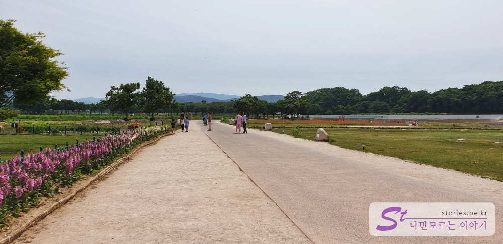

경주에서 부담없이 방문할 수 있는 장소 중에 하나가 첨성대이다. 화창한 여름같은 봄날이라면 꼭 한번 찾아봐야 할 곳이다. 
  

첨성대는 신라의 수도였던 반월성의 동북쪽 평지에 선덕여왕이 별들을 관찰하여 농사의 시기를 예측하기 위해 건립했다고 한다. 농사의 시기를 예측한다는 것은 정권을 강화하는 방법중에 하나라고 한다.  
차가운 목적으로 건립이 되긴 했으나 어찌되었든 현재의 첨성대는 한국인이라면 수학여행의 필수 코스로 한번쯤은 방문해 봤을 추억이 담긴 건축물이 되었다.  
필자도 그러한 추억을 안고 짧은 시간 경주를 방문할 기회가 주어졌을 떄 방문하게 되었다. 

   
5월의 첨성대로 가는 길은 봄꽃들과 같이 할 수 있다. 아직은 풍성하게 가득찬 꽃들을 볼 수 는 없지만 아직 숙녀가 되기 전 소녀의 모습을 한 꽃들을 만날 수 있다.  

   
꽃양귀비 꽃에서 바라보는 첨성대는 예전 추억을 떠올리게 하기에 충분한 모습을 보여준다. 
> 양귀비와 꽃양귀비는 같은 양귀비과의 식물이기는 하지만 꽃양귀비는 법적인 문제가 없이 재배가 가능하다. 

햇볕이 따뜻하게 내리쬐는 한낮에 방문해 보는 첨성대도 추억이 돋지만 해가져서 조명이 비추는 첨성대 또한 다른면을 볼 수 있다. 

첨성대 안으로 들어가기 위해서는 입장료는 무료이며 반려동물은 입장을 할 수 없다.

