우연한 기회에 경주를 방문할 일이 있어서 가성비로 알려진 캔싱턴리조트를 방문했습니다. 홈페이지를 보고 판단할 때 펜션의 경우는 복불복이 있는 반면 리조트는 기본은 하는지라 가성비 리조트로 알려진 캔싱턴리조트에서 1박을 머물렀습니다.

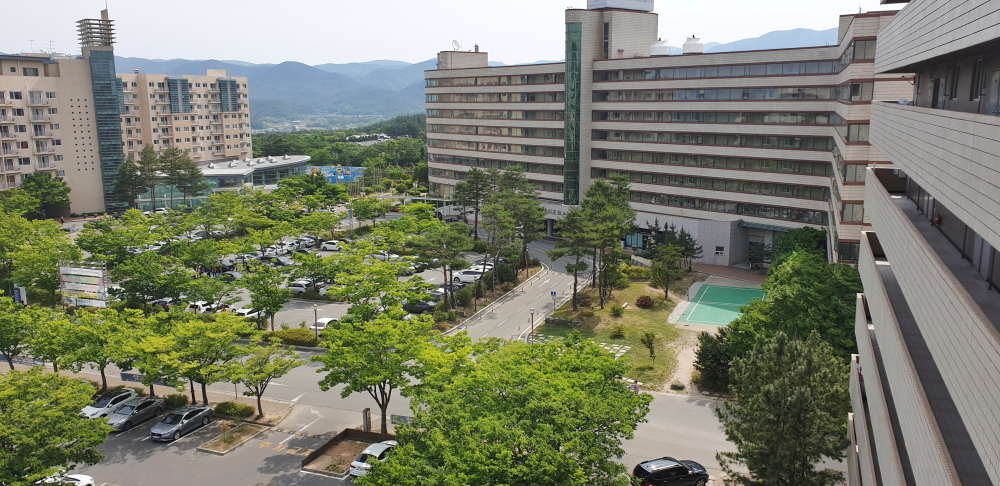  
이랜드 계열에 속해 있는 캔싱턴리조트라 관리에 기본은 할 줄 알았으나 다소 기대에 미치지는 못했습니다.

건물은 한화리조트와 마주보는 위치에 있으며 본관과 서관 2개의 동으로 이루어져 있습니다. 리셉션은 본관에 있으므로 차량을 타고 들어갔을 때 오른쪽에 있는 본관 건물로 먼저 입장을 하면 됩니다.  
저희는 서관 7층으로 배정을 받았습니다. 올라가는길에 바라 본 7층에서의 풍경은 정말 멋있었습니다.

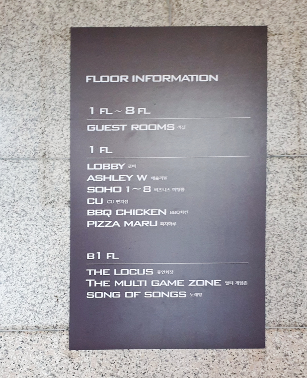  
1~8층은 숙소로 되어있고 1층은 로비와 애슐리, 편의점, 피자, 치킨점이 있습니다. 지하에는 주차장과 노래방 게임장이 있습니다.

### 숙소 내부

저희는 **패밀리B** 숙소를 예약했습니다. **패밀리B**는 거실, 주방, 침실, 화장실로 구성되어 있습니다.

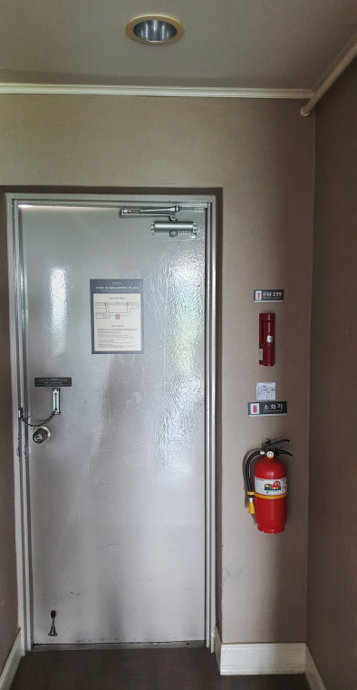  
현관을 들어서면 다른 리조트와는 달리 상당히 레트로한 분위기를 느낄 수 있습니다. 보통은 카드키로 열고 들어가지만 여기는 열쇠로 열고 들어가야 합니다. 보조 잠금장치도 상당히 레트로 합니다.

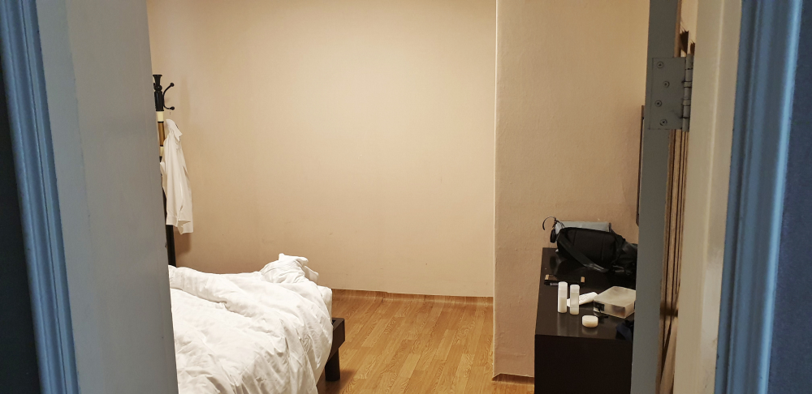  
현관을 들어서면 보이는 첫번째 방인 침실입니다. 침대방이 있고 온돌방이 있는데 저희는 침대방을 선택했습니다. 침실에는 침대와 화장대, 옷장이 있습니다. 옷장에는 바닥에 깔고, 덮고 잘 수 있는 각각 3장의 이불이 있습니다.

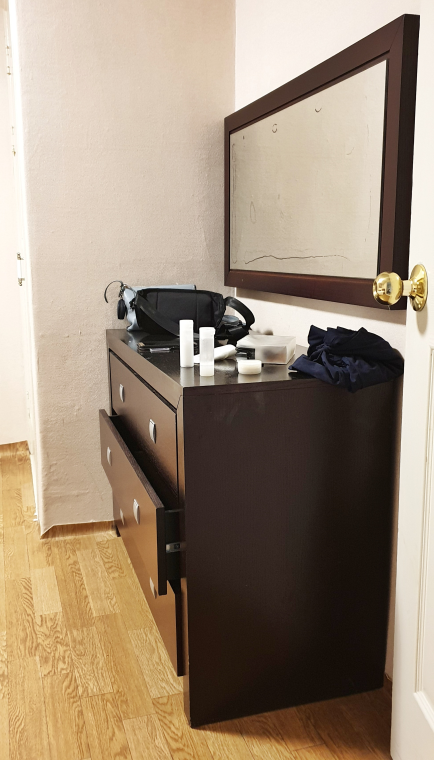  
숙소가 워낙 오래되다 보니 다들 많이 낡았습니다. 거울도 많이 기스가 났네요. 저렴한 만큼 유지보수에 신경을 쓰지 않은 모습입니다.

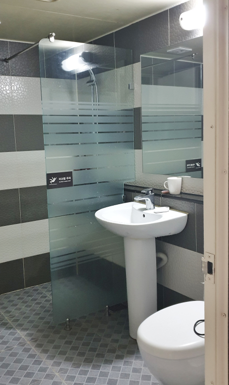  
화장실입니다. 샤워기와 세면대 대소변기가 있으며 샤워기 물은 할아버지 오줌싸는 것 처럼 시원하게 나오지는 않습니다.  
수건은 1박에 4장을 줍니다. 2일차 때는 4장을 다시 달라고 하면 줍니다.

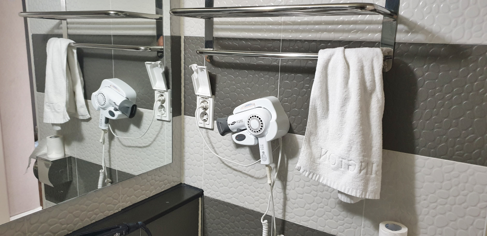  
작지만 헤어드라이기도 있습니다.

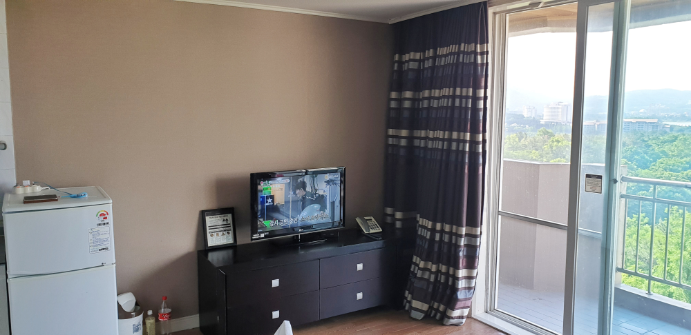  
화장실을 지나면 바로 거실이 나타납니다. 거실과 주방이 같이 붙어있습니다. 거실에는 사다코가 나올것만 같은 올드한 TV가 한대 놓여있고 간략한 객실 이용안내가 놓여있습니다. TV옆에는 조그만 냉장고가 하나있는데 처음에는 전원이 꺼져있으니 입장을 하면 먼저 냉장고부터 전원을 켜야 합니다.  
오른쪽으로 고개를 돌리면 정말 녹음이 가득한 풍경을 볼 수 있습니다. 리조트는 조금 낡아서 실망스럽지만 풍경이 충분히 만회를 해 줍니다. 풍경은 정말 멋집니다.

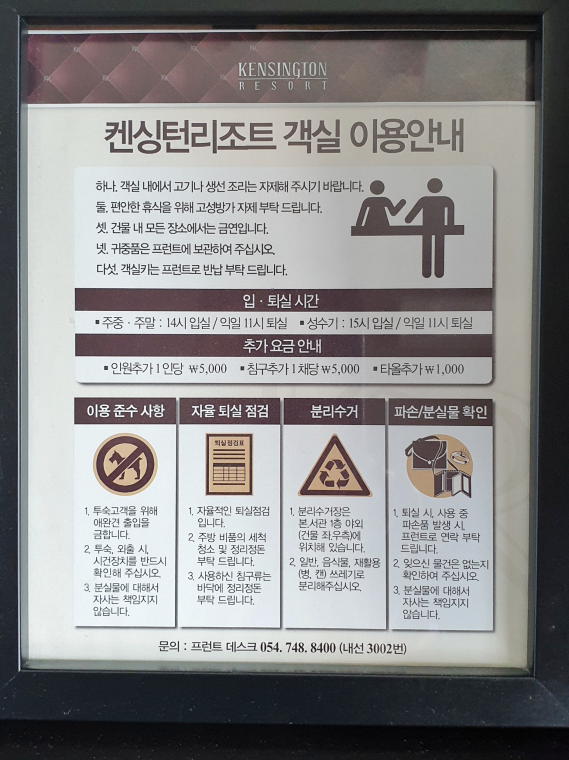  
객실 이용안내를 보면 객실내에서 생선이나 고기를 굽지말라고 하고 고성방가를 하지 말라고 합니다. 금연하시구요. 애완견은 들어올수 없다고 하네요..

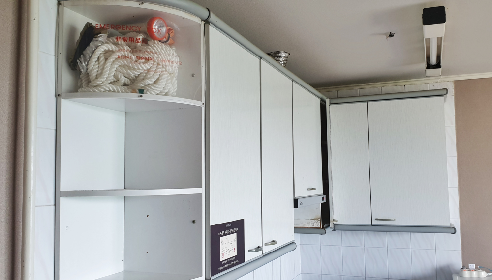  
고개를 다시 왼쪽으로 돌리면 주방이 거실과 같이 있습니다. 보시면 아시겠지만 상당히 낡았습니다. 소방법때문인지 화재가 났을때 탈출할 수 있는 로프와 손전등이 있네요.

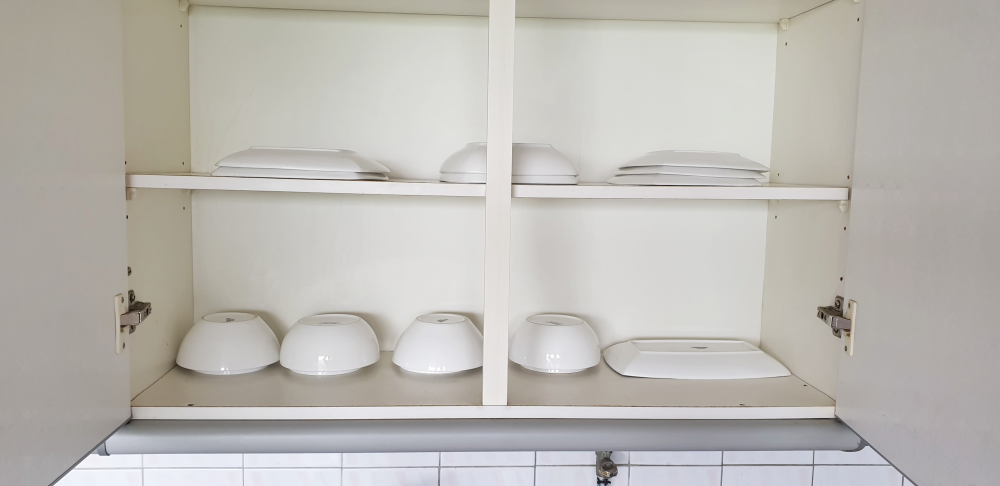  
상단 수납장에는 4인분의 식기세트가 있습니다. 그냥 사용은 못할 것 같고 다시 한번 씻어서 사용해야 할것만 같은 분위기 입니다.

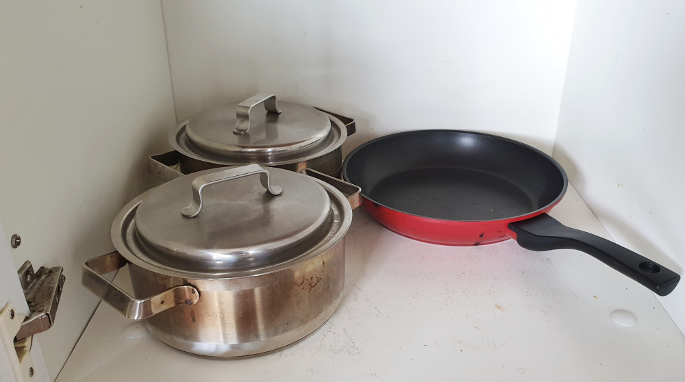  
하단 수납장에는 냄비 2개와 후라이펜이 하나 있습니다. 이것 역시 한번 씻어 써야 할것 같아요.

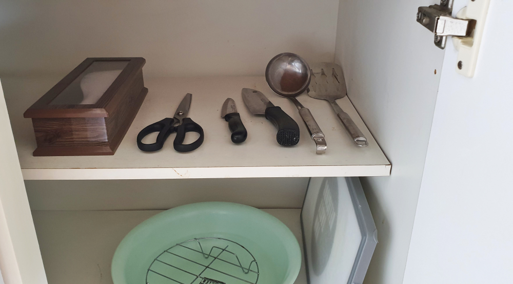  
수저나 가위, 칼 등 도구가 있습니다. 이것 역시 지저분합니다. 쓰고 싶은 마음은 들지 않아요.

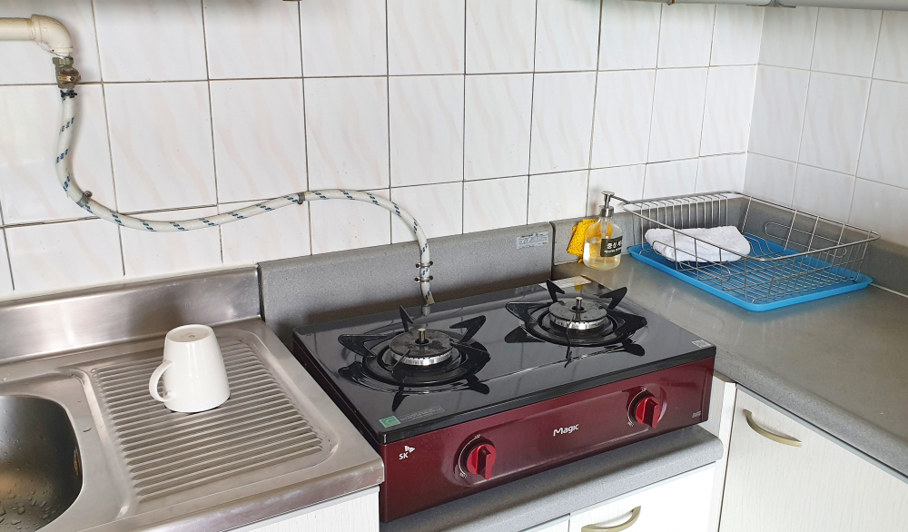  
다른 리조트의 경우는 화재 예방을 이유로 전기레인지로 바뀌는 추세인데 여기는 가스레인지를 새로 교체한것 같습니다. 식기세트도 좀 바꾸지..

## 비용

리조트 치고는 저렴합니다. 회원이 아니더라도 인터넷에서 구매를 하면 비수기 1박에 10만원 안팎입니다. 일반 리조트가 보통 20~40만원정도 하는 것에 비하면 가성비가 뛰어 나다고 할 수 있습니다. 물론 그에 따른 깔끔하지 않음은 감안해야 합니다.

## 입장시간

- 시작시간 : 14시
- 마감시간 : 11시

## 여행지 정보

- 주소 : 경북 경주시 보문로 182-29
- 연락처 : 054-748-8400
- URL : http://www.kensingtonresort.co.kr

## 총평

아마도 성수기 때 경주로 수학여행을 오는 단체 손님이 주요 고객인 듯 합니다. 객실 청결에 민감한 사람이라면 가지 마세요. 단지 가성비에 민감하고 저녁에 잠만 자는 용도로 생각하시는 분에게 추천하는 리조트입니다.
