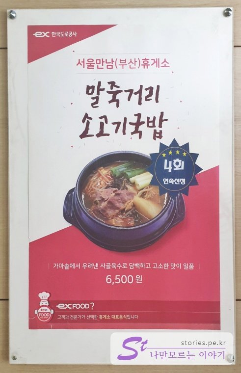
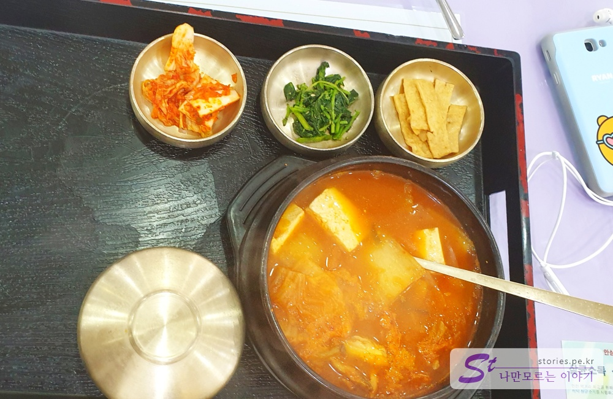
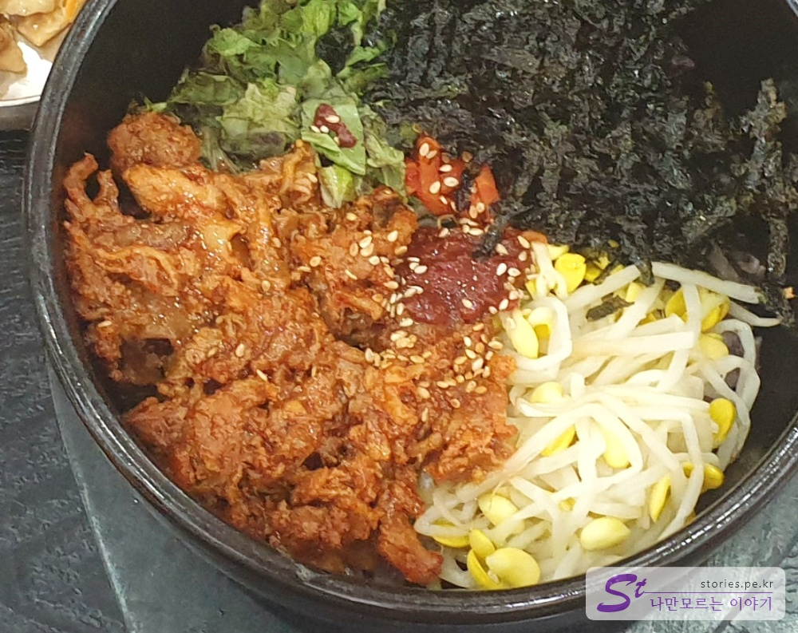
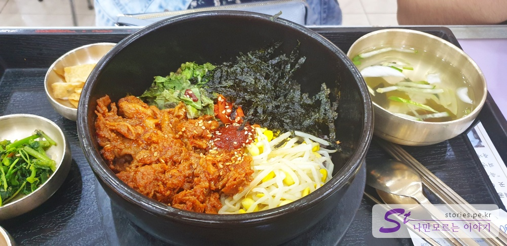
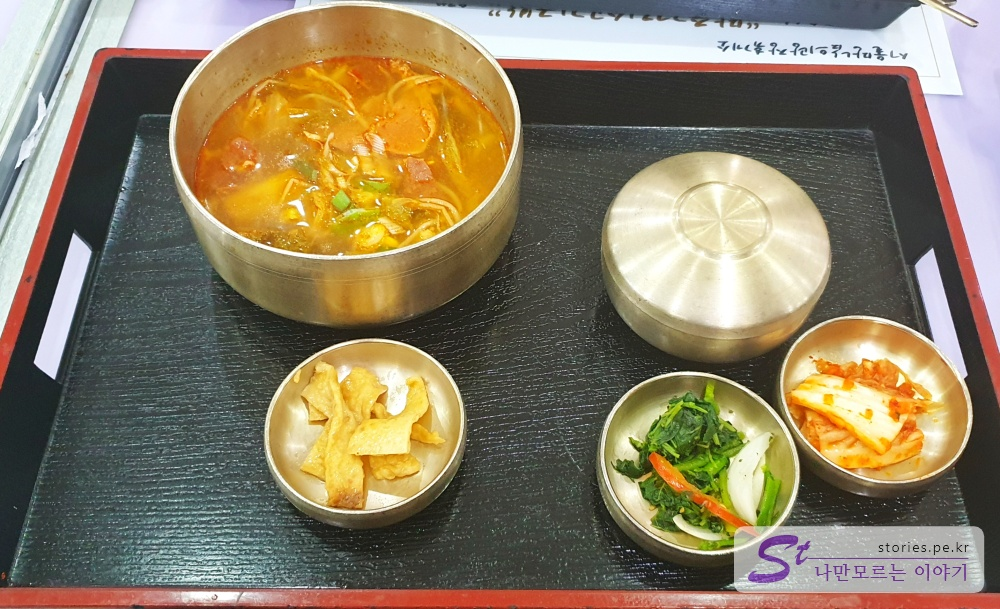
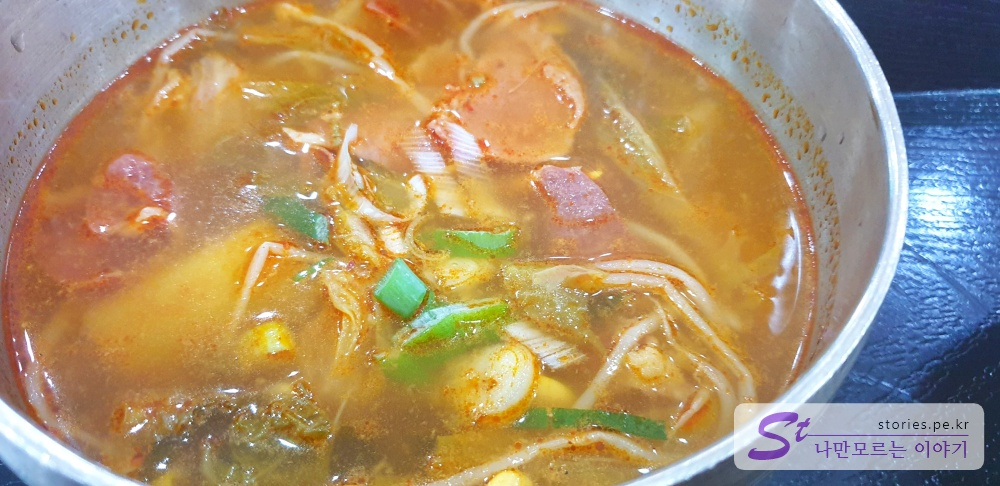
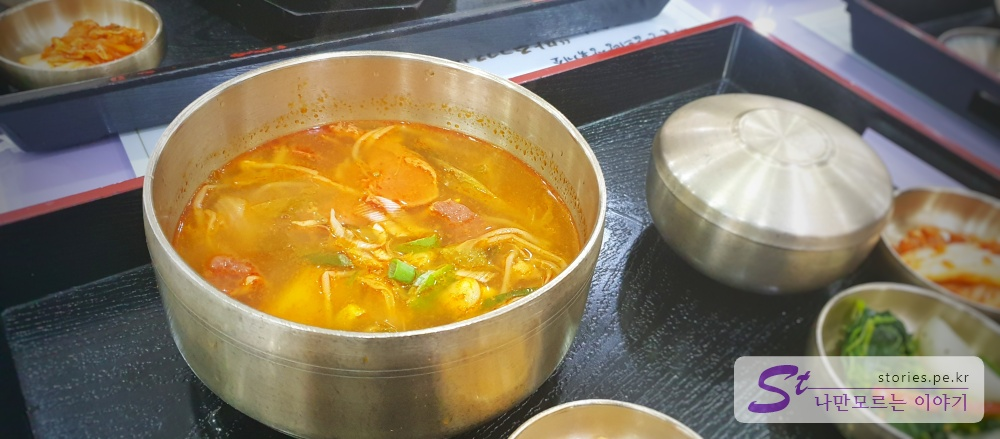

한국의 고속도로 휴게소는 세계에서도 알아 준다고 하는데요. 고속도로의 오아시스라고 할 수 있는 휴게소의 맛집에 대해서 소개해 볼까합니다.
이번 여름은 마땅히 여름휴가를 갈 수 없어서 그냥 여행 기분이라도 내기 위해 당일치기로 고속도록 휴게소 투어를 다녀오기로 했습니다.

**경부고속도로**의 첫 출발점이라 할 수 있는 **서울 만남의 광장**을 들렀다가 **영동고속도로**로 갈아타고 가다가 **덕평자연휴게소**를 지나 **중앙고속도로**를 타고 춘천 **일점오 닭갈비**를 먹고 집으로 오는 코스를 잡았습니다.

이번 포스팅에서는 첫 출발점인 **서울 만남의 광장**의 휴게소 음식을 간단히 소개해 볼까 합니다.

## 대표 메뉴와 가격(가성비)

대표 메뉴는 이영자씨가 극찬을 아끼지 않은 **말죽거리 소고기 국밥**이라 할 수 있습니다.  
  
한국도로공사에서 주최한 휴게소 음식에서 4회 연속 선정되었다는 광고판도 붙어 있습니다.

## 먹어본 음식

저희가 먹어본 메뉴는 **김치찌개**, **제육돌솥비빔밥**, **말죽거리 소고기 국밥**, 먹어봤습니다.

### 김치찌개

  
김치찌개는 김치찌개와 김치, 나물, 어묵볶음, 밥이 제공됩니다.  
김치찌개는 그다지 추천하지 않습니다. 웬만하면 김치찌개는 실패하기 힘든데..
너무 조미료로 맛을 낸 듯한 느낌이고 국물이 묽습니다. 찌게가 아니고 국이라고 하면 이해가 가지 않을까 하네요. 비추비추~~

### 제육 돌솥 비빔밥

  
제육 돌솥 비빔밥은 약간 호불호가 갈릴 수 있습니다. 맛은 강하게 볶은 제육 때문에 비볐을 경우 전체적으로 진한 맛이 납니다.
비빔밥에 있는 각각 제료 본연의 맛을 느끼는 것을 좋아하는 사람이라면 불호일 것이구요. 매콤하고 진한 맛을 좋아하는 사람은 좋아할 맛입니다.

  
반찬은 김치찌개와 동일하게 나옵니다.

### 말죽거리 소고기 국밥

가장 기대를 했던 메뉴입니다. 이영자씨가 방송에서 소개를 했기 때문이죠.

어디서 많이 보던 국밥의 형태입니다. 반찬도 다른 한식과 동일하게 나오구요

  
국밥의 비주얼은 그냥 평범합니다. 아주 빨갛지도 않고 그렇다고 묽지도 않습니다. 딱 적당합니다.

  
맛은 휴게소 음식치고는 괜찮은 맛입니다. 너무 짜지도 않고 싱겁지도 않고 깊은 맛이 납니다.  
같이 먹은 가족들도 국밥이 제일 맛있다고 손을 들어주네요.

이영자씨가 추천할 만한 맛이네요. 이거 드세요.. **추천추천!!!**

## 식당과 주차 정보

- 주소 : 서울 서초구 양재대로12길 73-71 고속도로 위 휴게소
- 연락처 : 02-578-3372
- 영업시간(휴무일) : 연중무휴
