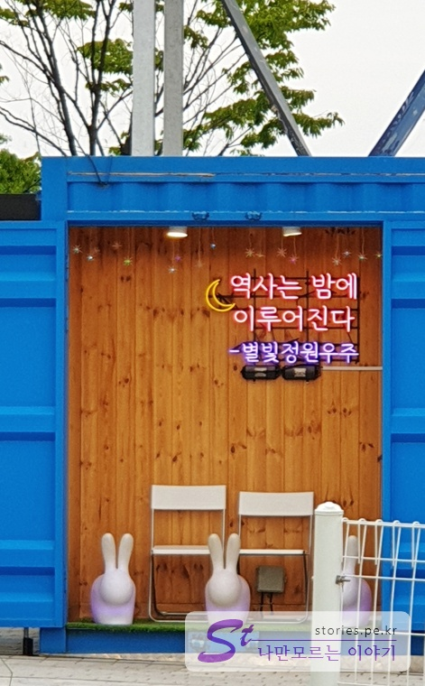

여행은 못가고 하루 날잡아 고속도로 휴게소 탐방만 다녀왔습니다. 먼저 경부고속도로에 있는 만남의 광장에서 이영자씨가 추천한 [말죽거리 소고기 국밥](https://stories.pe.kr/350)을 먹고 덕평자연 휴게소로 이동했습니다.

> [[휴게소 탐방] 이영자의 휴게소 맛집 - 서울만남의 광장(feat.이영자)](https://stories.pe.kr/350)

덕평자연휴게소는 국내에 손꼽히는 휴게소라 할 수 있습니다. 제 기준으로는 여러가지 면에서 최고의 휴게소가 아닐까 합니다. 비교적 최근에 생긴 내리천휴게소도 시설면에서는 좋으나 덕평휴게소는 시설, 관리, 운영, 음식맛에서 모두 상위에 랭킹할 만 합니다.

  
영동고속도로에 위치한 덕평휴게소는 상행(인천방향)과 하행(강릉방향)이 자동차를 기준으로는 분리가 되어 있으나 사람 기준으로는 동일한 휴게소를 사용합니다. 휴게소가 가운데 있고 휴게소를 기준으로 북쪽은 하행, 남쪽은 상행의 차량이 주차를 하게 되어 있습니다. 덕평휴게소에서는 톨게이트 비용을 지불하면 상행과 하행을 변경할 수 있는 길도 있습니다.

덕평 휴게소에는 **별빛정원 우주**도 있고 개들의 놀이터인 **달려라 코코**와 **Y garden 휴**도 있습니다. 이러한 것들이 덕평휴게소를 더 풍성하게 하는 것은 아닌가 합니다.

### 별빛정원 우주

별빛정원 우주는 덕평휴게소 주차장에서 가든을지나 위쪽으로 5~10분정도만 위로 올라가면 나옵니다.

  
정말 제대로되느 별빛정원우주를 즐길려면 해가 진 저녁에 와야 합니다. 조명이 멋있게 되어 있더라구요. 저희는 여름이라 6시쯤에 갔지만 날이 너무 환해서 조명이 켜지지는 안았습니다.

  
그래서 주간에 방문할때는 건물 내부에서 티켓 구매를 할 수 있고 외부 산책은 무료로 할 수 있습니다. 그래도 낮에는 별로 볼것은 없어요.

  
보통 계절별로 운영시간이 다릅니다. 근대 이 운영시간과도 꼭 맞는 것은 아닌것 같아요. 우리가 여기에 7시정도까지 있었는데 그때까지도 낮이 너무 밝았거든요.
가격은 주간과 야간이 거의 2배정도 차이가 나고 여러가지 할인요소가 있으니 잘 찾아보시고 입장하시면 가격을 좀 절약할 수 있습니다.

  
별빛정원우주 입구 바로 앞에는 우주타워가 있습니다. 별빛정원에 들어가지 않고 타워만 이용할 수도 있습니다.  
이 우주타워의 핵심은 커피를 들고 타워 꼭대기에서 마실 수 있다는 것입니다.

이용료는 성인 일반 기준으로 12000원하고 있으며 카페음료가 포함된 가격입니다. 이 음료를 들고 타워꼭대기에서 카페에 온것 처럼 마실 수 있습니다.

  
커피, 음료뿐만 아니고 빙수도 사서 먹을 수 있습니다. 공중카페라 할 수 있겠습니다.

  
우주타워의 전체 모습입니다. 아래의 의자에 앉으면 위로 상승해서 공중에서 커피나 음료, 빙수를 먹을 수 있습니다. 의자 앞에는 테이블도 같이 있습니다.

  
별빛정원우주를 구경하고 이제 휴게소 방향으로 내려오게 되면 우측에는 애견 놀이터인 **달려라 코코**가 있고 좌측으로는 **Y Garden 휴**가 있습니다.

### 애견놀이터 달려라 코코

달려라 코코는 상당히 넓은 잔디밭에서 강아지들과 견주들이 같이 뛰어 놓 수 있는 곳입니다.

  
달려라 코코의 입구입니다. 가격은 대략 견주와 개 모두 6000원~8000원의 가격대를 형성하고 있습니다.

  
넓게 펼쳐진 잔디밭만 봐도 힐링이 될 것 같습니다. 견주들이 쉴수 있는 의자와 테이블도 있고 강아지가 뛰어 놀 수 있는 놀이 시설도 있습니다.

  
달려라 코코는 아래 홈페이지에서 더 많은 정보를 볼 수 있습니다.

> [달려라 코코](https://www.runkoko.com/)

### Y garden 휴

내려오는 길의 좌측으로는 Y Garden 휴가 있습니다.  
   
 Y garden 휴의 본거지는 돔모양의 건물이고 곧곧의 정원을 전문가의 손길로 다듬어 놓은 것 같습니다.

  
입구쪽에는 더 정돈되고 아름답게 꾸며져 있습니다. 이곳에서 여러가지 허브제품이나 식물들을 판매하고 있습니다. 한번쯤 들어가서 구경하고 구매할 만합니다.

  
다른 휴게소와 달리 덕평자연휴게소는 산책을 할 수 있는 정원이 있습니다. 여행을 하다가 잠간 들리는 곳이 아니라 일부러 찾게되는 휴게소라고 할 수 있습니다.

  
30분정도 천천히 걷으면서 힐링의 시간을 가질 수 있습니다.

## 맛집

아쉽게도 이영자씨가 덕평휴게소의 맛집 소개는 없었던것으로 알고 있습니다.
하지만 덕평휴게소의 음식점도 어느정도 기본은 하기 때문에 어느것을 먹든지 실패하지는 않을듯 합니다.

## 기타사항

덕평휴게소는 일부러 휴게소를 즐기기 위한 목적으로 방문하기에 좋은 휴게소 입니다.
들렀다가 10분~20분 화장실만 들렀다가 갈 곳이 아니라 30분~2시간정도 시간을 두고 즐길 만한 곳입니다.

## 여행지 정보

- 주소 : 경기 이천시 마장면 덕이로154번길 287-76
- 연락처 : 031-645-0001
- URL : https://www.dpecoland.com/
