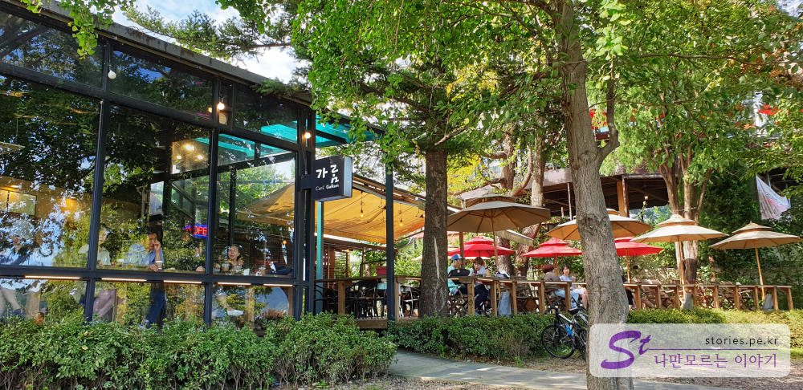

이제 아침과 저녁에는 날씨가 쌀쌀해 진 것을 보니 여름이 가고 가을이 오고 있는 것 같습니다. 가을을 즐기러 하루 휴가를 내고 집사람과 양평에 있는 **두물머리**를 다녀왔습니다. 얼마 전에 매스컴을 보니 두물머리가 **가을에 가봐야 할 여행지** 중 높은 순위를 차지한 것을 봤습니다. 다녀와 보니 역시나 너무 멋졌습니다.~

**두물머리**라는 뜻은 북한강과 남한강의 두 물이 만나는 지점이라 이름이 붙었다고 합니다.

## 주차할 곳

두물머리에는 주차할 곳이 크게 3군데가 있습니다.

### 두물머리 공영 주차장

초입에 있는 공영 주차장은 두물머리와 거리가 좀 있어서 5~10분정도를 걸어야 세미원이나 두물머리에 도착할 수 있습니다. 이 주차장은 **무료로 운영**되고 있습니다.  
북한강변을 따라 천천히 구경하면 올라가면 나름 운치는 있으나 연로하신 분이나 도저히 걷는 것이 싫다면 여기는 패스하고 차를 타고 좀더 위로 올라가시면 됩니다.

### 두물머리 공용 주차장

공영주차장과 공용주차장의 명칭차이가 있는데 초입에 있는 공영주차장은 행정관청이 주최가 되어 운영되어지는 곳이고 공용주차장은 이용권한이 여러 곳으로 분할되어 동시에 다른 용도 다른 점유 형태로 사용가능한 경우 라고 합니다.
  
두물머리 공용 주차장은 양수대교 밑에 있어서 찾기가 쉽습니다. 주말이나 휴일이 아니라면 여기도 주차하기 어렵지 않습니다. 이 곳도 **무료로 운영**되고 있습니다.

### 두물머리 민영주차장 (두물머리 느티나무 주차장)

두물머리와 가장 가까운 위치에 자리잡고 있어서 두물머리 이용하기가 가장 좋습니다.  
그러나 민영이라 **하루 2,000원**의 주차요금을 받습니다. 돈 보다는 편리성을 윈하신다면 이곳을 이용하는 것도 좋은 방법입니다. 다만 휴일이나 성수기때는 이곳도 가득찬다고 합니다.

> 가장 추천하는 주차장은 다리밑에 있는 공용주차장입니다. 거리도 그렇고 위치도 그렇고 다리밑이라 주차 환경도 좋습니다.

저희도 다리밑 공용주차장에 주차를 하고 세미원 방향으로 걸어 갔습니다.

  
신양수대교 옆에 있는 세미원으로 가는 다리가 보입니다. 가보고 싶었으나 저희는 강아지도 데리고 가는 바람에 입장을 할 수 없었습니다. 강아지는 출입금지라고 하네요.

  
세미원 들어가는 입구만 보고 바로 지나쳐서 두물머리 느티나무쪽으로 이동했습니다.

  
"당신의 건강은 안녕하십니까?"라고 기둥과 기둥의 빈공간 사이의 틈 넓이를 다르게 하여 날씬한 사람과 뚱뚱한 사람을 편 가르는 아주 나쁜 목적의 시설물이 있습니다. 흥!!!..
나쁜 목적으로 만들어졌지만 많은 사람들이 이용하더라구요. 사람없을 떄 겨우 사진 찍었네요..

  
가는길에 운치있는 연잎밭이 있습니다. 연꽃이 핀다면 더 멋진모습을 볼 수 있을 것 같습니다.  
강아지를 데리고 산책오시는 분들도 많습니다.

  
두물머리의 가장 끝쪽에 있는 커다란 느티나무가 있는 곳입니다. 두물머리의 핫플레이스 입니다.

  
두물머리의 첫번쨰 포토스팟입니다. 가을하늘이 너무 멋져요.

  
카페로 가는 길입니다. 가는 길의 경치과 하늘이 너무 멋지네요.

  
카페촌의 첫번째에 나오는 카페 만경입니다. 총 3층으로 되어 있고 강을 바라 볼 수 있게 되어 있습니다. 멋진 전망...

  
1층으로 운치있게 커피를 마실 수 있는 카페들도 몇군데 있습니다.

  
카페 앞에는 특이한 형태의 의자도 있습니다. 서로 붙어 앉을 수 있게 가운데로 기울어진 의자입니다. 집사람과 사이좋게 앉아봤습니다. ㅋ

  
두물머리의 마지막 지점입니다. 이곳에 공용화장실도 하나 있습니다.  
마지막 지점이긴 하지만 사람들이 별로 없는 한적한 길은 있습니다. 두물머리 섬을 한바퀴 돌아서 갈 수 있습니다.

  
억지로 스토리를 만들려고 했는지는 모르겠지만 소원을 들어주는 나무라고 하네요.

  
두물머리의 액자형태의 포토스팟입니다. 많은 사람들이 이곳에서 다양한 포즈로 사진을 찍습니다.

## 비용

두물머리의 입장료는 무료입니다. 다만 세미원을 들어가려면 4000원의 입장료가 있습니다.
주차를 편하게 하시려면 하루 주차비가 2000원입니다.

## 여행지 정보

- 주소 : 경기 양평군 양서면 양수리
- 연락처 : 031-770-1001

## 기타사항

근처에 양수리 전통시장이 있습니다. 5일장이라 끝 날짜가 1일과 6일이 들어간 날에는 장이 열립니다. 예를 들면...  
**9월 `1`일**, **9월 `6`일**, **9월 1`1`일**, **9월 1`6`일**, **9월 2`1`일**, **9월 2`6`일**...
이 날짜에 장이 열린다고 보시면 됩니다.
날짜가 맞는다면 5일장도 구경해 보시는 것도 좋을 듯 합니다.
