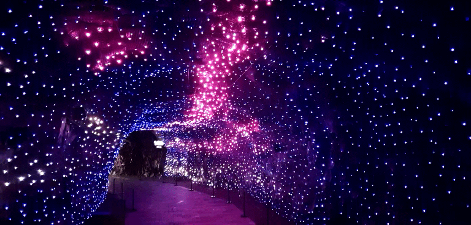

평일 한적한 가을날 광명동굴을 다녀왔습니다. 주말이나 휴일인 경우는 사람들이 상당히 많이 찾아온다고 하는데 우리가 방문한 날은 평일이라서 그런지 사람이 별로 없었습니다.

## 주차 정보

광명동굴의 정식 주차장은 3곳이 있습니다. 1, 2주차장은 원래 주 출입구인 서쪽 출입구를 이용하기에 좋은 주차장이고 3주차장은 최근 개방한 산 뒤편의 동쪽 출입구를 이용할때 주로 사용됩니다.

**제 1주차장**과 **제 2주차장**은 거의 동일한 위치에 있습니다. 제 1, 2주차장을 지나 안쪽으로 조금 더 가면 우리가 이번에 이용한 광명동굴과 가장 가까우면서 방문객이 없을 때 주로 이용할 수 있는 **자원회수시설 주차장**이 있습니다.  
제 3주차장은 아예 다른 곳에 위치해 있습니다. 산 뒤쪽, 동굴의 반대편 쪽에 있는 동쪽 출입구를 이용할 수 있는 주차장입니다. 제 3주차장과 광명동굴 동쪽 출구와는 거리가 꽤 있는 편인데 광명동굴에서 15분 간격으로 코끼리차를 운영하고 있습니다. 올라올때는 오르막이라 꼭 코끼리차를 이용하는 것이 좋고 내려갈떄는 내리막길이라 산책을 하듯이 천천히 걸어내려가도 좋습니다.
아이들이 있다면 코끼리 차 자체가 즐길거리중에 하나게 될것도 같습니다.

**주차비**는 자원회수시설 주차장, 제1, 2 주차장 모두 대형차는 4,000원, 중소형차는 3,000원 친환경차 등은 2,000원의 비용을 **후불**로 받습니다.
반면에 **제 3주차장은 무료**입니다. 대신에 코끼리차를 이용하는데 성인 편도 2,000원, 어린이 1000원의 비용이 발생합니다.

## 주차장에서 광명동굴로 이동하기

  
우리는 **자원회수시설 주차장**에 주차를 했습니다.
자원 회수 시설이라는 혐오시설을 조금이라도 친근해 보이게 하기 위해서 전체를 분홍색으로 칠해 놓은 건물을 지나서 횡단보도를 건넙니다.

  
광명동굴로 가기 위해서는 산 위쪽으로 올라가야하는데 2가지 길이 있습니다.
오른쪽에는 힘들지만 경사로를 빠르게 올라갈 수 있는 **빠른 길**과 왼쪽에는 시간이 조금 걸리지만 천천히 걸어 올라갈 수 있는 **정다운 길**이 있습니다.

> 올라갈때는 정다운 길, 내려올때는 빠른 길을 추천합니다.

  
정다운 길로 올라가는 중 조경을 하고 있는 모습을 볼 수 있습니다. 산책한다 생각하고 올라가시면 그렇게 힘들지 않게 올라갈 수 있습니다.

그렇게 올라오면 제 1매표소를 만날 수 있습니다.  
매표소도 주차장과 마찬가지로 곳곳에 3곳의 매표소를 운영하고 있습니다. 사람이 많이 않은 경우는 2, 3매표소는 운영을 하지 않는 것 같습니다. 우리가 갔을떄도 제 1매표소만 운영하고 있었습니다.

  
입장료는 광명동굴과 라스코 전시관, 2개를 같이 이용할 수 있는 통합권으로 구성되어 있고 어른 6,000원, 청소년 3,500원, 어린이 2,000원의 비용을 받습니다.
운영시간은 오전 9시에서 저녁 6시까지(5시 입장) 이용을 할 수 있습니다.

  
저희는 2인이 이용했고 원래는 12000원이였으나 [광명시청 카톡친구](https://pf.kakao.com/_pJxdBxl/39584273)를 신청하여 20%할인받아서 9600원에 이용을 했습니다.

  
제 1매표소에서 개울을 따라 올라가면 광명동굴 입구로 이동할 수 있습니다.

## 광명동굴 탐험

  
얼마 올라가지 않아 동굴 입구에 도착할 수 있습니다. 매표소에서 구매한 입장료를 제출하고 입장을 합니다.  
음료수는 가지고 들어갈 수 없기 떄문에 입구에 있는 음료수 보관대에 놔두고 입장을 할 수 있습니다

  
드디어 동굴로 들어왔습니다. 들어오자 마자 바람길을 만날 수 있습니다. 바람길을 따라 1~2분정도 들어가면 웜홀광장을 만날 수 있습니다.

### 웜홀광장

  
바람길을 지나면 아주 밝고 느낌있는 웜홀광장을 만날 수 있습니다. 이 웜홀 광장이 광명동굴의 중심점입니다. 제 1출입구나 제 2출입구로 들어오더라도 이 웜홀 광장에서 관람을 시작하게 됩니다.

  
우리는 바람길을 따라 제 1출입구로 들어왔고 반대편의 제 2출입구는 와인동굴을 지나서 들어올 수 있습니다.  
어쩨튼 웜홀광장에서 시작해서 한바퀴 돌아 다시 웜홀광장으로 돌아 오는 코스 입니다.

  
처음 빛의 공간을 지나갑니다. 여러 조명들로 아름답게 꾸며져 있습니다.

  
조금 안쪽으로 들어가 다보면 동굴 예술의 전당을 만날 수 있습니다.

  
동굴 예술의 전당은 동굴 내부의 넓은 공간에 의자를 마련해 놓고 동굴 벽면을 이용하여 공연을 보여주고 있습니다.
저희가 도착했을 때는 운이 좋게도 **미디어파사드 쇼**를 볼 수 있었습니다.
**미디어파사드 쇼**는 여러대의 프로젝터를 조합하여 동굴 벽면에 쏴서 이야기를 꾸며서 보여주는 쇼입니다. 어두운 환경에서 보는 공연이라 다른사람의 관람을 방해할 수 없어서 촬영은 하지 못했습니다.  

공연은 20분 간격으로 진행을 하고 있습니다.

  
  
이런곳에 수족관이 어울리겠냐 마는 수족관이 있습니다. 아주 크지는 않지만 아이들에게는 좋은 체험 장소인것 같습니다.

  
황금패 소망의 벽이 나옵니다. 약 5000원정도를 지불하고 소원패를 구매하여 사연을 적고 걸어 놓는 곳입니다. 광명시 입장에서는 부수입이라 할 수 있겠네요. 이곳에 소원패가 넘쳐나면 걷어서 동굴 아래 쪽에 있는 보관탑에 보관을 하게 됩니다.

  
소망의 벽을 지나 바로 황금폭포가 있고 이 황금폭포를 깃점으로 **지하세계**로 내려가게 됩니다.

  
지하세계로 내려가면서 구경하고 올라오면서 구경하는 코스로 되어 있습니다. 내려가는 길이 많이 가파릅니다. 힘드신 어르신이 있다면 안내원의 인도로 옆으로 빠질 수 있습니다.

  
지하세계의 가장 아래쪽으로 이동하면 공포체험을 만날 수 있습니다. 우리는 들어가 보지 않았지만 연인이라면 한번쯤 들어가 볼만하다... 고 안내하시는 분이 말씀하시더라구요..

  
동굴 지하호수에도 LED를 달아놔서 마치 반딧불이가 날라다니는 듯한 효과를 표현했습니다.  
동굴 지하호수를 마지막으로 이제 올라가면서 관람을 하고 마치게 됩니다.

  
반지의 제왕에서 나오는 용과 골룸의 모형을 볼 수 있습니다. 사진으로 찍어 보니 더 실감나네요.

  
광명동굴은 자연적으로 생긴 천연동굴은 아니고 일제시대 때 금, 은, 구리, 아연 등의 광물을 채취하기 위해서 생긴 광산이였다고 합니다. 그 이후 6.25 때 피난 장소로 활용이 되었다고 합니다.

  
그 이후 1년 내내 서늘한 온도를 활용하여 새우젓을 숙성하는 장소로도 활용이 되었다고 합니다.

  
와인동굴로 가기위해 긴 동굴을 지나 가야 합니다.

### 와인동굴

  
제 2출입구쪽으로 가면 와인동굴을 만날 수 있습니다.
  
와인동굴 입구에 들어서면 TV에서 볼만한 와이너리 풍경을 볼 수 이습니다. 동굴입구에 와인 시음장소와 와인 판매장소도 있습니다.

  
동굴의 끝에 다다르면 **마루드까브** 라는 카페가 나옵니다. 예전에는 레스토랑이였다고 하는데 동쪽 출입구가 개방이 되면서 카페로 바뀌었다고 합니다.

  
맛은 어떨지 모르겠지만 가격은 이해할 정도 수준의 가격입니다.  
여기서 더 지나가면 제2출입구가 나올것이나 저희는 여기에서 발걸음을 돌려 웜홀을 지나 제 1출입구로 다시 나왔습니다.

## 여행지 정보

- 주소 : 경기 광명시 가학동 34-1
- 연락처 : 070-4277-8902
- URL : http://www.gm.go.kr/cv/index.do

## 인근맛집

돼지집
