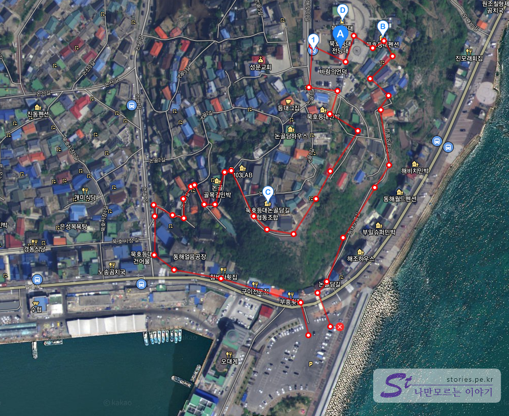

힘들지만 당일치기로 동해 묵호항에 다녀왔습니다. 아침 일찍 양양고속도로를 통해 **내린천 휴게소**에서 한번 쉬고 막힘 없이 달려 4시간 만에 도착을 했습니다.  
하루일정이라 많이 돌아다니지는 못했고 묵호항에서 논골담길과 묵호등대를 보고 해변가 카페에서 커피한잔 마시고 올라왔습니다.

**묵호항 수변공원 무료주차장**에 주차를 하고 좌측방향에 있는 **논골담길**로 올라가는 오르막으로 올라갑니다.

  
첫번째 만나는 곳이 **행복상회**입니다. 행복상회에서는 옛날 향수 가득한 교복을 빌릴 수 있습니다. 교복을 입고 2시간정도 논골담길에서 사진을 찍고 반납을 할 수 있습니다. 동해시에서 운영을 하기 떄문에 가격이 저렴한 편이라고 합니다.

  
행복상회를 나와서 골목으로 이어져 있는 언덕을 따라 올라 갑니다.

  
다른 벽화마을 처럼 이 논골담길도 실제로 사람이 살고 있는 마을입니다. 너무 떠들거나 도에 지나친 행동은 삼가해야 합니다.

  
웬만한 관광지에는 대부분 있는 포토스팟입니다. 연인과 와서 찍어봐야할 만한 장소 입니다.

  
언덕을 오르면서 바라보는 바닷가로 전망대와 울릉도로 갈 수 있는 묵호항 여객선 터미널을 볼 수 있습니다.

  
눈을 돌려 산쪽으로 바라보면 어디서 많이 본 듯한 광경을 볼 수 있습니다.  
부산의 감천마을과 비슷한 모습을 하고 있습니다. 바닷가 마을이라 그런지 대부분 이런 모습인가 봅니다.

  
그 길의 마지막 정점에 위치한 논골카페입니다. 카페에서 바다를 바라보면서 커피를 마시는 분들이 꽤나 많이 계셨습니다. 나무 대크로 길을 만들어 놔서 쉬기도 좋고 구경하며 사진찍기도 너무 좋은 곳입니다.

  
이렇게 바다를 향해 사진을 찍을 수 있는 곳도 있습니다. 사진이 잘나오는 편이니 꼭 찍어보세요.

  
바다를 바라보고 있는 여인의 동상이 있습니다. 한 아이는 업고 한 아이는 여인의 다리를 붙잡고 있습니다. 그 옆에는 무심한 강아지가 한마리가 있습니다.
아무래도 고기를 잡으러 바다로 나간 남편이자 아빠가 무사히 돌아오기를 바라는 마음을 담은 것 같습니다.  
이 논담골길에 사는 사람들의 일상적인 모습이지 않을까 싶습니다.

  
여인의 동상을 지나 좁은 골목을 따라 걸어가면 묵호등대로 갈 수 있습니다.

  
저멀리 묵호 등대가 보입니다.

  
약간 돌아 들어가면 묵호등대로 들어가는 입구가 보입니다. 차를 가지고 여기까지 올라올 수 있나봅니다. 주차장이 있네요.

  
묵호등대는 해양문화공간으로 꾸며져 있습니다. 등대뿐만 아니라 빈약하긴 하지만 문화공간으로 꾸며져 있습니다. 등대를 지나면 현재 공사중이기는 하지만 조만간 오픈할 스카이워크도 있습니다.

  
멋진 묵호등대입니다. 원래 목적인 불을 밝히는지는 모르겠습니다. 어째튼 멋있게 생겼네요.

  
등대의 방문에대한 개방시간과 주의 사항입니다. 애완견이나 음식물은 반입금지입니다.

  
요렇게 위에서 아래로 사진을 찍으면 인생사진 건질 수 있습니다. 찍힌사람들 모두 마음에 들어하더군요.

  
등대위에서 바라보면 현재 공사중인 스카이워크를 볼 수 있습니다. 완공이 되면 또 하나의 명물이 탄생하겠네요. 스카이워크는 바닥을 유리로 만들어서 떨어질 듯한 바다를 보며 걷는 것이 포인트 입니다.

  
등대 바로 앞에 아주 멋진 풍경의 카페를 볼 수 있습니다. 사진 명당입니다.

  
내려오는 길에 멋진 시가 꽃과 함께 적혀있어서 찍어봤습니다.

  
우리는 꺼꾸로 올라오긴 했는데, 이쪽으로 올라오는 길도 있습니다. .

우리는 묵호항 수변공원주차장에 주차를 하고 왼쪽으로 한바퀴 돌아서 내려 왔습니다. 반대쪽으로 오른쪽으로 돌아와도 될 것 같습니다.

## 여행지 정보

- 주소 : 강원 동해시 해맞이길 289

## 주차정보

**묵호항 수변공원 주차장**을 이용하면 무료입니다.
